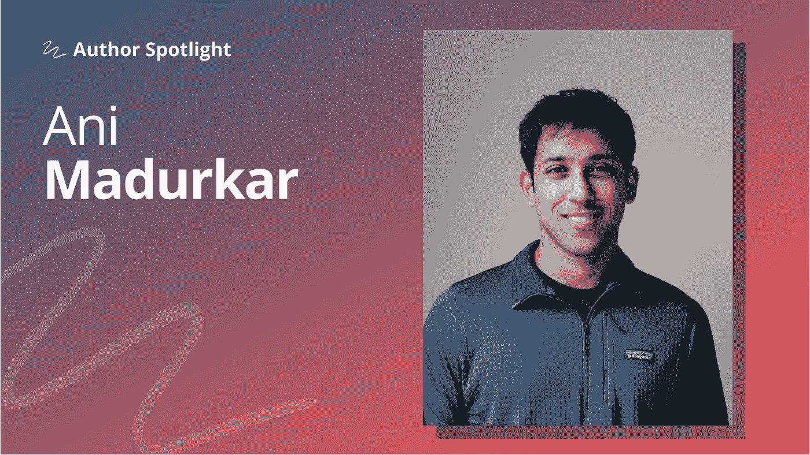

# 在机器学习中，失败和不确定性有时是成功的必要因素

> 原文：<https://towardsdatascience.com/in-machine-learning-failure-and-uncertainty-are-sometimes-necessary-ingredients-for-success-62d969050866>

## [作者聚焦](https://towardsdatascience.com/tagged/author-spotlights)

## “我想成为一个用我的技能和知识来帮助我周围的人的人。”

*在 Author Spotlight 系列中，TDS 编辑与我们社区的成员谈论他们在数据科学领域的职业道路、他们的写作以及他们的灵感来源。今天，我们很高兴与* [*阿尼·马杜尔卡*](https://medium.com/u/c9b0adccc01d?source=post_page-----62d969050866--------------------------------) *分享我们的对话。*

照片由 Ani Madurkar 提供

[*Ani*](https://medium.com/u/c9b0adccc01d?source=post_page-----62d969050866--------------------------------) *是一位资深数据科学家，对机器学习& AI 的艺术和科学充满热情。他对健康、环境和运动科学的应用特别感兴趣。构建数据科学产品来赋能社区和加强网络是他的兴趣所在。*

不做项目的时候，Ani 喜欢骑自行车，拍摄风景和街头摄影，阅读哲学，并在媒体上写下他的想法。

## **你是如何决定成为一名数据科学家的？**

通过一系列毁灭性的失败，我找到了进入数据科学的道路。我原本想成为一名内科医生，专攻神经科学，但我两次都没有通过 MCAT 考试，这让我当时很迷茫。获得哲学学位毕业后，我觉得自己完全没有资格掌握任何有价值的技能来为他人解决问题。

我当时的研究让我接触到了数据分析，所以我想我应该尝试一下这个职业——主要是因为它激发了我的好奇心。从零开始，我自学了 SQL，并获得了一个数据分析师的职位。这第一步拓宽了我对数据世界的视野，我的好奇心增长到了无法满足的程度。

我能够很快掌握数据分析技术，并希望成为一名数据科学家，因为我觉得这更适合我。这需要大量的技能和经验，而我当时并不具备这些。因此，我自学了 Python，掌握了统计学和线性代数的基础，并在密歇根大学注册了应用数据科学硕士项目，同时工作并领导实践社区。

这份工作很大程度上是我的天职，而不是医学。从编程到数学，这些概念自然而然地来到我的面前，我能够快速地学习大量的信息。毕业后，我很快发现自己在构建企业机器学习系统，为备受瞩目的商业项目带来价值。

## 进入这个领域后，你面临过哪些挑战，你是如何应对的？

我的旅程还有更多细节，但基本概念是它充满了失败和不确定性。在大部分时间里，我觉得自己完全力不从心，在进行一场艰难的战斗。

我用三个心智框架来处理这些问题:永不满足的好奇心、不懈的动力和合作成长。我很幸运地找到了一个完全激起我的兴趣，充满了我深深感兴趣的理论和应用的工艺。

> 为了让你自己和你周围的人实现指数级增长，你应该通过合作来实现。

我的动力主要来自于我知道我的父母为了给我一个健康快乐的生活牺牲了多少，以及我有多接近放弃它，因为我认为太多的事情是理所当然的。我再也不想回到那个版本的自己，所以为了让他们和我自己感到骄傲，我坚持不懈。

最后，我相信，如果你尽你所能努力工作，但独自一人，你最多只能实现线性增长。为了让你自己和你周围的人实现指数级增长，你应该通过合作来实现。我想成为一个用我的技能和知识来帮助我周围的人的人，即使目前我不是最好的，这是我随身携带的原则。即使我现在正在做这些事情，我总是有时间帮忙。

## **你如何选择你从事的以数据为中心的项目？**

这些天我主要发现自己被贝叶斯方法和图形 ML 项目所吸引。我认为这两种方法不仅是解决问题的有趣方式，也是看待世界的令人难以置信的迷人方式。我认为，在多任务学习和强化学习方面也有一些前沿工作正在进行，但我还没有找到许多行业现成的应用程序。

在接下来的几个月里，我想进一步专注于构建机器学习*系统*，而不仅仅是机器学习*模型*。TensorFlow 有一个很好的基础设施来构建远远超出 Jupyter 笔记本的系统。我认为大多数组织都有足够的人阅读 sklearn 文档和少量文章，在 Jupyter 中进行基本的机器学习设置，但仍然非常需要知道如何从这些模型中大规模创造价值的专家。MLOps 现在感觉很像狂野的西部，但我开始喜欢那种不确定性。

## **是什么促使你开始公开撰写关于你的职业和其他数据相关话题的文章？**

我知道我现在想创建自己的品牌，但在开始之前，我想在这个行业有一个更好的立足点。我从事摄影已经快七年了，所以我被通过一种新的艺术形式创造一个在线的存在所深深吸引。我在我的硕士项目的顶点工程期间开始，并在写作之前初步确定了我想在网上拥有什么样的声音。

我注意到有大量的内容是给初学者的，也有大量的内容是给研究人员的，但是对于寻求有效和高效成长的中级专家来说，这些内容显得分散和杂乱。我想适应这个利基，所以我选择以一种应用的方式谈论方法和技术，这种方式讨论的理论足以在你自己的项目中工作。

中高级专家不需要被理论淹没，也不需要只有代码片段——他们两者都需要就够了。因此，在我的一些介绍技术概念的文章中，我提供了足够的理论，并将其与应用于数据集的代码结合起来，以指导全面的理解。

此外，我一直对教学充满热情，因为我来自一个前世是教师的家庭。我认为写下我的想法和学习是分享我所拥有的和向他人学习的最快和最有效的方式。

## 在 TDS 和其他地方的写作中，你融合了几种不同的兴趣。你是如何为你的帖子选择主题的？

我首先假设，如果我在努力理解某件事，很可能我的同龄人也是如此。我花大量时间阅读有关问题、概念或技术的资料，然后试图把我的想法写在纸上。我通常是一个思维活跃的人，所以我对源源不断的事物充满好奇。这创造了一个流动的内容引擎，包含了机器学习的艺术、科学和哲学的一切。

> 确定你的价值观和身份赋予你的内容个性；它给了人们某种联系。

我尽量给别人写一篇，给自己写一篇，以此来平衡我的写作。我会阅读大量的博客或文章，这让我很好地了解人们试图学习或正在努力学习的内容，然后我也会对我想学习和好奇的东西产生自己的兴趣。我会试着为读者和我自己各做一个，有时在一个故事里平衡两种需求。不过，最终，我还是会非常关注什么能给别人带来价值。

## **你对那些想写自己作品，但不知道从哪里开始或如何找到时间的人有什么建议吗？**

我认为当务之急是首先要知道你是谁。你对什么感兴趣？你最引以为豪的工作是什么？确定你的价值观和身份赋予你的内容个性；它给了人们某种联系。

当我考虑创建内容时，我会分三个阶段来考虑:

1.  **创作娱乐内容**。这是基本形式，因为它可能只是告知一项新技术，或总结一本书或课程，或澄清一些概念。这一阶段最好的可以是信息丰富的。这些内容会产生视图。
2.  **创作真实性内容**。这是你在故事中加入自己的想法、观点和努力的时候。你可以在书中谈论一种新的建模技术，这很好，但如果你能添加一个你尝试它的轶事以及它是如何进行的，或者用你自己的声音对原始材料做出贡献，那就更好了。在内容中加入你的个人风格可以创造出人们真正感兴趣的故事。这些内容会产生追随者。
3.  **根据你的价值观创作内容**。内容创作的最终形式是当你确定你的价值观是什么，你相信什么，你代表什么，然后以各种方式公开强化它们。你想成为人工智能道德实践的拥护者吗？把这个写进你的故事里。当你谈论一种新的 ML 模式时，做一些研究，并谈论它可能会给社会带来什么样的新问题。这很难，主要是因为很难坐下来知道你的价值观是什么。把事情搞砸了，一路编辑自己，没关系；从某个地方开始，失败，学习，提高，无休止地迭代。这些内容会产生合作伙伴。

## 这些阶段如何转化为你的写作流程？

仅仅为了娱乐或信息目的而创造内容没有错，但是要知道创造你自己的品牌远不止是在包装文档中重复例子。

至于找时间写作，我认为这可能很难，取决于你想写什么和写作对你来说有多容易。如果你只想写一些包含代码的以项目为中心的故事，你可能需要很多前期时间来做准备。

通常，我会试着在写作和足够的阅读量之间取得平衡。我总是试着随身携带一本新书、一篇文章或一篇博客文章(主要是在我的手机上)，这样我就可以不断地阅读，哪怕是一次一点点。这样做的原因是它让我的大脑以我不会有的方式思考问题。我不是说要有零空闲时间，这对于创造力是非常有用的。我提倡创建你自己的内容引擎。创造方法让灵感来找你，而不是你去找它。

我读得越多，我给自己创造新故事的空间就越大。我的大部分时间不是花在感觉超级有动力和灵感上；事实上，我大部分时间都在感受相反的东西。而在那些时刻，最好是读书。所以，当灵感和能量袭来时，我准备好放下我的想法去写作。

## **展望未来一两年，你希望在数据科学领域看到什么样的变化？**

我是一个超级技术乐观主义者，所以我希望在未来看到很多东西，但我会从可能是最有争议的开始。我希望看到范围更好的机器学习项目。今天，ML 项目没有按照计划进行有很多原因，但我觉得其中太多原因是因为它们是由那些可能不完全理解机器学习以及如何积极地使数据有用的人领导或提出的。让没有做过这项工作的人领导这样的大规模项目可能非常危险，因为它会导致不准确的时间表、精疲力竭的科学家和工程师、次质量系统的建立等等。

学习这些概念可能有一个较低的门槛，但这不应与优秀的低门槛相混淆。这是一个很难做好的行业，因此也是一个很难领导的行业。我做过的最好的项目是由科学家/工程师领导的，他们职业生涯的大部分时间都在做统计或机器学习，并逐渐学习业务。显然，这是罕见的，所以我希望未来能带来一种更明智、更可行的方法来构建成功概率更高的项目。

> 我们相互联系和多样化决策的能力，将是创造利大于弊的系统的必要一步。

我也对以数据为中心的 ML 感到非常兴奋。对高质量数据的高度关注将是未来数据科学和技术的重要一步。随着我们开始成为一个以技术为中心的社会，我们今天在数据方面面临的任何挑战(并且有很多挑战)都将变得更加困难。

技术已经成为我们用来应对社会最棘手问题的武器，比如气候变化、公共卫生等。不管我们喜欢与否，我们正在走向一个未来，在这个未来中，我们拥有传感器、相机、虚拟助手，并且更加无缝地融入社会。这带来了过多的道德问题和数据问题。这将要求我们超越 Jupyter 笔记本的思维，这不是一个人的工作。我们需要在大规模处理和部署数据方面变得更好，以应对这些新问题，我们最好的防御是我们的协作和集体性质。开源、虚拟社区和广泛的知识共享是我们成功构建机器学习和人工智能系统来解决我们最具挑战性的问题的能力的关键部分。

该领域正在快速发展，每天都有新的模型、工具和论文发布。我们相互联系和多样化决策的能力，将是创造利大于弊的系统的必要一步。我非常期待和更多启发我的人一起解决复杂的问题。

要了解更多阿尼的作品，请前往他的[媒体简介](https://animadurkar.medium.com/)，或者在[推特上关注他](https://www.linkedin.com/in/ani-madurkar-20a54183/)。或者看看他最近的一些 TDS 帖子:

*   [**AutoML 和数据科学的未来**](/automl-and-the-future-of-data-science-82a1b8f65e7e)
*   [**区分专家数据科学家的隐形技能**](/invisible-skills-that-distinguish-expert-data-scientists-6c3af0dfdbfa)
*   [**未来 5 年的 5 大数据科学趋势**](/5-data-science-trends-in-the-next-5-years-44984c63a772)

为了支持 TDS 作者的工作并无限制地访问我们的档案，[请考虑立即成为媒体会员](https://medium.com/membership)。

*注意:为了长度和清晰度，本次采访稍作编辑*