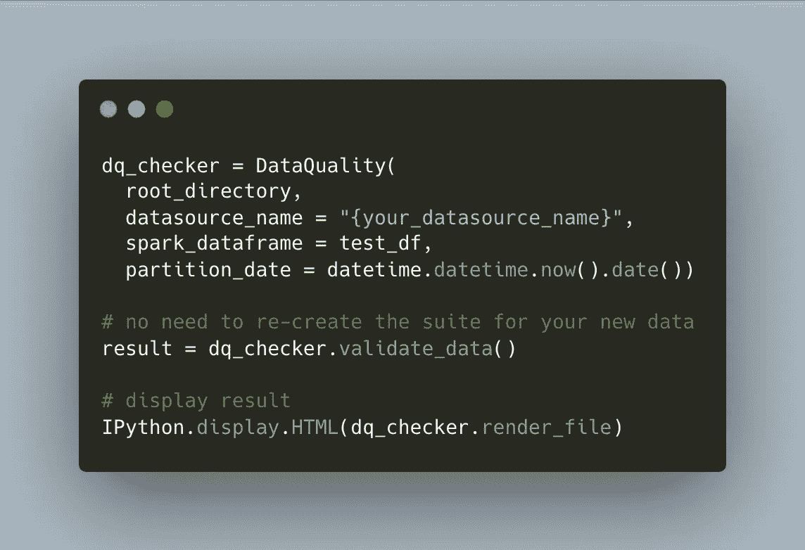

# 内存数据质量检查——充满期待的教程

> 原文：<https://towardsdatascience.com/in-memory-data-quality-check-tutorial-with-great-expectation-54913b1c37fa>

## 将数据质量检查嵌入任何数据管道的实用代码片段

## TL；速度三角形定位法(dead reckoning)⏱

我们提供了教程和抽象类来将 Great Expectation validator 嵌入到任何只有五行代码的 Jupyter 笔记本中。Google Colab 中的完整教程在本文中间。

## 介绍😔

一年半前，我为你的数据分析写了一篇关于[数据质量检查的文章——熊猫](https://medium.com/p/data-quality-check-for-your-data-analysis-tutorial-with-pandas-7ee96d7dc4b6)教程。直到今天，这篇文章已经成为我发表的最好的文章之一，许多人仍然在从事它。这一参与数字反映了数据质量在一段时间内的重要性。

不幸的是，当谈到商业世界时，许多人在演示幻灯片上强调它是多么重要，但他们没有提供足够的资源来实施和维持它。

这种技术数据债务从兴趣点或应用点通过底层数据库流向分析人员，分析人员汇总数字并向管理人员报告。

通常，错误发生在没人注意的地方。它可能来自前端办公室、中间系统或最近部署的计算逻辑。然而，当高管们发现报告中有问题时，他们往往不信任最终结果数据和给他们发送信息的分析师，尽管这可能不是他们的错。这可能只是因为分析师是他们最后一个可以发泄不满的人。

由[克里斯蒂安·埃尔富特](https://unsplash.com/@christnerfurt?utm_source=medium&utm_medium=referral)在 [Unsplash](https://unsplash.com?utm_source=medium&utm_medium=referral) 上拍摄的照片

以我个人的经验来看，这就像你时不时的抱着炸弹，不知道什么时候会被触发。运气够好，可以平安回家；否则，有一天你可能会被解雇。

> 分析师如何在这种情况发生之前避免它？

## 作业环境🔥

作为数据分析师，我们通常会根据首席技术官的指示使用许多分析工具。例如，工具可以从 Jupyter 笔记本或您首选的 IDE 中的低级语言(python、R、SQL)到 SAP、SAS 等高级企业软件。

最可悲的是，我们通常只能有限地访问分析工具，而不能访问另一个系统。例如，我们不能接触服务器的底层终端，也不能为最近发现的最新工具和技术提供新的服务器。

这种限制让我们的生活变得痛苦，因为我们需要向 IT 解决方案管理部门请求最新的技术，并且一直等到它被实施。

补充介绍一下，你不仅手里拿着炸弹，还得等着有人来救你脱离这种情况。但是，当然，你没有能力阻止这场灾难。所以这是一个非常可怕的情况。

照片由[马特 C](https://unsplash.com/@mchesin?utm_source=medium&utm_medium=referral) 在 [Unsplash](https://unsplash.com?utm_source=medium&utm_medium=referral) 拍摄

> 我们有没有一个变通方法可以自己解决这个问题，而不必依赖其他方？

## 这是🥳的答案

**是的**，我们可以应对巨大的期望！我给可能不知道什么叫大期待的人介绍一下。 [**【远大前程】**](https://docs.greatexpectations.io/docs/) 是用于验证数据和生成数据质量报告的开源工具。

## 为什么是远大前程？🤔

您可以使用 Pandas、Pyspark 或 SQL 编写一个自定义函数来检查您的数据质量。然而，它要求您维护您的库，并且不利用他人的力量。另一方面，Great Expectation 是一个开源项目，许多功能都非常有用。你不需要重新发明轮子，但是你可以成为社区的一部分，让事情变得更好。所以我们对开源贡献越多，我们的数据社区就会越强大。

对于其他工具，比如 dbt，我也在研究它，发现需要设置一个专用的服务器，或者开发人员必须在您可以使用它之前设置好基础设施。然而，最近的巨大期望提供了一种使用`RuntimeDataConnector`和`RuntimeBatchRequest`来验证内存中数据的替代方法。这些对象使得我们在不设置服务器的情况下使用 Great Expectations 功能变得更加容易。

## 为什么是这个教程？🤔

有很多基本用法的教程都写了如何使用它，但是我很少找到强调`RuntimeDataConnector`应用的教程。甚至《远大前程》的官方文件也提供了一个例子。我发现它安排得不够好，不足以让我快速实现我的用例(实际上，为了写这篇文章，我花了很多天来理解如何在我的工作笔记本环境中使用它)。因此，我今天在这里写作，并向你展示如何做到这一点，并将代码嵌入到你的任何数据管道。

## 假定📚

1.  下面的实现是在笔记本环境下，比如 Google Colab 或者 Databricks。这种工具代表了在分析环境范围之外你不能做任何事情的情况。
2.  此外，因为您处于分析环境中，所以您没有数据库的键访问权；因此，要连接数据，只能使用我们前面提到的`RuntimeDataconnector`。
3.  您没有权限为报告设置服务器，也没有权限调整永久存储以显示数据质量报告。

从长远来看，那些有权使用传统的“远大前程”方式调整或提升服务器的人将是更好的选择。

## **我们要做什么？🏃🏻‍♂️**

1.  建立一个临时的地方来存放大期望文档，例如 Google Colab 中的临时空间或者 Databricks 环境中的 data bricks 文件系统。
2.  设置一个类/函数来验证您的数据，并将其嵌入到您拥有的每个数据管道中。
3.  我们的类/函数应该在笔记本中显示质量报告，以跟踪运行时的数据质量。
4.  使用永久存储(如 Google Drive、亚马逊 S3、Azure blob 存储等)定期保存报告。

## 这个解决方案是如何解决问题的？⭐️

现在，您应该考虑一下所提出的解决方案与互联网上的其他教程之间的区别。关键的区别在于，现在我们可以**将报告嵌入到正在运行的笔记本中(耶！我不需要等人来为我实现发布的文档服务器)。此外，没有预定义的数据源可以连接(作为一名数据分析师，我没有数据库的钥匙)，**这意味着你可以将其嵌入到你工作的任何环境中，而不必依赖于其他方的基础设施。

就系统设计而言，这种方法可能不是最好的方法，但对于数据分析师来说，在提交下一份分析报告之前知道他们的数据可能有什么问题就足够了。

对于那些无法想象结果的人来说，这里有一个例子。

假设您使用这个笔记本来执行 ETL 过程。您可以在每次完成时将其导出，并保留历史更改以供将来审核。

# 辅导的💻

在我们深入了解细节之前，这里有一个示例 Google Colab 笔记本供您参考。

<https://colab.research.google.com/drive/1CV69el6lrIHGDx-e9FDT-RWvahWW_7sS?usp=sharing> [## 谷歌联合实验室

### 内存数据质量检查——充满期待的教程](https://colab.research.google.com/drive/1CV69el6lrIHGDx-e9FDT-RWvahWW_7sS?usp=sharing) 

## 快速启动

Google Colab 中的 **DataQuality** 类提供了对 Great Expectation 库的抽象。我对它进行了简化，以便您可以嵌入五行代码来在运行时验证您的数据。

在 Google Colab 中，我们提供了一个抽象版本和一个详细的教程，以满足巨大的期望。有很多术语，比如 DataSource、DataConnector、Checkpoint 等。，你应该明白利用伟大的期望的力量。这里我们不赘述术语，但是你可以在[远大前程](https://docs.greatexpectations.io/docs/)文档中找到。有据可查，很快会好起来的。

让我们回到我们的话题。首先，您可以使用下面一行自定义类来启动数据质量检查器。

## 启动期望套件

使用 customer 类创建数据质量检查器。

上面的代码片段首次使用您提供的数据创建了一个期望套件。您可以从 Great Expectation 使用分析工具自动创建它(参数 with_profiled = true ),或者通过 validator 对象手动调整它。

我们将把所有的期望套件保存在组织好的数据源名称下，当您必须验证一个新的数据集时，您可以沿着目录进行遍历而不会产生混淆。您还可以使用以下三行代码来验证基于现有期望套件的数据。

## 验证新数据

用现有的期望套件验证您的新数据。

在你的 ETL 脚本的末尾嵌入上述所有内容，就这样。在运行脚本的末尾，您将看到一个 HTML 格式的数据质量报告。

所有上述代码片段只需要您的分析环境中的临时空间来保存结果。之后，你可以定期将《远大前程》文件夹复制到永久存储器，比如 Google Drive、亚马逊 S3 或者 Azure blob 存储器。

尽管本教程示例适用于 spark 数据框，但它也适用于 Pandas 数据框。所以，我会让你自己做，这样你会更熟悉大期望库。

## 🛠投入运作

由[迈克·辛德尔](https://unsplash.com/@mikehindle?utm_source=medium&utm_medium=referral)在 [Unsplash](https://unsplash.com?utm_source=medium&utm_medium=referral) 上拍摄的照片

在我的工作时间，当我需要创建一个数据产品的原型，并想为生产阶段做计划。我通常添加上面的代码片段来了解我的数据，以及它是否仍然与历史数据相似。

如果您是高级用户，您可以设置更复杂的检查点，例如当数据质量不合格时向电子邮件、slack 或 Microsoft 团队发送通知。当您收到通知时，您可以回到管道并从 Jupyter 运行笔记本中检查日志。与我们通常在操作系统中使用的日志文件相比，它相当不错。

我目前将它与数据砖中的作业调度一起使用，当作业运行时，所有的数据质量报告都将保存在 HTML 输出中，对我来说，调试它更容易，而无需更改日志系统和源代码之间的 IDE。

此外，随着我在这个旅程中工作得越来越多，我将需要维护更多的东西，无论是简单的分析报告还是机器学习模型。在错误发生之前知道它是一件幸事。

如果你的组织没有安排和跟踪工作的工具，我也建议你看一看 MLFlow(这是我过去写的关于它的文章，[用 MLflow](https://medium.com/p/improve-your-machine-learning-pipeline-with-mlflow-6bdbb70fde36) 改善你的机器学习管道)。您可以使用工件日志的概念来集成 Great Expectation，因此您可以更有效地组织事情。

## 最后的想法🧡

[混动](https://unsplash.com/@artbyhybrid?utm_source=medium&utm_medium=referral)在 [Unsplash](https://unsplash.com?utm_source=medium&utm_medium=referral) 上拍照

我们的生命太短暂了，不能每次都修复我们不知道的 bug。我希望本教程能够帮助您将这一伟大的期望融入到日常生活中，让您作为数据分析师的生活变得更加轻松。我觉得这是我认识的每个数据分析师都会遇到的痛苦，我想成为一个让他们的工作生活更快乐的人。直到我们再次相遇🏄🏻‍♂️.

## 帕泰鲁什·西达

**如果你喜欢我的工作，想支持我，** [**成为会员**](https://padpathairush.medium.com/membership)

*   在[媒体](http://padpathairush.medium.com)上跟随我
*   其他渠道？ [LinkedIn](https://www.linkedin.com/in/pathairush/) ， [Twitter](https://twitter.com/data_products)