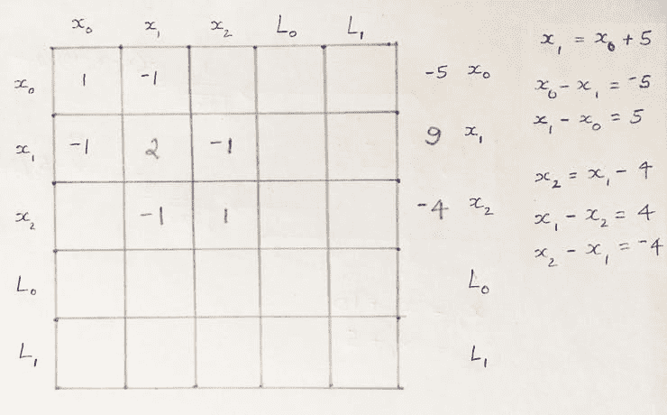
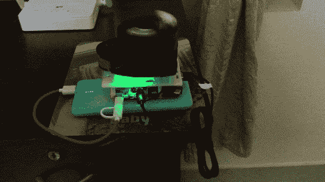

# 基于 SLAM 的室内机器人定位

> 原文：<https://towardsdatascience.com/indoor-robot-localization-with-slam-f8b447bcb865>

## *在 Raspberry Pi 上使用 RP LIDAR A1 进行同步定位和制图(SLAM)导航，并使用 MQTT 进行远程“点云”可视化*

在工厂或酒店，机器人越来越多地取代了人类。但是在不了解环境的情况下**机器人如何在室内**动态导航？如果你已经有一张地图，那么你就知道你在哪里。否则，你需要**生成地图(制图)，还要了解你在地图上的位置(定位)。想象一下，即使对一个人来说，在一个陌生的地方，这有多难。**

**SLAM(同步定位和地图绘制)** **算法使用 LiDAR 和 IMU 数据在******中同时定位机器人，并生成周围** **地标**的连贯地图，如建筑物、树木、岩石和其他世界特征，同时**。****

**这个经典的*先有鸡还是先有蛋的问题*已经使用**粒子滤波、扩展卡尔曼滤波(EKF)、协方差交叉和图形 SLAM 等方法近似解决了。** SLAM 可在 GPS 定位不可用的地方(如室内空间)实现精确测绘。**

**因此， **SLAM 是用于自动驾驶汽车、机器人导航、**机器人地图、虚拟现实和增强现实的核心算法。如果我们可以在 RPi 上进行机器人定位，那么就很容易制造出可以在室内自主行驶的移动汽车或步行机器人。**

**首先来讨论一下 **Graph SLAM** 做一个**自定义实现。**然后**我们将尝试将 RPi 与 RPLidar A1 M8 集成，使用 5V 3A 电池运行，并与** **激光雷达点云地图**的可视化一起进行 SLAM，以辅助导航甚至生成楼层地图。最后使用 MQTT 将**激光雷达点云地图** **在远程机器上可视化。****

****项目演示:**与 RPi 集成的 RPLidar A1 部署了 BreezySLAM**

# **图表猛击**

**假设 2D 世界中的一个机器人，试图从 x 向右移动 10 个单位到 x’。由于运动不确定性，x' = x + 10 可能不成立，但**它将以 x + 10 为中心呈高斯分布。**当 x’接近 x + 10 时，高斯将达到峰值**

****

**图片由作者提供:机器人从 x0 到 x1 到 x2 的运动由两个高斯函数表征**

**如果 x1 与 x0 相差 10 个单位，卡尔曼滤波器将使用高斯函数(x1–x0–10)对不确定性进行建模。因此，仍然存在与位置< 10 and > 10 相关联的概率。**

**在 x2 处有另一个相似的高斯分布，具有更高的扩散。**整条路线的总概率是两个高斯**的乘积。我们可以去掉常数，因为我们只需要在给定 x0 的情况下，最大化位置 x1 的可能性。因此**高斯的乘积变成了指数项的和**，即约束只有 x 和 sigma。**

****Graph SLAM 将约束条件建模为线性方程组(SLEs)** ，其中一个ω矩阵包含变量系数，一个ξ向量包含约束条件的极限值。**每次在两个姿势之间进行观察时，在 4 个矩阵元素** **上进行“局部相加”(因为高斯的乘积变成了指数的和)。****

**比方说，机器人从 x0 移动到 x1，再到 x2，它们相距 5 和-4 个单位。**

****

**图片作者:奥米加矩阵和 Xi 向量经过 2 次运动**

**x 的系数和 RHS 值被加到相应的单元上。考虑地标 L0 距离 x1 9 个单位。**

****

**图片由作者提供:奥米加矩阵和 Xi 向量在考虑了地标 L1 之后**

**如上填写ω矩阵和ξ向量后，计算下面的等式**以获得所有机器人位置的最佳估计值:****

****

**估计机器人的位置**

# **自定义实现:Graph SLAM**

**您需要更新 2Dω矩阵和ξ矢量中的值，以考虑 x 和 y 方向上的运动和测量约束。**

**自定义 SLAM 实现的**完整源代码和结果可以在 IPython 笔记本[这里](https://github.com/AdroitAnandAI/SLAM-on-Raspberry-Pi/blob/main/Custom_SLAM_Landmark_Detection_Tracking.ipynb)找到。****

**我们可以看到 SLAM 的实际应用，如果部署在配备 RPLidar A1 M8 的 **RaspberryPi 上，使用 5V 3A 电池运行。**见下面组装好的小工具。**

****

**作者图片:SLAM 组装设备**

**正如您在顶部的视频中所看到的，**便携式装置被带到我家的各个房间，实时轨迹被传输到 MQTT 服务器，并存储在 RPi 的 SD 卡**上。**

**你可以看到**激光雷达点云地图**的可视化和使用 [PyRoboViz](https://github.com/simondlevy/PyRoboViz) 估计的机器人轨迹，如下图。在上面的视频中，你可以看到我穿过地板上的不同房间。**

****

**有趣的是，我们可以使用 MQTT 为实时可视化**将**实时可视化重新路由到远程机器。**机器人的位置、角度和地图可以编码为字节数组，由 MQTT 客户端解码。****

**请注意，激光雷达地图中的**高密度线性点云**代表稳定的障碍物，如墙壁。因此，我们可以使用像霍夫变换这样的**算法在这些线性点云**上找到最佳拟合线**来生成楼层地图。****

**从 3D 激光雷达点云中，我们甚至可以使用来自 Motion 技术的**结构来构建周围的 3D 地图，****

*   **使用**检测器**如 SIFT、SURF、ORB、Harris 来查找特征，如角落、渐变、边缘等。**
*   **使用**描述符**如 HOG 对这些特征进行编码。**
*   **使用**匹配器**如 FLANN 在图像间映射特征。**
*   **使用 **3D 三角测量**重建 3D 点云。**

**我们可以利用 SLAM 室内导航的想法**在封闭的环境中部署自主移动机器人**如机场、仓库或工厂。**

**此解决方案的源代码可从[这里](https://github.com/AdroitAnandAI/SLAM-on-Raspberry-Pi)获得**

*****如果您有任何疑问或建议，可以在这里*** 联系我<https://www.linkedin.com/in/ananduthaman/>**

# ***参考***

***1.**轻松实现满贯:**[https://github.com/simondlevy/BreezySLAM](https://github.com/simondlevy/BreezySLAM)***

*****注:**已联系 Breezy SLAM 的作者，**华盛顿和李大学 CSE 系【Simon D. Levy 教授，了解可视化期间的激光雷达扫描数据错误。我已经**通过将激光雷达扫描代码分离为单独的线程**修复了代码，并实现了线程间通信**他确认了修复。*******

***2.【https://github.com/simondlevy/PyRoboViz】激光雷达点云可视化:***

***3. **Udacity 计算机视觉纳米度:**[https://www.udacity.com/course/computer-vision-nanodegree-nd 891](https://www.udacity.com/course/computer-vision-nanodegree--nd891)***

***4.**Adafruit 的激光雷达数据扫描码存根:**[https://learn . Adafruit . com/remote-IOT-environmental-sensor/code](https://learn.adafruit.com/remote-iot-environmental-sensor/code)***

***5.**激光雷达距离估计:**【https://en.wikipedia.org/wiki/Lidar ***

***6. **RPLIDAR A1 M8 硬件规格:**[https://www . generation robots . com/media/RP lidar-A1 M8-360 度-激光-扫描仪-开发-套件-数据表-1.pdf](https://www.generationrobots.com/media/rplidar-a1m8-360-degree-laser-scanner-development-kit-datasheet-1.pdf)***