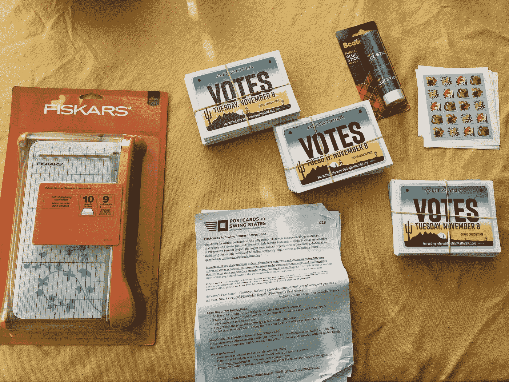
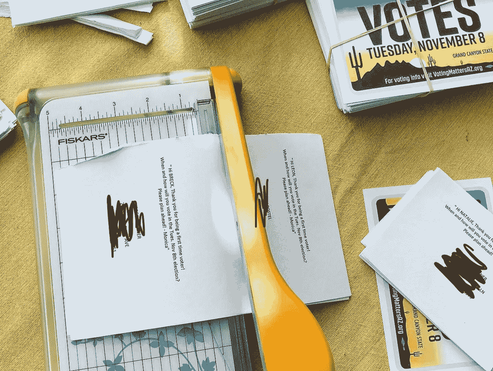
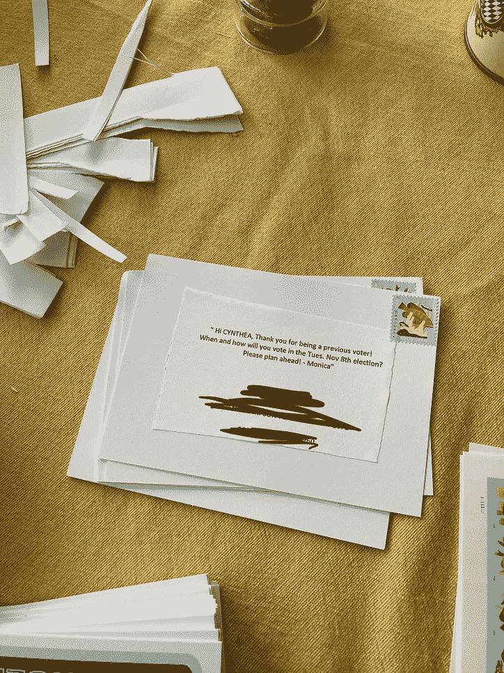

# 我没有发出美德信号，而是签约写了 300 张 GOTV 明信片

> 原文：<https://towardsdatascience.com/instead-of-virtue-signaling-i-signed-up-to-write-300-gotv-postcards-3b0ab6dd0575>

## 只不过它们不是我写的，是 Python 为我写的。



我的 GOTV 项目

# 意图:

我想把我的两个爱好结合起来，编码和在市政技术部门工作。我曾是一家大型公共部门联盟的数据科学家，现在是一名联邦数据科学顾问。

也许这也是因为当我在一家大型公共部门工会担任数据科学家时，我尝到了“组织”和“团结”这两个词的味道，但是(请原谅我的法语)，要让人们通过积极参与为一项运动做出贡献，而不仅仅是在社交网站上发帖，这真的很难。我想，我唯一一次看到大多数同龄人(包括我自己)聚集在一起，是在 2020 年乔治·弗洛伊德(George Floyd)和布莱恩娜·泰勒(Bryana Taylor)被谋杀后的黑人的命也是命。这超出了我在社交媒体上交叉发布内容的社交圈，但实际上:

*   打电话给他们的代表
*   捐钱给保释债券(包括我自己，我从来没有这样做过)
*   写电子邮件
*   参与当地市政厅关于警察预算的讨论
*   对地方政策进行投票

我想，在现场为这场精彩的战斗奋战过的人也注意到，在这段时间里，人们不仅兴趣大增，而且积极参与。

我第一次听说“美德信号”这个词是来自贾·托伦蒂诺(Jia Tolentino)，她是《恶作剧之镜》(Trick Mirror)的作者，我非常欣赏她的散文和智慧，因为她剖析了从互联网到资本主义、女权主义等文化层面。在她写的*互联网中的我的那一章中，这句话让我印象深刻。“但美德信号是两党合作的，甚至是非政治性的行动。Twitter 上充斥着对第二修正案的戏剧性效忠誓言，这种誓言起到了权利内美德信号的作用，当人们在名人去世后发布自杀热线时，它可能有点像美德信号。我们中很少有人完全不受这种做法的影响，因为它与对政治诚信的真正渴望交织在一起。正如我写这篇文章时所做的那样，张贴抗议边境家庭分离的照片是一个微观上有意义的行动，是一种真正原则的表达，也不可避免地是某种表明我很好的尝试”。*

再加上同一章的另一段引文。*“互联网是如何扩大我们的认同感的；第二，它如何鼓励我们高估自己的观点；第三，它如何最大化我们的对立感；第四，它如何贬低了我们对团结的理解；最后，它如何摧毁我们的规模感。”*

有些事情我们在同龄人的背景中看不到，我们日常行为中的微小贡献也有助于社会对道德的共识，这也很重要。这是一篇展示我如何打破自己的美德来寻求改变的文章。

我对我们的投票权充满热情，希望每个人都能行使这一权利。我真的相信，当每个人都投票的时候，我们的政府功能/看起来更像它应该服务的人群。我报名为 2020 年大选写 200 张明信片，通过 [*明信片到摇摆州组织*](https://www.turnoutpac.org/postcards/) *去摇摆州。我的手抽筋了，因为我写了这个人的名字，通用的信息，以获得投票(GOTV)和他们的地址。当我抱怨我的手抽筋时，我妈妈主动提出帮忙。*

这次是中期选举，我心想。我一定有办法让这部分自动化。我要的是 excel 文件，而不是他们为你打印的和明信片一起邮寄的纸张。

这让我想到了我想学 Python 的原因，就是想把事情自动化，节省自己的时间。当我第一次学习 Python 的时候，我把这本书作为参考资料:[用 Python 把枯燥的东西自动化](https://www.amazon.com/Automate-Boring-Stuff-Python-2nd/dp/1593279922)。

# 代码:

这是一个非常简单的 Python 程序，如果他们是以前的投票人，我会根据 P 列的值进行定制；如果是第一次投票，我会根据 F 列的值进行定制。我提取了要包含在消息中的第一个名字。在 excel 中，地址栏已经被我很好地分开了。

```
import pandas as pd df = pd.read_csv('300 Arizona.csv') # read in the excel file#split out the First and Last name based on space and extract F Name
def first_name(x):
 x = str(x)
 x = x.split(' ')
 x = x[0]
 return(x)df['first_name'] = df.Name.apply(first_name) #did it via a functiondef message(x):
 if x[1]== 'P':
  vote = 'previous'
 else:
  vote = 'first time'
 first_name = x[0]
 message = f''' Hi {first_name}, Thank you for being a {vote} voter! \n When and how will you vote in the Tues. Nov 8th election? \n Please plan ahead! - Monica'''
 return message# you can use 2 arguments in an apply pandas methoddf['message'] = df[['first_name','Vote']].apply(message,axis=1)df.to_csv("300_Arizona_wmessage.csv",index=False)
```



作者提供的图片

# 流程:

在投资 30 美元购买了 Homegoods 的切纸机后，我使用了 Word 中的邮件地址合并功能，并使用元数据将邮件和地址写入 Word，然后在一张纸上打印 4 个邮件地址，然后切割成方块，与邮资一起粘贴。

上次我花了大约 5-7 分钟的时间制作每张明信片，总共 17-23 个小时。现在总共花了我 5 个小时。大约一个小时的准备工作，包括编写 Python 程序和解决 Word 文档的邮件合并。然后在 300 张明信片上剪贴邮票，用了大约 4 个小时。这相当于每张明信片 1 分钟。这对我来说节省了大量时间。

# 行动号召:

对我来说，这是一个小小的壮举，但对我的时间和精力却有影响。没有什么比得上疫情期间发生的一些公民技术的巨大成就，例如这位[软件工程师，他创建了一个网站来众包可用的疫苗预约，这些预约在他看到利用当前的地方政府资源找到一个可用的预约有多难之后，实时发布在 Twitter 上](https://www.nytimes.com/2021/02/09/nyregion/vaccine-website-appointment-nyc.html)。

作为一名狂热的程序员，我认为掌握一项技能并将其应用于让世界变得更美好是一件很棒的事情，尤其是在公民技术领域。

不幸的是，明信片到摇摆州不赞助邮票，所以我这次花了 180 美元买了 300 张明信片，手写的时候花了 120 美元。如果你想赞助我的工作，你可以在 https://www.buymeacoffee.com/dsmoni 买一杯咖啡给我，或者更好的是，你可以自己重复这个过程并注册 GOTV 明信片！

## **此外，我很想知道你认为可以在哪里应用你的编码技能来支持一个公民技术领域。或者如果你已经知道了，很想知道！**