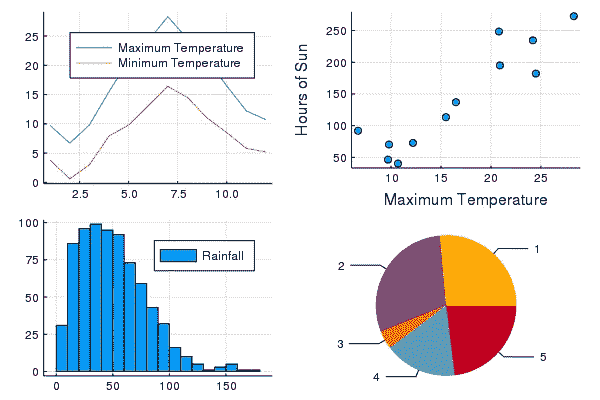
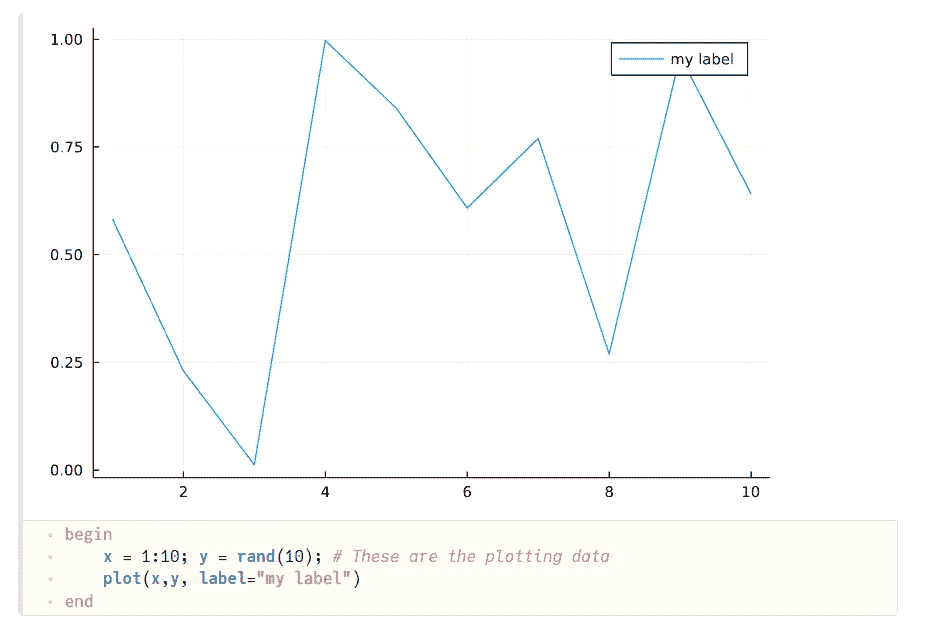
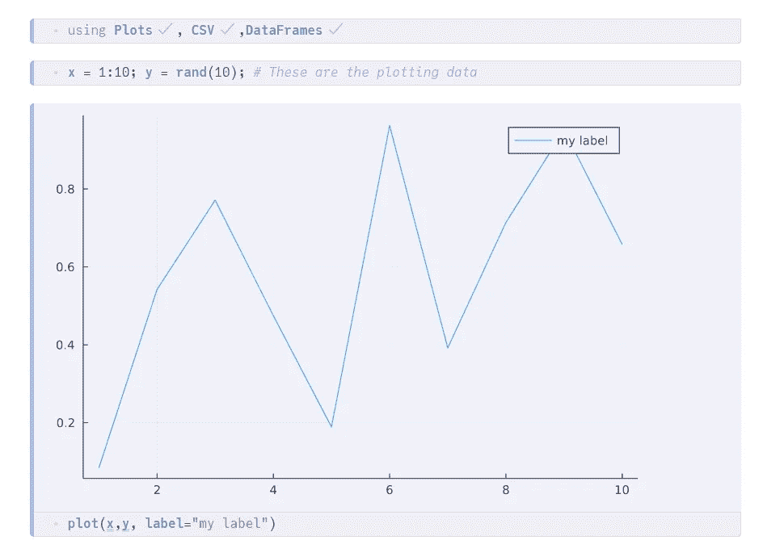
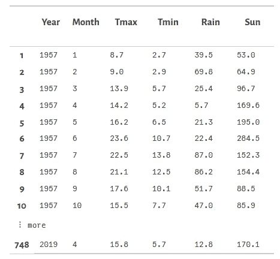
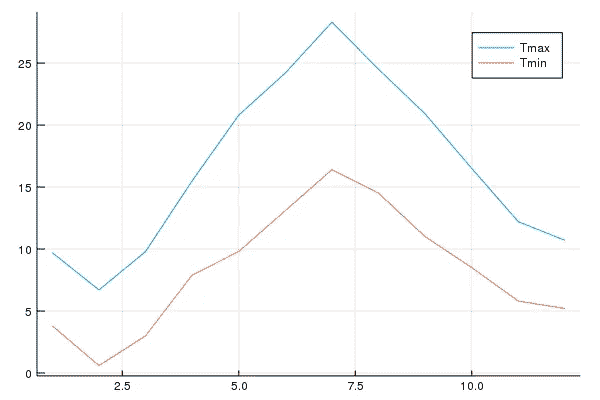

# 使用 Julia 和 Pluto 笔记本进行交互式数据可视化

> 原文：<https://towardsdatascience.com/interactive-data-visualization-with-julia-and-pluto-notebooks-6fad6f3eca2>

# 使用 Julia 和 Pluto 笔记本进行交互式数据可视化

## Pluto 是一项重要的发展，它允许您轻松地与数据进行交互。我们使用 Julia 绘图包快速浏览一下，轻松创建令人印象深刻的图表。



一些朱莉娅情节-作者图片

有人认为朱莉娅是新的巨蟒。如果这是真的，那么冥王星可能就是新的木星笔记本。

我们将非常简要地看一下如何在 Julia 中绘制图表，同时，稍微熟悉一下(相当)新的 Pluto 笔记本和它们的交互特性。

我们将开发的交互的预览图——图片由作者提供

Pluto 是 Jupyter 笔记本上 Julia 语言的一个改进，我预测，我们将来会更多地使用它。

对于以下内容，我不假设任何知识的朱莉娅或布鲁托。

# 朱莉娅

Julia 是一种相对较新的语言，具有高级语法，旨在易于使用和理解。

然而，与 Python 不同的是，它是一种编译语言，这意味着尽管它像 Python 一样容易编写，但它运行得更快，因为它被转换为更容易被计算机理解的低级代码。如果您必须处理需要大量处理的大型数据集，这非常有用。


Julia 徽标——由 Julia 项目提供的公共域图像

与 Python 相比，Julia 对程序的布局也没有那么挑剔。

Julia 是一种通用语言，拥有现代编程语言的所有特性。在这里，我们将看看 Julia 的数据可视化功能，它既令人印象深刻又易于使用。

一旦你安装了 Julia 和 Pluto，你就可以创建运行 Julia 代码的 Pluto 笔记本，执行它们并导出为 HTML、PDF 或独立的 Julia 程序。您可以将可视化保存为标准的 *png* 文件，并将其保存到您的文档中。

## 普路托

冥王星是一个笔记本环境，让人想起 Jupyter，但有一些显著的不同。有了 Jupyter，你很容易就能找到一种新的笔记本电脑，它会给你带来与以前不同的结果。


Pluto 徽标—图片由 Pluto 作者提供(麻省理工学院许可)

在 Jupyter 中，每个单元都是单独运行的，但是所有单元都可以访问所有全局声明的变量，无论它们被分配到哪个单元。例如，假设我们有三个细胞，这一个

```
a = 13
```

接下来是这个，

```
print(a)
```

接下来是这个，

```
a = 10
```

如果运行整个笔记本，第二个单元格将打印出值 13。但是如果你单独运行第二个单元格，它将打印出 10。您可能会认为运行相同的代码但得到不同的结果不是最佳的。

更糟糕的是，如果您删除第一个和第三个单元格，然后运行第二个单元格，它仍然会打印出一个值，因为该变量的值仍然存在于笔记本中，即使定义它的单元格已被删除。

这不可能发生在冥王星。Pluto 跟踪单元依赖关系，并根据需要更新它们。在上面的例子中，一旦第三个单元被执行，Pluto 将检测到第二个单元需要被更新，并这样做。在第一个和第三个单元格被删除的情况下，Pluto 将重新运行第二个单元格，它将检测到该变量不再存在并报告相应的错误。

# 安装朱莉娅和布鲁托

要安装 Julia，你需要去[https://julialang.org/](https://julialang.org/)下载适合你操作系统的版本。安装很简单，只需按照说明操作。

一旦你安装了它，你需要做几件事情。因此，启动 Julia，您将在如下窗口中看到命令提示符:


第一件事是安装冥王星。在提示符下键入]，然后输入`add Pluto`:

```
julia> ]
pkg> add Pluto
```

方括号告诉 Julia 您将使用包管理器，而`Pluto`是您将要添加的包。

要返回 Julia 提示符，请在空行上按 backspace 或 Ctrl-C。

在一个正常的 Julia 程序中，我们需要添加更多的包，但是 Pluto 会自动为我们处理这些，所以接下来我们需要做的就是运行它。

```
julia> import Pluto
julia> Pluto.run()
```

这将在浏览器中启动 Pluto(Pluto 的人推荐最新版本的 Firefox 或 Chrome)。


冥王星欢迎屏幕——作者图片

点击`new notebook`，我们将开始。


一个空的冥王星笔记本——作者图片

我们已经准备好了。

# 朱莉娅·图斯

与大多数其他语言一样，Julia 依赖于特定专业用途的代码库。因为我们要研究 Julia 中的绘图，我们最初对名为 *Plots* 的包感兴趣。这为我们提供了创建数据可视化的能力。但是我们还需要使用另外两个包， *CSV* 和 *DataFrames，*来读取 CSV 文件并将其加载到 dataframe 中。

所以我们需要执行的第一段代码是这样的:

```
using Plots, CSV, DataFrames
```

注意 DataFrames 有一个大写字母“F”。

你将会看到的是:


准备下载软件包—图片由作者提供

点击单元格右下角的 play 按钮，单元格就可以执行了，小云符号告诉我们需要下载三个包。

运行单元后，云将被标记所取代，表示软件包已成功下载:


软件包已下载—图片由作者提供

# 你的第一次想象

Pluto 只允许在一个单元中运行一段代码，然而，在`begin`和`end`块中包含多行代码也是可行的。如果你忘记了，冥王星会提醒你并自动帮你修正。这是我们想要运行的代码。

```
x = 1:10; y = rand(10);
plot(x,y, label="my label")
```

将鼠标悬停在前一个单元格上，点击左下角的`+`符号，打开一个新单元格。


我们的第二个细胞——作者图片

现在试着运行它。


一个错误-作者的图像

Pluto 已经检测到了这个错误，并给出了两种可能的解决方案，将代码放在 begin/end 块中，或者将代码分成两个单元。您可以单击两个解决方案中的任何一个。



第一张图表—作者提供的图片

选择修复会自动运行单元格，您可以在代码上方看到结果。

需要注意的是:第一次运行单元时，需要一段时间来执行。这是因为 Julia 需要在第一次运行时编译代码。后续运行将会更快。例如，上面的代码第一次运行需要大约 8 秒钟(我使用的是普通的 Windows 笔记本电脑)，但是随后的运行只需要几百微秒。

让我解释一下这是怎么回事。

```
x = 1:10; y = rand(10);
```

这位代码创建两位数据，一位称为
`x`，另一位称为`y`。 `*x*`被赋予从 1 到 10 的数字范围的值，而`y`被赋予 10 个伪随机数的范围(每个将具有 0 到 1 之间的值)。因此，我们在这里有一个图形的基础:一个范围从 1 到 10 的 x 轴和 x 轴上每个点的 y 值。

下一步很简单。

```
plot(x,y, label="my label")
```

这段代码调用一个函数来绘制图形，我们所做的就是给它 x 和 y 值——我们也给了它一个标签。

# 冥王星反应性

现在让我们尝试一些不同的东西来展示冥王星的一个强大的特征。让我们将多行单元格一分为二。



新版——作者图片

运行细胞给出了一个熟悉的结果。现在再次运行第二个单元。

因为数据是随机产生的，所以`x`和`y`中的值会改变。Pluto 将检测到创建绘图的第三个单元格依赖于第二个单元格中的值，然后**自动运行它**以生成更新的绘图。印象深刻？你应该害怕。


这是冥王星的一个重要特征，确保笔记本始终一致。

# 来自 CSV 数据的图表

这很简单，但让我们来看一些真实的数据。

我有几个表，我在其他文章中用过。这是一组关于过去几十年英国伦敦天气的数据。我是从英国气象局提供的表格中推导出来的(这些是公共领域的数据，我的版本可以从我的 Github 库中免费下载)。

数据记录了每个月记录的最高温度、最低温度、降雨量和日照时数。我有两个文件，一个是几年的数据集，一个是 2018 年的，只有。它们是 CSV 格式的，就像您可以导入到电子表格中一样。

下面一行将数据读入一个变量`d`，它是一个 DataFrame。

```
dforig = CSV.read("londonweather.csv", DataFrame)
```

运行代码的结果是，我们现在有了一个如下所示的数据表:



我们下载的数据是一个表格，有 6 栏:`Year`、`Month`、`Tmax` (最高温度)、`Tmin` (最低温度)、`Rain` (降雨量，单位为毫米)和`Sun` (日照时数)。

最初，我们只关注一年。因此，让我们在一个新单元格中定义年份:

```
year = 2018
```

然后，我们将创建一个新的 dataframe，其中包含该年的数据子集。

```
d=filter(:Year => y -> y==year, dforig)
```

现在我们将从新的数据框架`d`中绘制一些图表。

# 条形图

要在条形图中绘制每个月的最高温度，我们可以这样做:

```
bar(d.Month, d.Tmax)
```

`bar`是一个绘制条形图的函数(还有什么？)并且我们提供 x 和 y 轴的列作为参数。我们通过使用 dataframe 的名称，后跟列的名称来实现这一点。这两个名字用一个点隔开。

这里，我们将列`Month` 作为 x 轴，将`Tmax`作为 y 轴，因此我们在表格中绘制了 12 个月中每个月的最高记录温度。

将它放入一个新的代码单元并运行它，您会惊喜地(我希望)看到这个图表:


条形图—按作者分类的图像

按照英国的标准，七月相当暖和了！

# 折线图

如果你想制作一个折线图，你可以做同样的事情，但是使用函数`plot`

```
plot(d.Month, d.Tmax)
```


折线图—按作者分类的图像

(注意，在这个图中，我添加了几个参数来隐藏图例并显示标题。)

而且，如果你想在同一个图表上绘制最高和最低温度，只需将 x 值(和标签)放在一个向量中。：

```
plot(d.Month, [d.Tmax, d.Tmin], label=["Tmax","Tmin"])
```

两个值`d.Tmax`和`d.Tmin` *，*在方括号中组合在一起，并用逗号分隔。这是向量或一维数组的符号。此外，我们还为线条添加了标签，这些标签以相同的方式分组。我们得到了这样一个图表:



# 散点图

或者散点图怎么样？散点图通常用于查看是否可以在数据中检测到模式。这里我们绘制了最高温度与日照时数的关系图。正如你所料，这是一种模式:一种明显的相关性——日照时间越长，气温越高。

```
scatter(d.Tmax, d.Sun)
```


# 圆形分格统计图表

这是一个饼图，显示了每个月的年降雨量比例。

```
pie([d](http://localhost:1234/edit?id=080a07f0-7209-11ec-3da3-45f784b1d6fd#d).Rain)
```


# 柱状图

现在，我们将加载更多的数据:

```
d2 = CSV.read("londonweather.csv"`, DataFrame)
```

这类似于我们一直使用的数据表，但更大，因为它涵盖了几十年的数据，而不仅仅是一年。这给了我们大量的降雨量数据，这样我们就可以看到伦敦在一段较长的时间内的降雨量分布。

```
histogram(d2.Rain, label="Rainfall")
```

这是结果。


# 保存图表

在 Jupyter 环境中看到这些图表当然很好，但是为了有用，我们需要能够保存它们以便在我们的文档中使用它们。

您可以像这样保存图表:

```
savefig("myhistogram.png")
```

运行此代码时，不会显示图表，但会以给定的文件名保存。

# 交互性

现在真正有趣的部分来了。使用 Pluto，我们可以将一个 HTML 控件(比如一个滑块)绑定到一个 Julia 变量。通过这种方式，我们可以交互式地改变绘制的数据。

从上面的代码中，您需要删除将年份定义为`2018`的单元格，并用以下单元格替换它:

```
using PlutoUI
```

这将安装 Pluto UI 包，让我们绑定到 HTML 控件。然后这个:

```
[**@bind**](http://twitter.com/bind) **year Slider(1957:2018, default = 1990)**
```

此代码创建一个滑块，其默认值为 1990，范围为 1957 到 2018。并且绑定到变量`year`。这个单元格将在笔记本中创建一个滑块元素，当它被调整时,`year`的值将被相应地设置。

当您将此与所有使用 year 的单元格的自动更新相结合时，我们会得到一个动态笔记本，它的图表会随着我们移动滑块而自动更新。

滑块看起来是这样的:


当我们移动滑块时，我们会看到所有的图表都在实时更新。

那有多好！

# 结论

我希望这是有用的——我们已经查看了 Julia Plots 中可用的基本图表——比我们在这篇短文中看到的要多得多——但我希望你已经发现这篇介绍激起了你寻找更多关于 Julia、Plots，特别是冥王星的欲望。

## 下载

右键单击下面的链接下载文件，然后将它们复制到您将用于 Pluto 笔记本的目录中

[londonweather.csv](https://github.com/alanjones2/dataviz/raw/995f48b31ab4b9a1af32352042b5e6cfe83ebf3b/londonweather.csv)

一如既往，感谢阅读。如果你想知道我什么时候发表新文章，请考虑注册我的临时[子栈简讯](https://technofile.substack.com/)。

之前的文章可以看[这里](https://alan-jones.medium.com/my-medium-articles-559d23f3b9f3)。