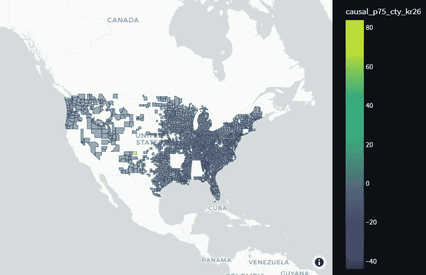
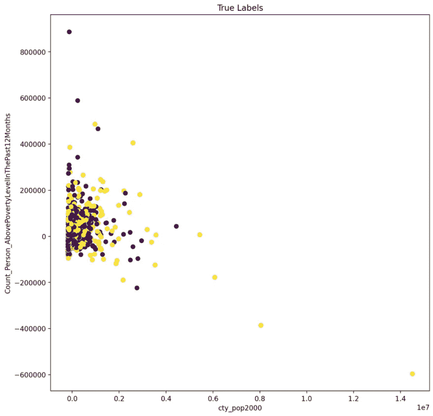
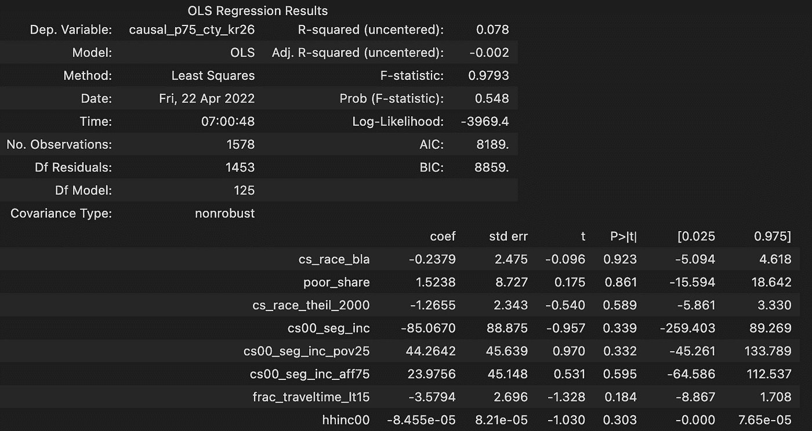
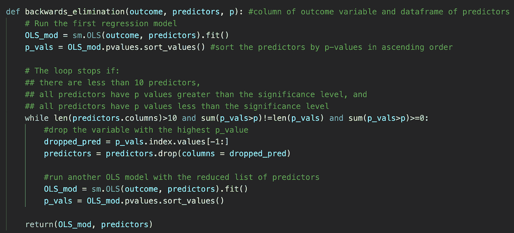
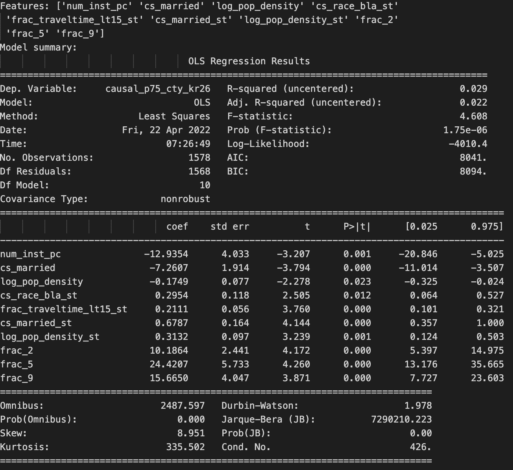
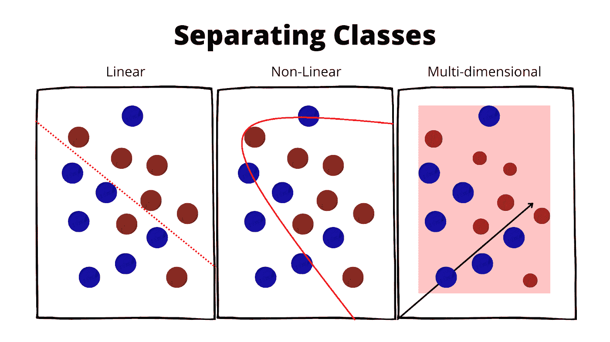
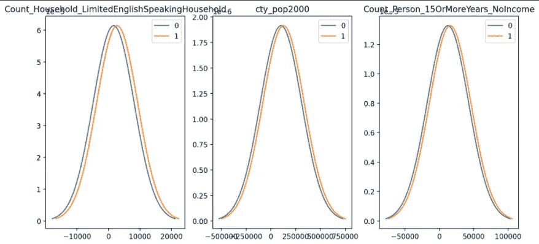
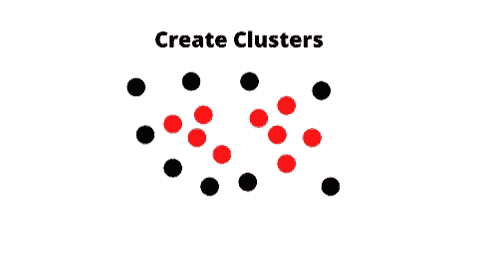
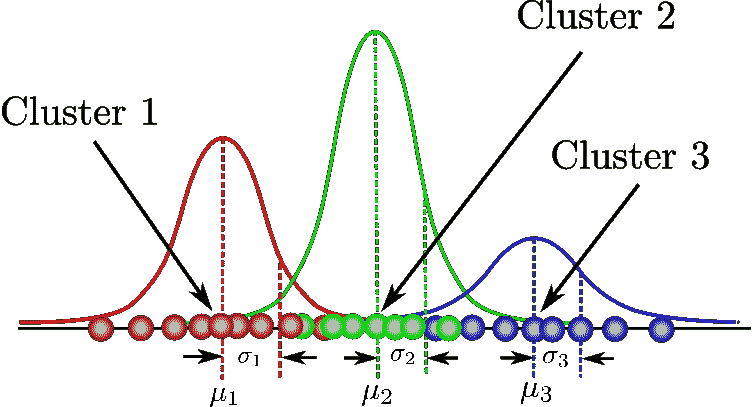
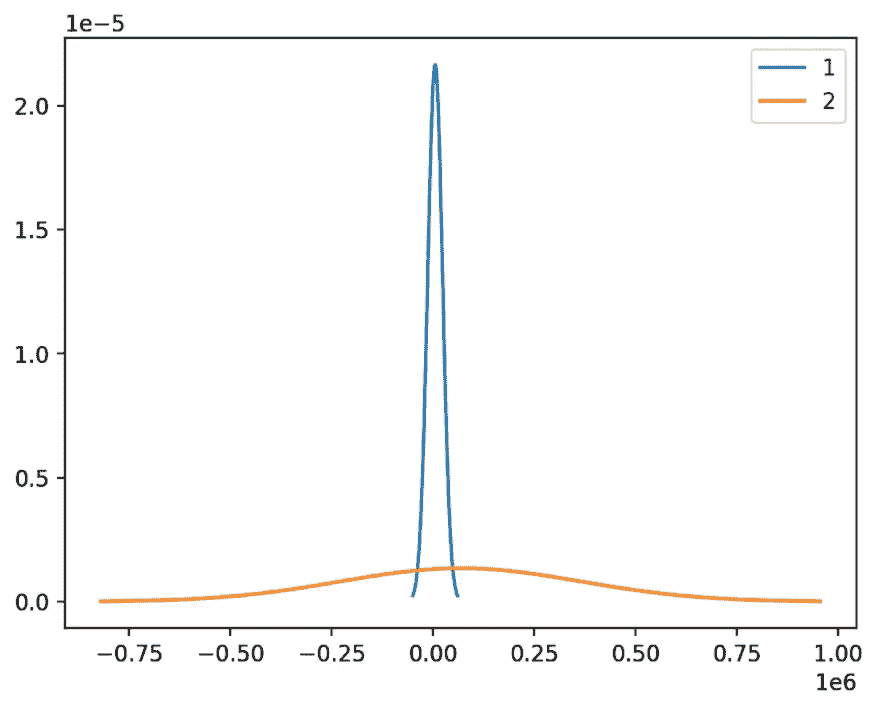

# 美国的代际流动——探索性数据分析(3/5)

> 原文：<https://towardsdatascience.com/intergenerational-mobility-in-the-us-exploratory-data-analysis-3-5-6060af48b37b>

> 本系列由 Ibukun Aribilola 和 Valdrin Jonuzi 共同撰写，是社会公益数据科学教程的一部分。

本文是预测美国代际流动系列文章的第三部分。在第一篇和第二篇文章中，我们从 Chetty & Hendren 的[论文](https://academic.oup.com/qje/article/133/3/1163/4850659)中收集并清理了数据，并将其与来自[机会图谱](https://opportunityinsights.org/data/?geographic_level=0&topic=0&paper_id=1652#resource-listing)和谷歌[数据共享](https://datacommons.org/)的数据结合起来。

本文的目标是执行探索性数据分析(EDA)以了解我们拥有的数据，并开始探索我们可能执行的分析类型，以预测有助于美国代际流动的县的特征。

*代际流动性的因变量和标志是所有父母的子女在 26 岁时国民收入第 75 个百分点的收入变化。*

在本文结束时，您将学会如何:

*   深入了解数据集
*   选择用于分析的变量
*   确定要执行的可能分析
*   在 Python 中执行 EDA

你可以在这个 [Jupyter 笔记本](https://github.com/valdrinj/dssg_final_project/blob/main/finalised_notebooks/ExploratoryDataAnalysis/exploratory_data_analysis.ipynb)中试用本教程的所有代码，并在这里找到文章[的交互版本。](https://share.streamlit.io/anglilian/dssg_final_project/main/finalised_notebooks/ExploratoryDataAnalysis/exploratory_data_analysis.py)

# 理解变量

对于每个变量，我们想知道它的分布、类型、取值范围、潜在的异常值等。我们可以使用 [Pandas Profiling](https://github.com/ydataai/pandas-profiling) 在报告中生成汇总统计数据，而不是对每条信息的所有变量进行循环。你可以点击查看完整报告[。](https://github.com/valdrinj/dssg_final_project/blob/main/finalised_notebooks/ExploratoryDataAnalysis/pandas_profiling_report.html)

报告显示:

*   没有空值。
*   因变量比负值稍微偏向正值。
*   因变量“causal_p75_cty_kr26”的平均值为 0.024，标准偏差为 2.859(意味着 68%的数据与平均值相差如此之远)

我更强调因变量，因为我们的结果是基于可用值的变化来解释的。(图片来自作者)

*   所有的自变量都是数值型的，不需要转换。
*   所有的自变量都是连续的，所以我们可以一视同仁地对待它们，而不需要处理分类变量。
*   每列中的所有值都属于同一类型。
*   作为行 ID 的 county code 列是唯一的。
*   自变量的分布大多是偏斜的。

# 映射变量

由于我们也在处理地理空间数据，我们可以使用 [Plotly](https://plotly.com/) 来创建我们数据的交互式地图。Plotly 有一个 [geojson 文件](https://raw.githubusercontent.com/plotly/datasets/master/geojson-counties-fips.json)，其中包含绘制每个县的形状的坐标。

绘制我们的数据显示，3，006 个县中有 2，319 个(77.15%)缺少数据，特别是在美国中西部。根据 Chetty 和 Hendren 的第一篇论文，他们“将样本限制在人口超过 250，000 的 CZs，以最小化采样误差”。他们还讨论说，他们已经调整了人口规模的临界值，以确保这个规模将导致最稳健的结果。因此，我们不能用这些数据填充某些县，因为通勤区数据被删除了。

去[这里](https://share.streamlit.io/anglilian/dssg_final_project/main/finalised_notebooks/ExploratoryDataAnalysis/exploratory_data_analysis.py)看不同变量的分布。(图片来自作者)

# 变量选择

当处理许多变量时，我们希望选择最终用于分析的变量，因为太多的变量可能会产生噪声。此外，如果两个变量高度相关，它们的数据将在一个方向上对最终结果施加更大的拉力，即使它们代表相同的东西。

# 主成分分析

PCA 尝试使用多维空间中的组件(在这种情况下是每个县的特征)将县分成组，以确定哪一个最能描述数据的分离。对于每个组件，它在空间中绘制一条线，使方差最大化，这意味着数据点的总距离将尽可能远离原点。

下面的 scree 图显示了每个部分在多大程度上有助于解释各组县之间的差异。第一个成分占方差的 90%以上，考虑到我们有超过 100 个成分，这是很重要的。这种维数的减少使得分类更快，并且减少了可能来自如此多的组件的噪声。

(图片来自作者)

不幸的是，我们无法想象县与县之间的区别，因为我们无法在三维之外绘图。但是这两个方差最大的部分的图应该有助于说明数据可能是什么样子。颜色代表该县是具有正的代际流动性“1”还是负的代际流动性“0”。正如我们所见，表现出代际流动的县和没有表现出代际流动的县之间几乎没有什么区别。

(图片来自作者)

然而，当我们不知道这些县是如何被分开的时候，盲目依赖这些结果是危险的。PCA 执行的最佳分离对于我们试图解决的问题可能不是最佳的。我们可以将这种技术与后向消除结合起来，后向消除更有意识地确定要删除哪些值。

# 反向消除

注意:代码在[回归笔记本](https://github.com/valdrinj/dssg_final_project/blob/main/finalised_notebooks/Regression/IA_regression.ipynb)里。

另一种常见的特征选择方法是向后排除法，这种方法包括从潜在预测值的完整列表开始，根据选择的标准测试每个变量的性能，并删除变量，直到模型停止改进。我们将使用 Python 模块 [statsmodels](https://www.statsmodels.org/stable/index.html) 来运行普通最小二乘(OLS)回归模型，用于我们的反向消除过程。这些步骤改编自 Jatin Grover 的文章。查看本笔记本[中的完整反向消除代码。](https://github.com/valdrinj/dssg_final_project/blob/main/finalised_notebooks/Regression/IA_regression.ipynb)

向后消除涉及四个步骤，下面将对它们进行概述，并在接下来的几个小节中进行解释。

1.  确定剔除标准，如变量显著性水平 p=0.05
2.  用所有 125 个候选变量或预测值拟合模型
3.  删除 p 值最高的变量
4.  重复步骤 3，直到满足停止标准

## 步骤 1 —确定淘汰标准

由于我们使用 OLS 回归，我们得到了分析中每个变量的显著性水平。因此，我们将使用标准的 5%置信水平。目标是选择 p 值为 0.05 或更小的变量。

## 步骤 2-用所有变量拟合模型

反向消除过程的下一步是用所有 125 个潜在预测变量拟合回归模型。

“summary”命令的输出是一个结果表，包括我们感兴趣的可变系数及其相应的 p 值。

## 步骤 3 和 4 —删除 p 值最高的变量，直到终止

接下来，我们找到具有最高 p 值的变量，并将其从我们的分析中删除。我们重复这个过程，直到我们满足我们的停止标准。如果这三个陈述中的任何一个为假，我们就终止反向消除过程:至少有 10 个预测值，所有预测值的显著性水平都高于阈值，所有预测值的显著性水平都低于阈值。

请注意，10 是一个任意的数字，它仅仅意味着我们对具有最高统计显著性的 10 个代际流动性预测指标感兴趣。这种方法的妙处在于它的灵活性。您可以选择以更少或更多的变量结束，或者甚至选择完全不同的终止标准。例如，当 r 平方或均方根误差停止改善时，您可以停止模型。下面的代码单元格显示了一个函数，该函数完成了反向消除过程，并返回最终的 OLS 模型和所选最终变量的数据框架。

当我们打印' backwards _ elimination '函数的输出时，我们得到如下结果。请注意，这些变量在 5%的水平上都是显著的，但是 r 平方值从 0.078 下降到 0.029。我们将在回归文章[链接]中讨论 r 平方值作为回归模型的性能度量的重要性。

执行反向消除后的结果摘要。(图片来自作者)

# 分类问题

到目前为止，我们已经把这个问题作为一种方式来看待，以找出哪些特征有助于告知代际流动的确切数量。我们可以用另一种方式来看待这个观点，这种方式有助于我们用一种有趣的方式来重建我们的问题。理想情况下，我们希望根据某些特征清楚地分辨出哪些县显示出代际流动性。

不幸的是，真实世界的数据很少如此清晰，你会经常看到混合。我们的数据中的变量不能区分县，但如果我们增加更多的维度，并改变我们描绘县的方式，如下所示，我们可能会找到一种可行的方法。

(图片来自作者)

我们可以试着找出这两个不同等级的县在他们的分组中有什么显著的共同特征，而不是寻找一种方法来找出所经历的流动性的确切数量。

1.  将因变量转换为二进制数，其中“1”表示正等级变化，而“0”表示没有或负等级变化。
2.  比较其要素的分布，查看等级变化为正或负的县的要素之间是否有任何明显的差异。

下图显示了两个标签之间分布间隔最大的三个变量。不幸的是，没有一个单一的变量能显示一个县有无代际流动的明显差异。也许这些差异的总和会给我们指出一个有趣的方向。

转到[这里](https://share.streamlit.io/anglilian/dssg_final_project/main/finalised_notebooks/ExploratoryDataAnalysis/exploratory_data_analysis.py)来试验其他变量。(图片来自作者)

# 使聚集

也许这些县在独立于代际流动的方式上是相似的。我们可以试着把相似的县放在一起，看看每个组内是否有更多的差异。有多种[方法](https://scikit-learn.org/stable/modules/clustering.html)来执行聚类，我们需要选择最适合我们数据的方法。

我们将在这里试验两种流行的聚类方法:DBSCAN 和高斯混合模型。

# 基于密度的噪声应用空间聚类

该方法在根据各县的特征将各县带入多维空间后，根据它们彼此之间的距离对它们进行聚类。让我解释一下算法在二维空间中是如何工作的:

*   基于两个参数选择核心点-最小邻居数量和邻居之间的最大距离

(图片来自作者)

*   随机选择一个核心点，并将其接触的所有点分组。作为集群一部分的其他核心点可以扩展集群，但是非核心点只能成为成员而不能扩展集群。一旦没有其他点可以添加，随机选择一个核心点不分组，同样操作。

(图片来自作者)

*   瞧啊。我们有我们的集群。

代码运行起来很简单，其中“eps”是指邻居之间的最大距离，“min_samples”是邻居的最小数量。

不幸的是，即使调整了参数，我们的聚类结果也没有产生任何重要的聚类。

# 高斯混合模型

GMM 假设数据集是由一定数量的高斯混合而成的。因此，根据这一假设，我们应该能够确定这些高斯分布是什么，并根据创建每个点的高斯分布对它们进行聚类。该算法适合几个不同的高斯，直到它找到最大化每个高斯之间的距离和最小化每个高斯内的方差。

图片来自 [Oscar Contreras Carrasco](/gaussian-mixture-models-explained-6986aaf5a95) 。

代码看起来像这样，其中“n_components”是我们对存在的高斯数的猜测。

在尝试增加“n_components”后，我们的结果仅显示两个集群。

图片来自作者。

群组 1 有 2330 个县，群组 2 有 37 个县。这些分类的标准差相差很大，而分类 2 的可变性要大得多，这表明它可能包含数据集的所有异常值。

当我们尝试分析时，我们可以看到删除这 37 个县是否会导致更好的结果！

# 结论

在本文中，我们已经了解了如何使用 Pandas Profiling 和地理空间映射从宏观层面理解数据。这些见解表明:

*   我们不需要执行任何其他数据清理或转换
*   我们只有 3006 个县中的 2319 个县(77.15%)的数据
*   如果我们进行回归，均方误差大于数据的标准偏差(2.859)会显示不稳定的结果，因为平均而言，超过 68%的数据会包含在该误差中。

我们还看到了两种可以通过 PCA 修整数据以获得更好结果的方法，即向后消除和聚类。我们的 PCA 初步结果表明，我们可能只需要少量的转换来预测代际流动性。在使用高斯混合模型进行聚类时，我们确定了 37 个县，我们可能会尝试删除这些县，以查看它是否能为聚类 1 创建更好的预测。我们将使用 PCA 和聚类作为分类方法的变量选择技术和回归方法的反向消除技术。

最后，我们看到了分析数据的两种方法——回归和分类。基于变量在两个类之间的分布，分类看起来并不乐观，但是当我们把所有的变量放在一起时，可能会有一个组合效应，所以我们将尝试一下。

探索性数据分析是关于创造性地思考问题，所以如果你能想到不同的方法，我们可能会转换，修剪，集群等。数据，那就去争取吧！在接下来的两篇文章中，我们将讨论回归和分类技术。