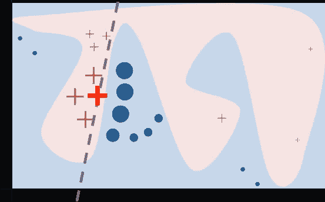
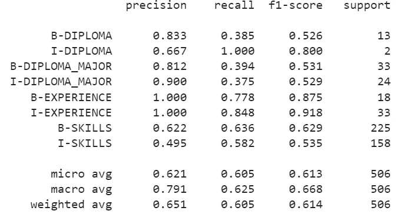
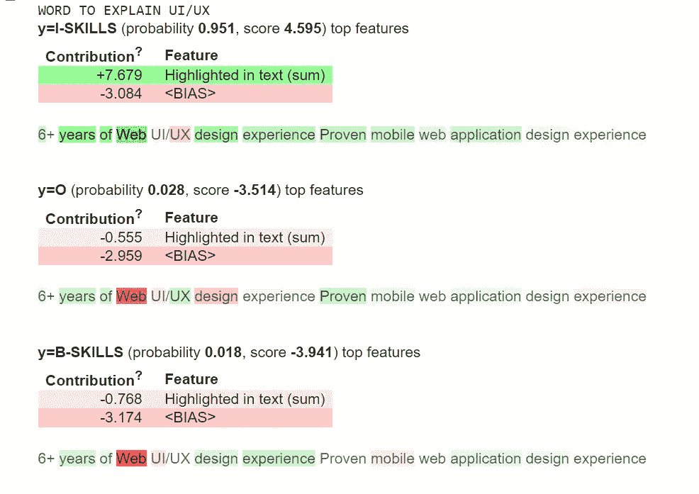

# 可解释的和可说明的石灰 NER

> 原文：<https://towardsdatascience.com/interpretable-and-explainable-ner-with-lime-d643512c524>

## 一步一步的教程，了解你的 NER 模型如何工作


图片来自 [Pixabay](https://pixabay.com/illustrations/woman-code-matrix-ai-artificial-5741175/)

虽然在开发最新最伟大、最先进、具有大量参数的深度学习模型方面取得了很多进展，但在解释这些模型的输出方面却付出了很少的努力。

在 2020 年 12 月的一次研讨会上，Gradio 的首席执行官阿布巴卡尔·阿比德(Abubakar Abid)通过使用提示“两个 __ 走进一个 __”检查了 GPT-3 生成宗教文本的方式在观察了各种宗教的前 10 个回答后，他发现 GPT-3 提到了暴力，犹太人、佛教徒和锡克教徒各一次，基督教徒两次，但是**十次有九次**提到了穆斯林。

后来，阿比德的团队[展示了](https://arxiv.org/abs/2101.05783)将关于穆斯林的正面文本注入到一个大型语言模型中，减少了近 40%关于穆斯林的暴力提及。即使是 GPT 3 的创造者 OpenAI 也在 2020 年 5 月发表了一篇论文，通过测试发现 GPT 3 对黑人的评价普遍较低，并表现出性别歧视和其他形式的偏见。嵌入在这些大型语言模型中的这种类型的社会偏见的例子不胜枚举，从种族主义言论到有毒内容。

**深度学习模型就像一个黑匣子**；给它一个输入，它给你一个输出，而不解释决定的原因，无论是文本分类，文本生成，还是命名实体识别(NER)。密切监控这个模型的输出，更重要的是能够解释这些模型的决策过程，这是至关重要的。解释输出背后的推理会让我们更有信心相信或不相信模型的预测。

# **用石灰解释 NER 模型**

在本教程中，我们将重点解释使用 [LIME(本地可解释模型不可知解释)](https://www.youtube.com/watch?v=hUnRCxnydCc)的命名实体识别模型的预测。可以从[原论文](https://arxiv.org/pdf/1602.04938v1.pdf)中了解更多。

LIME 是模型不可知的，这意味着它可以用来解释任何类型的模型输出，而无需对其进行峰化处理。这是通过扰动目标预测周围的局部特征并测量输出来实现的。在我们的具体例子中，我们将改变目标实体周围的标记，然后尝试度量模型的输出。

下图说明了石灰的工作原理。

这里有一个来自 [LIME 网站](https://homes.cs.washington.edu/~marcotcr/blog/lime/)的解释“原始模型的决策函数用蓝色/粉色背景表示，明显是非线性的。亮红色的十字就是正在解释的实例(姑且称之为 X)。我们对 X 周围的扰动实例进行采样，并根据它们与 X 的接近程度对它们进行加权(这里的权重由大小表示)。我们获得原始模型对这些扰动实例的预测，然后学习线性模型(虚线),该线性模型在 x 附近很好地逼近该模型。注意，这种情况下的解释不是全局忠实的，但是在 x 附近是局部忠实的。”



石灰法。[来源](https://homes.cs.washington.edu/~marcotcr/blog/lime/)

LIME 输出具有对模型预测的贡献分数的记号列表(参见下面的文本分类示例)。这提供了局部可解释性，并且还允许确定哪些特征变化将对预测产生最大影响。


由 LIME 生成的一个文档类的解释。[来源](https://homes.cs.washington.edu/~marcotcr/blog/lime/)

在本教程中，我们将重点解释 NER 模型的石灰输出。

以下是步骤:

*   为我们的模型生成训练数据
*   在我们定制的带注释的数据集上训练 NER 模型
*   选择一个目标词来解释

# 加载数据

在本教程中，我们将训练一个 NER 模型，从职位描述中预测技能、经验、文凭和文凭专业。数据是从 [Kaggle](https://www.kaggle.com/airiddha/trainrev1) 获得的。关于使用 [UBIAI](https://ubiai.tools?utm_source=medium&utm_medium=lime+post&utm_campaign=organic+social) 的数据注释部分的更多细节，请参考[这篇文章](https://medium.com/ubiai-nlp/build-an-nlp-project-from-zero-to-hero-4-data-labeling-379515d8a087)。

为了训练 NER 模型，我们将使用 CRF 算法，因为它可以很容易地输出每个预测实体的置信度得分，这是 LIME 工作所需的。

第一步是将带注释的数据加载到我们的笔记本中；数据被格式化为 IOB 格式。

这里有一个小例子:

```
-DOCSTART- -X- O O2 B-EXPERIENCE+ I-EXPERIENCEyears I-EXPERIENCEexperience Oin Othe Oonline B-SKILLSadvertising I-SKILLSor Oresearch B-SKILLS
```

接下来，我们导入几个包，并将数据预处理成一个元组列表(令牌、标签):

```
! pip install -U 'scikit-learn<0.24'!pip install sklearn_crfsuite #Installing CRF!pip install eli5 # Installing Lime
```

让我们看看这个列表是什么样子的:

```
train_file_path = r"/content/train_data.tsv"train_sents = import_documents_set_iob(train_file_path)print(train_sents)#Small sample of the output
('of', 'O'), ('advanced', 'B-SKILLS'), ('compute', 'I-SKILLS'), ('and', 'O')
```

# 数据预处理

为了训练 CRF 模型，我们需要将带注释的文本转换成数字特征。更多信息请查看 [CRF 文档](https://sklearn-crfsuite.readthedocs.io/en/latest/tutorial.html):

完成这些之后，我们就可以开始训练了——我们只需要将训练/测试特性和目标标签放入它们各自的列表中:

```
X_train = [sent2features(s) for s in train_sents]y_train = [sent2labels(s) for s in train_sents]X_test = [sent2features(s) for s in test_sents]y_test = [sent2labels(s) for s in test_sents]
```

# 模特培训

我们通过 100 次迭代来启动培训:

```
crf = sklearn_crfsuite.CRF(algorithm='lbfgs',c1=0.1,c2=0.1,max_iterations=100,all_possible_transitions=True)crf.fit(X_train, y_train)
```

训练后，我们得到 0.61 的 F-1 分数，虽然不高，但考虑到标注数据集的数量，这是合理的。每个实体的分数:

```
sorted_labels = sorted(labels,key=lambda name: (name[1:], name[0]))print(metrics.flat_classification_report(y_test, y_pred, labels=sorted_labels, digits=3))
```



作者图片:培训后实体得分

# 用石灰解释 NER

既然我们已经训练好了模型，我们就可以使用 LIME 算法来解释它的标签预测了。首先，我们初始化我们的 NERExplainerGenerator 类，它将从输入文本中生成特性，并将其输入到我们的模型中:

我们将使用工作描述中的以下句子进行测试:

```
text = '''6+ years of Web UI/UX design experienceProven mobile web application design experience'''explainer= NERExplainerGenerator(crf)for index,word in enumerate(word_tokenize(text)):print(index,word)0 6+
1 years
2 of
3 Web
4 UI/UX
5 design
6 experience
7 Proven
8 mobile
9 web
10 application
11 design
12 experience
```

最后，我们需要设置时间解释器算法。以下是每个功能的含义:

*   **MaskingTextSampler:** 如果你还记得在前面的介绍中，我们提到过 LIME 会试图干扰局部特征并记录我们模型的输出。它通过用“UNK”令牌随机替换 70%的令牌来做到这一点。如果需要，可以调整百分比，但默认值是 70。
*   **样本，相似度:**LIME 模型会通过对带有“UNK”令牌的原句进行随机化，生成很多句子。这里有几个例子。

```
['6+ years of UNK UNK/UX design experience\nProven UNK web UNK UNK experience', 'UNK+ years UNK Web UI/UX design experience\nProven mobile web application UNK UNK', '6+ UNK of Web UI/UX design experience\nProven UNK web application UNK experience', 'UNK+ years of Web UI/UNK UNK UNK\nUNK mobile web application UNK experience']
```

对于每个句子，我们将有一个来自我们的 NER 模型的预测标签。然后，LIME 将使用线性白色模型对数据进行训练，该模型将解释每个令牌的贡献:te.fit(text，func)

例如，让我们试着解释单词“UI/UX”的标签，它有一个 **word_index =4** :

```
word_index = 4 #explain UI/UX labelfunc = explainer.get_predict_function(word_index)sampler = MaskingTextSampler(replacement="UNK",max_replace=0.7,token_pattern=None,bow=False)samples, similarity = sampler.sample_near(text, n_samples=4)print(samples)te = TextExplainer(sampler=sampler,position_dependent=True,random_state=42)te.fit(text, func)#the explainer needs just the one instance text from texts listexplain = te.explain_prediction(target_names=list(explainer.model.classes_),top_targets=3)print("WORD TO EXPLAIN", word_tokenize(text)[word_index])explain
```

这是输出结果:



作者图片:石灰输出

绿色表示令牌对预测标签有积极贡献，红色<bias>表示它有消极贡献。该模型以 0.95 的概率正确预测了“UI/UX”是多令牌技能 I-SKILLS 的一部分。单词“Web”是预测标签的一个强有力的指示器。与第一个陈述一致，标签 B-SKILLS 具有 0.018 的较低概率，其中单词“Web”具有很强的负面贡献。</bias>

Lime 还提供了每个令牌的贡献，非常简洁:


作者图片:每个功能的贡献

我们注意到，网络、设计和年份对预测的 I-SKILLS 标签的贡献最大。

# 结论:

随着我们走向大型复杂的黑盒人工智能模型，理解预测背后的决策过程对于能够信任模型输出至关重要。

在本教程中，我们将展示如何训练自定义 NER 模型，并使用石灰算法解释其输出。LIME 是模型不可知的，可以用于解释任何复杂模型的输出，无论是图像识别、文本分类还是本教程中的 NER。

如果您有任何问题或想要为您的特定案例创建定制模型，请在下面留言或发送电子邮件至 admin@ubiai.tools。

在 Twitter 上关注我们