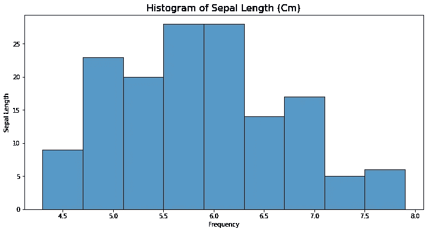
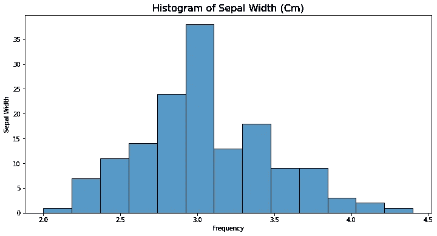
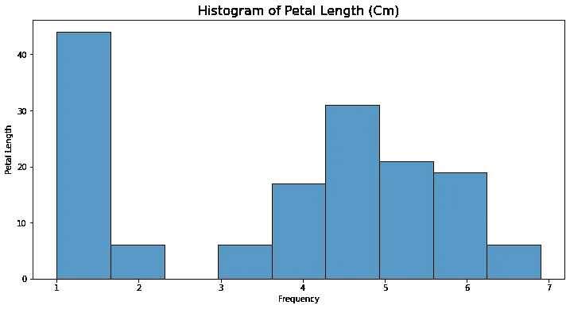
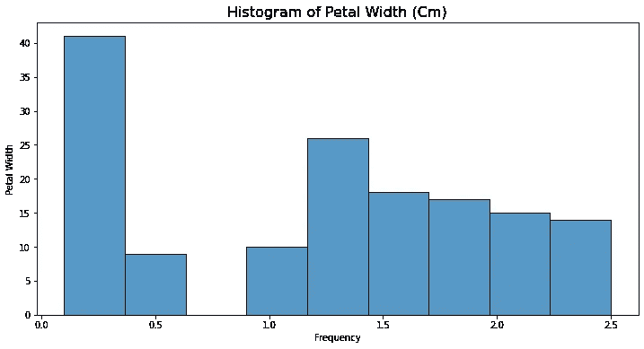
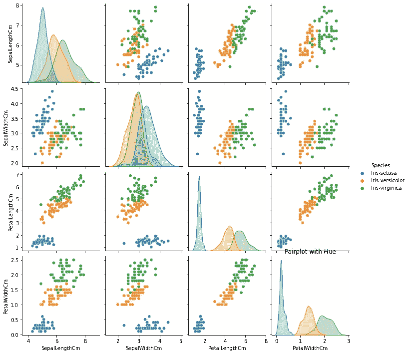

# 解读 EDA:第一章

> 原文：<https://towardsdatascience.com/interpreting-eda-chapter-i-8d0999e372a2>

## 想知道数据是如何讲述故事的吗？观想叙述它们。

2017 年，数据超越石油成为这个星球上最有价值的资产。每个部门都会产生大量的数据。根据 cloud tweaks 的数据，每天至少产生 2.5 万亿字节的数据(也就是 2.5 后面跟着惊人的 18 个零)。太神奇了。但是，人类的大脑没有能力处理哪怕是 1%的如此庞大的数据。因此，为了将这些令人受宠若惊的数据文件变成现实，并将它们转化为信息，我们需要探索性的数据分析。通常被称为“探索性数据分析之父”的约翰·图基说:

> “一张照片的最大价值在于它能迫使我们注意到我们从未想过会看到的东西。”

安娜斯塔西娅·马莱在 [Unsplash](https://unsplash.com/s/photos/iris-flower?utm_source=unsplash&utm_medium=referral&utm_content=creditCopyText) 上拍摄的照片

标题中的“解释”一词是有原因的。一起，我们将理解可以从一些常见的可视化中提取的结论。可视化不仅仅是美丽、引人注目的图片，每种类型的情节都有自己的故事要讲述。在这个博客系列的第一部分中，我将介绍三种重要的绘图类型，即直方图、散点图和计数图。所有的可视化都是在著名的“虹膜数据集”上计算的，该数据集是关于根据花瓣和萼片特征对三种花进行分类的。

数据样本。来源:图片由所有者提供

# 目录

1.  [直方图](https://medium.com/p/8d0999e372a2/edit#2666)
2.  [散点图](https://medium.com/p/8d0999e372a2/edit#61f5)
3.  [计数图](https://medium.com/p/8d0999e372a2/edit#abaa)
4.  [结论](https://medium.com/p/8d0999e372a2/edit#9b5c)

# 柱状图

直方图用于分析和理解样本的分布。它可能是正态分布、左偏、右偏、均匀或其他。理解分布的一个原因是它有助于处理缺失值，

1.  如果分布是左偏或右偏的，那么我们用中值来代替空值，因为中值不受极值的影响。
2.  如果是正态分布，那么就用均值来代替空值。

为了比较两个分布，有必要确保 X 轴和 Y 轴上的值相同，并且面元大小相同。箱的大小会影响分布的形状。直方图有助于理解分布是单峰、双峰还是多峰。此外，它还显示了分布范围有多广。它有助于识别数据集中的异常值和高杠杆点。

就箱的大小而言，可以有许多方法来选择箱的大小，但其中之一是斯特奇法则，

K = 1 + 3.22 logN

在哪里，

k 是箱的数量

n 是观察值的数量

来源:作者图片

来源:作者图片

来源:作者图片

来源:作者图片

当你仔细观察萼片宽度的直方图时，它们近似呈正态分布。而其他三个不是因为以下原因，

1.  花瓣长度和花瓣宽度不是正态分布。对于 1 和 0.5 的箱大小，它分别围绕平均值不对称。
2.  就萼片长度而言，它是双峰的，大小为 0.5。

如果你想详细了解正态分布，可以看看我上一篇博客“[揭秘估计:基础知识](/demystifying-estimation-the-basics-5206532b6378)”。直方图的问题在于它的形状会随着容器大小的变化而变化。另一种检验分布是否正态的方法是使用一个正态 q-q 图，我们将在本系列的下一部分中讨论。

# 散点图

散点图有助于理解两个连续变量之间关系的本质。它可以是，

1.  线性关系

*   正:两个变量一起增加。从左到右上坡
*   负:一个变量增加，另一个变量减少。从左向右下坡

2.非线性关系:曲线模式

3.无模式:无相关性

具有线性模式的散点图的点似乎通常落在一条线上，而非线性模式似乎沿着一些曲线。不管模式是什么，我们用它来描述变量之间的关联。如果没有明确的模式，那就意味着我们正在研究的变量之间没有明确的关联或关系。在完美线性图的情况下，我们可以得到类似于 X 增加使 z 乘以 y 的关系。点越接近，它们之间的相关性越好。

相关性并不意味着因果关系。如果存在关系，并不一定意味着 X 的增加/减少会导致 y 的增加/减少。如果任何特征相对于目标变量呈散点图，并且具有高相关性(正/负)，则意味着它可以很好地解释目标变量，并且是预测目标变量的良好特征。

它有助于理解:

1.  离群点:远离其他点但在回归线路径上的点。它不符合回归线，可能会对回归线产生较大影响。
2.  高杠杆观察:远离回归线/点模式。它改变了回归线，但幅度不大。

散点图的问题在于人眼无法理解重叠的点。

来源:作者图片

*   上面的图是结对图。配对图包括特征的所有可能组合的散点图和直方图。
*   花瓣长度和花瓣宽度之间的关系是最线性的，这意味着它们具有很强的相关性。
*   随着数据点从左到右上坡，它们具有正的关系。这意味着花瓣长度随着花瓣宽度的增加而增加。
*   花瓣长度和萼片长度也是具有正相关关系的最线性的图之一。
*   大致来说，图中没有大的异常值，但也许有一些高杠杆点。
*   在所有散点图中，一段点与大多数数据点分离。为了更深入地挖掘，我绘制了配对图，将目标变量“物种”作为第三个变量。

来源:作者图片

*   从上面的散点图中可以看出,“鸢尾-刚毛鸢尾”是与其他两个分开的一组，特别是在花瓣长度和花瓣宽度方面。
*   花瓣长度和花瓣宽度的直方图表明‘鸢尾’的长度和宽度小于其他两类。
*   因此，花瓣长度和花瓣宽度是区分鸢尾类和其他两类的重要特征。
*   另外，其他两类很难分类。尽管如此，关于花瓣长度和花瓣宽度，它们大部分是可以分开的，中间有一个很小的间隙。

# 计数图

因为这是一个分类问题，所以有必要检查目标特征是否是倾斜的，即不平衡的。如果不平衡，我们可以选择任何一种方式，

1.  随机过采样是复制最不频繁类别的观察值，以匹配最频繁类别的频率。
2.  随机欠采样是去除最不频繁类的观测值，以匹配最频繁类的频率。
3.  使用 SMOTE 等技术创建合成数据。

理解上述技术仅应用于训练数据集是很重要的。否则，会给结果增加偏见。

来源:作者图片

*   如上面的计数图所示，目标变量没有不平衡/偏斜。所以，我们不需要任何技术来平衡数据。

# 结论

在本系列的第一篇博客中，我们学习了如何解释直方图、散点图和计数图。我们学习了两种类型的解释，

1.  一般解读:是关于可视化可以得出什么样的结论。例如，散点图显示了两个连续变量之间关系的本质。
2.  具体项目解读:是关于我们从剧情中学到了什么。例如，花瓣长度和花瓣宽度散点图显示正线性关系。因此，它们可以被认为是区分鸢尾和其他两类的良好特征。

在本系列的下一章中，我们将学习其他类型的可视化，如小提琴图、普通 q-q 图、蜂群图、热图和箱线图。我已经使用 python 中的 seaborn 库在这个数据集上实现了探索性数据分析。您可以访问我的 Kaggle 笔记本“ [Iris:探索性数据分析](https://www.kaggle.com/code/dhruv1234/iris-exploratory-data-analysis)”进行代码演练。

就这些了，伙计们。快乐学习。