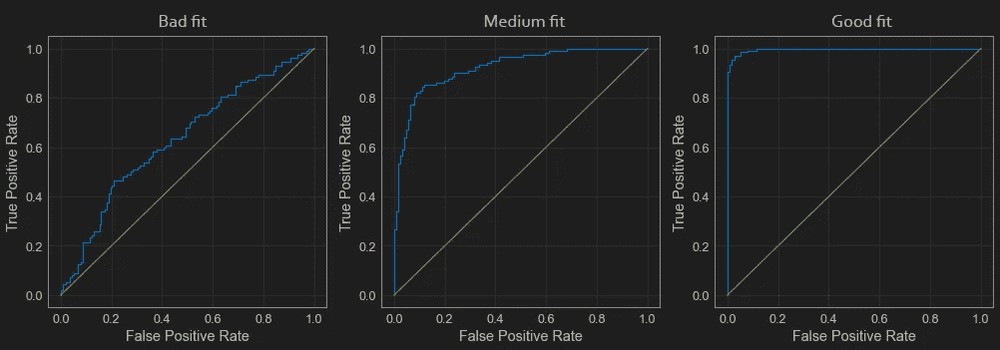
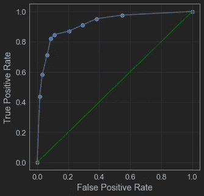
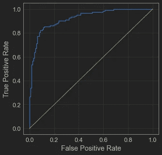
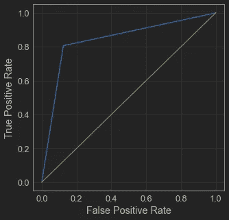

# 解释 ROC 曲线和 ROC AUC 进行分类评估

> 原文：<https://towardsdatascience.com/interpreting-roc-curve-and-roc-auc-for-classification-evaluation-28ec3983f077>

# *解释 ROC 曲线和 ROC AUC 进行分类评价*

## 我多么希望我第一次学 ROC 曲线的时候就有人教我


原文来自[威尔·弗朗西斯](https://unsplash.com/@willfrancis)上[的 Unsplash](https://unsplash.com/)

评估分类器预测能力的一个非常有效的方法是绘制 ROC(接收器操作特性)曲线。

这是众所周知的，但你知道如何解读 ROC 曲线吗？

# ROC 曲线直觉

这条曲线通过绘制两个变量向我们展示了每个阈值的分类器行为:真阳性率(TPR)和假阳性率(FPR)。

真实阳性率通常被称为回忆/敏感度，定义为:


而假阳性率定义为:


在下图中，我们展示了给定数据集的逻辑回归模型的输出。当我们将阈值定义在 **50%** 时，没有实际的正观测值会被归类为负，所以 FN = 0，TP = 11，但是 4 个负例会被归类为正，所以 FP = 4，15 个负观测值被归类为负，所以 TN = 15。


改编自[谷歌开发者](https://developers.google.com/machine-learning/crash-course/classification/roc-and-auc)

当我们将阈值移动到 **75%** 时，只有阳性观测值会被归类为阳性，所以 TP = 7，FP = 0，而所有阴性观测值都会被归类为阴性，TN = 19。我们仍有 4 个阳性观察结果被归类为阴性，因此 FN = 4。

我们可以计算每个阈值的 TPR 和 FPR，并对它们进行比较:


最佳阈值取决于模型的目标。如果更重要的是将所有的正面分类为正面，即使这意味着将一些负面分类为正面，50%的阈值更好(见下面的例子)。

> **1)汽车故障预测——高召回，低精度**
> 
> 假设您为一家从汽车中收集数据的汽车制造商工作，您的模型试图预测汽车何时会发生故障，以便提醒客户前往修理厂进行检查。
> 
> 在这种情况下，你可能想要一个**高召回**，这意味着所有有潜在缺陷的车主将被警告进行检查。然而，通过最大化召回，我们也可能向不太可能很快损坏的汽车发送警告(误报)，从而降低精确度。假阳性汽车的车主将面临一个小小的不便，即去修理店却发现他的汽车很好，但另一方面，大多数可能损坏(甚至可能导致事故)的汽车情况都包括在内。
> 
> 我们减少了 FN(提高了召回率)，但增加了 FP(降低了准确率)。

现在，如果我们希望有一个对每个被分类为正面的观察都有高置信度的模型，即使这意味着将一些正面的观察错误分类为负面的，75%的阈值是最佳选择(参见下面的选股示例)。

> **2)选股预测——低召回、高精度**
> 
> 这里你是一个股票交易者，希望建立一个模型来帮助你挑选股票。这个模型将把高收益概率的股票归类为正数。
> 
> 在这种情况下，你希望只买最好的股票，因为你的钱有限，你不想承担太大的风险。这种情况下，你要提高精确度，只挑选最有可能产生回报的股票，即使这意味着一些好的股票可能会被遗漏(假阴性)。
> 
> 通过只挑选最好的，我们减少了假阳性(并提高了精确度)，同时接受增加假阴性(并减少召回)。

# 解读 ROC 曲线

ROC 曲线的目的是显示该模型对于每个可能的阈值的效果，作为 TPR 与 FPR 的关系。所以基本上，为了绘制曲线，我们需要计算每个阈值的变量，并绘制在一个平面上。

在下图中，绿线代表 TPR = FPR，而蓝线代表分类器的 ROC 曲线。如果 ROC 曲线正好在绿线上，说明分类器的预测能力和抛硬币一样。



作者图片

在左图中，蓝线相对靠近绿线，这意味着分类器是坏的。最右边的图显示了一个好的分类器，ROC 曲线靠近轴，而“肘”靠近坐标(0，1)。中间的一个是足够好的分类器，更接近于从真实世界数据中可能得到的结果。

解释 ROC 曲线的另一种方式是考虑类别的分离，我们可以用直方图来说明，如下所示。


作者图片

坏的分类器(左)有太多的类别重叠，因此无法做出好的预测，并且没有阈值能够分离类别。正如预期的那样，好的分类器(右)几乎没有重叠，因此我们可以很容易地找到一个好的阈值来分离正确类别中的预测。最后，中间的一个处于中间位置:有一些重叠，但通过相应地设置阈值可以获得良好的结果。

# ROC AUC

现在你知道 ROC 曲线有多有用了，但是怎么评价呢？答案是:曲线下面积(AUC)。

AUROC 曲线(ROC 曲线下的面积)或简称为 ROC AUC 得分，是一种允许我们比较不同 ROC 曲线的指标。

绿线是下限，该线下的面积是 0.5，完美的 ROC 曲线的面积应该是 1。我们模型的 ROC AUC 越接近 1，就越有利于分类和做出更好的预测。

我们可以使用 sklearn 轻松计算 ROC AUC:

```
from sklearn.metrics import roc_auc_score
score = roc_auc_score(y_real, y_pred)
print(f"ROC AUC: {score:.4f}")
```

输出是:

```
ROC AUC: 0.8720
```

当使用`y_pred`时，ROC 曲线将只有“1”和“0”来计算变量，因此 ROC 曲线将是一个近似值。为了避免这种影响并获得更准确的结果，在计算 ROC AUC 时，建议使用`y_proba`并获得类别“1”的概率:

```
score = roc_auc_score(y_real, y_proba[:, 1)
print(f"ROC AUC: {score:.4f}")
```

输出是:

```
ROC AUC: 0.9271
```

# 从头开始绘制 ROC 曲线

我认为理解一个概念的最好方法是通过实验，所以让我们从头开始学习如何绘制 ROC 曲线。稍后，我将展示如何使用 sklearn 库轻松做到这一点。

您可以在我的 github 存储库中找到可用的代码，所以可以跳过这一部分。

[](https://github.com/vinyluis/Articles/tree/main/ROC%20Curve%20and%20ROC%20AUC) [## 主要乙烯基/物品的物品/ROC 曲线和 ROC AUC

### 第一篇:解读 ROC 曲线和 ROC AUC 用于分类评价(TBD) [EN]什么是 ROC 曲线，如何…

github.com](https://github.com/vinyluis/Articles/tree/main/ROC%20Curve%20and%20ROC%20AUC) 

首先，我们需要在数据集中训练一个分类器模型:

```
from sklearn.model_selection import train_test_split
from sklearn.naive_bayes import GaussianNB# Split train and test sets
X_train, X_test, y_train, y_test = train_test_split(X, y, test_size = 0.25)
# Create the model object
model = GaussianNB()
# Fit the model to the training data
model.fit(X_train, y_train)
# Predict the classes on the test data
y_pred = model.predict(X_test)
# Predict the classes on the test data, and return the probabilities for each class
y_proba = model.predict_proba(X_test)
```

然后，我们定义一个函数，根据前面给出的公式计算每个实例的 TPR 和 FPR。

```
from sklearn.metrics import confusion_matrixdef calculate_tpr_fpr(y_real, y_pred):
    # Calculates the confusion matrix and recover each element
    cm = confusion_matrix(y_real, y_pred)
    TN = cm[0, 0]
    FP = cm[0, 1]
    FN = cm[1, 0]
    TP = cm[1, 1]
    # Calculates tpr and fpr
    tpr =  TP/(TP + FN) # sensitivity - true positive rate
    fpr = 1 - TN/(TN+FP) # 1-specificity - false positive rate

    return tpr, fpr
```

我们希望评估每个阈值的 TPR 和 FPR，因此我们定义了一个函数，该函数将创建“n”个阈值，并在这些阈值上迭代，计算变量并将它们存储在一个列表中。这些将是 ROC 曲线点的坐标。

在二元分类器中，预测可以是“0”或“1”，并且移动阈值不会有任何影响。为了确保我们能够得到正确的曲线，我们需要使用将每个观察分类为“1”类的概率，我们通过`model.predict_proba(X_test)`方法得到这些概率。

```
def get_n_roc_coordinates(y_real, y_proba, n = 50):
    tpr_list = [0]
    fpr_list = [0]
    for i in range(n):
        threshold = i/n
        y_pred = y_proba[:, 1] > threshold
        tpr, fpr = calculate_tpr_fpr(y_real, y_pred)
        tpr_list.append(tpr)
        fpr_list.append(fpr)
    return tpr_list, fpr_list
```

最后，我们可以使用 seaborn 绘制点和曲线，方法是将 tpr 和 fpr 列表传递给下面的函数:

```
import seaborn as sns
import matplotlib.pyplot as pltdef plot_roc_curve(tpr, fpr, scatter = True):
    plt.figure(figsize = (5, 5))
    if scatter:
        sns.scatterplot(x = fpr, y = tpr)
    sns.lineplot(x = fpr, y = tpr)
    sns.lineplot(x = [0, 1], y = [0, 1], color = 'green')
    plt.xlim(-0.05, 1.05)
    plt.ylim(-0.05, 1.05)
    plt.xlabel("False Positive Rate")
    plt.ylabel("True Positive Rate")
```

结果是一个相当好的 ROC 曲线，使用直线作为没有计算坐标的线段的近似值。

```
# Calculates 10 coordinates of the ROC Curve
tpr, fpr = get_n_roc_coordinates(y_test, y_proba, resolution = 10)
# Plots the ROC curve
plot_roc_curve(tpr, fpr)
```



# 用 Scikit-Learn 绘制 ROC 曲线

当然，您不会每次需要时都从头构建 ROC 曲线，所以我将展示如何用 scikit-learn 绘制它。

看看有多简单:

```
from sklearn.metrics import roc_curve
from sklearn.metrics import RocCurveDisplaydef plot_sklearn_roc_curve(y_real, y_pred):
    fpr, tpr, _ = roc_curve(y_real, y_pred)
    roc_display = RocCurveDisplay(fpr=fpr, tpr=tpr).plot()
    roc_display.figure_.set_size_inches(5,5)
    plt.plot([0, 1], [0, 1], color = 'g')# Plots the ROC curve using the sklearn methods - Good plot
plot_sklearn_roc_curve(y_test, y_proba[:, 1])# Plots the ROC curve using the sklearn methods - Bad plot
plot_sklearn_roc_curve(y_test, y_pred)
```

`roc_curve`函数计算所有 FPR 和 TPR 坐标，而`RocCurveDisplay`将它们用作绘制曲线的参数。线条`plt.plot([0, 1], [0, 1], color = 'g')`绘制绿色线条，可选。

如果用`model.predict_proba(X_test)[:, 1]`的输出作为参数 y_pred，结果就是一条漂亮的 ROC 曲线:



但是，如果直接使用`model.predict(X_test)`的输出，该方法将没有构建所有点的所有必要信息，并且绘图将是两条线段的近似:



# 结论

本文的结论是:ROC AUC 最终是二元分类器中类之间分离的度量。我希望在我开始作为一名数据科学家的旅程时，这是如何向我解释的，我希望这将对本文的所有读者产生影响。

# 如果你喜欢这个帖子…

支持我一杯咖啡！

[](https://www.buymeacoffee.com/vinitrevisan)

给我买杯咖啡！

如果你喜欢这个主题，可以看看我解释 ROC 曲线用于多类分类的文章:

[](/multiclass-classification-evaluation-with-roc-curves-and-roc-auc-294fd4617e3a) [## 用 ROC 曲线和 ROC AUC 进行多类分类评价

### 将最常用的分类评估度量用于具有 OvR 和 OvO 的多类分类问题…

towardsdatascience.com](/multiclass-classification-evaluation-with-roc-curves-and-roc-auc-294fd4617e3a)