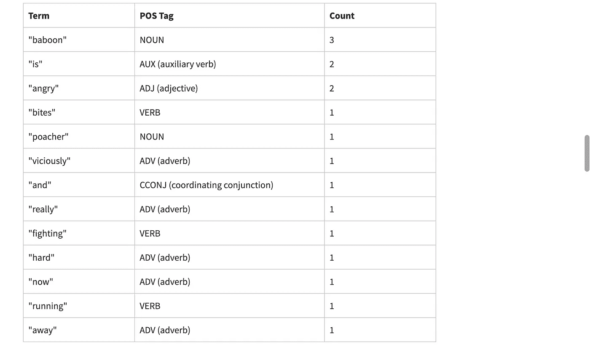
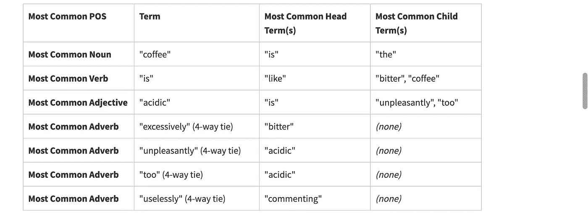
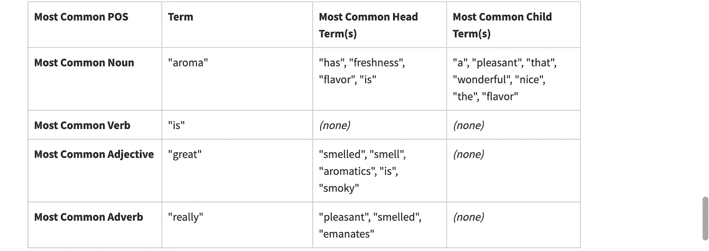

# 引入“思想凝聚”

> 原文：<https://towardsdatascience.com/introducing-idea-condensation-5a0c1dbe5cca>

## 自动识别在一系列相似文本语句中表达的“想法”的功能

# 介绍

现代计算时代给人类带来了广泛的挑战，无论是在技术行业还是在全球文化中都是如此。社交媒体平台、调查和公共研究公司、公共关系、广告和零售产生了大量的文本数据。在 Within3，我们管理洞察和沟通管理平台，促进制药公司和开药的医疗保健提供商之间的对话。管理和理解来自医疗保健提供者的大量自由文本反馈对于理解和管理意外问题至关重要，这些问题甚至可能在药物脱离临床试验并投入使用后出现。

在数据科学中，众所周知，文本数据比数字数据更难研究。不仅文本更加多变，充满了细微差别，并且依赖于上下文，而且对一个问题的正确答案会随着回答它的观众的不同而不同。当我们甚至不能总是就正确答案达成一致时，编写软件来分析文本数据并产生可靠且可操作的答案本身就存在问题。然而，理解大量的文本反馈对于组织确定业务决策的影响和识别盲点仍然是至关重要的。如果医疗保健提供者报告了某种特定药物在某种情况下的罕见副作用，生产该药物的制药公司越早解决他们研究管道中的问题，他们就能越早解决问题。如果一项调查正在征求对某个问题的文本回答，并收到数千个答案，那么拥有一个自动化的数据驱动的解决方案来识别常见答案和回答中的结构是至关重要的。如果购买某一品牌床单的顾客反复撰写公开的产品评论，说床单从包装中出来时有一股难闻的气味，制造商会想知道，而不需要有人在注意到之前手动阅读数千条评论。

用于分析文本数据的常见技术通常包括关键字识别、监督分类模型和向量嵌入模型(即“Word2Vec”和类似的方法),它们将向量分配给术语，这有助于对文本数据的向量表示进行代数操作。虽然这些可以引出一些关于文本数据集中的词汇和主题的有用信息，但它们都没有真正解决每个人真正想知道的问题:

> "这些数据中表达的最常见的**想法**是什么？"

我们一直在开发一种方法来直接解决这个问题。这种过程的一个关键组成部分是从多个语句的文本数据输入开始，这些语句用不同的确切措词传达大致相同的“想法”(将在下面更精确地定义)，并将它们“浓缩”成最佳地表示全部输入的单个输出语句。

作为一个介绍性的教学例子，如果我们有以下四个简单的关于一些咖啡的文本评论:

> "这咖啡尝起来又苦又酸。"
> 
> "我不喜欢这咖啡有多苦。"
> 
> "这咖啡酸得令人不舒服。"
> 
> “味道太酸了。”

我们如何输出一个“答案”,比如

> "这咖啡酸得让人不舒服"

哪一个最能代表输入中所表达的想法？

使用现有的“自然语言处理”(NLP)“词性标注”(POS tagging)和“依存句法分析”技术，我们引入了一种我们称之为“思想浓缩”的技术来执行该功能。在文本中表达的多个相似的想法被“浓缩”成一个单一的表达，这个表达最好地代表了所有的输入。

# 什么是“想法”？

自然语言处理领域包括用数学和统计技术研究语言数据；如果我们能把一个语言数据集翻译成数字形式，那么我们就能使用现有的定量分析技术来描述这些数据。在我们能够在本研究中说明什么是“想法”之前，我们需要说明 NLP 中允许我们检测文本数据中的结构的一些常见技术。

## n-grams

英语 NLP 中的“术语”通常是一个单词(“the”、“cat”、“runs”、“away”等)。)，但也可以指像“客厅”、“满月”、“波士顿环球报”(一份报纸)这样的复合词，甚至可以指“自然语言处理”(一个三字复合词)这个词本身。例如，“波士顿环球报”是一个单数名词，它指的是一份报纸，因此是除了“波士顿”(一个城市)和“环球报”(教室中地球的一种表示)之外的一个单独的“术语”。在 NLP 中，被识别的术语也经常被称为“n 元语法”，其中“n”指的是组成术语的单词的数量。“Cat”是由一个单词组成的术语，因此可以表示为“unigram”；“波士顿环球报”由两个单词组成，因此可以被表示为“二元模型”；类似地，“自然语言处理”是一个“三元模型”(我们很少考虑 n > 3 个术语)。

## 标记化

接下来，NLP 中的“[标记化](https://nlp.stanford.edu/IR-book/html/htmledition/tokenization-1.html)”以其最一般的形式，是获取一系列文本字符并将它们分割成一系列片段的过程，其中每个片段本身被表示为一个“标记”。“术语标记化”是一种更具体的情况，即获取一系列文本数据，并根据我们上面的定义将其分解成一系列单独的术语。二元模型和三元模型通常通过对包含它们的单词一起出现的计数统计来识别，并设置任意阈值。例如，假设我们正在考虑一个文档，其中术语“波士顿”和“全球”各出现五次，但每次出现都是在序列“波士顿全球”中，那么我们可能要考虑报纸“波士顿全球”的二元模型，而不是对城市或球形地图的引用。

## 词性标注

通过术语标记化，我们可以翻译字符串

> "这只猫跑过波士顿环球报."

转换成一维数组

```
["the", "cat", "runs", "through", "the", "Boston Globe"]
```

现在，我们可以将一些文本数据标记成一系列术语。词性标注(POS tagging)是一种为描述其在句子中的功能的单个术语分配标签的技术。在我们刚刚标记化的句子中，“cat”将被标记为“名词”，“runs”被标记为“动词”，等等。因此，我们的术语标记化的文本数据序列可能看起来像这样

```
[("the", "determiner"), ("cat", "noun"), ("runs", "verb"), ("through", "preposition"), ("the", "determiner"), ("Boston Globe", "noun")]
```

在实践中，一个名词将被标记为“NN”而不是“名词”，一个动词将被标记为“VBZ”而不是“动词”，等等，但我们不需要在这里深入研究。我们将在本次研究中使用[空间位置标签](https://spacy.io/usage/linguistic-features#pos-tagging)。

## 依存句法分析

对文本数据进行标记和词性标注后，我们接下来讨论文本数据中的术语如何相互关联。术语“跑”是由名词“猫”执行的动作。既然“猫”(名词)在执行动作“跑”(动词)，那么“猫”就是动词“跑”的“主语”。动词“跑”要靠名词“猫”才有意义。动词不仅有实施动作的主语，还有实施动作的“宾语”。

请注意，“猫跑了”似乎只是勉强符合一个想法，因为它是反身性的——动词的主语和宾语都是“猫”。完整的想法是“猫在波士顿环球报上奔跑”。

动词“运行”也出现在这个想法的某个地方。跑步是通过“波士顿环球报”(介词的宾语)发生的。

注意，在英语中,“介词”和“后置”统称为“adpositions ”,因此介词“through”将在下面被指定为词性标记“ADP”。因为介词“Boston Globe”的宾语跟在 adposition“through”后面，所以更具体地说是一个“介词”。如果 adposition 的宾语在 adposition 之前，则为“后置”。

这句话的所有术语形成一个想法是因为它们之间有一个内在的关系结构。在计算语言学中，这组关系被称为“依赖树”。这里有一个[的例子，展示了我们句子的依赖关系](https://explosion.ai/demos/displacy?text=The%20cat%20runs%20through%20the%20Boston%20Globe.&model=en_core_web_sm&cpu=1&cph=1)


(图片由作者创建)简单句的依存关系树图(包含短语)

识别这些关系的过程称为“依存解析”。我们将使用 [SpaCy python 包](https://spacy.io/usage/linguistic-features#dependency-parse)的依赖解析器。

## 为 NLP 定义一个“想法”

有了这些技术，我们就能解决我们试图解决的问题。当一个客户带着一组文本数据来问我们“应答者告诉我们的主要思想是什么？”，我们必须首先问自己“NLP 中的‘想法’是什么？”。从 NLP 的角度来看，我们找不到任何关于“想法”的标准定义，所以我们提出了一个。

直觉上，一个“想法”需要不仅仅是任何一个术语。“猫”只是一个名词，“跑”是一个动作或动词；两者都不符合一个完全成形的想法的直觉概念。“猫跑”几乎像一个想法，而“猫跑”似乎像一个单一的，完全形成的思想的最低限度。像“白狗”(以及形容词和形容词描述的名词，没有任何动作)或“吃食物”(动词和动词作用的宾语名词，没有表现动词的主语名词)这样的词对也不太符合完整的概念。

然而，复合句直觉上似乎走得太远了。认为

> "这只猫跑过波士顿环球报，然后他藏在一个盒子里."

这个句子仍然很短，但是包含了两个完整的想法:一个想法是一只动物跑过一个地方，另一个想法是同一只动物藏在一个更具体的地方。一般来说，句子太长，不能表达单一的意思。

因此，为了表示一个单独的想法，我们要寻找的不仅仅是单个术语，甚至是成对的术语，而是不仅仅是一个通常包含不止一个想法的完整句子。为了 NLP 的目的，我们决定将一个“想法”表示为一个英语从句，无论是从属还是独立的。子句是包含谓语(动词)和主语(名词)的语法单位。

因此，使用我们的术语标记器、词性标记器和依存解析器，我们可以从单个动词及其主语和宾语名词开始识别文本数据中的单数概念。这些名词和动词也可能有形容词或副词来描述或修饰它们，所以应该包括在内。此外，与动词相关的 adpositions，如我们上面的例子，也应该包括在内。一个“想法”将由一系列匹配这个模式的术语定义，使用刚刚描述的词性标注和依存解析。

# 引入“思想凝聚”

管理和研究文本数据的困难在于固有的模糊性。一个特定的想法可以用无数种不同的方式表达，每种表达方式都有细微的变化。根据我们对自然语言处理概念的定义，我们在这篇文章中提出了一个狭义的应用。如果我们有一系列 idea 大小的文本数据字符串作为输入，这些字符串都表达了一个相似的想法，只是在特定的措辞上有所不同——暂且撇开这一系列文本是如何获得的问题不谈——那么我们如何才能输出一个 idea 大小的文本字符串来最好地代表整个输入呢？

我们将展示一种方法来解决这个问题，这种方法只利用了词性标注、依存解析和结果的计数统计。请注意指导我们方法的一些原则:

*   应该避免全有或全无的方法。如果找不到完整的简单句描述，那么可以返回可识别的较少语法结构，即使它们不完全符合我们的 NLP 对“想法”的定义。从最高质量的可接受输出到最低质量的可接受输出有一个排序。
*   如果最高等级的质量输出有平局，则返回所有结果。
*   文本数据是有噪声的，因此任何试图解决这个问题的方法都需要对输入中的噪声具有弹性。
*   返回两种形式的输出:
*   1.可以从输入中自动识别的最高质量的语法结构
*   2.最能代表整个输入序列的单个输入字符串。

该方法从标注输入开始。然后，对于每个标记的词性，识别最常见的术语。也就是最常见的名词，最常见的动词等。，被识别为输入。

## 初始示例

让我们用一个简单的、人为的例子来介绍我们的想法浓缩方法。假设我们的输入由以下四个简单的句子组成。所有四个句子说的东西大致相似，但在措辞和意思上略有不同。

```
"The red fox jumps over the lazy dog."
"The red fox jumps."
"The fox jumps. "
"The fox jumps over the dog."
```

**想法浓缩中的词性标注**

我们的 POS 标签检测以下计数


(图片由作者创作)

我们从词类标签中注意到每个词类最常见的术语


(图片由作者创作)

**思想凝结中的依存解析**

现在我们已经有了一些不同词类的最常用术语，让我们看看是否可以用依存解析自动检测它们之间的任何关系。一般来说，这样的关系不保证能找到。如果输入由具有不同术语的完全不同的语句组成，那么依存句法分析就不太可能为每个识别出的词类找到最常见术语之间的共同关系。然而，输入语句越相似，我们就越有可能找到不同词类的不同最常见术语之间的共同关系，从而允许我们自动构建关于输入整体的更复杂的概念大小的语句。因此，我们需要明确，这种思想浓缩方法是基于这样一个假设，即已经做了工作来确保输入是相似的语句。想法浓缩将是[在文本数据集](https://medium.com/p/f0fb34c9369a/edit)中总结想法的更大方法论的一个组成部分。

让我们看一下第一个例子中四个输入中每一个的依赖树的图形表示。

> "红色的狐狸跳过了懒惰的狗."


(图片由作者创作)“赤狐跳过懒狗。”

> “赤狐跳。”


(图片由作者创作)“赤狐跳。”

> “狐狸跳。”


(图片由作者创作)“狐狸跳。”

> "狐狸跳过了狗。"


(图片由作者创作)“狐狸跳过狗。”

指向感兴趣的术语的依赖性在该术语的“头部”。远离我们感兴趣的术语的依赖项在术语的“子术语”中。从最常见的名词“fox”开始，指向“fox”的最常见的依赖项是动词“jumps”。所以，术语“jumps”是最常见的名词“fox”的“head”中最常见的术语，但“jumps”恰好也是最常见的动词。因此，我们已经确定了描述整个输入的术语之间的一种关系。“fox jumps”是我们可以根据以下事实自动构造的结构:(1)“fox”是输入的最常见名词；(2)“跳转”是最常见的输入动词；而(3)最常见的动词“跳”是最常见的名词“狐狸”的头部最常见的术语。

让我们继续看最常见名词“狐狸”的孩子。限定词“The”在“狐狸”的子女中出现了两次，形容词“red”也在“狐狸”的子女中出现了两次。术语“红色”也恰好是最常见的形容词。因此，描述“狐狸”的“红色”也应该被认为是对整个输入的描述，我们可以构造“红色的狐狸”或“狐狸是红色的”。

最后，将两个结果放在一起，因为最常见的名词“fox”在其头部有最常见的动词“jumps ”,在其子代中有最常见的形容词“red ”,所以我们可以自动构造

> 《赤狐跳跃》

作为一个想法大小的语句，最好地代表了四个输入语句的整体。换句话说，我们将四个想法“浓缩”成一个表示输入数据的想法。(输出想法恰好与输入语句之一完全匹配，这是巧合)。

在我们的思想浓缩方法中，我们不想仅仅依赖自动构造。我们还想确定哪个特定的输入语句最能代表整个输入，然后返回那个例子。

此时，我们通过返回包含不同词类的最常见术语的单个输入语句来实现这一点。在这个例子中，如果我们只考虑最常见的名词(“fox”)、动词(“jumps”)、形容词(“red”)和副词(未标识)，那么我们想要标识哪些(如果有的话)输入包含所有的“fox”、“jumps”和“red”。在这四个输入中，有两个实际上包含了所有这三项

> "红色的狐狸跳过了懒惰的狗."
> 
> “赤狐跳。”

因为这两者之间有联系，所以两者都被返回。

这个例子的最终输出是，

**最佳答案:**

> 《赤狐跳跃》

**输入的最佳代表范例:**

> "红色的狐狸跳过了懒惰的狗."
> 
> “赤狐跳。”

# 第二个例子

让我们先看一个包含少量输入语句的构建示例，然后再看更多实际的示例。

```
"The angry baboon viciously bites the poacher."
"The baboon is angry and really fighting hard."
"Now the baboon is running away."
```

这个例子有更多的词类，因为有副词，而且语句之间不太相似。我们在上面提到过，指导我们开发方法的原则之一是，我们不想要一个全有或全无的方法。这三种说法都提到了一只“狒狒”，但是在这三种说法中，每一种说法都发生了不同的行为。因此，我们可能无法从输入中构建一个完整的 idea 大小的语句，但是我们也不想什么都不返回。应该返回可以识别的整个输入的最佳表示。主观上，我们可以看到对狒狒的描述对于所有的输入都是相同的，即使相关的动作是不同的。因此，我们的方法应该至少能够返回一些关于输入的公共元素的信息。

让我们看看我们的方法能做什么。我们的 POS 标签识别



(图片由作者创作)

不同词类最常见的术语是


(图片由作者创作)

现在让我们看一下三个输入中每一个的依赖解析。

> "愤怒的狒狒恶毒地咬着偷猎者."


(图片由作者创建)“愤怒的狒狒恶毒地咬着偷猎者。”

> “狒狒生气了，真的在拼命打。”


(图片由作者创作)“狒狒生气了，真的在拼命打。”

“现在狒狒正在逃跑。”


(图片由作者创作)“现在狒狒正在逃跑。”

再次从最常见的名词“狒狒”开始，“狒狒”头部最常见的术语有三种说法:“咬”、“是”和“跑”。我们应该注意到，虽然“is”是最常见的动词，但“is”只有一种用法是称赞“baboon”(第二个输入)，而另一种用法是称赞“running”(第三个示例)，这就是为什么“is”与“bites”和“running”并列。

在这一关系的三个术语中，“是”也是最常见的动词，因此我们可以将“狒狒”与“是”联系起来，构成“狒狒是”。

最常见的形容词是“愤怒的”，愤怒的头部最常见的术语是“是”(最常见的动词)以及“狒狒”(最常见的名词)。所以，我们也可以把形容词“生气”和“狒狒”联系起来。

我们的最佳构造输出是

> “狒狒生气了”。

它包含了陈述中常见的部分，同时忽略了输入中不重复的无关部分。

对于最佳代表性输入，只有一个包含最常见的名词、最常见的动词、最常见的形容词和最常见的副词之一:

> “狒狒生气了，真的在拼命打。”

这个例子的最终输出是，

**最佳答案:**

> “狒狒生气了”。

**输入的最佳代表范例:**

> “狒狒生气了，真的在拼命打。”

# 难以下咽的苦咖啡

在第三个例子中，我们想说明这种方法如何对输入中的噪声具有鲁棒性，并进一步展示构造的输出如何不限于形成单个 idea 大小的文本语句。考虑一个由以下关于咖啡的语句组成的输入数据集，其中混合了一些不相关的语句。

```
"The coffee tastes excessively bitter and acidic."
"I do not like how bitter the coffee is."
"This coffee is unpleasantly acidic."
"The taste is too acidic."
"I am uselessly commenting some other unrelated statement."
"This is another noise comment."
```

词性标注和依存句法分析发现



(图片由作者创作)

我们的自动输出结构实际上寻找各种各样的可能的语法结构，并按照优先顺序输出。最完整和最彻底的“想法”被给予最高的优先权，而简单的结构，像仅仅是一个名词和一个描述它的形容词，被给予较低的优先权。

对于此输入，最能描述整个输入的完整构造输出为:


(图片由作者创作)

同时，输入中被检测为最好地描述全部输入的一个语句是:

> "这咖啡酸得令人不舒服。"

即使输入中存在外来噪声，两种形式的输出也如此接近，这一事实证明了我们提出的思想凝聚方法的力量和有效性。

# 一口新鲜咖啡

在我们的第四个例子中，我们构建了一个数据集，该数据集由一个面包师的十几个句子组成，这些句子是从亚马逊上一个实际咖啡产品的评论中复制并粘贴而来的。虽然我们没有像前三个例子那样直接出于教学目的来写这些陈述，但我们确实挑选了主要与咖啡味道有关的单句陈述。在实践中，人们甚至经常写不出完整的句子或接近正确的语法，因此拥有一种对不太理想的情况有弹性的方法是至关重要的。

```
"This coffee has a really pleasant aroma."
"This one really smelled great."
"Great smell and taste!"
"I picked up on some great aromatics when I first bought this."
"Morning brews have a lighter scent."
"It really emanates an evanescent smell that fills my house and company loves."
"I love waking up to the smell of this coffee."
"Freshness and that wonderful aroma is great!"
"Love this coffee!"
"Great bold smoky, almost chocolaty taste with sweet aromas and no sourness."
"The crema is magnificent. It has a velvety flavor and nice aroma."
"The aroma, flavor, and smoothness is unmatched."
"Best espresso beans ever!"
```

词性标注和依存句法分析发现



(图片由作者创作)

思想浓缩的构造输出是


(图片由作者创作)

最能代表整个输入数据集的特定输入为(并列第一):

> "我第一次买这个的时候，发现了一些很棒的芳香剂."
> 
> "新鲜和美妙的香气是伟大的！"

# 最后一个例子

在我们的最后一个例子中，让我们考虑一个不是人为的输入。虽然我们已经明确地提出了思想浓缩适用的假设，但我们还没有提出在实践中如何以及何时使用它的更广泛的背景。

在很多情况下，我们会发现自己的数据集由许多段落长度的文本回复组成，这些回复是人们针对某个共同话题而写的。它们可以是对特定调查问题的回答，也可以是对特定产品或服务的评论。每个人都想知道答案的问题是“在这个数据集中，人们向我们表达的最常见的想法是什么？”

关键词和分类模型不回答这个问题。因此，假设我们对答案一无所知，并希望找到我们无法预测的答案，我们试图回答上述问题，并寻找产生输入数据集结构固有的“想法”(如本文上文所定义)的解决方案。这就是为什么我们开始采用无人监督的训练方法。无监督训练技术旨在识别数据集固有的结构。当应用于文本数据时，无监督训练方法可以识别数据集中具有相似措辞的聚类。

## 咖啡和床单

本着这种精神，我们构建了一个从亚马逊复制的 500 个段落长度的用户评论的数据集。250 条评论与特定品牌的咖啡有关，250 条评论与特定品牌的床单有关。70%的咖啡评论在情感上是正面的，并且与咖啡的气味有关，而另外 30%是关于咖啡的酸度/苦味的负面情感评论。70%的床单评论是关于床单舒适的正面情绪评论，而另外 30%是关于床单从包装中散发出难闻气味的负面情绪评论。

第一步是将数据集标记为子句，因为我们在上面决定使用子句和语法上等同于文本中的单数“idea”。接下来，我们使用术语频率-逆文档频率(TF-IDF)模型来创建每个子句的向量表示。有了这些向量表示，我们就可以对数据集执行 K-means 聚类。作为 K-means 聚类过程的一部分，我们使用我们的[划分方法](https://jasonnett.medium.com/introducing-the-factionalization-method-for-identifying-the-inherent-number-of-clusters-in-a-37b593e98400)首先估计数据集固有的最佳聚类数，然后在假设自动检测到最佳聚类数的情况下运行 K-means 聚类。通过将数据集划分成这 K 个聚类，我们可以将对应于每个聚类的文本视为思想浓缩的输入。

[我们已经在另一篇文章中描述了完整的“想法总结”过程。](https://jasonnett.medium.com/introducing-idea-summarization-for-natural-language-processing-f0fb34c9369a)

## 包装上散发着怪异气味的床单

这个想法浓缩的输入是从我们的咖啡和床单开发数据集自动生成的——它是通过自动化 K-means 聚类过程生成的一个聚类的文本。

```
"i love the smell first thing in the morning"
"smell"
"horribly overburned taste and smell"
"smell and taste good"
"it is light brown in color and you can smell the acid as soon as you open the bag"
"my wife said smell good"
"smell great"
"they smell weird"
"they smell a bit inky after coming out of the package"
"also they had a slight ‘new smell’ kind of a bad smell"
"strong chemical smell"
"they feel weird and smell a bit like plastic when you take them out of the package"
"they smell weird"
"great smell and taste"
"strong chemical smell"
"after owning them for less than a year they have developed a musty smell"
"weird chemical smell made us choke"
"i live in southwest florida they came with really weird smell"
"it smelled like cat pee when it arrived and i had to wash it 3 times to remove the awful smell"
"the smell was still"
"there was a strong chemical smell when the package was opened (took washing them 3 times to get smell out)"
"they smell like they’ve been in my grandma’s linen closet for 20 years"
"musty smell"
"the smell though"
"they smell terrible"
"with fabric softener and unstoppables and can not get the smell out of them"
"they smell like a combination of antifreeze and mothballs"
"i noticed quite a bit of blotchy discoloration and a strange burnt smell"
"strong chemical smell"
"horrible chemical smell even after washing"
"the terrible chemical smell is still present"
"i'm going to wash them and see if the smell goes away"
"both had this weird smell that took several washes to get rid off"
"they smell like elmer's glue"
"they smell like something rotten"
"muted chemical smell (like an garage at a gas station)"
"they smell terrible"
"when i opened it they smell like perfume/scented detergent and are stained"
"they started to smell"
"rating is 3 stars due to the chemical smell after 2 washes in the past 24 hours after receiving"
"i can’t get the burnt smell out of my dryer and almost burned my condo down"
"terrible petroleum smell out of the package"
"fishy smell from the material even after multiple washings"
"hard to wash off the “new” funky smell"
"these smell like paint"
"the chemical smell was super strong when i took them out of the package"
"they smell heavily like chemicals"
"they smell bad (like petrol)"
"very weird smell"
"they still smell strongly of formaldehyde"
"they came with a really weird smell"
"when i opened i felt a strong smell and after wash the smell didn’t away completely"
"don’t really ever smell clean"
"weird smell"
"i'm not sure what's going on with the smell"
"these have a terrible smell right out of packaging"
"the smell was awful"
"they smell horrible"
"they smell like you just painted a room and it needs to dry"
"i’ve washed them multiple times to try and get the smell out"
"it’s definitely an overwhelming smell"
"the smell really makes my mouth water like pavlov's dog just before my first sip"
"it really emanates an evanescent smell that fills my house and company loves"
```

找到了词性标注和依存关系分析


(图片由作者创作)

思想浓缩的构造输出是


(图片由作者创作)

最能代表整个输入数据集的特定输入为(并列第一):

> "我住在佛罗里达州西南部，它们带着很奇怪的味道."
> 
> “它们带着一股非常奇怪的味道。”

## 非常舒适的床单

让我们尝试从同一个数据集和同一次 K-means 聚类执行中识别出的另一组想法。群集的 idea 大小的文本以及 idea condensation 的输入是:

```
"these sheets are soft & comfortable to sleep on."
"these are honestly the most comfortable sheets i’ve ever owned."
"the sheets are pretty soft after a few washes and are very comfortable."
"these sheets are lightweight which makes them very comfortable for me."
"both the pillowcases and sheets are soft and very comfortable."
"these sheets are the most comfortable that i've ever slept in."
"the sheets are very comfortable."
"they are comfortable sheets that can withstand summer heat."
"we asked our guest what they thought of the sheets and they said they were very comfortable and soft."
"the sheets and pillow cases are comfortable and i like them a lot."
"now i have these and they are by far the most comfortable sheets i have had in a while."
"these are the sixth set of amazon basics bed sheets i've purchased and they are very comfortable."
"these sheets are soft and comfortable without becoming oppressively hot."
"these sheets are soft and comfortable."
"i was very pleasantly surprised at how comfortable and soft these sheets are."
"these are among the most comfortable sheets i've ever slept on."
"however the feel of these sheets even after washing a few times is definitely comfortable."
"bought these for my guest room for my sister when she is over and they are quite possibly the most comfortable sheets ever."
"the sheets remain comfortable and smooth."
"comfortable sheets in great colors."
"comfortable sheets that will keep you cool at night."
"these sheets are better than the 400 thread count sheets that i have gotten in the past in an effort to be more comfortable sleeping."
"these sheets are extremely soft and comfortable."
"these sheets are soft and comfortable."
"super soft and light weight microfiber sheets are the most comfortable i have ever slept on."
"if you’re looking for comfortable high quality sheets at an affordable price then these are the sheets for you."
"the sheets got softer after the first wash and are very comfortable to sleep on."
"i get really warm when i sleep and these sheets are really lightweight which is comfortable for me."
"very soft and comfortable sheets."
"soft and very comfortable i have gone through a bimbos different sets of sheets and these by far are the ones i love."
"the sheets are super comfortable."
"they're actually very soft sheets and comfortable to sleep on."
"i got these sheets with minimal expectations and was blown away by how comfortable they are."
"these sheets are comfortable and soft."
"these are the most comfortable sheets or fabric for that matter that you will ever experience."
"comfortable sheets."
```

找到了词性标注和依存关系分析


(图片由作者创作)

思想浓缩的构造输出是


(图片由作者创作)

最能代表整个输入数据集的特定输入为(第一名出现了 7 次平局):

> "洗过几次后，床单非常柔软，非常舒适."
> 
> "这些床单很轻，我穿着很舒服。"
> 
> "枕套和床单都很柔软，非常舒适."
> 
> “床单很舒服。”
> 
> “这是我购买的第六套亚马逊基础床单，它们非常舒适。”
> 
> "我对这些床单的舒适和柔软感到非常惊喜。"
> 
> "第一次洗后，床单变得柔软了，睡在上面很舒服。"

## 光滑的咖啡豆

虽然我们没有展示在我们的咖啡和床单数据集中发现的每个聚类的 idea condensation 结果，但让我们以一个例子来说明 idea condensation 不是一个昙花一现的奇迹。最后一个例子中给出的所有结果都对应于我们的自动文本聚类算法的一次执行。

这是来自另一个聚类的文本数据，该聚类似乎以咖啡的术语“smooth”为中心。这一组文本不像前两个文本那样被高度填充，因此最常见的名词有 16 种排列方式，每种排列方式只出现一次。尽管文本数据环境相对嘈杂，但仍能找到合理的表示。

```
"it’s very smooth.
"it is very smooth and his tummy tolerates more than one cup a day." 
"and for me personally really went against what i'm looking for in an espresso - smooth."
"high acidity and not smooth at all."
"very acidic and not smooth."
"it's smooth."
"it is a well balanced bean that finishes smooth."
"creamy) and extremely smooth."
"smooth."
"they're smooth."
"it is very smooth."
"they’re smooth."
"than the smooth full body i am accustomed to with medium and dark roast guatamalan."
"get silky smooth and cleaned up."
"smooth texture with good amount of oils."
"silky smooth."
"it’s very smooth and flavorful."
"very smooth."
"smooth mouth-feel."
"smooth."
```

找到了词性标注和依存关系分析


(图片由作者创作)

思想浓缩的构造输出是


(图片由作者创作)

最能代表整个输入数据集的特定输入是:

> "它非常光滑，他的肚子每天能忍受不止一杯."

因此，我们能够从真实用户评论的数据集开始——尽管我们在其中插入了一些我们知道希望我们的建模方法能够重现的想法——并自动生成一个想法大小的文本，准确反映该数据集中的特定聚类。我们的方法中没有一个部分知道任何关于咖啡、床单、任何东西的香味或任何其他特定数据集的内容。尽管如此，我们现在能够准确地识别和输出在大型段落长度文本数据集中表达的最常见的想法，作为一组简短、可消化的要点和例子——并且以完全自动化的方式这样做。

# 结论

我们已经展示了一项我们开发的技术，称之为“思想浓缩”。这种技术有效的假设是，我们有一个由一系列子句长度的文本组成的输入，这些文本表达大致相似的思想。使用所提出的方法，可以生成自动的子句长度文本输出，其最好地代表了输入数据中所表达的思想。此外，来自一系列输入数据的最能代表整个输入的特定条目也被识别和返回。从某种意义上说，我们正在将输入中表达的“想法”“浓缩”成一个最能概括输入的单一表达式。该方法完全不知道输入数据的实际内容。既不需要模型训练，也不需要选择分类方案。

想法浓缩是作为一个更大的文本处理方法的一个组成部分开发的，我们已经开发并表示为“[想法摘要](https://jasonnett.medium.com/introducing-idea-summarization-for-natural-language-processing-f0fb34c9369a)”。创意摘要的前提是，我们从任何任意文本数据集开始，假设它由大量条目组成，这些条目的长度大致相当于段落长度，而不是输入像小说这样的单一作品并对其进行摘要(创意摘要不是为处理这种情况而设计的)。想法摘要识别数据集中的想法簇，然后使用想法浓缩输出在原始文本数据集中重复的想法的简短列表，以及有代表性的示例选择。如果有必要，还可以更深入地研究与特定的已识别想法相关联的原始文本数据。通过开发这种方法，我们使组织能够更有效地解释大型文本数据集，并识别可操作的情报。