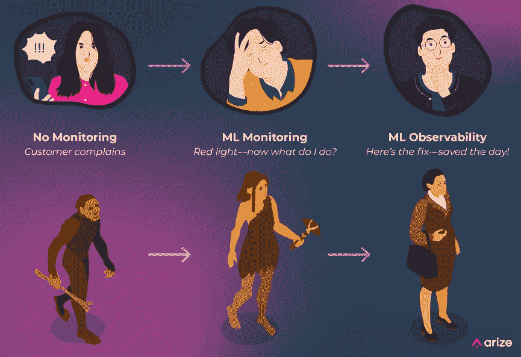
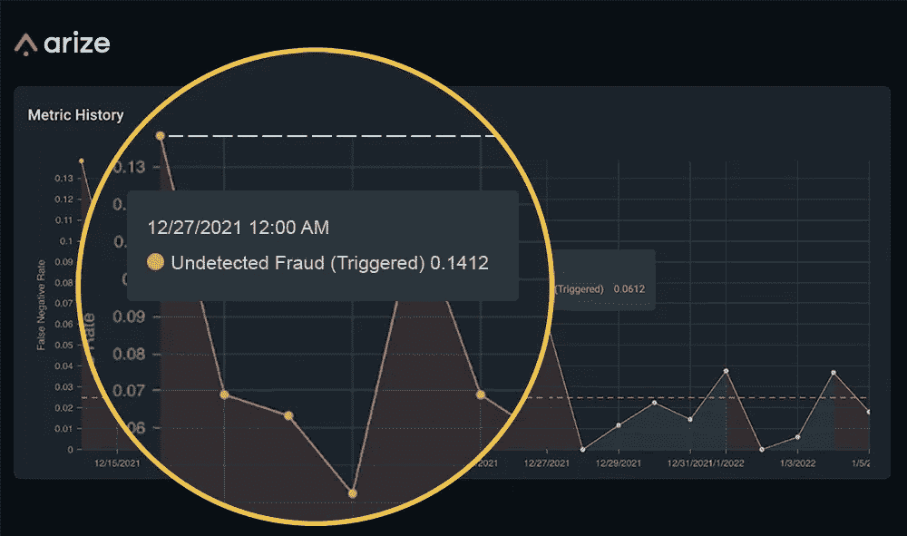
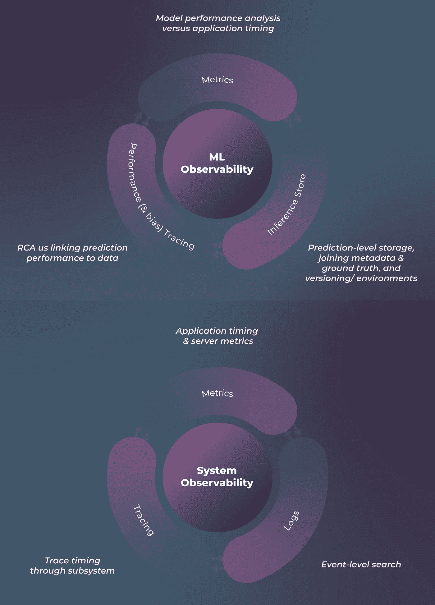
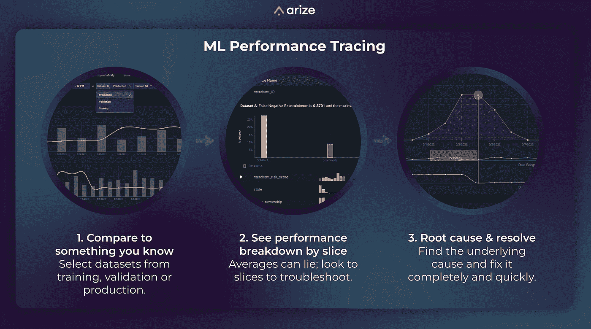
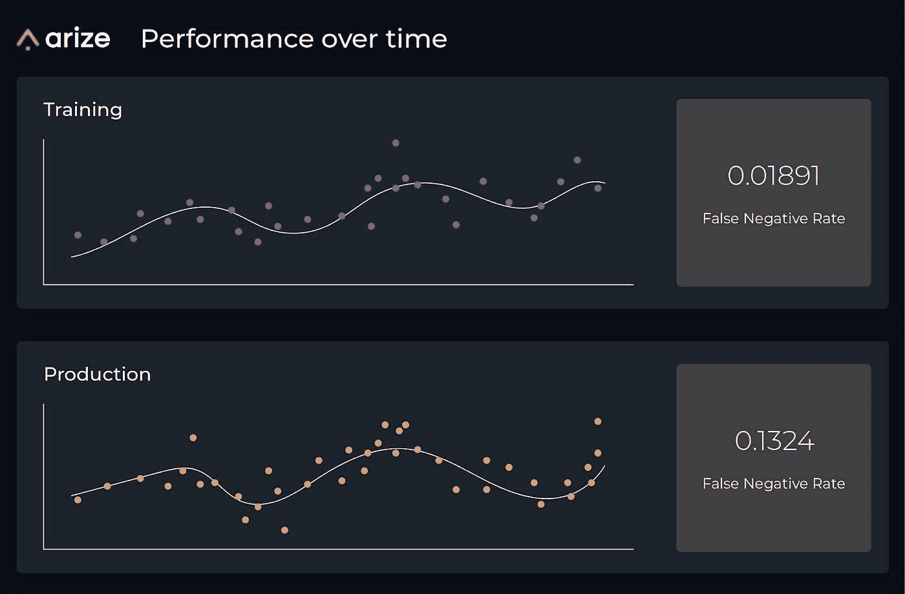
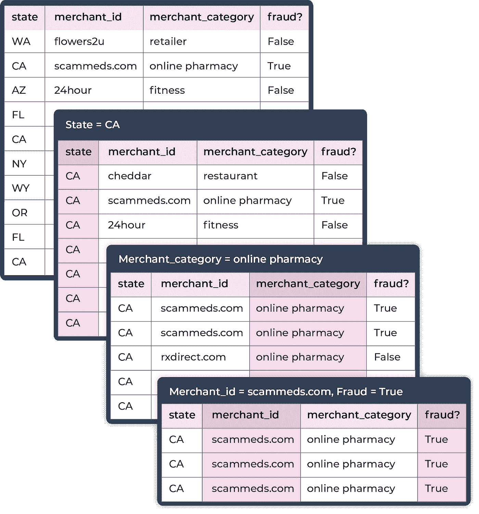

# ML 性能跟踪简介

> 原文：<https://towardsdatascience.com/introducing-ml-performance-tracing-4a1f0042b65d>

ML 故障排除的演变:作者图片

## ML 故障排除系列的第二部分

在本内容系列的第一部分中，我们介绍了当今 ML 故障排除是多么痛苦，以及如何开始 ML 监控。然而，仅仅监测并不能解决问题。

为了说明这一点，让我们回顾一下本系列第一部分中的情况。您正在享受早晨的咖啡，但这一次您实施了性能监控。你得到的不是产品经理的投诉，而是一个寻呼机工作警报，说“欺诈模型性能下降。”

您的产品经理、客户支持团队和客户仍然幸运地没有意识到欺诈交易的增加，并且您在问题对公司产生重大影响之前就意识到了它。性能指标已经超过了阈值，您看到了红灯— *但是现在该怎么办*？为了查明并解决问题，需要 ML 可观测性。

性能指标超过了阈值—现在该怎么办？图片作者:艾瑞泽·艾

# 可观察性的关键组成部分

在基础设施和系统中，[日志、度量和跟踪都是实现可观察性的关键](https://iamondemand.com/blog/the-3-pillars-of-system-observability-logs-metrics-and-tracing/)。这些组件对于实现 [**ML 可观察性**](https://arize.com/ml-observability/) 也是至关重要的，这是一种深入理解模型在其生命周期中的数据和性能的实践。

最大似然可观测性的关键组成部分，系统可观测性

## 定义最大似然可观测性的关键组成部分

**推理存储** —从模型中记录的 ML 预测事件的记录。这些是原始预测事件，包含有关模型预测的粒度信息。系统可观测性日志的含义和 ML 可观测性中的[推理库](https://arize.com/blog/the-only-3-ml-tools-you-need/)之间有一些关键区别。这将包括在即将到来的职位！

**模型指标** —预测事件的计算指标，用于确定模型随时间的整体健康状况，包括漂移、性能和数据质量指标。然后可以监控这些指标。

**ML 性能跟踪** —虽然日志和指标可能足以理解单个事件或聚合指标，但它们很少在调试模型性能时提供有用的信息。为了解决模型性能问题，您需要另一种叫做 ML 性能跟踪的可观察性技术。

在本文中，我们将深入探讨如何使用 ML 性能跟踪进行根本原因分析。

比较系统可观测性和机器学习可观测性(Arize AI)

# ML 性能跟踪简介

**💡定义:什么是 ML 性能跟踪？** [ML 性能跟踪](https://arize.com/blog/machine-learning-performance-tracing/)是一种方法，用于查明模型性能问题的来源，并映射回导致该问题的底层数据问题。

在基础设施可观察性中，跟踪表示请求或动作在分布式系统的所有不同节点间移动的整个过程。在 ML 可观测性中，轨迹表示模型在数据集和各个切片中的性能。它还可以通过多个依赖模型跟踪模型的性能，以找出导致性能下降的子模型的根本原因。当今行业中的大多数团队都是单模型系统，但是我们看到了一组越来越多的模型依赖链。

在基础设施和 [ML 可观察性](https://arize.com/ml-observability/)中，通过分析跟踪数据，您和您的团队可以测量整体系统健康状况，查明瓶颈，更快地识别和解决问题，并优先考虑高价值领域以进行优化和改进。

让我们深入研究 ML 性能跟踪工作流。它遵循三个核心步骤:

*   步骤 1:与另一个数据集进行比较；
*   第二步:按切片进行性能分解；
*   步骤 3:根本原因和解决方案。

机器学习性能跟踪工作流(Arize AI)

# 第一步:和你知道的东西比较

模型性能只有在与某些事情相关时才有意义——如果触发了警报，那么一定是某些事情发生了变化。

机器学习模型依赖于数据和代码。其中一个必须保持不变，以便在更改另一个时进行比较。所以你要么在多个数据集上比较同一个模型，要么在同一个数据集上比较多个模型。

机器学习的故障排除需要跨数据集进行比较。

跨数据集比较性能(Arize AI)

我们需要比较哪些数据集？

1.  **训练数据。**您的模型必须经过某种训练，您可以在训练数据集和您在生产中看到的数据之间寻找差异。例如，也许一个[欺诈检测模型](https://arize.com/use-case/fraud-detection/)在生产中出现了问题。您可以提取原始的训练数据集，并查看自那时以来假阴性百分比是如何变化的。
2.  **验证数据。**对模型进行训练后，您应该在验证数据集上对其进行评估，以了解模型如何处理训练中未发现的数据。与您验证模型时相比，您的模型现在的性能如何？
3.  **生产中的另一个时间窗口。**如果您的模型上周投入生产，但警报没有触发，那么从那时起发生了什么变化？

您还可以将您的模型的性能与您在生产中使用的以前的模型进行比较。例如，上个月的模型可能会为您的食品配送提供更准确的 eta。

# 第二步:超越平均值，分析切片的性能

**💡定义:什么是切片？**

数据集切片标识了您的数据的一个子集，该子集可能[在性质上与其余部分](https://research.google/pubs/pub46555/)不同。例如，从机场接站的拼车客户可能与“普通”乘客有很大不同。

在整个数据集中比较一个指标很快，但平均值往往掩盖了有趣的见解。大多数情况下，您看到的是一小部分，比如数据子集的一个子集。如果你能找到正确的切片，那么解决问题就变得微不足道了。理想情况下，这不应该涉及成百上千的 SQL 查询，因为您应该能够快速缩小选择范围。

例如，如果您看到欺诈检测模型的整个生产数据集的性能略有异常，它可能不会告诉您太多信息。另一方面，如果你在加州的交易中看到的份额更小，表现明显更差，这可能有助于你确定发生了什么。更好的是:如果你将范围缩小到加利福尼亚、某个特定的商户类别和某个特定的商户，并发现所有或大多数交易都是欺诈性的，这可能会帮助你在几分钟内而不是几天内确定原因。

真正的洞察力往往存在于几层之下。

作者图片(阿里泽·艾)

您希望能够快速确定是什么拉低了您的整体绩效。您想知道您的模型相对于您的比较数据集在不同部分的表现如何。

然而，由于片段的可能组合的数量呈指数级增长，这种需求变得复杂。您可能有数千个特性，每个特性都有几十个类别，一个切片可以包含任意数量的特性。那么你如何找到重要的呢？

作者图片(阿里泽·艾)

为了实现自动化，您需要某种方法来对哪些部分对您所看到的问题影响最大进行排序。如果存在这样的排名，你可以利用计算能力来处理所有可能的组合，并对每个部分的贡献进行排序。

## 简介:绩效影响得分💡

**性能影响分数是衡量你的兴趣指标与平均水平相比有多差的指标**(了解更多关于性能影响分数背后的[数学](https://arize.com/resource/modern-model-performance-management/) ) **。**

理想情况下，ML 工程师应该一眼就能看出问题出在哪里。良好的可视化和简单的导航可以使这个过程非常直观，并帮助工程师专注于提供洞察力——这是人类最擅长的工作。

继续以欺诈模型为例，按性能影响分数排序使您能够缩小范围—在本例中，是加利福尼亚州一家名为“scammeds.com”的特定商家—与平均值相比，性能下降了 30%。由于在训练中没有此切片的数据，这可能表明需要重新训练模型或恢复到不同的版本。

性能切片:作者提供的图片(Arize AI)

将特征“merchant_name”按准确度和交易量进行分类，进一步揭示了“scammeds.com”在生产中的模型准确度仅为 5%,因此它拖累了整体性能，尽管它仅占整体交易量的一小部分(~15%)。

准确性分类、按特征分类的数量:按作者分类的图像(Arize AI)

## 可解释性如何融入 ML 可观察性？

[**可解释性**](https://arize.com/blog/model-explainability-primer/) 在机器学习中是指特征对一个预测的重要性。一些特征可能比其他特征对预测欺诈有更大的影响。将可解释性视为分割的圣杯是很诱人的，但是在这样做的时候你必须小心。

可解释性是解决问题之旅的起点，而不是终点。正如 Chip Huyen [提到的](https://huyenchip.com/2022/02/07/data-distribution-shifts-and-monitoring.html)，可解释性帮助你理解你的模型如何工作背后最重要的因素。另一方面，可观察性帮助你理解你的整个系统。可观察性包括可解释性和其他几个概念。

使用功能重要性可以帮助您对故障排除的位置进行排序和优先排序。

回到欺诈模型的例子，可解释性可以说明问题出在哪里。如果您按对模型最重要的功能进行排序，您将很快发现功能州(如加利福尼亚州)和商户名称(如 scammeds.com)对于进一步研究发现潜在的性能问题非常重要。

虽然可解释性是一个极好的工具，但它不应该被用作解决模型问题的灵丹妙药。性能影响分数通过描述哪个部分对性能下降的原因影响最大来提供更多信息。

# 步骤 3:根本原因和解决方法

你揭开了大海捞针，找到了模型做得不好的地方。恭喜你！现在，让我们来回答更难的问题——为什么？

以下是模型性能下降的三个最常见的原因:

1.  一个或多个功能存在数据质量问题；
2.  一个更多的[特性已经漂移](https://arize.com/blog/take-my-drift-away/)，或者在生产中看到意想不到的价值；或者
3.  有标签问题。

让我们更详细地看看这些。

## **1。一个(或多个)功能有数据质量问题**

*示例:*您正试图找出为什么拼车应用程序的 eta 是错误的，并且您发现功能“上车位置”总是与实际上车位置相差 0.5 英里。

*推荐的解决方案:*数据工程团队需要经历“拾取位置”特性的生命周期，并找出它在哪里被破坏。当他们发现问题并能够实现功能修复时，应该会改进 ETAs。

## 2.一个(或多个)功能已经漂移，或者在生产中出现意外值

*示例:*您看到您的模型出现欺诈交易高峰，但您的模型没有发现它们。换句话说，假阴性增加了。这是来自一个特定的商家 ID(这是一个发送到您的模型的功能)。你最近也收到了来自这个商家 ID 的巨大的峰值。您应该会看到这个商家 ID 特性有所变化，显示您看到来自该商家的交易比以前多。

*推荐的解决方案:*在这种情况下，您想知道自您构建模型以来或者自性能下降之前，什么特性发生了变化。你要找到商家 ID [分布漂移](https://arize.com/model-drift/')的根本原因。在那之后，你可能需要重新训练你的模型，对你以前没见过的新商家 ID 进行上采样。在某些情况下，您甚至可能想要为这个用例训练另一个模型。

## 3.有标签问题

*例子:*一个预测房价的模型显示了一个特定邮政编码的价格分布的极端差异。邮政编码非常重要。进一步检查后，您发现训练数据显示该邮政编码被标注了两个不同的城市名称，例如 Valley Village 和 North Hollywood(城市名称“Hollywood”产生更高的房价)。

*推荐解决方案:*向标签提供商强调问题，并在标签文件中提供说明。

# 结论

在本系列的[第一部分](https://arize.com/blog/toward-better-ml-troubleshooting/)中，我们讨论了从无监控到[监控](https://arize.com/model-monitoring/)的最初转变。这里，我们讨论了下一步:带有 ML 性能跟踪的全栈 ML 可观测性。

概括地说，ML 性能跟踪的基础是:

1.  与你知道的东西相比；
2.  超越平均值，进入数据切片；和
3.  根本原因和解决方法。

现实生活中的复杂性通常意味着最小部分的错误都会导致经济价值的巨大损失。如今，这意味着 ML 工程师必须花费大量时间编写 SQL 查询，并手动剖析模型，直到解决方案出现。还有一种将可解释性视为捷径的自然倾向。虽然可解释性通常可以帮助您理解问题，但在您的武器库中拥有其他工具也很重要——尤其是性能跟踪——以找到问题的根源。

知道寻找什么样的信息，并拥有快速呈现信息的好工具——以一种容易理解的方式——可以节省许多时间、金钱和客户关系。

# 联系我们

如果这个博客引起了你的注意，并且你渴望了解更多关于[机器学习可观察性](https://arize.com/ml-observability/)和[模型监控](https://arize.com/model-monitoring/)，请查看我们其他的[博客](https://arize.com/blog/)和 [ML 监控](https://arize.com/ml-monitoring/)上的资源！如果您有兴趣加入一个有趣的 rockstar 工程团队来帮助模型成功生产，请随时[联系](https://arize.com/contact/)我们，注册一个免费帐户，或者在这里[找到我们的空缺职位](https://arize.com/careers/)！