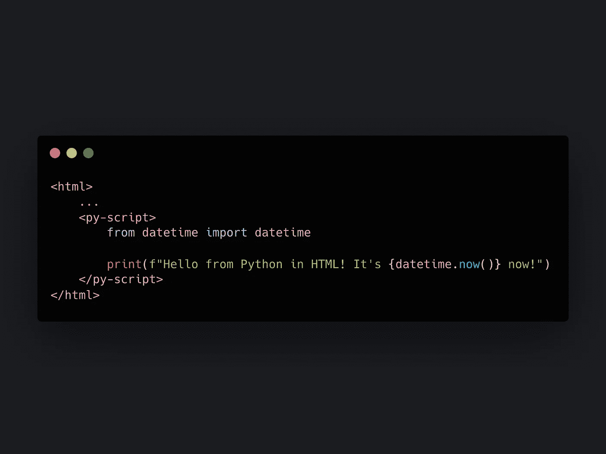

# PyScript 简介—如何在浏览器中运行 Python

> 原文：<https://towardsdatascience.com/introducing-pyscript-how-to-run-python-in-your-browser-8d838bb12224>

## Python 是现在新的 JavaScript 吗？嗯，不，但你仍然可以做很酷的事情



文章缩略图(图片由作者提供)

Anaconda 的首席执行官王蒙杰在 PyCon US 2022 期间透露了一些非常有趣的事情。它是**py script**——一个 JavaScript 框架，允许你在浏览器中创建 Python 应用。没错，现在您可以直接在 HTML 文件中嵌入 Python 代码，就像任何 JavaScript 开发人员都会做的那样。

PyScript 背后的想法很简单——数据科学家可以用他们最喜欢的语言围绕他们的模型创建网站，前提是他们具备基本的 HTML 知识。HTML 在某个方面有点像 SQL 每个人都知道。

【PyScript 会不负众望吗？只有时间会证明一切。今天，我将向您展示两个基本示例，让您在几分钟内开始使用 PyScript。如果您希望涵盖更高级的主题，比如机器学习和处理用户输入，请告诉我。

不想看书？请观看我的视频:

# 什么是 PyScript，为什么要关注它？

据 [Anaconda Cloud](https://anaconda.cloud/pyscript-python-in-the-browser) 称，PyScript 是一个在 HTML(类似 PHP)中交错 Python 的系统。这意味着您可以用 HTML 编写和运行 Python 代码，调用 JavaScript 库，并处理几乎所有与 web 开发相关的事情。

对于数据科学家来说，这意味着您现在可以围绕您的数据产品创建 web 应用程序。每个人都可以使用网络浏览器，这使得网络成为一个比手机更容易进入的平台。

此外，您不必担心部署，因为一切都发生在浏览器中。您可以将您的模型和仪表板作为 HTML 文件共享，只要有人在 web 浏览器中打开它，它就会运行代码。整洁！

PyScript 构建在 [Pyodide](http://pyodide.org/) 之上，是 CPython 到 WebAssembly/Emscripten 的一个端口:


图 1 — PyScript 技术堆栈(来源:[https://anaconda.cloud/pyscript-python-in-the-browser)](https://anaconda.cloud/pyscript-python-in-the-browser))

如果你想知道，WebAssembly 是一项使用 Python 编写网站成为可能的技术。据 [Mozilla](https://developer.mozilla.org/en-US/docs/WebAssembly) 称，这是一种低级的类似汇编的语言，具有紧凑的二进制格式，以接近本机的性能运行，并为语言提供编译目标，以便它们可以在网络上运行。

但是实际上如何使用 PyScript 呢？接下来我们来回答这个问题。

# 如何使用 PyScript

你可以在[pyscript.net](https://pyscript.net/)上下载 PyScript 的 alpha 版本。我们今天不会下载任何东西。相反，我们将在 HTML 文件中嵌入一个样式表和一个脚本。作为参考，所有使用 PyScript 的 HTML 文件都必须有一个指向以下内容的链接:

```
<link rel="stylesheet" href="https://pyscript.net/alpha/pyscript.css" />
<script defer src="https://pyscript.net/alpha/pyscript.js"></script>
```

PyScript 允许您使用以下组件用 HTML 编写 Python:

*   `py-env` -定义运行 Python 代码所需的 Python 包。
*   `py-script` -编写 Python 代码的 HTML 文件的一部分。
*   `py-repl` -创建 REPL 组件，评估用户输入的代码并显示结果。

我们今天将处理前两个问题，把最后一个问题留待以后处理。

让我们看看你如何用 PyScript 编写一个简单的 *Hello World* 程序。

# PyScript 示例# 1-Hello World

在 Visual Studio 代码中，您可以编写一个感叹号，后跟一个制表符，以创建一个基本的 HTML 文档结构。在`<head>`标签内，添加上一节提到的两个链接。

hello world 示例不需要任何外部 Python 库，所以我们可以完全放弃`<py-env>`部分。

在关闭`</body>`标签之前，打开一个包含 Python 逻辑的新的`<py-script>`标签。只需注意**压痕** -最好将其完全去除。格式看起来不太好，但是你会得到一个错误。

我们要做的很简单——打印一条 hello world 消息和当前的日期时间信息:

```
<!DOCTYPE html>
<html lang="en">
<head>
    <meta charset="UTF-8">
    <meta http-equiv="X-UA-Compatible" content="IE=edge">
    <meta name="viewport" content="width=device-width, initial-scale=1.0">
    <link rel="stylesheet" href="https://pyscript.net/alpha/pyscript.css" />
    <script defer src="https://pyscript.net/alpha/pyscript.js"></script>
    <title>First Python HTML app</title>
</head>
<body>
    <py-script>
from datetime import datetime print("Hello World!")
print(f"It's now {datetime.now()}")
    </py-script>
</body>
</html>
```

在浏览器中打开 HTML 文件，几秒钟后您将看到:


图像 2-在浏览器中使用 Python-Hello World 示例(作者提供的图像)

就在那里！这将花费您更多的时间在 Flask 中编码，所以 PyScript 已经显示出它是一个可行的替代方案。接下来让我们看一个更复杂的例子。

# PyScript 示例# 2-带 Bokeh 的图表

没有图表，您无法围绕您的数据产品创建仪表板。到目前为止，PyScript [不支持](https://github.com/pyodide/pyodide/tree/main/packages) Plotly，所以我们只能选择 Matplotlib 或 Bokeh。让我们选择后者。

它需要大量的 Bokeh JavaScript 脚本，所以只需从下面的代码片段中复制它们。

这一次，我们依赖于一个外部 Python 库——Bokeh——所以一定要在`<py-env>`标签中指定它。我从[博凯画廊](https://docs.bokeh.org/en/latest/docs/gallery/bar_basic.html)复制了图表示例，只是为了确保它有效:

```
<!DOCTYPE html>
<html lang="en">
<head>
    <meta charset="UTF-8">
    <meta http-equiv="X-UA-Compatible" content="IE=edge">
    <meta name="viewport" content="width=device-width, initial-scale=1.0">
    <link rel="stylesheet" href="https://pyscript.net/alpha/pyscript.css" />
    <script defer src="https://pyscript.net/alpha/pyscript.js"></script>
    <script type="text/javascript" src="https://cdn.bokeh.org/bokeh/release/bokeh-2.4.2.min.js"></script>
    <script type="text/javascript" src="https://cdn.bokeh.org/bokeh/release/bokeh-gl-2.4.2.min.js"></script>
    <script type="text/javascript" src="https://cdn.bokeh.org/bokeh/release/bokeh-widgets-2.4.2.min.js"></script>
    <script type="text/javascript" src="https://cdn.bokeh.org/bokeh/release/bokeh-tables-2.4.2.min.js"></script>
    <script type="text/javascript" src="https://cdn.bokeh.org/bokeh/release/bokeh-mathjax-2.4.2.min.js"></script>
    <title>Bokeh Example</title>
    <py-env>
    - bokeh
    </py-env>
</head>
<body>
    <h1>Bokeh Example in PyScript</h1>
    <div id="chart"></div> <py-script>
import json 
import pyodide 
from js import Bokeh, console, JSON
from bokeh.embed import json_item
from bokeh.plotting import figure
from bokeh.resources import CDNfruits = ['Apples', 'Pears', 'Nectarines', 'Plums', 'Grapes', 'Strawberries']
counts = [5, 3, 4, 2, 4, 6]
p = figure(x_range=fruits, height=350, title="Fruit Counts", toolbar_location=None, tools="")
p.vbar(x=fruits, top=counts, width=0.9)
p.xgrid.grid_line_color = None
p.y_range.start = 0
p_json = json.dumps(json_item(p, "chart"))
Bokeh.embed.embed_item(JSON.parse(p_json))
    </py-script>
</body>
</html>
```


图像 3-在浏览器中使用 Python-Bokeh 示例(作者图像)

你看看那个！不需要为了显示一个简单的图表而编写整个 web 应用程序。这就是 PyScript 的强大之处。

# Python for Web 与 py script——何去何从？

长话短说，PyScript 简化了可视化和交互式展示数据产品的过程。这是最好的解决方案吗？没有，至少现在还没有。是不是最容易上手的？遥遥领先。

我很高兴看到未来的 PyScript 版本会带来什么。如前所述，它仍处于 alpha 阶段，因此预计未来会有很多变化。如果您对 PyScript 的更高级用法感兴趣，请告诉我—例如，围绕机器学习模型创建仪表板。

你对 PyScript 有什么想法？你计划用它来代替基本的 Python web 应用程序吗？请在下面的评论区告诉我。

*喜欢这篇文章吗？成为* [*中等会员*](https://medium.com/@radecicdario/membership) *继续无限制学习。如果你使用下面的链接，我会收到你的一部分会员费，不需要你额外付费。*

<https://medium.com/@radecicdario/membership>  

## 推荐阅读

*   [学习数据科学先决条件(数学、统计和编程)的 5 本最佳书籍](https://betterdatascience.com/best-data-science-prerequisite-books/)
*   [2022 年学习数据科学的前 5 本书](https://betterdatascience.com/top-books-to-learn-data-science/)
*   [用 Python 打印列表的 7 种方法](https://betterdatascience.com/python-list-print/)

## 保持联系

*   雇用我作为一名技术作家
*   订阅 [YouTube](https://www.youtube.com/c/BetterDataScience)
*   在 LinkedIn 上连接

*原载于 2022 年 5 月 4 日*[*https://betterdatascience.com*](https://betterdatascience.com/pyscript-intro/)*。*