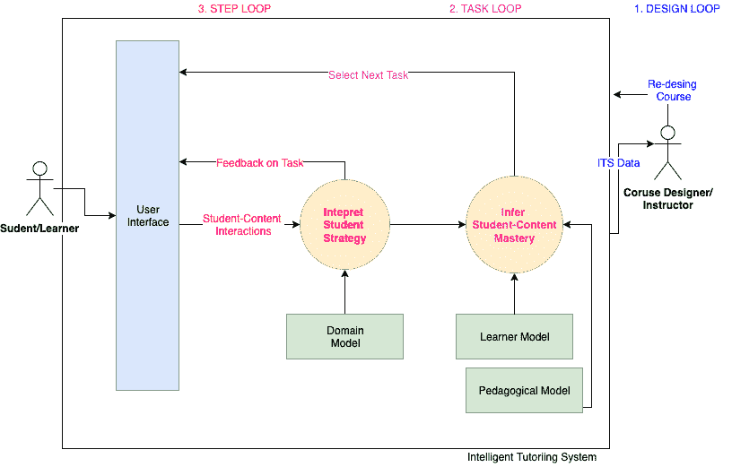
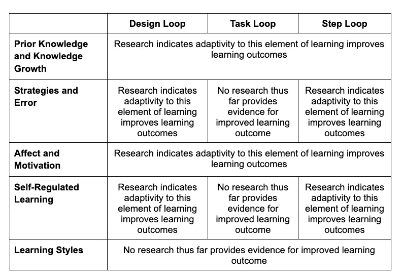

# 适应性学习简介

> 原文：<https://towardsdatascience.com/introduction-to-adaptive-learning-9a0ee48fb8a7>

## 使用机器学习和数据科学来个性化教育

Alexandre Van Thuan 在 [Unsplash](https://unsplash.com/s/photos/education?utm_source=unsplash&utm_medium=referral&utm_content=creditCopyText) 上拍摄的照片

数据科学(DS)和机器学习(ML)经常被用来构建个性化产品。个性化在教育中的应用包含了适应性学习的领域。DS/ML 的商业化程度相对较低的应用吸引了该领域的顶级研究人员，包括[汤姆·米切尔(是的，汤姆·米切尔)经营公司](http://squirrelai.com/)致力于解决这个问题。

在这篇文章中，我们将深入探讨什么是自适应学习，基本概念，自适应学习系统的设计，以及该领域常用的 DS/ML 技术。

# **什么是适应性学习？**

适应性学习旨在为个别学习者提供个性化的课程教学。在一个师生比例不断下降的时代，人们对创建能够支持教师和学生的学习系统有着极大的兴趣。适应性学习旨在通过提供实时反馈和适应学生的学习细微差别来支持学生。就教师而言，适应性学习可以帮助识别有后退风险的学生，并提供关于学生如何学习概念的见解，以随着时间的推移改进课程。

# **智能辅导系统**

在文献中，利用自适应学习的解决方案通常被称为智能辅导系统(ITS)。典型的智能交通系统如下图所示。

作者基于引用创建的图像

从标有数字和突出显示的部分，我们可以看到智能交通系统以三种不同的方式适应学生的需求。

**设计回路适应性**

它可以从与课程互动的一组学生中收集数据，并将其提供给教师，教师可以为下一组学生更好地设计课程。这被称为设计循环适应性，其中课程基于数据一次适应整个队列。

**任务循环适应性**

它可以收集单个学习者的表现，因为他们与课程内容互动。然后，基于“领域模型”(连接课程概念的信息模型)、“学习者模型”(跟踪学习者到目前为止已经学习了哪一组概念以及有多大信心的模型)和“教学模型”(有一定信心已经学习了某一组概念的学习者接下来应该教什么的模型)，ITS 可以调整下一组课程指令，称为任务循环适应性。因此，task loop 可以为个人学习者提供个性化的课程内容。

**步进循环适应性**

它还可以适应学习者在一项任务中的个人行为。例如，正在进行任务的学生可以收到关于他们是否正确执行了任务中的中间步骤的实时反馈，询问下一步的提示，了解中间步骤的影响等。这被称为“步进循环”适应性。步骤循环用于在任务中适应单个学习者的动作。

# **适应哪方面的学习？**

既然我们已经了解了在系统中建立适应性的层次，那么我们能适应学生学习的哪些方面呢？鉴于直觉会告诉我们学生可以有不同的学习风格，并将不同的情绪与学习内容联系起来，我们应该把自己局限于学生的知识吗？以下是我们可以适应的一些可能的元素，可以使用的 DS/ML 技术，以及迄今为止围绕它们的基于研究的结论。

**先验知识和知识增长**

照片由 [Charl Folscher](https://unsplash.com/@charlfolscher?utm_source=unsplash&utm_medium=referral&utm_content=creditCopyText) 在 [Unsplash](https://unsplash.com/s/photos/knowledge?utm_source=unsplash&utm_medium=referral&utm_content=creditCopyText) 上拍摄

学习者在目标领域有不同程度的先验知识和经验，所以一课适用于所有人的方法是行不通的。因此，智能教学系统需要能够评估学生的知识，并相应地调整教学。根据目前的研究，这可以在所有三个适应性水平上有效地完成

**设计循环调整**:对课程互动和表现数据进行分析，以确定洞察力，如缺少学生需要接受培训的先决条件，学生可能基于不完整的指导做出不正确的假设等。[教育数据挖掘领域](https://educationaldatamining.org/)处理不同尺度的多维分析。

任务循环适应:在这一级，我们试图根据我们迄今为止对学习者的知识建立的模型来预测下一个最好的任务。一种流行的方法使用[认知掌握进行任务选择](http://citeseerx.ist.psu.edu/viewdoc/download?doi=10.1.1.7.1268&rep=rep1&type=pdf)和[贝叶斯知识追踪](https://www.cs.cmu.edu/~ggordon/yudelson-koedinger-gordon-individualized-bayesian-knowledge-tracing.pdf)模型来确定什么是理想的下一个任务，以最大限度地学习，同时最小化多余的努力。

**步骤循环适应**:在这个级别，我们试图在学习者完成任务时向他们提供实时反馈，例如中间步骤的正确性。研究表明，这有助于减少学习者的不确定性，从而提高学习者的效率。实现这一点的一个简单而流行的方法是[基于规则的认知建模](https://learnlab.org/opportunities/summer/readings/CognitiveModeling-v09.pdf)。

**策略和错误**

Felix Mittermeier 在 [Unsplash](https://unsplash.com/s/photos/strategy?utm_source=unsplash&utm_medium=referral&utm_content=creditCopyText) 上拍摄的照片

学习者在完成一项任务时可能会使用不同的策略来实现相同的目标(比如使用不同的方法来解决一个数学问题)，这可能会导致学习者面临不同的错误。(如计算错误、单位转换错误、不正确的公式等)研究表明，ITS 可以在设计和步骤循环级别适应这样的学习者偏好。目前，没有任何结论性的研究表明任务循环适应这一目标可以提高学习。

**设计循环调整**:在这一阶段，我们试图确保学生能够使用不同的策略，但同时需要足够的中间步骤，也称为“脚手架”，这样我们就可以跟踪他们正在使用什么策略，而无需明确询问他们。根据互动和表现数据，教师可能会决定改变任务周围的脚手架，以允许更多的策略和尽量减少错误。[知识组件建模](https://home.x-in-y.com/pluginfile.php?file=%2F2075%2Fmod_folder%2Fcontent%2F0%2FDesign%20Recommendations%20for%20ITS_Volume%201%20-%20Learner%20Modeling%20Book_Chapter%2015.pdf&forcedownload=1)是一种解决这种设计循环适应性的流行方法。

**步骤循环适应** s:在这一阶段，我们试图解释错误，或错误步骤的影响，并根据我们迄今为止推断的学生策略提供下一步的提示。[动态贝叶斯网络](/introduction-to-bayesian-networks-81031eeed94e)和[强化学习](https://datamachines.xyz/the-hands-on-reinforcement-learning-course-page/)是构建步进循环自适应的常用方法。

**情感和动机**

学习者可能会经历不同的情绪，如厌倦、困惑、沮丧、投入/心流，也称为“情感状态”，这可能会影响他们对课程内容的看法和总体表现。因此，智能交通系统必须能够检测情感状态，并促进有利于学习的情感状态。研究表明，它能适应所有三个适应水平的情感状态。

**设计循环适应**:在这一级，分析互动和表现数据，以了解有利于学习的情感状态。它旨在促进有利于学习的情感状态。例如，教育数据挖掘通常用于识别与“游戏系统”相关的学习者和行为，其中学习者表现出不参与(通过使用计算机视觉检测到的面部提示来识别)，并且可能利用实时反馈来提供例如关于中间步骤或下一步提示的正确性反馈。教师可以设计机制来阻止这种情况。

**任务循环适应**:在这个阶段，我们的目标是选择下一个任务，它不仅能优化学习效果，还能产生有利于学习的情感状态。例如， [A/B 测试](/data-science-you-need-to-know-a-b-testing-f2f12aff619a)表明，围绕学生兴趣(如体育/娱乐/艺术等)量身定制任务环境会带来更好的学生参与度和整体表现。

**循环适应**:在这个级别，我们的目标是在任务中提供支持，促进积极的情感状态。这可以是在提供暗示、提醒让走神的学生回来或激励信息时的移情对话。研究和 A/B 测试表明，这使学生以更好的方式看待它，并取得更好的学习成果。

**自我调节学习(SRL)**

照片由 [Josefa nDiaz](https://unsplash.com/@josefandiaz?utm_source=unsplash&utm_medium=referral&utm_content=creditCopyText) 在 [Unsplash](https://unsplash.com/s/photos/self-learning?utm_source=unsplash&utm_medium=referral&utm_content=creditCopyText) 上拍摄

学习者采取一些自我激励的行动来掌握概念，如设定目标、对比不同的策略和评估自己的表现，以了解自己的优势和劣势。所有这些行为都属于 SRL 范畴，它解释了学习结果的显著差异。研究表明，SRL 可以在设计回路和步进回路级别进行调整。关于任务循环适应的研究尚无定论。

**设计循环调整**:在这一层面，我们利用教育数据挖掘和用户调查来了解 SRL 行为，从而实现最佳学习。然后，教师在智能交通系统中设计机制，以促进成功的 SRL 行为。例如，研究和 A/B 测试表明，让学生解释他们的答案会带来更好的学习效果。

**分步循环适应**学生:在这一阶段，我们利用领域和学习者模型来评估学生在任务中的熟练程度，并提供适应性信息以鼓励 SRL 活动。例如，根据学生与任务的互动——所用时间、尝试次数、迄今为止使用的提示等，可以识别出正在努力的学生。可以向这样的学生提供适应性信息，以在继续之前反映和解释他们迄今为止所做的事情。研究表明，这种分步循环适应性导致更好的学习结果，并促进“为未来的学习做准备”。

**学习风格**

布鲁克·卡吉尔在 [Unsplash](https://unsplash.com/s/photos/learning?utm_source=unsplash&utm_medium=referral&utm_content=creditCopyText) 上的照片

学习者对自己的学习方式有各种各样的偏好。直觉告诉我们，根据学生的学习风格调整内容会提高学习效果。然而，迄今为止的研究并没有提供任何适应性水平相同的证据。

因此，总结研究，我们可以创建一个我们可以适应什么与我们适应的水平(设计/任务/步骤)的概述，在文献中称为适应性网格。(如下图所示)

作者创建的图像

# **结论**

在这篇文章中，我们讨论了什么是适应性学习，智能交通系统是什么样子，我们可以在不同的水平上适应智能交通系统，以及我们可以适应智能交通系统的不同学习元素。

对于那些希望深入这个相对较新的领域的人来说，除了特定领域的技术(认知建模、知识组件建模、ACT-R)，所需的关键 DS/ML 知识包括强化学习、贝叶斯建模和 A/B 测试。

**参考文献**

[https://cs . CMU . edu/~ Aleven/Papers/2016/Aleven _ et al _ handbook 2017 _ adaptivelearningtechnologies . pdf](https://cs.cmu.edu/~aleven/Papers/2016/Aleven_etal_Handbook2017_AdaptiveLearningTechnologies.pdf)