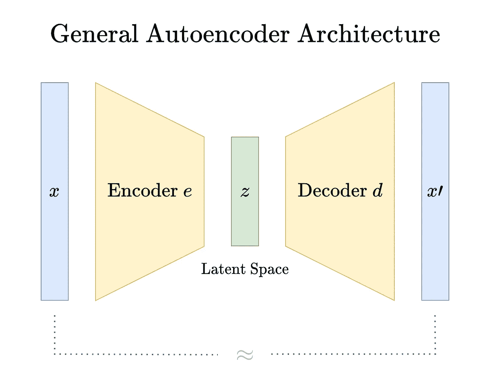
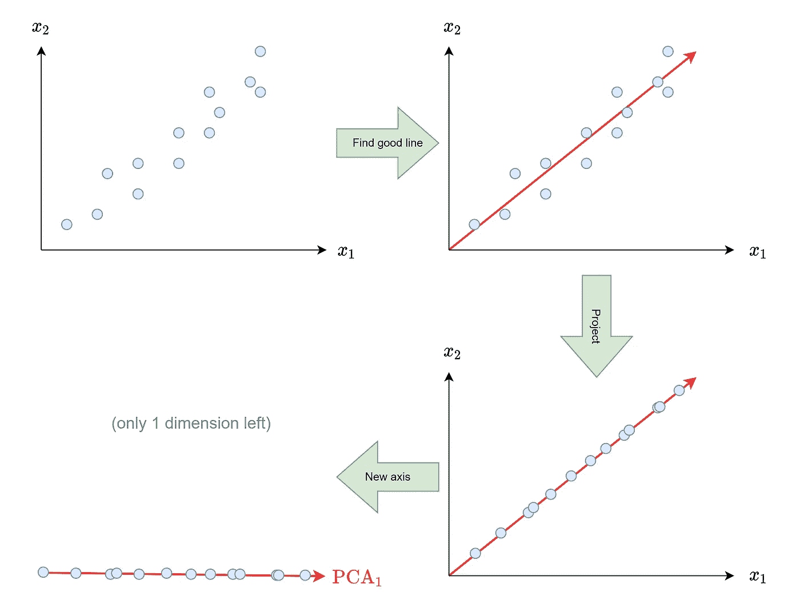
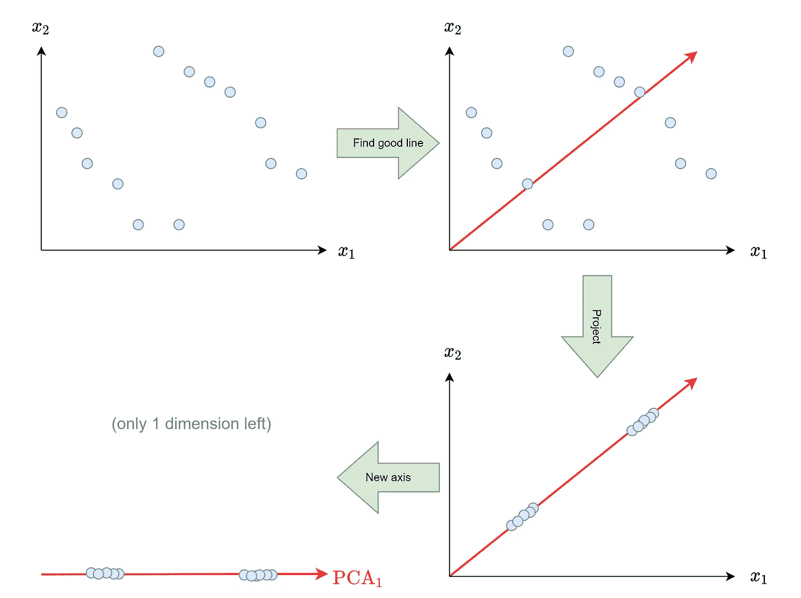
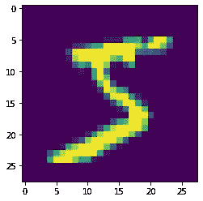
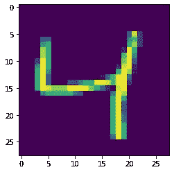
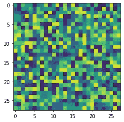
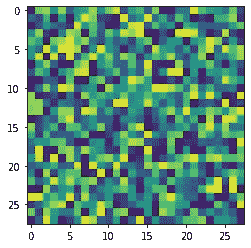

# 自动编码器简介

> 原文：<https://towardsdatascience.com/introduction-to-autoencoders-b6fc3141f072>

## [自动编码器](https://medium.com/tag/autoencoder)

## 如何使用 Tensorflow 简化您的数据


由[蒂姆·斯蒂夫](https://unsplash.com/@timstief?utm_source=medium&utm_medium=referral)在 [Unsplash](https://unsplash.com?utm_source=medium&utm_medium=referral) 上拍摄的照片

我想象你有一个数据集( *X* ， *y* )，其中包含了**大量的特征**，你想用它们来解决一个任务，比如回归或分类。虽然拥有更多的**观察值**总是更好，但是在一个模型中包含太多的**特性**可能会适得其反，无论是对于可解释性还是甚至是模型的性能。考虑这个简单的例子:

```
import numpy as np

np.random.seed(0)

X = np.random.randn(1000, 900)
y = 2*X[:, 0] + 1 + 0.1*np.random.randn(1000)
```

在这里，我们创建了一个数据集( *X* ， *y* )，包含 1000 个样本，每个样本有 900 个特征 *x* ₀，…， *x* ₈₉₉。我们想知道的事实是 *y* = 2 *x* ₀ + 1，由于误差也很小，线性回归应该完全达到接近 1 的 *r* 。然而，进行交叉验证会产生

```
from sklearn.linear_model import LinearRegression
from sklearn.model_selection import cross_val_score

print(cross_val_score(LinearRegression(), X, y))

# Output:
# [0.88558154 0.87775961 0.87564832 0.86230888 0.8796105]
```

看不见的数据上的 *r* 约为 0.87，离 1 相当远。当将模型限制为仅使用前 10 个变量时，通过进行相同的分析，我们可以更清楚地看到这有多糟糕:

```
print(cross_val_score(LinearRegression(), X[:, :10], y))

# Output:
# [0.99701015 0.99746395 0.99780414 0.99752536 0.99745693]
```

我们可以看到，丢弃特征将性能提高到大约 0.997。这意味着即使像线性回归这样简单的算法也可能淹没在特性中。

有几种技术可以减少特性的数量，比较流行的有

*   仅仅根据诸如单变量分析(即与目标 *y* 的相关性)或重要性分数(*p*-值、基于树的算法的特征重要性、Shapley 值等)的规则来丢弃一些特征，以及
*   [主成分分析](https://en.wikipedia.org/wiki/Principal_component_analysis) (PCA)，使用特殊的线性映射将数据转换到低维空间(即，将数据矩阵 *X* 乘以另一个矩阵 *W* )。注意这里我们**不需要*y*。**

在本文中，我们将了解到*类* **对 PCA** 的另一种推广方法:[内核 PCA](https://en.wikipedia.org/wiki/Kernel_principal_component_analysis) 。

开玩笑，我指的当然是**自动编码器**！*(不过内核 PCA 是一个有效的选择。)*

# 自动编码器

那么，这些神秘的自动编码器是如何工作的，为什么我们首先要关心呢？让我们来找出答案。

## 直觉

通常，手边的数据包含了 T4 冗余，可以很容易地压缩而不会丢失太多信息。想象一个数据集，它具有以厘米为单位的**高度和以米为单位的**高度。这两个要素包含相同的信息，但是如果它们都有不同种类的噪声，可能会影响模型性能。所以，还是选这两个中的一个比较好。

虽然这种情况很明显，但自动编码器可以找到更细微的冗余，并将其压缩掉。我们希望的是，自动编码器中间所谓的**信息瓶颈**(潜在空间，见下文)不会过滤掉必要的信息，而只是冗余信息。一个简单的检查是通过查看所有的 *x* 和 *x* 之间的**重建误差**。一会儿就变得更具体了。

## 定义

对于什么是自动编码器，没有一个真正的数学定义，至少我找不到。不过，我可以给你一个足够好的直觉。

自动编码器由**两个功能 *e* (编码器的简称)和 *d* (解码器的简称)**组成，其行为如下:

1.  *e* 将一个具有 *n* 特征的观测值 *x* 作为输入，并将其映射到一个维度为 *m* ≤ *n* 的**低维**向量 *z* ，称为 *x* 的*潜在向量*。
2.  *d* 取潜在向量 *z* 并再次输出一个尺寸为 *n* 的*x*’。

另外，我们希望 ***x* 和 *x* 接近，即*x*≈*x*’，**即**重建误差应该很小**。用通俗的语言来说:

> 编码器压缩原始观察值 x *。解码器再次解包。这个打包和拆包的过程不要太扭曲 x(平均)。*



图片由作者提供。

像 zip 和 rar 这样的压缩工具也试图达到同样的效果，但是有一个更严格的条件:x = x’。 PNG 是另一种*无损*格式，虽然 jpeg 或 mp3 等格式并非无损，但*足够好*让人类看不出区别，至少如果压缩不是太激进，即 *m* 不是太小。

在我们转向通用自动编码器之前，让我们重复一下 PCA 在高层次上做什么——以及它失败的时候。

## 何必呢？

好的，我们知道拥有太多的特性*可能是一件消极的事情。我们还谈到了 PCA 能够减少特征的数量。然而，PCA——作为线性变换——具有有限的表达能力。提醒一下 PCA 是如何工作的:*



图片由作者提供。

> *在 autoencoders 的语言中，* ***左下角的图像显示编码*** *(它只是一维而不是二维)，右下角的* ***图像显示解码*** *(回到原来的二维)。两个顶部图像都包含原始输入数据。*

如果数据接近于在一个维度为 *m 的*线性子空间*(即直线、平面、超平面)中，具有 *m* 分量的* PCA 工作得很好。但是，如果不这样做，我们可能会丢失许多关于原始数据的信息，正如我们在这里看到的:



图片由作者提供。

好吧，如果线性变换的简单性是瓶颈，让我们使用更复杂的编码器和解码器！实现这一点的一个简单方法是使用神经网络，所以让我们开始吧。

> ***注:*** *通常，当人们谈论自动编码器时，他们指的是* ***基于神经网络的自动编码器*** *。但是这并不是唯一的选择:只要你有一个解码器和一个编码器，一切都是允许的。例如，你可以根据下面的决策树来检查一个奇特的自动编码器。然而，在本文中，我将坚持使用传统的*自动编码器。**

[](/building-a-simple-auto-encoder-via-decision-trees-28ba9342a349) [## 通过决策树构建一个简单的自动编码器

### 如何使用随机决策树构建自动编码器

towardsdatascience.com](/building-a-simple-auto-encoder-via-decision-trees-28ba9342a349) 

# Tensorflow 中的实现

编码时间到了！首先，让我们做一些基本的事情，用以下方式定义一个具有 4 个特征的数据集 *X* :

```
import tensorflow as tf

tf.random.set_seed(0) # keep things reproducible

Z = tf.random.uniform(shape=(10000, 1), minval=-5, maxval=5)
X = tf.concat([Z**2, Z**3, tf.math.sin(Z), tf.math.exp(Z)], 1)
```

如果你想一想，你能如何压缩 *X* 的维度？用更少的特征重构 *X* 有什么必要？

嗯，我们只需要 *Z* ，即**一个单一特征**。 *X* 并不包含比 *Z* 更多的信息，我们只需对 *Z* 应用某种确定性函数就可以得到 *X* 的特征。

编码器可以计算出如何找到函数的*逆*，即从 *x* = ( *z* ， *z* ， *sin* ( *z* )， *exp* ( *z* ))到*z*，解码器可以学习取一个数 *z* 并将其转化为

你有没有注意到我在这里是如何使用*这个词的？对我们来说，这将是显而易见的解决方案，因为我们知道如何从 *Z* 生成 *X* 。然而，自动编码器不知道这一点，可能会找到另一种方法来压缩数据。比如它可以想办法把 *x* = ( *z* ， *z* ， *sin* ( *z* )， *exp* ( *z* ))压缩成 *z -* 3，解码器可以重新学习解码这个，一样好。*

*好的，所以我们应该能够建立一个只有一个潜在维度的性能良好的自动编码器。我们可以通过以下方式做到这一点*

```
*class AutoEncoder(tf.keras.Model):
    def __init__(self):
        super().__init__()

        self.encoder = tf.keras.Sequential([
            tf.keras.layers.Dense(100, activation='relu'),
            tf.keras.layers.Dense(100, activation='relu'),
            tf.keras.layers.Dense(100, activation='relu'),
            tf.keras.layers.Dense(1), # compress into 1 dimension
        ])
        self.decoder = tf.keras.Sequential([
            tf.keras.layers.Dense(100, activation='relu'),
            tf.keras.layers.Dense(100, activation='relu'),
            tf.keras.layers.Dense(100, activation='relu'),
            tf.keras.layers.Dense(4), # unpack into 4 dimensions
        ])
    def call(self, x):
        latent_x = self.encoder(x) # compress
        decoded_x = self.decoder(latent_x) # unpack
        return decoded_x

tf.random.set_seed(0) # keep things reproducible

ae = AutoEncoder()

ae.compile(
    optimizer=tf.keras.optimizers.Adam(learning_rate=0.0001),
    loss='mse'
)

ae.fit(
    X, # input
    X, # equals output
    validation_split=0.2, # prevent overfitting
    epochs=1000,
    callbacks=[
        tf.keras.callbacks.EarlyStopping(patience=10) # early stop
    ]
)

# Output:
# [...]
# Epoch 69/1000
# 250/250 [==============================] - 0s 1ms/step - loss:          # 0.0150 - val_loss: 0.0276*
```

*看起来不错，模型可以学习底层结构！我们还可以通过以下方式检查自动编码器产生的最大误差*

```
*print(tf.reduce_max(tf.math.abs(X-ae(X))))

# Output:
# tf.Tensor(0.89660645, shape=(), dtype=float32)*
```

*不错，考虑到有些功能要上百个。现在我们知道了自动编码器的工作原理，让我们做一些更有趣的事情。*

## *压缩数字*

*自动编码器的一个经典例子是使用手写数字的 MNIST 数据集。让我们通过以下方式获取数据集*

```
*(X_train, _), (X_test, _) = tf.keras.datasets.mnist.load_data()
X_train = X_train.reshape(-1, 28, 28, 1) / 255\. # value range=[0,1]
X_test = X_test.reshape(-1, 28, 28, 1) / 255\.   # shape=(28, 28, 1)*
```

*画几个数字:*

```
*import matplotlib.pyplot as plt

for i in range(3):
    plt.imshow(X_train[i])
    plt.show()*
```

*****

MNIST 数据集中的数字。图片由作者提供。* 

*正如我们所看到的，数据集由手写数字组成，确切地说是 28x28 像素。由于每个像素都是一个特征，所以我们面对的是一个 28*28= **784 维的**数据集，对于一个图像数据集来说，这甚至*非常低*。*

*我们现在将为这个数据集构建一个自动编码器。但是我们为什么要成功呢？答案是手写数字是所有潜在 28x28 像素图片的**非常小的子集**。它们有非常特殊的像素模式。举例来说，尽管以下图像是 28x28 像素的图像，但它们绝不会被视为数字:*

*****

不是数字。图片由作者提供。* 

*但是我们需要多少个维度来表达 MNIST 数据集呢？不幸的是，这个问题没有通用的答案。通常，我们试图使维度尽可能小，以使重建(解码)足够好。*

*我们现在可以再次构建另一个简单的前馈自动编码器，我鼓励您这样做。我们要做的是使用**卷积层**建立一个自动编码器，因为我们在这里处理图像数据。这些类型的自动编码器被方便地称为**卷积自动编码器**。开门见山，对吧？*

*注意，图像的像素值在 0 和 1 之间，用于更快和稳定的训练，并且单个图像的形状为(*高* = 28，*宽* = 28，*通道* = 1)，用于卷积层工作。*

```
*from tensorflow.keras import layers

class ConvolutionalAutoEncoder(tf.keras.Model):
    def __init__(self):
        super().__init__()

        self.encoder = tf.keras.Sequential([
            layers.Conv2D(4, 5, activation='relu'),
            layers.Conv2D(4, 5, activation='relu'),
            layers.Conv2D(1, 5, activation='relu'),
        ])
        self.decoder = tf.keras.Sequential([
            layers.Conv2DTranspose(4, 5, activation='relu'),
            layers.Conv2DTranspose(4, 5, activation='relu'),
            layers.Conv2DTranspose(1, 5, activation='sigmoid'),
        ])
    def call(self, x):
        latent_x = self.encoder(x)
        decoded_x = self.decoder(latent_x)
        return decoded_x

tf.random.set_seed(0)

ae = ConvolutionalAutoEncoder()

ae.compile(optimizer='adam', loss='bce')

ae.fit(
    X_train, 
    X_train,
    batch_size=128,
    epochs=1000,
    validation_data=(X_test, X_test),
    callbacks=[
        tf.keras.callbacks.EarlyStopping(patience=1)
    ]
)

# Output:
# [...]
# Epoch 12/1000
# 469/469 [==============================] - 91s 193ms/step - loss: # 0.0815 - val_loss: 0.0813*
```

*我们可以通过它来查看潜在空间有多大*

```
*print(ae.summary())*
```

*我们看到第一层(即编码器)的输出形状为(None，16，16，1 ),这意味着输出是 16 * 16 * 1 = 256 维，也可以解释为单通道的 16x16 像素图像。*

*在我们继续之前，我们还可以手动检查一些图像重建:*

```
*n = 10

decoded_images = ae.predict(X_test[:n])
latent_images = ae.encoder(X_test[:n])

plt.figure(figsize=(20, 4))

for i in range(n):
    ax = plt.subplot(3, n, i + 1)
    plt.imshow(X_test[i])
    ax.get_xaxis().set_visible(False)
    ax.get_yaxis().set_visible(False)

    ax = plt.subplot(3, n, i + 1 + n)
    plt.imshow(latent_images[i] / tf.reduce_max(latent_images[i]))
    ax.get_xaxis().set_visible(False)
    ax.get_yaxis().set_visible(False)
    ax = plt.subplot(3, n, i + 1 + 2*n)
    plt.imshow(decoded_images[i])
    ax.get_xaxis().set_visible(False)
    ax.get_yaxis().set_visible(False)

plt.show()*
```

**

*顶行:原始，中行:压缩，底行:重建。图片由作者提供。*

*整体看起来还过得去！它到处都有一些问题，例如 2，但建立一个更好的网络架构可能会使它变得更好。我们还可以看到，原始图像的潜在版本仍然非常类似于原始数字，只是分辨率更差，因为它是 16x16 而不是 28x28 像素。虽然情况并不总是这样，但是在这里，autoencoder 碰巧发现这是一个很好的压缩。*

*我发现有趣的是，自动编码器了解到图像的边界不包含有用的信息。它只是放大数字，让它们填充完整的图像，这很有意义——我可能会像人类一样做同样的事情。然而，和神经网络一样，它不一定是这样的。在这里，这只是一个很好的小巧合。*

## *更多架构*

*我们现在已经看到了普通的自动编码器，以及卷积自动编码器。你可能已经猜到，通过改变自动编码器的结构，我们也可以创建 **LSTM 自动编码器或序列到序列自动编码器**、**变压器自动编码器**等等。*

*还有**稀疏自动编码器**，如果编码器一次使用太多的潜在维度，它会惩罚编码器。您可以通过`activity_regularizer`关键字将活动正则化添加到图层中。*

*尽管主要思想总是相同的:获取一个输入并使其变小。然后尽你所能把它放大一倍，基本上就像每个犯罪系列里一样(这是真的！):*

**

*图片由[信任号](https://imgur.com/user/trustno2)在[https://imgur.com/gallery/zVq9W7u](https://imgur.com/gallery/zVq9W7u)上。*

*另一种值得注意的我非常喜欢的自动编码器是**变体自动编码器。**它不仅能够重建数据，甚至能够**创建新数据**，这使其成为**创成式模型**。使用它们，您可以创建催眠图片，如*

**

*[https://www.tensorflow.org/tutorials/generative/cvae](https://www.tensorflow.org/tutorials/generative/cvae)*

# *结论*

*我们已经看到，数据可能带有大量冗余。这增加了处理所述数据所需的内存和计算能力，甚至可能降低模型的性能。通常，我们可以通过删除一些功能或使用 PCA 等方法来摆脱困境。*

*然而，这些方法可能过于简单，无法从数据中恰当地提取相关信息——它们存在不足。为了解决这个问题，我们可以使用自动编码器，它可以按照我们需要的复杂程度来转换数据。大多数时候，我们使用神经网络构建自动编码器，但也存在其他方法，例如使用决策树的。*

*然后，我们看到了如何用 Tensorflow 用几行代码构建一个普通的卷积自动编码器。您还看到了更多的自动编码器类型，这取决于您如何定义您的编码器和解码器。*

*现在，您可以开始自己探索自动编码器，使用它们，看看您是否能从它们中受益，解决您的问题。玩得开心！*

*我希望你今天学到了新的、有趣的、有用的东西。感谢阅读！*

***作为最后一点，如果你***

1.  ***想支持我多写点机器学习和***
2.  ***无论如何都要计划获得中等订阅量，***

***为什么不做** [**通过这个环节**](https://dr-robert-kuebler.medium.com/membership) **？这将对我帮助很大！😊***

*透明地说，给你的价格不变，但大约一半的订阅费直接归我。*

*非常感谢，如果你考虑支持我的话！*

> **有问题就在*[*LinkedIn*](https://www.linkedin.com/in/dr-robert-k%C3%BCbler-983859150/)*上写我！**