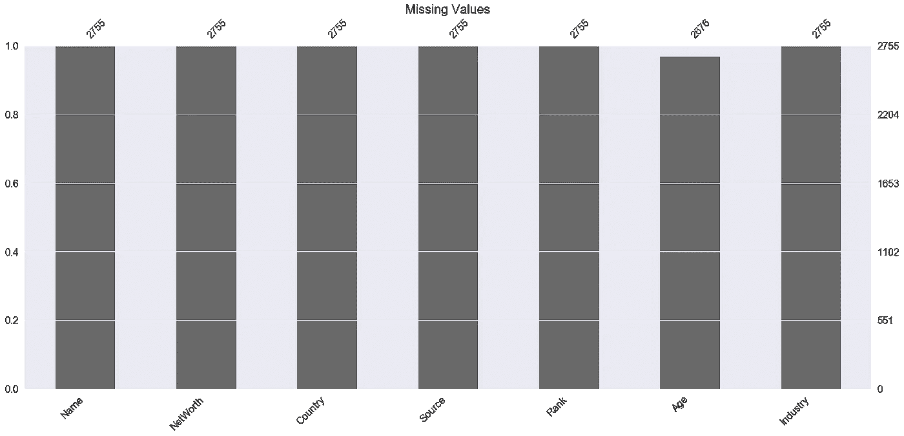
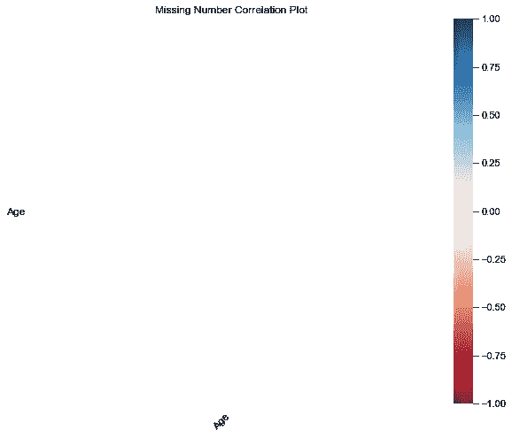
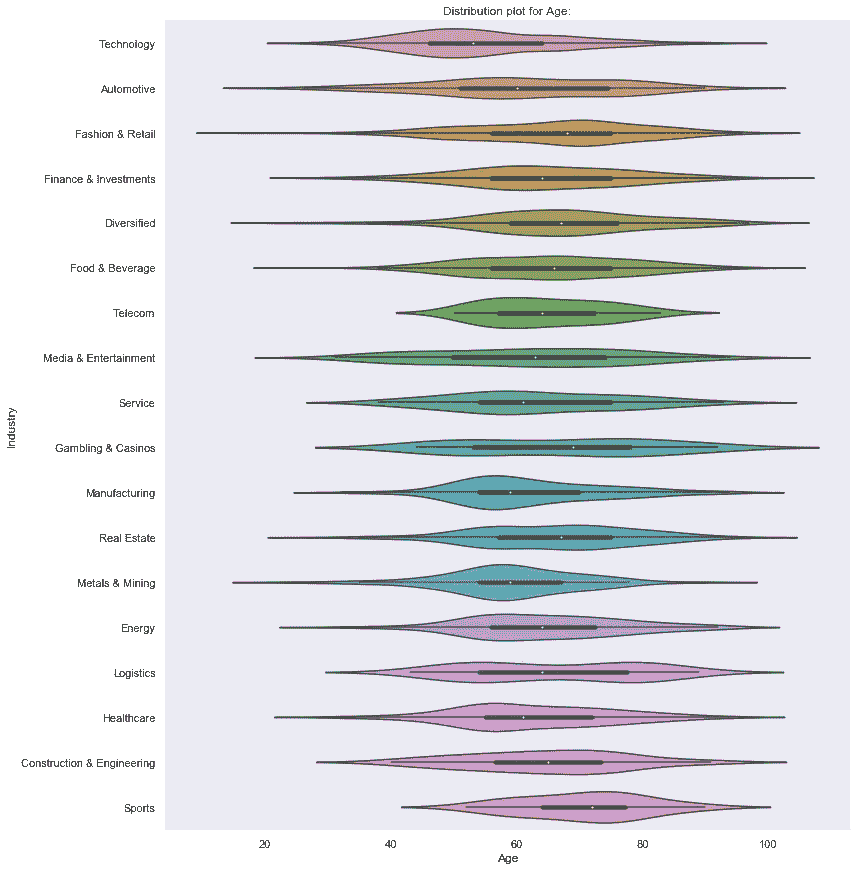
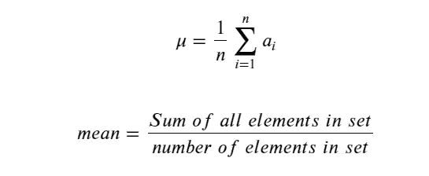
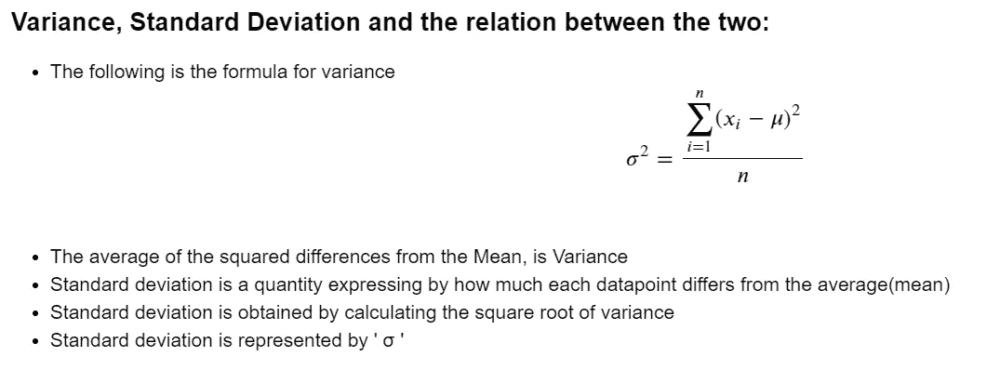
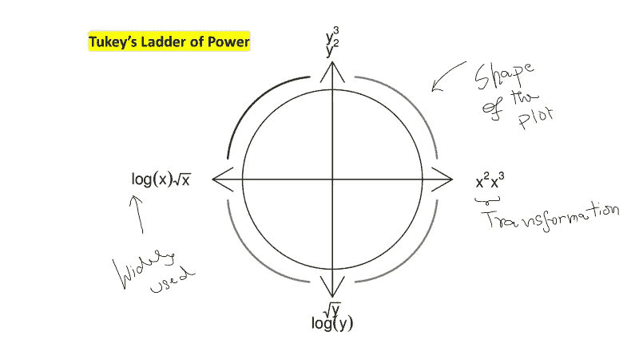
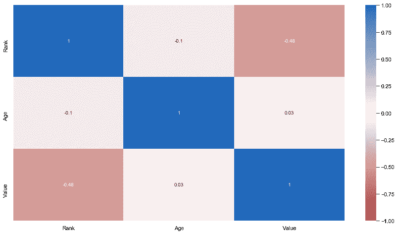

# Python 中使用描述性统计和统计图进行数据处理的介绍

> 原文：<https://towardsdatascience.com/introduction-to-data-processing-using-descriptive-statistics-and-statistical-charts-in-python-9857a60c481b>

# Python 中使用描述性统计和统计图进行数据处理的介绍

## Python 中测试数据假设(MCAR、MAR、MNAR、集中趋势、偏斜度和异常值)的完整实践指南


贾斯汀·摩根在 [Unsplash](https://unsplash.com?utm_source=medium&utm_medium=referral) 上的照片

# 数据可视化和统计

我们围绕数据的大部分工作涉及 70%的描述性分析，10%的探究性分析，剩下的 20%是预测性和规范性分析。描述性分析可以回答市场上正在发生的事情。例如，如果我们为一家零售店工作，我们希望确定他们的月销售额、客户流量、增长、净利润、业务来源(比如新客户和现有客户)以及多个其他 KPI。所有这些 KPI 都可以使用任何商业智能(BI)工具进行计算和可视化表示，如 Power BI、Tableau、Qlik Sense，甚至可以使用 Excel 和 PowerPoint 的组合。那么我们为什么需要 Python 及其可视化能力呢？

考虑到可再现的包和情节的限制，在 Python 中创建美观的可视化是具有挑战性的。Matplotlib(使用 Pyplot)、Seaborn 和 Plotly (plotly。express)可以用 Python 生成大部分统计图。这些软件包的主要限制在于它们格式化的灵活性，因此在描述性分析方面并不优于 BI 工具。虽然 Seaborn 不会自动生成数据标签，但 Plotly 并不支持 Python 中所有可能的可视化。Matplotlib 形成了所有可视化的主干，并在三层架构系统上运行，“后端层”、“艺术家层”和“脚本层”允许用户控制布局和格式。尽管如此，它也带来了复杂编码的巨大代价，而这是许多用户所避免的。

## 统计学和 Python 适合在哪里？

Python 提供了一些包，允许用户在构建任何预测模型之前研究数据属性并采取适当的措施。线性回归、逻辑回归、朴素贝叶斯分类器等统计模型，甚至基于聚类的任务都会对数据做出假设。在建立模型之前，我们可以使用图来验证这些假设。这些图使用描述性统计作为基础。我们将一点一点地讨论这个问题。你可以在拥有公共领域许可证的 [Kaggle](https://www.kaggle.com/roysouravcu/forbes-billionaires-of-2021?select=Billionaire.csv) 中找到用于此分析的数据集，这意味着每个人都可以访问它。在本文中，我们将涵盖以下概念:

1.  缺失值和缺失值的相关性-测量缺失值的随机性。
2.  使用数据分布的数据偏斜度
3.  离群值和图基阶梯
4.  皮尔逊相关系数—了解多重共线性

这项分析中使用的数据由以下属性组成——亿万富翁的“姓名”、“净值”、“国家”、“来源”、“排名”、“年龄”和“行业”。

```
#---------------------Importing packages for visualization----------------import pandas as pd #---Pandas for dataframe
import numpy as np #---Numpy for manipulation; Not used in this analysisimport seaborn as sns #---Seaborn for graphs
import matplotlib.pyplot as plt #---Pyplot for canvas (e.g. figure size, title, x and y axis ranges etc.)sns.set(color_codes=True)%matplotlib inline#With this backend, the output of plotting commands is displayed inline within frontends like the Jupyter notebook, 
#directly below the code cell that produced it. The resulting plots will then also be stored in the notebook document.data_MM=pd.read_csv('Billionaire - 2021.csv')data_MM.head()
```


图一。展示了数据集中的前五条记录和相关属性(列名)。图片由作者使用 Jupyter 笔记本制作。

## 1.了解缺失值

缺失值通常是指在数据收集过程中没有引入或丢失的属性。多种原因可导致缺失值，包括手动数据输入程序、设备错误和不正确的测量。Python 将缺失值视为 NA/Null/NaN，并自动忽略它们进行描述性分析。例如，当我们在原始数据上创建一个条形图来按行业分析亿万富翁的数量时，在创建计数图时，数据中任何缺失的名字都将被忽略。但是，假设使用相同的缺失值作为输入来构建聚类或回归模型。在这种情况下，Python 将抛出一个错误，因为大多数内置的统计建模包不能处理缺失值。我们可以使用以下内容来检查缺失值:

```
data_MM.info()data_MM.isnull().sum()
```

可以使用 [missingno](https://github.com/ResidentMario/missingno) 包创建这些缺失值的可视化表示。

```
!pip install missingnoimport missingno as msplt.title("Missing Values", fontsize=20);ms.bar(data_MM);
```



图二。说明了数据中缺失值按属性的分布情况。主 X 轴提供非缺失值的百分比，而次 X 轴提供非缺失记录的计数。图片由作者使用 Jupyter 笔记本制作。

正如您所看到的，我们只有一个属性“年龄”，它缺少一些条目。

1.  第一种方法是丢弃属性中缺少值的记录。删除缺失值较高的属性属于此类别。然而，这种技术的选择取决于从分析中移除的数据的百分比。如果百分比较低，则用户可以要求删除缺失的属性，否则需要某种形式的插补
2.  另一种方法是使用最大似然法，对完整数据部分的模型参数进行估计，然后用于抽样估算。这些包括期望最大化、多重插补、贝叶斯主成分分析等等
3.  最后，缺失值插补是一类旨在用估计值填充缺失值的程序。在大多数情况下，数据集的属性并不是相互独立的。因此，通过识别属性之间的关系，可以确定丢失的值。这还涉及领域知识和业务规则，它们可以用来纠正缺失的值

下面的可视化旨在检查变量/列中的随机样本或间隔值是否缺失。如果由于另一个变量缺少值而导致缺少值(例如，某个特定记录的年龄和姓名都缺少)，或者某个特定属性中的值独立于另一个属性而缺少(例如，在我们的数据集中，只有年龄缺少值，而所有其他属性都完整)。遗漏的类型包括:

*   **完全随机缺失(MCAR)** :缺失与观察值或缺失值无关
*   **随机缺失(MAR):** 缺失与其他观测数据之间存在系统关系，但缺失数据不存在系统关系
*   **非随机缺失(MNAR):** 缺失和它的值有关系，缺失或非缺失

```
#---------------------------------------Plotting data using msno----------------------------ms.heatmap(data_MM,figsize=(10,8), fontsize=12);
plt.title("Missing Number Correlation Plot");
```



图 3。说明数据中缺失值之间的相关性。我们只有缺失条目的“年龄”；因此，我们看不到上面的相关性，也就是说，我们可以断定“年龄”的值完全是随机缺失的。图片由作者使用 Jupyter 笔记本制作。

对于随机缺失或完全随机缺失的值，像平均值和中值这样的简单插补是最佳策略，这取决于偏斜度。对于偏斜的数据，最好使用中位数来抵消异常值的影响，而对于正态分布的数据，可以使用平均值。当数据随机缺失或者与另一个属性密切相关的属性中的值没有缺失时，也可以使用 K 最近邻等高级技术。对于 MNAR，即非随机缺失的值，一种流行的技术是从非缺失分布中采样值，直到缺失值处理后的数据分布与原始分布的分布匹配。

## 2.数据偏斜度

数据偏斜度表示数据值围绕平均值不对称的程度。测量偏斜度的一种方法是研究分布的平均值和中值。

*   均值>中位数:正分布还是右偏分布
*   均值=中位数:零偏斜或对称分布
*   平均值< Median: Negative or left-skewed distribution


图 4。说明了偏斜度的公式。Xi 是数据点，X 条是数据的平均值，西格玛是标准偏差，n 是记录数。

```
data_MM['Age'].skew()
```

Output: 0.045

```
data_MM[‘Age’].mean()
```

Output: 63.11

```
data_MM['Age'].median()
```

Output: 63.0

As we can see that Mean >中位数，数据是右偏的，偏度为 0.04。由于偏斜度非常小，约为 0，所以分布图显示了几乎正态分布。

```
plt.figure(figsize=(8,7))
sns.distplot(data_MM['Age']);
plt.title("Distribution plot for Age:");
```


图 5。说明了“年龄”的分布图。图片由作者使用 Jupyter 笔记本制作。

通常，整个数据的分布图可能无法描绘正确的画面。因为 sns.displot()不允许我们按类别分解数据，所以我们可以使用 catplot 创建一个 violin 图。**注意，我们不能使用 pyplot 和 figsize 来设置画布的高度和宽度，因此我们使用 catplot 中的 height 选项。**

```
sns.catplot(x="Age", y="Industry",
            kind="violin", data=data_MM, height=12);plt.title("Distribution plot for Age:");
```



图 6。说明了“年龄”按“行业”的分布图。图片由作者使用 Jupyter 笔记本制作。

注意-没有必要按类别分析分布，但对于倾斜数据，将数据恢复到正态分布是很重要的，因此，我们可以只转换特定类别的数据，而不是转换整个数据。

**线性模型(回归&逻辑)使用“正态数据分布”作为核心假设之一。像人工神经网络这样的深度学习模型也使用参数方程，假设数据是正态分布的。**

## 3.极端值

均值、中值和众数是在识别异常值时广泛用于理解数据分布的主要趋势。当我们测量同类事物时，相对大量的此类测量值会聚集在中间值周围。这样的值被称为集中趋势/统计平均值的度量。

**平均值计算如下:**



图 7。测量平均值。作者使用 Latex 制作的图像。

**中位数计算如下:**


图 8。测量中间值。这个公式适用于奇数个观测值。对于偶数个观察值，中位数计算为第 N/2 次和第(N/2)次+1 次观察值的平均值。例如，如果有 10 个观察值，我们将它们按升序排列，然后取第 5 个和第 6 个观察值的平均值作为中间值——作者使用 Latex 准备的图像。

Q1 和 Q3 的四分位数计算如下:


图 9。测量四分位数。k 是四分位值，即对于 Q1，k=1，对于 Q3，k=3。作者使用 Latex 制作的图像。

例如，考虑下面的一组数字:11 个学生解决一个难题所用的时间，以秒为单位，按 7、12、13、17、18、20、22、24、25、30、45 的顺序排列。由于𝑛在这个问题陈述中是 11，𝑞将永远是 0。因为(𝑛+1)是 12，而 MOD 4 是 0，所以对于𝑘=1， *p=floor(1* x *(12/4))，也就是 3。对于 K=3，p =地板(3* x *(12/4))，也就是 9。因此，从上面的列表中，Q1 = Xp 或 X3，13，Q3 等于 X9，25。*


图 10。说明了计算 Q1 和 Q3 的方法。作者使用 Latex 制作的图像。

四分位数间距(IQR) = Q3 — Q1

箱线图使用 IQR 基础来计算数据中的异常值。IQR 可以识别较低和较高的晶须，它们被用作逼近数据中异常值的阈值。任何超出这些阈值的数据点都被视为异常值。

1.  **下须= Q1–1.5 倍 IQR**
2.  **上须= Q3 + 1.5 x IQR**

```
data_MM['Age'].describe()count    2676.000000
mean       63.113602
std        13.445153
min        18.000000
25%        54.000000
50%        63.000000
75%        73.000000
max        99.000000
```

根据上面的例子，Q3 = 75%或第 75 百分位= 73，Q1 = 25%或第 25 百分位= 54。IQR = 73–54 = 19。下须= 54–1.5x 19 = 25.5，上须= 73 + 1.5 x 19 = 101.5

```
plt.figure(figsize=(15,7))
sns.boxplot(x = ‘Age’, data = data_MM, showmeans=True)
plt.title(“Boxplot for Age”)
plt.show()
```


图 11。说明了年龄的箱线图。请注意，下面的晶须标记为 25.5，超出的点被视为异常值。上须的理想值应该是 101.5，但是由于没有超过该阈值的值，数据中的最高年龄 99 被认为是上须。图片由作者使用 Jupyter 笔记本制作。

```
plt.figure(figsize=(30,9))
sns.boxplot(y = 'Age', x="Industry", data = data_MM, showmeans=True)
plt.title("Boxplot for Age")
plt.show()
```


图 12。展示了按行业划分的年龄箱线图。图片由作者使用 Jupyter 笔记本制作。

根据不同模型对数据分布的假设，离群值对于模型的良好运行同样重要。一般来说，有偏差的数据表明存在异常值。使用聚类分析时，离群值往往会形成自己的聚类，从而产生不正确的分段。存在异常值时，线性模型的最佳拟合线不正确。有多种方法可以处理异常值:

*   winsorization——将离群值限制在上下须上。这些须状物由 IQR 或者甚至标准差(例如±2/3 标准差)来定义



图 13。说明了方差和标准差的度量。图片由作者使用 Jupyter 笔记本和 Latex 制作。

*   Tukey 的权力阶梯—对于任何有偏差的数据，如果我们在两个变量 X 和 Y 之间创建一个图(比如年龄和净值，我们需要将净值转换为数字)，该图的形状可用于确定数据的转换类型。



图 14。说明了 Tukey 决定数据转换的权力阶梯。图片由作者使用 PowerPoint 制作。

```
data_MM['Value']=data_MM['NetWorth'].apply(lambda x: x.replace("$","").split()[0])data_MM['Value']=data_MM['Value'].astype('float')data_MM.head()plt.figure(figsize = (15,8));sns.scatterplot(x="Age", y="Value", data=data_MM);
```


图 15。展示了年龄和估价(价值)的散点图。随着年龄的增长，估值也在上升，因此我们可以对年龄和平方估值进行对数转换。图片由作者使用 Jupyter 笔记本制作。

## 皮尔逊相关系数—了解多重共线性

为了测量一个变量如何随着另一个变量的变化而变化，我们计算协方差。当我们用两个变量各自的标准差来归一化这两个变量的协方差时，我们得到了皮尔逊相关系数。协方差和皮尔逊相关系数计算如下:


图 15。说明了两个变量 X 和 Y 及其相关系数之间的协方差度量。适马指的是这些变量的标准差。作者使用 Latex 制作的图像。

*   该指标仅告诉我们两个变量一起变化的程度，而不是得出一个变量的变化导致另一个变量的变化的唯一证据。
*   正值表示两个变量朝同一方向移动，而负值表示两个变量朝相反方向移动。

我们只能确定两个变量之间关系的方向，但是为了确定关系的强度，我们计算两个变量的相关系数。

```
correlation = data_MM.corr().round(2) # creating a 2-D Matrix with correlation plotscorrelationplt.figure(figsize = (15,8)) #figsize=(width,height)sns.heatmap(correlation, annot=True, cmap='vlag_r', vmin=-1, vmax=1); #color palette
```



图 16。展示了数据中所有数值变量的关联矩阵(热图)。图片由作者使用 Jupyter 笔记本制作。

与协方差不同，相关系数与比例无关，可以取-1 到+1 之间的值。接近-1 的值表示变量之间的负相关。例如，等级和值之间的相关性等于-0.48。这表明随着值的增加，等级降低(由于等级 1 被认为是最高的，所以等级会更高)。

多重共线性在创建驱动模型时尤其重要。如果两个或多个变量高度相关，那么线性模型的参数估计可能不是精确的表示。通常，VIF(方差膨胀因子)用于识别多重共线性，但是相关性可以在构建模型之前筛选此类变量。

# 参考

1.  卡格尔。(未注明)。2021 年福布斯亿万富翁。2022 年 1 月 20 日检索，来自 kaggle.com 网站:[https://www . ka ggle . com/roysouravcu/Forbes-billionaires-of-2021？select=Billionaire.csv](https://www.kaggle.com/roysouravcu/forbes-billionaires-of-2021?select=Billionaire.csv)

*关于作者:高级分析专家和管理顾问，帮助公司通过商业、技术和组织数据的数学组合找到各种问题的解决方案。一个数据科学爱好者，在这里分享、学习、贡献；你可以和我在* [*上联系*](https://www.linkedin.com/in/angel-das-9532bb12a/) *和* [*上推特*](https://twitter.com/dasangel07_andy)*；*