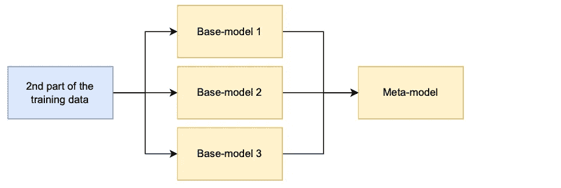
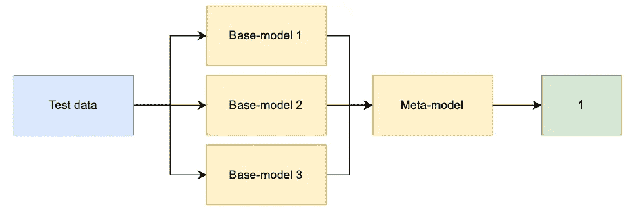
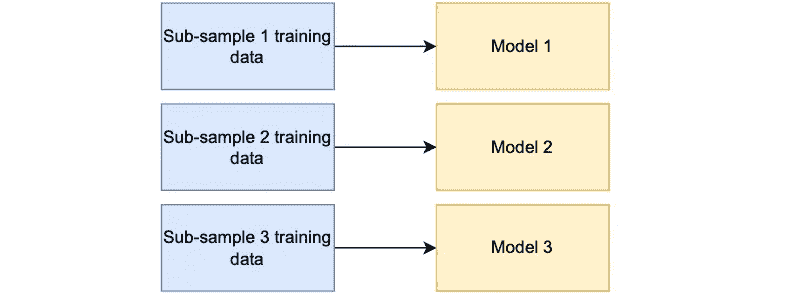
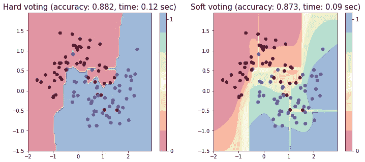
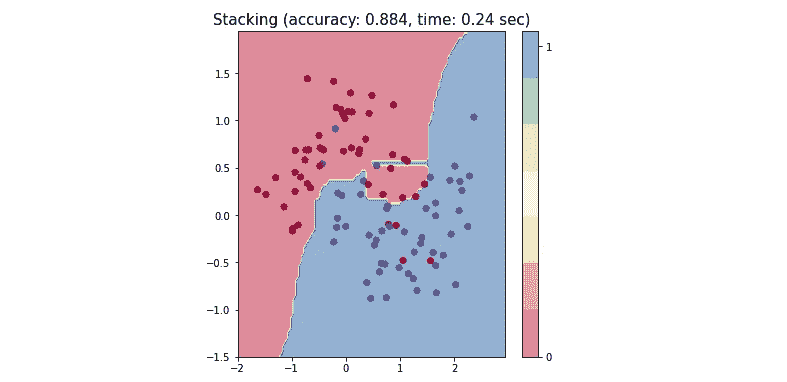
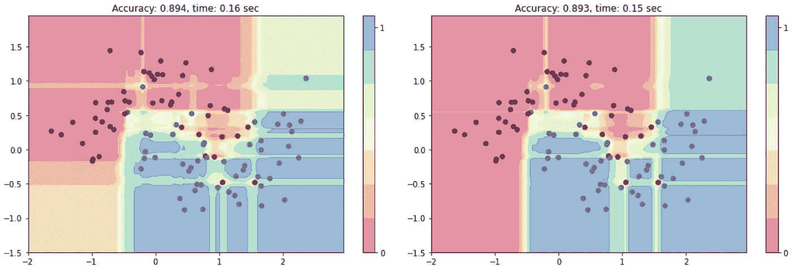
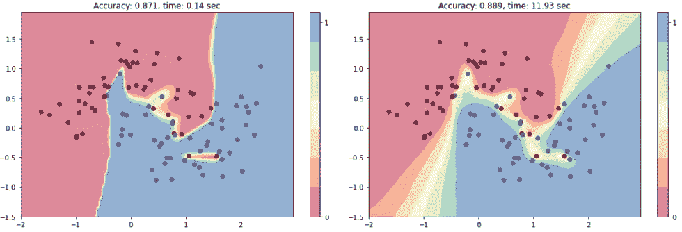

# 机器学习中的集成方法介绍

> 原文：<https://towardsdatascience.com/introduction-to-ensemble-methods-in-machine-learning-e72c6b9ff4bc>

## 本文介绍了机器学习中使用的主要集成方法:投票、打包、提升和堆叠

照片由[卢卡斯](https://www.pexels.com/@goumbik)在[像素](https://www.pexels.com/photo/chart-close-up-data-desk-590022/)上拍摄

在机器学习中，*偏差*是模型的预测值和地面真实值之间的差异，而*方差*是训练集中对小波动的敏感性产生的误差。

具有高偏差可能导致算法错过目标输出和特征之间的相关关系(欠拟合)，而高方差可能由对训练数据中的随机噪声建模的算法产生(过拟合)。

*偏差-方差权衡*是一个模型的属性，它表示可以以增加样本间估计参数的方差为代价来减少估计参数的偏差。

解决偏差-方差权衡的一种方法是使用混合模型和集成学习。一般来说，主要的集成方法有*投票、堆叠、* *打包*和*助推*。

本文涵盖了这四种集成方法，介绍了每种方法的主要优缺点及其在 Python 中的实现。

> 在继续阅读本文之前，如果您不熟悉偏差和方差术语，我推荐您看一下文章[模型评估的偏差-方差分解](/bias-and-variance-for-model-assessment-a2edb69d097f)。

# 1.集成方法

## 1.1.投票

*投票集成方法*是一种机器学习模型，它将来自不同模型的预测结合起来，以输出最终预测。对于这种集成方法，模型应该是不同的，因为它使用所有的训练数据来训练模型。

**图一**。投票集成方法的训练模型。**参考号**:图片作者。

对于回归任务，输出是模型预测的平均值。相反，对于分类任务，有两种估计最终输出的方法:硬投票和软投票。前者包括从模型的所有预测中提取模式(图 2)。后者在平均所有模型的概率后使用最高的概率(图 3)。

**图二**。硬投票。参考号:图片由作者提供。

**图 3** 。软投票。**参考**:图片由作者提供。

投票背后的主要思想是能够通过分别补偿每个模型的误差来更好地概括，特别是当模型在预测性建模任务中预测良好时。

这种集成方法对于随机机器学习模型(如神经网络)特别有用，因为它们每次运行都会产生不同的模型。如果观察到相同的模型在使用不同的超参数时表现良好，则当组合相同机器学习算法的多个拟合时，这也是有用的。

## 1.2.堆垛

堆叠集成模型是投票集成模型的扩展，因为它们使用贡献模型的加权投票来避免所有模型对预测的贡献相等。

堆叠模型的架构包括*基础模型*(根据训练数据拟合的模型)和*元模型*(学习如何组合基础模型预测的模型)。常见的做法是对回归任务使用线性回归模型，对分类任务使用逻辑回归模型。

元模型是根据基本模型基于样本外数据所做的预测来训练的。换句话说，(1)不用于训练基本模型的数据被馈送到基本模型，(2)从这些基本模型进行预测，以及(3)提供这些预测和基本事实标签以适合元模型。

元模型的输入取决于任务。对于回归任务，输入是预测值。对于二元分类任务，输入通常是正类的预测值。最后，对于多类分类，它通常是所有类的一组预测值。

文献中常用的一类叠加模型叫做*混合*。虽然堆叠模型是根据 k 倍交叉验证期间所做的折外预测来训练的，但是混合模型是根据维持数据集所做的预测来训练的。

**图 4** 。堆积系综方法的训练基模型。 **Ref** :图片作者。

**图 5** 。堆叠集成方法的训练元模型。**参考**:图片由作者提供。

**图 6** 。堆积系综方法的新数据。**参考**:图片由作者提供。

堆叠旨在提高建模性能，但并不保证在所有情况下都能提高性能。如果任何基础模型的性能类似于叠加系综方法，这应该是更好的使用，因为它更容易解释和维护。

## 1.3.制袋材料

Bagging 是对训练数据进行子采样以提高单一类型分类器的泛化性能的过程。这种技术对于倾向于过度拟合数据集的模型是有效的。

用于子采样数据的方法是*自举*(名称*装袋*来源于*自举* + *合计*)。这种方法包括对数据进行随机采样和替换，这意味着训练数据的子集将重叠，因为我们不是分割数据，而是对其进行重采样。

一旦获得每个模型的输出，每个数据的最终预测可以通过进行*回归投票*，其中预测是贡献模型的平均值，或者*分类投票，*，其中预测是贡献模型的多数票。

实施该方法时需要考虑的一些重要注意事项是:( 1)分类器的超参数不会随着子样本的不同而变化,( 2)改进通常并不显著,( 3)它的成本很高，因为它可能会将计算成本增加 5 或 10 倍,( 4)这是一种偏差减少技术，因此当方差受限时，它没有帮助。

**图 7** 。bagging 集成方法的训练模型。**参考**:图片由作者提供。

**图 8** 。bagging 系综方法的新数据。**参考**:图片由作者提供。

这种集成方法在过拟合数据时特别有用，但在欠拟合数据时则不然，因为它通过更好地概化来减少方差。

## 1.4.助推

Boosting 是一种集成方法，通过串联使用弱学习器来建立模型。主要思想是每个连续模型校正其先前模型的误差。

尽管有几种类型的提升算法，如梯度提升或 XGBoosting，但第一个为二进制分类开发的提升算法是 AdaBoost。图 9 以简化的方式显示了 AdaBoosting 的工作方式，其中的任务是根据 *x* 和 *y* 特征将圆和正方形分类。第一个模型通过生成垂直分隔线来分类数据点。但是，正如所观察到的，它错误地分类了一些圆圈的数据点。因此，第二个模型集中于通过增加错误分类的数据点的权重来分类这些错误分类的数据点。对于声明对象时定义的估计量的数量，这个过程是迭代完成的。因为更详细地解释 AdaBoost 算法本身需要一整篇文章，所以我把这个[视频](https://www.youtube.com/watch?v=LsK-xG1cLYA)留给感兴趣的人。

**图 9** 。增强系综方法的训练方法论。参考号:图片由作者提供。

在文献中，增强已被证明实现了准确的结果，因为它们是一种容易抑制过度拟合的弹性方法。然而，它对异常值很敏感，因为每个分类器都必须修复前一个分类器中的错误，而且它也很难扩大规模，因为每个估计器都将其正确性基于前一个预测器。

# 2.履行

本节将介绍上述每种集成方法的实现。

这是使用 *make_moons* 函数随机创建的数据集，它创建了两个交错的半圆。

**图十**。训练和测试设备。**参考号**:作者图片。

为了评估每个集成方法的结果，我们运行了 SVM 分类器、决策树分类器和逻辑回归作为基准。SVM 分类器是一种机器学习算法，它基于在 N 维空间(是特征的数量 *N* )中找到一个超平面来对数据进行清楚的分类。决策树是树结构分类，其中内部节点表示数据集的特征，分支表示决策规则，每个叶节点是结果。逻辑回归是一种统计分析方法，根据先前的观察预测二元结果。

> **注 1** :我刚刚选择了这三个模型来比较不同的机器学习算法，并不是因为它们对于这项任务来说是最优的。
> 
> **注 2** :对于 SVM 分类器，C 参数告诉 SVM 优化您希望避免对每个训练样本进行错误分类的程度。对于较大的 C 值，如果超平面在正确分类所有训练点方面做得更好，优化将选择一个更小边界的超平面[1]。因此，我选择了正则项 C 为 10000，以便模型能够适应训练数据。

*   SVC:准确率 84.2%，运行时间 0.07 秒。
*   决策树:准确率 86.6%，运行时间 0.02 秒。
*   逻辑回归:准确率 83.5%，运行时间 0.02 秒。

**图 11** 。SVC、决策树和逻辑回归模型的准确性和计算时间。**参考**:图片由作者提供。

对于这些图和下面显示的图，我使用了下面的代码来可视化每个模型的分类结果。虽然显示的图是针对训练数据的，但是精度和时间都是基于测试集的。

## **2.1。投票**

以下是使用硬投票和软投票实现投票组合时的结果:

*   硬投票:准确率 88.2%，运行时间 0.12 秒。
*   决策树:准确率 87.3%，运行时间 0.09 秒。

**图 12** 。硬投票和软投票模型的准确性和计算时间。**参考号**:作者图片。

可以观察到两个输出看起来都像图 11 中决策树的图，但是模型对训练集的概括更好，因为它们对蓝色数据点中包含的红色数据点进行了错误分类，反之亦然。对于位于图像中心的区域，观察到硬投票和软投票之间的主要区别，其中被认为是一个类别或另一个类别的区域受到给予决策树分类器的权重的影响。

关于硬表决，它不输出概率，因此需要通过`clf.predict(zz)`改变线路代码`clf.predict_proba(zz)`。

## **2.2。堆叠**

为堆积集成方法选择的元模型是一个逻辑回归，因为我们是在一个二元分类任务中，使用 5 重交叉验证进行训练。

*   堆叠:准确率 88.4%，运行时间 0.24 秒。

**图十三**。叠加模型的精度和计算时间。**参考**:图片由作者提供。

该集成模型以增加总计算时间为代价，优于硬投票和软投票。

## 2.3.制袋材料

使用 100 个估计量时，bagging 集合方法的精度和时间为:

*   SVC:准确率 87.7%，运行时间 0.19 秒
*   决策树:准确率 89.3%，运行时间 0.16 秒
*   逻辑回归:准确率为 84.1%，运行时间为 0.32 秒

**图十四**。SVC、决策树和逻辑回归 bagging 模型的准确性和计算时间。**参考**:图片由作者提供。

对于逻辑回归，bagging 方法允许通过组合多个线性模型来获得轻微的非线性模型。当与基准比较时，bagging 方法优于它们各自的模型，因为它们提高了准确性。具体来说，可以观察到决策树的显著改进，其中 bagging 通过对具有不同训练集的几个树进行投票来帮助减少过度拟合。

这里要提出的一个有趣的话题是装袋和随机森林的区别，因为这两种方法看起来非常相似。正如在[ [2](https://www.csias.in/what-is-the-difference-between-bagging-and-random-forest-why-do-we-use-random-forest-more-commonly-than-bagging/) ， [3](https://stats.stackexchange.com/questions/264129/what-is-the-difference-between-bagging-and-random-forest-if-only-one-explanatory) 中提到的，主要的区别取决于特征的数量(*重要提示*:这里我们说的是特征的数量，而不是数据的数量)，因为随机森林只选择了特征的子集。观看下面的[视频](https://www.youtube.com/watch?v=J4Wdy0Wc_xQ)了解关于这个话题的更多信息。

**图 15** 。随机森林和决策树装袋模型的精度和计算时间。**参考**:图片由作者提供。

最后，这是一个如何使用 PyTorch 和 Scikit-Learn 的 bagging 包装器在神经网络上实现 bagging 的例子。为此，有必要将网络包装在一个[sk learn . base . base estimator](https://scikit-learn.org/stable/modules/generated/sklearn.base.BaseEstimator.html)对象中。

这里，bagging 方法也以增加计算时间为代价胜过神经网络模型。

**图十五**。神经网络和神经网络 bagging 模型的精度和计算时间。**参考**:图片由作者提供。

## 2.4.助推

最后，增压型号的性能如下:

*   SVC:准确率 88.4%，运行时间 2.40 秒
*   决策树:准确率 87.2%，运行时间 0.02 秒
*   逻辑回归:准确率为 83.7%，运行时间为 0.15 秒

对于 boosting，有两个主要参数可能会严重影响模型的性能。首先，学习率定义了权重/系数改变的激进程度。那么，估计量的数量就是模型中使用的树的数量。学习率越低，就需要更多的树来训练我们的模型。此外，学习率越低，模型学习越慢，但它变得越健壮和有效。学习率和估计器的数量分别被设置为 0.1 和 50。

**图十六**。SVC、决策树和逻辑回归增强模型的准确性和计算时间。参考:图片由作者提供。

虽然 SVM 分类器的结果有所改善，但决策树的结果并没有显著改善，因为它仍然过拟合训练数据。然而，当修改决策树的最大深度时，这个结果会改变，因为它解决了决策树模型的欠拟合问题。

**图十七**。决策树模型的准确性和计算时间。**参考号**:图片由作者提供。

**图十七**。决策树提升模型的准确性和计算时间。 **Ref** :图片作者。

# 3.摘要

本文介绍了四种主要的集成方法(投票、堆叠、打包和提升)，展示了它们的主要优点、缺点和实现。这里是结果的总结，因此您可以很容易地比较每种方法在准确性和计算成本方面的结果。

*基准*:

*   SVM:84.2% 0.08 秒
*   决策树:86.6% 0.02 秒
*   逻辑回归:83.5%和 0.02 秒

*投票*:

*   硬投票:86.2% 0.12 秒
*   软投票:87.3%零 0.09 秒

*堆叠*:

*   88.2%和 0.24 秒

*装袋*:

*   SVC: 87.7%和 0.19 秒
*   决策树:89.3% 0.16 秒
*   逻辑回归:84.1%和 0.32 秒

*增压*:

*   SVC: 88.4%和 2.4 秒
*   决策树:87.2% 0.02 秒
*   逻辑回归:83.7%和 0.15 秒

***如果你喜欢这个帖子，请考虑*** [***订阅***](https://javiferfer.medium.com/membership) ***。你将获得我所有的内容+所有其他来自牛逼创作者的文章！***

## 参考

【1】栈交换，[线性核的 SVM 中 C 的影响是什么？](https://stats.stackexchange.com/questions/31066/what-is-the-influence-of-c-in-svms-with-linear-kernel)

【2】CSI as，[装袋和随机森林有什么区别？](https://www.csias.in/what-is-the-difference-between-bagging-and-random-forest-why-do-we-use-random-forest-more-commonly-than-bagging/)

【3】栈交换，[如果只用一个解释变量，装袋和随机森林有什么区别？](https://stats.stackexchange.com/questions/264129/what-is-the-difference-between-bagging-and-random-forest-if-only-one-explanatory)

[4] YouTube，[自举主要观点](https://www.youtube.com/watch?v=Xz0x-8-cgaQ)

[5]柯林斯 Ayuya，[工程教育](https://www.section.io/engineering-education/ensemble-bias-var/#:~:text=Bagging%20and%20variance,variance%20by%20aggregating%20individual%20models.)。

[6]培养基、[集合方法:装袋、助推、堆积](/ensemble-methods-bagging-boosting-and-stacking-c9214a10a205)。

【7】CSI as，[装袋和随机森林有什么区别？](https://www.csias.in/what-is-the-difference-between-bagging-and-random-forest-why-do-we-use-random-forest-more-commonly-than-bagging/)

【8】栈交换，[如果只用一个解释变量，装袋和随机森林有什么区别？](https://stats.stackexchange.com/questions/264129/what-is-the-difference-between-bagging-and-random-forest-if-only-one-explanatory)

[9]中等，[叠加和混合高级集成方法的直观解释](https://medium.com/@stevenyu530_73989/stacking-and-blending-intuitive-explanation-of-advanced-ensemble-methods-46b295da413c)