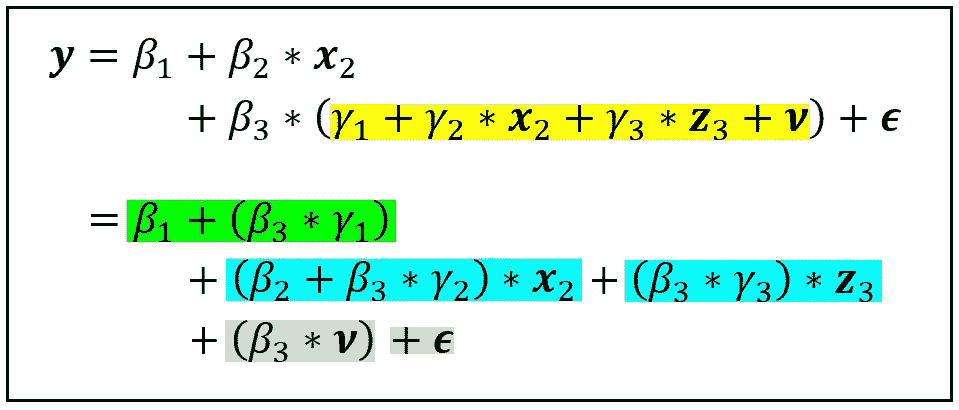

# 工具变量估计导论

> 原文：<https://towardsdatascience.com/introduction-to-instrumental-variables-estimation-3eba75a04418>

图片由 [Alexa](https://pixabay.com/users/clker-free-vector-images-3736/) 发自 [Pixabay](https://pixabay.com/photos/different-nationalities-children-1124478/) ( [Pixabay 授权](https://pixabay.com/service/license/))

## 我们将学习工具变量，以及如何使用它们来估计线性回归模型

在本文中，我们将了解一种使用称为**工具变量**的工件来估计线性回归模型的巧妙技术。

**基于工具变量(IV)的估计**允许回归建模者处理困扰大部分回归模型的严重情况，即一个或多个回归变量与模型的误差项相关。换句话说， [**回归变量是内生的**](/what-are-exogenous-and-endogenous-regression-variables-c0ea1ba03ce8) 。

由于一种被称为 [**省略变量偏差**](/what-happens-when-you-omit-important-variables-from-your-regression-model-966830590d53) 的现象，对包含内生变量的模型的普通最小二乘估计会产生回归系数的有偏估计。从功能上讲，系数的这种偏差给实验者带来了一大堆实际问题，并可能使整个实验的有用性受到质疑。

在 IV 估计中，我们使用一个或多个**工具变量** ( **工具** ) *代替*可疑内生变量，并且我们使用被称为**二阶段最小二乘法**(简称 **2SLS** 的最小二乘法的修正形式来估计最终模型。

在本文的其余部分，我们将展示如何使用工具变量来减轻内生性的影响，并且我们将通过一个例子来说明工具变量的使用。

# 内生性及其后果

在上一篇文章中，我们学习了 [**外生变量和内生变量**](/what-are-exogenous-and-endogenous-regression-variables-c0ea1ba03ce8) 。让我们快速回顾一下这些概念。

考虑以下线性模型:

两个变量的线性模型 **x** _2 和 **x** _3(图片由作者提供)

上式中， ***y*** 为因变量， ***x*** *_2* 和***x****_ 3*为解释变量，***【ϵ***为误差项，捕捉到了*y***x***对于包含 *n* 行的数据集， ***1，y*** ，***x****_ 2*，***x****_ 3*，***【ϵ***都是大小为*【n×1】—*的列向量为了简洁起见，我们将从后面的等式中去掉 ***1*** (它是 1 的向量)。*

*如果一个或多个回归变量，比如说***x****_ 3*，是内生的，即它与误差项相关，则 OLS 估计量是**而不是** [**一致的**](/the-consistent-estimator-913fab06f4f3) 。由于一种被称为 [**省略变量偏差**](/what-happens-when-you-omit-important-variables-from-your-regression-model-966830590d53) 的现象，所有*变量*的系数估计值，而不仅仅是 ***x*** *_3、*的系数估计值都偏离真实值。*

> *面对内生性，无论你的数据集有多大或者有多平衡，这种估计偏差都不会消失。*

*当面临模型的内生性时，您有以下选择:*

1.  *如果内生性被怀疑很小，你可以简单地接受它和随之而来的系数估计偏差。*
2.  *对于隐藏在您怀疑与内生变量相关的误差项中的不可观察因素，您可以选择合适的 [**代理变量**](/how-to-use-proxy-variables-in-a-regression-model-539f723ab587) 。*
3.  *如果可疑的内生变量是时间不变的，即它们的值不随时间变化，那么对模型进行一次时间差分，就会将它们减去。这是一种主要在 [**面板数据模型**](/understanding-the-fixed-effects-regression-model-d2fccc2cc27e) 中起作用的策略。*
4.  *您可以使用**工具变量(IV)***代替*可疑内生变量，并使用 IV 估计技术(如 **2 阶段最小二乘法**)估计“工具化”模型。*

*让我们进一步了解如何使用 IVs。*

# *开发工具变量的动机*

*再次考虑等式(1)中的模型:*

**

*二元线性模型 **x** _2 和 **x** _3(图片由作者提供)*

*在我们开始之前，让我们注意以下几点:*

*如果***x****_ 2*和***x****_ 3*都是外生的，则 OLS 估计量是</the-consistent-estimator-913fab06f4f3>**一致的，它产生的所有系数估计都是无偏的。不需要基于 IV 的估计。***

***但是现在假设***x****_ 3*是内生的。我们将概念性地将***x****_ 3*的方差视为由两部分组成:***

1.  ***与 ***ϵ*** 不相关的一大块。这是***x****_ 3*的部分，其实就是外生的。***
2.  ***与 ***ϵ.相关的第二个块*** 这是***x****_ 3*内生的部分。***

## ***工具变量背后的关键直觉***

***如果我们能够以某种方式分离出***x****_ 3*的外生部分，并用这个外生块替换***x****_ 3*，同时从模型中省去***x****_ 3*的内生部分，则得到模型**这是在线性模型中使用工具变量背后的关键直觉。*****

***为此，假设我们能够识别一个回归变量***z****_ 3*，使得***z****_ 3*具有以下两个属性:***

1.  ******z*** *_3* 与 ***x*** *_3* 相关。记数法:*Cov(****z****_ 3，****x****_ 3)！= 0.*这就是所谓的**关联条件**，用于包含***z****_ 3*。简单来说，***z****_ 3*应该和 ***x*** *_3 相关。****
2.  *****_ 3*与误差项不相关，*即 e(****【ϵ|x】****_ 3)= 0*或常数，*e(****【ϵ】*********x*这就是使用***z****_ 3*的**外生条件**。********

> **如果 **z** _3 满足**相关条件**和**外生条件，则 z** _3 称为**仪器变量**或**仪器**为 **x** _2。**

**不过先来考察一下关于***z****_ 3*的一个微妙点。**

**由于***z****_ 3*与***x****_ 3*，我们可以将***x****_ 3*表示为***z****_ 3*和一个误差的线性组合**

****

****x** _3 对 **z** _3 的回归(图片由作者提供)**

**然而， ***z*** *_3* 也可以与 ***x*** *_2* 相关联。回归变量之间的这种共线性在现实环境中非常普遍。由于这种共线性，***x****_ 2*可能会通过***z****_ 3*影响***x****_ 3*并且在上面的等式中， *γ_3* 捕捉的不仅仅是***z****_ 3***

***我们可能要隔离出***x****_ 2*对***x****_ 3*的影响，这样 [**的主要影响**](/understanding-partial-effects-main-effects-and-interaction-effects-in-a-regression-model-54e8a127c62d) 对**_ 3*的影响为此，我们必须回归***x****_ 3*不仅仅是在 ***z*** *_3、*上，还要在***×x**_ 2*上:******

********

******x** _3 表示为 **x** _2 和 **z** _3 的线性组合，以及一个常数(图片由作者提供)****

****和前面一样，***x****_ 3*，***x****_ 2，****z****_ 3，*和误差项 ***ν*** 都是大小为*的列向量同样，在等式(1a)中，***x****_ 2*和***z****_ 3*是外生的，即它们与 ***ν*** 不相关。*****

***将等式(1a)代入等式(1):***

******

***将等式(1a)代入等式(1)(图片由作者提供)***

***绿色位可以被吸收到新的截距 *β*_1* 中。同样，我们将把( *β_2+β_3* γ_2)* 替换为新的系数 *β*_2* ，将 *(β_3* γ_3)* 替换为 *β*_3* ，并将复合误差项*(β_ 3 *****ν****)+****ϵ******

***通过这些替换，等式(1)中的回归模型被转换成以下模型:***

******

***内生变量 **x** _3 替换为变量 **z** _3 的线性模型(图片由作者提供)***

***回想一下***x****_ 2*和***z****_ 3*都是假设不相关的*和 ***ϵ*** 。因此，它们也与合成误差 ***、ϵ**** 不相关。因此，在等式(1b)中，R.H.S .上的所有变量都是外生的，等式(1b)可以使用 OLS 一致地估计。****

# ****一个例子****

****考虑以下终生收入的治疗效果模型，该模型根据一个人是否上过常春藤盟校而回归:****

********

****终生收入随着这个人是否上过常春藤盟校而递减****

****布尔变量***Attended _ Ivy _ League***显然是内生的。一个人是否上过常春藤盟校取决于社会经济因素和个人特定因素，如能力和追求成功的动力，这些因素无法衡量，但也会直接影响一生的收入。因此，这些不可观察的变量隐藏在误差项中，并且它们还与***Attended _ Ivy _ League*，**相关，使得***Attended _ Ivy _ League***内生。使用 OLS 估计会导致对 *β_1* 和 *β_2 的有偏估计。*****

****很难想象更大的成功欲望会导致常春藤盟校的系统性下降。能力等其他因素也是如此。因此，我们假设***【ϵ】***和 ***中的隐藏因素之间存在正相关，从而导致对β_1* 和*β_ 2*的正偏差*，进而导致实验者的*高估了常春藤盟校出勤率对终生收入的影响。********

***显然，这个问题需要一个解决方案。让我们试着找出一个与***Attended _ Ivy _ League***相关但与误差项不相关的变量。其中一个变量是**遗产**，即这个人的父母或祖父母是否曾就读于常春藤联盟学校。数据显示，一个人的遗产状况和这个人是否被同一所常春藤盟校录取之间存在相关性。这满足了**关联条件**。此外，此人的父母或祖父母是否曾就读于常春藤联盟学校似乎与此人的能力和动机等因素没有直接关联，从而满足了**外生性条件**。因此，我们有:***

****Cov(* ***遗留*** *，* ***出席 _ 常春藤*** *)！= 0****

****Cov(* ***遗留*** *，****ϵ****)= 0****

***因此，我们指定 ***遗产*** 为 ***就读 _ 常春藤*** 的乐器。我们将评估以下测量模型，而不是原始模型:***

******

***回归模型的工具化版本(图片由作者提供)***

***使用 OLS 可以一致地估计这个仪器模型，并且可以得到 *β*_1* 和 *β*_2 的无偏估计。*注意 *β*_2* 是 ***遗留*** 的效果，而不是***Attended _ Ivy _ League***on***Lifetime _ income。*** 但是我们已经看到 *β_2* 无论如何都无法可靠估计。所以我们必须接受 *β*_2* 作为 *β_2 的代表。*顺带一提，估算软件会将 *β*_2* 报为原内生变量**的系数 *Attended_Ivy_League* 和*的系数*遗留**** 这是好事。***

# ***工具变量估计的优点和缺点***

***通过检查等式(1b)中的仪表化模型，有一点变得很明显:***

******

***内生变量 **x** _3 替换为变量 **z** _3 的线性模型(图片由作者提供)***

***仪表化变量( ***z*** *_3* )与内生变量 ***x*** *_3* 并不完全相关。通过使用***z****_ 3*代替**_ 3*，我们正在丢失包含在***x****_ 3*中的一些信息。这种信息损失使得仪表化模型具有更大的误差项和更不精确的系数估计，即它们的标准误差大于原始模型中相应系数的标准误差。较大的标准误差转化为较宽的置信区间。****

> ****当我们使用工具变量进行估计时，我们是在用精度换取系数估计的无偏性——这是我们从模型中去除内生性所必须付出的代价。****

****总的来说，IV 估计模型不如内生模型精确。除非选择的变量与内生变量具有中等至强相关性，并且变量也或多或少与误差不相关，否则最好使用包含内生变量的原始模型，并接受其估计系数中的偏差。****

> ****对于回归建模者来说，虽然内生性的幽灵可能会令人困扰，但不得不与**弱工具**一起工作的前景也可能是同样糟糕的困境。****

## ****一种实用的 IV 估计方法****

****在现实生活中，人们可能希望采用以下方法:****

1.  ****使用 OLS 估计原始模型，使用 2SLS 等技术估计仪表化模型。****
2.  ****比较两个模型的估计系数值，并比较它们各自的置信区间。如果 OLS 估计模型的配置项完全位于 IV 估计模型的相应配置项内，这是使用 OLS 估计模型的一个强烈信号。****
3.  ****还要在人们正在研究的真实世界环境中检查来自两个模型的估计系数。根据上下文，选择产生较低(或较高)估计值的模型会有所帮助。****

# ****总结和关键要点****

*   ****当一个回归模型包含一个或多个内生变量时，不能使用 OLS 进行一致的估计。如果使用 OLS 估计，估计的系数偏离它们的真实值。****
*   ****当面临内生性时，人们可以要么接受由此产生的估计偏差，要么尝试使用诸如**代理变量**，或**差分**(在面板数据模型中)，或通过**工具变量** (IVs)等技术来修正它。****
*   ****在 IV 方法中，我们确定与内生变量相关但与误差项不相关的合适变量，然后用 IV 替换内生变量。由此产生的模型是免费的内生解释变量，它可以估计使用 OLS。在实践中，我们使用特定于 IV 的技术，如 **2 阶段最小二乘法** (2SLS)。****
*   ****IV 估计模型不如包含内生变量的原始模型精确，但与后者不同，它们产生无偏的系数估计。****

# ****参考文献、引文和版权****

## ****形象****

****本文中的所有图片版权归 [CC-BY-NC-SA](https://creativecommons.org/licenses/by-nc-sa/4.0/) 下的 [Sachin Date](https://www.linkedin.com/in/sachindate/) 所有，除非图片下面提到了不同的来源和版权。****

*****如果您喜欢这篇文章，请关注我的*[***Sachin Date***](https://timeseriesreasoning.medium.com)*以获得关于回归、时间序列分析和预测主题的提示、操作方法和编程建议。*****