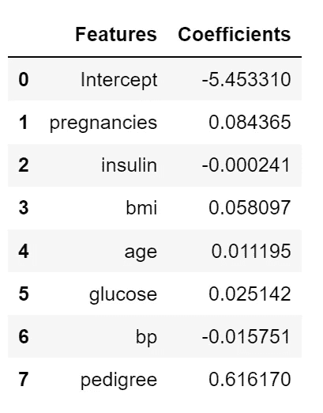
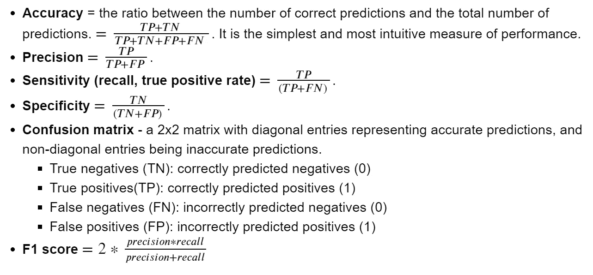
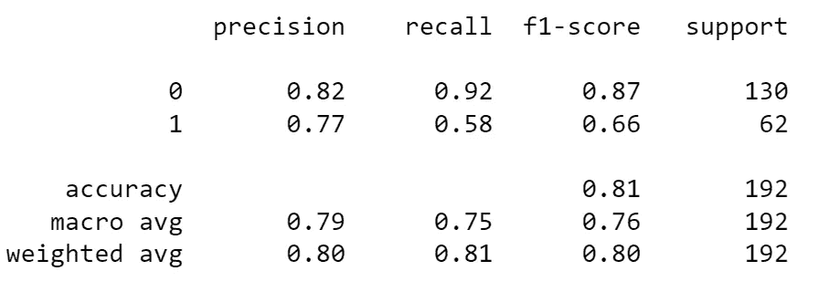
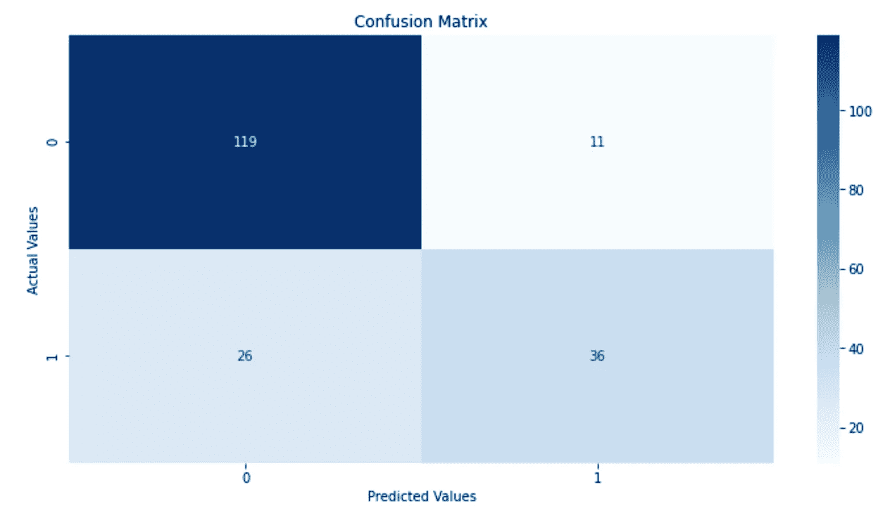
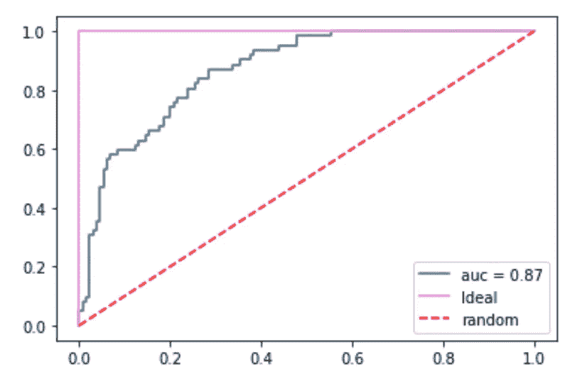

# 逻辑回归简介:预测糖尿病

> 原文：<https://towardsdatascience.com/introduction-to-logistic-regression-predicting-diabetes-bc3a88f1e60e>

## UCL 数据科学学会研讨会 11:什么是逻辑回归、数据探索、实施和评估


[斯科特·格雷厄姆](https://unsplash.com/@homajob?utm_source=medium&utm_medium=referral)在 [Unsplash](https://unsplash.com?utm_source=medium&utm_medium=referral) 上拍照

今年，作为 UCL 数据科学协会的科学负责人，该协会的目标是在整个学年举办一系列 20 场研讨会，涵盖的主题包括 Python、数据科学家工具包和机器学习方法的介绍。每一篇文章的目标都是创建一系列的小博客，这些小博客将概述要点，并为任何希望跟进的人提供完整研讨会的链接。所有这些都可以在我们的 [GitHub](https://github.com/UCL-DSS) 资源库中找到，该资源库将在全年更新新的研讨会和挑战。

本系列的第 11 个研讨会是 Seda Radoykova 撰写的 Python 中的逻辑回归介绍。本课程涵盖了什么是逻辑回归，什么时候可以使用它，探索数据，实施模型和评估结果。虽然亮点将会在这篇博文中呈现，但是完整的研讨会可以在我们的 GitHub 账户[这里找到。](https://github.com/UCL-DSS/logistic_regression_DSS)

如果您错过了我们之前的任何研讨会，可以在这里找到:

[](/linear-regression-in-python-for-data-scientists-16caef003012) [## 面向数据科学家的 Python 线性回归

### UCL 数据科学学会研讨会 10:什么是线性回归，数据探索，Scikit 学习实施和…

towardsdatascience.com](/linear-regression-in-python-for-data-scientists-16caef003012) [](/an-introduction-to-sql-for-data-scientists-e3bb539decdf) [## 数据科学家的 SQL 介绍

### UCL 数据科学学会工作坊 9:什么是 SQL，选择数据，查询数据，汇总统计，分组数据和…

towardsdatascience.com](/an-introduction-to-sql-for-data-scientists-e3bb539decdf) [](/an-introduction-to-plotting-with-matplotlib-in-python-6d983b9ba081) [## Python 中 Matplotlib 绘图简介

### UCL 数据科学学会研讨会 7:创建一个基本的图表，在同一图表上绘制不同的信息…

towardsdatascience.com](/an-introduction-to-plotting-with-matplotlib-in-python-6d983b9ba081) 

## 什么是逻辑回归？

数据可以大致分为连续数据和分类/离散数据，前者可以在给定范围(如距离或时间)内获取无限数量的点，后者在给定数据组(如支付方式或客户投诉)内包含有限数量的点或类别。我们已经看到了以[线性回归](/linear-regression-in-python-for-data-scientists-16caef003012)的形式将回归应用于连续预测问题的例子，其中我们预测了销售额，但是为了预测分类输出，我们可以使用逻辑回归。

虽然我们仍然使用回归来预测结果，但逻辑回归的主要目的是能够预测哪个类别和观察值属于哪个类别，而不是一个确切的值。该方法可用于的问题示例包括:“给定一个人的年龄、性别、吸烟状况、*等、* ( **变量/特征**)，该人患疾病的可能性有多大？”“这封电子邮件是垃圾邮件的可能性有多大？”"给学生一些成绩预测指标，他们会通过考试吗？"。

逻辑回归的实现是基于“sigmoid 函数”，也称为“逻辑函数”，而不是线性回归中使用的线性函数。对于二元分类任务，其基础是结果值只能取 0 或 1，因此我们必须将我们的预测限制在这个范围内。该功能采取以下形式:


作者图片

用于将预测值映射到 0 和 1 之间的概率。这可以直观地表示为:

```
# implement a sigmoid function by hand
def sigmoid(x):
    a = []
    for item in x:
        a.append(1/(1+math.exp(-item)))
    return a# evaluate the sigmoid at some x values
sigm = np.arange(-22, 22, 0.5)# plot the sigmoid
plt.plot(sigm*0.2+4.57, np.array(sigmoid(sigm)), color = "red") # manually implemented sigmoid
plt.plot([0,10], [0.5, 0.5], linestyle = "dotted", color = "black") 
plt.title("Sigmoid function")
plt.xlabel("x")
plt.ylabel("y")
plt.show()
```


作者图片

我们可以看到大多数值非常接近 0 或 1。在此范围内，如果预测的概率大于 0.5，那么它将被指定为 1，或者如果它小于 0.5，那么它将被指定为 0。

其中，传统的线性回归模型表现为:


作者图片

当 B 值代表校准模型的参数时，逻辑回归函数变为:


作者图片

其中 P(x)可被视为给定输入的输出等于 1 的概率(给定输入的输出等于 0 的概率由 1- p(x)给出)。然后，模型拟合具有相同的目的，即确定系数(B)的最佳值，使得曲线和每个 y 的数据点之间的距离尽可能接近。

## 探索数据

我们使用的数据集来自 [UCI 机器学习库](https://www.kaggle.com/uciml/pima-indians-diabetes-database)，专注于能够基于几个变量预测一个人是否患有糖尿病。在此范围内，我们有八个预测值和一个结果:

*   怀孕次数=既往怀孕次数
*   葡萄糖=葡萄糖耐量试验中的血糖水平
*   bp =舒张压值(毫米汞柱)
*   skin_thickness =三头肌皮褶厚度(mm)
*   胰岛素=胰岛素水平
*   bmi =身体质量指数(bmi)，𝑤𝑒𝑖𝑔ℎ𝑡ℎ𝑒𝑖𝑔ℎ𝑡2=𝑘𝑔𝑚2weightheight2=kgm2
*   谱系=糖尿病谱系功能
*   年龄=年龄(岁)
*   结果=健康结果(1 =糖尿病，0 =健康)

我们不一定需要理解这些与糖尿病有什么关系(如果有的话),因为有人在数据收集中已经为我们想到了这一点。然而，我们的任务是创建探索这些关系的模型，并对它们进行评估。

## 模型拟合

创建一个模型的主要目的之一是确保它可以推广到看不见的数据，这样它就不会过度拟合它训练的数据([偏差与方差权衡](/bias-and-variance-for-machine-learning-in-3-minutes-4e5770e4bf1b))。这意味着，我们在建模之前要做的第一件事是拆分训练和测试数据集中的数据，以便我们可以保存一些数据，从而能够准确地评估模型的性能。我们可以这样做:

```
# split data into features/inputs and targets/outputs
feature_cols = ['pregnancies', 'insulin', 'bmi',
                'age', 'glucose', 'bp', 'pedigree']
X = diabetes[feature_cols] # features
y = diabetes.outcome # target variable# split data into training and validation datasets 
X_train, X_test, y_train, y_test = train_test_split(X, y, test_size=0.25, random_state=0)
```

既然我们已经将数据放入了训练和测试数据集，我们就可以创建将要使用的模型了。为此，我们导入必要的库和模型，然后将模型实例化为:

```
from sklearn.linear_model import LogisticRegression# instantiate the model
model = LogisticRegression()
```

此时，我们已经创建了一个`LogisticRegression`对象的实例。然而，在此过程中，我们使用了默认的参数设置，这将有助于确定哪些参数可能是我们感兴趣的，以及它们的含义:

*   `fit_intercept` -布尔值，决定是否计算截距𝛽0β0(为真时，默认)或将其视为等于零(为假时)。
*   `intercept_scaling` -浮点数，定义了截距𝛽0β0 的缩放比例，(默认为 1.0)。
*   `class_weight` -字典，“平衡”或`None`(默认)，定义与每个类别相关的权重。当`None`时，所有类的权重都为 1。
*   `solver` -字符串，用于拟合模型的解算器。默认为“liblinear ”;其他选项包括“牛顿-cg”、“lbfgs”、“sag”和“saga”。
*   `tol` -浮点数，定义停止程序的公差(默认为 0.0001)。
*   `n_jobs` -整数或`None`(默认)，定义要使用的并行进程的数量。`None`通常表示使用一个内核，而-1 表示使用所有可用的内核。

在更复杂的应用程序中还可以探索更多。

考虑到这一点，我们可以使用默认值，并将其与我们现有的训练数据进行拟合，如下所示:

```
# fitting the model
model.fit(X_train, y_train)
```

通过从模型中提取截距和斜率，我们可以看到它的表现:

```
coefficents = {"Features": ["Intercept"] + feature_cols,
              "Coefficients":np.concatenate((model.intercept_ ,model.coef_[0]))}coefficents = pd.DataFrame(coefficents)coefficents
```



作者图片

我们可以将这些解释为积极的迹象，即在其他条件相同的情况下，人数越多，他们患糖尿病的可能性越大，人数越少，他们患糖尿病的可能性越小。尽管这些影响的实际大小可能难以解释，并且取决于所涉及的变量的范围和大小。理解这一点的一个很好的来源是 this [链接。](https://www.displayr.com/how-to-interpret-logistic-regression-coefficients/)

## 评估绩效

一旦我们拟合了模型并检查了参数，我们就可以看到它的表现以及在看不见的数据上的表现。虽然在一个好的模型中，许多预测都是准确的，但不可避免地会有误差。

在我们的应用中，有时模型会将健康个体误分类为糖尿病个体(假阳性)，将糖尿病个体误分类为健康个体(假阴性)。然而，为了全面评估性能，我们可以使用各种不同的方法来理解和评估模型的性能。其中包括:



作者图片

选择使用哪种指标将取决于您的目标，因为不同的模型实现可能会以牺牲一种指标的性能为代价来提高另一种指标的性能。

我们可以做的第一件事是对我们设置的测试数据集的看不见的数据做一些预测。为此，我们可以使用模型中的`.predict()`方法来检查我们的测试数据集，如下所示:

```
y_pred = model.predict(X_test)
y_pred[0:5]#out:
array([1, 0, 0, 1, 0], dtype=int64)
```

我们可以看到，模型将个人分为 1 类或 0 类(是否患有糖尿病)。因为我们知道这些个体实际上是否患有糖尿病，所以我们可以使用这些知识来评估模型性能。

我们可以从分别检查准确度分数、精确度分数和召回分数开始:

```
# metrics
print("Accuracy for test set is {}.".format(round(metrics.accuracy_score(y_test, y_pred), 4)))
print("Precision for test set is {}.".format(round(metrics.precision_score(y_test, y_pred), 4)))
print("Recall for test set is {}.".format(round(metrics.recall_score(y_test, y_pred), 4)))#out:
Accuracy for test set is 0.8073.
Precision for test set is 0.766.
Recall for test set is 0.5806.
```

或者，我们也可以使用 scikit learn 的内置功能获得分类报告，例如:

```
print(metrics.classification_report(y_test, y_pred))
```



作者图片

从中我们可以看出，虽然我们在模型中有很好的整体准确性和精确度，但在召回率方面表现很差。这告诉我们，虽然该模型在真阳性方面表现良好，但在假阴性方面有点困难。

我们可以通过一个混淆矩阵来实现这一点，该矩阵可以在一行代码中提取，然后绘制如下:

```
#confusion matrix
conf_mat = metrics.confusion_matrix(y_test, y_pred)# plotting the confusion matrix
plt.figure(figsize=(12,6))
plt.title("Confusion Matrix")
sns.heatmap(conf_mat, annot=True, fmt='d', cmap='Blues')
plt.ylabel("Actual Values")
plt.xlabel("Predicted Values")
plt.savefig('confusion_matrix.png')
```



作者图片

我们可以直观地看到分类报告如何转化为实际结果。

我们可以为此使用的另一种评估技术是接收器操作特性(ROC)曲线，这在许多机器学习上下文中都可以看到。这用于绘制真阳性率与假阳性率，显示灵敏度和特异性之间的权衡。在该图中，理想曲线是紫线，而完全随机模型的结果是红线，目标是尽可能接近紫线。

```
# ROC curve
y_pred_proba = model.predict_proba(X_test)[::,1]
fpr, tpr, _ = metrics.roc_curve(y_test, y_pred_proba)
auc = metrics.roc_auc_score(y_test, y_pred_proba)
plt.plot(fpr, tpr, label="auc = " + str(round(auc,2)))
plt.plot(x, y, color = "violet", label = "Ideal")
plt.plot([0,1], [0,1], color = "red", linestyle = "--",
          label = "random")
plt.legend(loc=4)
plt.show()
```



作者图片

这种性能通过曲线下面积(AUC)来量化，曲线下面积显示模型与理想性能的接近程度。理想模型的“最佳”AUC 分数应该是 1，而我们的随机模型的 AUC 是 0.5。因此，我们可以看到我们的模型虽然不完美，但表现相对较好。

## 结束语

我们已经学习了如何实现一个简单的逻辑回归方法。这是一种相对直观、有效和优雅的分类技术，它为我们提供了给定一些观察结果的给定结果的概率。这使得它成为一种非常流行的分类方法。

这种方法的好处包括:

*   不需要很高的计算能力
*   易于实施(甚至从头开始)
*   易于解释和评估

然而，这样做的负面影响是:

*   它不能处理具有许多预测变量的高度复杂的模型
*   需要在大样本上训练
*   倾向于过度拟合
*   无法处理非线性问题

如果您想了解我们协会的更多信息，请随时关注我们的社交网站:

https://www.facebook.com/ucldata

insta gram:【https://www.instagram.com/ucl.datasci/ 

领英:【https://www.linkedin.com/company/ucldata/ 

如果你想了解 UCL 数据科学协会和其他优秀作者的最新信息，请使用我下面的推荐代码注册 medium。

[](https://philip-wilkinson.medium.com/membership) [## 通过我的推荐链接加入媒体-菲利普·威尔金森

### 作为一个媒体会员，你的会员费的一部分会给你阅读的作家，你可以完全接触到每一个故事…

philip-wilkinson.medium.com](https://philip-wilkinson.medium.com/membership) 

或者看看我写的其他故事:

[](/bias-and-variance-for-machine-learning-in-3-minutes-4e5770e4bf1b) [## 3 分钟机器学习的偏差和方差

### 什么是偏差和方差，这对你的机器学习模型意味着什么？

towardsdatascience.com](/bias-and-variance-for-machine-learning-in-3-minutes-4e5770e4bf1b) [](/an-introduction-to-object-oriented-programming-for-data-scientists-879106d90d89) [## 面向数据科学家的面向对象编程介绍

### 面向对象的基础知识，适合那些以前可能没有接触过这个概念或者想知道更多的人

towardsdatascience.com](/an-introduction-to-object-oriented-programming-for-data-scientists-879106d90d89) [](/git-and-github-basics-for-data-scientists-b9fd96f8a02a) [## 面向数据科学家的 Git 和 GitHub 基础知识

### UCL 数据科学研讨会 8:什么是 Git，创建本地存储库，提交第一批文件，链接到远程…

towardsdatascience.com](/git-and-github-basics-for-data-scientists-b9fd96f8a02a)