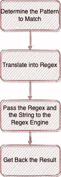
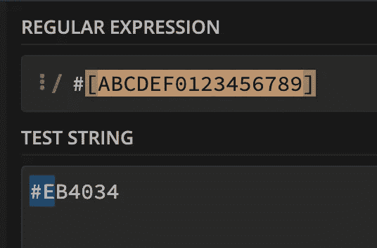
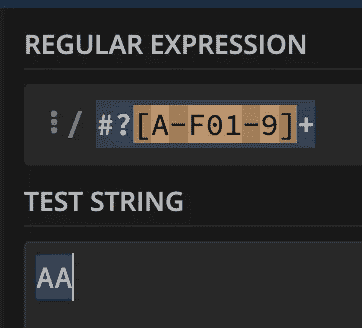
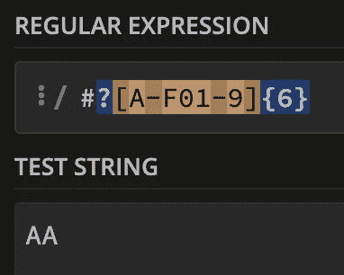
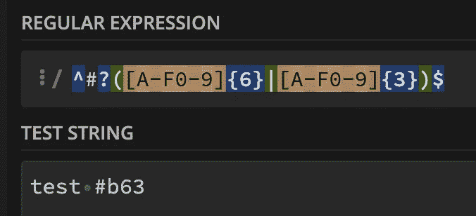

# 正则表达式简介

> 原文：<https://towardsdatascience.com/introduction-to-regular-expressions-3371c86f7>

## 正则表达式|编程|模式匹配

## 一个实用的指南，让你很快就能流利地使用正则表达式


照片由 [Unsplash](https://unsplash.com?utm_source=medium&utm_medium=referral) 上的 [Clément Hélardot](https://unsplash.com/@clemhlrdt?utm_source=medium&utm_medium=referral) 拍摄

正则表达式是定义某种形式的搜索模式的字符序列。

正则表达式是搜索和替换字符串中文本的非常强大的工具。它是一种在任何编程语言中查找、格式化和操作文本的方法。

它们允许你做一些非常高级的搜索和替换操作，如果手工执行的话，这些操作会非常耗时。

正则表达式就像程序的瑞士军刀；它们可以用于各种事情，从搜索(从文件系统到数据库)到编程。

你可能是一个经验丰富的程序员，也可能是一个完全的初学者。无论如何，正则表达式是编程语言中非常强大的一部分，但不幸的是，大多数人都忽略了这一点。

正则表达式是一种更精确地搜索(和准备)文本数据的方法。您还可以使用它们进行调试、转换、验证，或者换句话说，处理字符串。一些常见的用例包括从博客文章中捕获所有电话号码，用 x 替换它们，或者从 HTML 元素中去除所有特殊字符。

正则表达式的美妙之处在于，它们是当今几乎所有编程语言的一部分。

无论您是 IT 人员、SEO 人员、编程人员、执行数据库查询人员，还是探索数据进行研究的人员，regex 都可以为您节省大量时间！

诚然，regex 一开始很难理解，但是一旦你开始在日常工作中使用它，它会改变你的生活。这个博客将帮助你学习和掌握正则表达式。

# 正则表达式是如何工作的？

使用 regex 相对简单。几乎所有现存的编程语言都支持正则表达式匹配(要么是本地的，要么是通过一些库或包)。

第一步是确定要在字符串中匹配和搜索的模式。这可以是任何字符序列。

然后，您希望将该模式转换成正则表达式。在整个过程中，使用正则表达式验证工具来测试你的正则表达式可能是明智的(剧透一下，网上有几个免费的)。

一旦构建了正则表达式，就该为您正在使用的编程语言找到相应的正则表达式引擎了。在这一点上，如果您浏览一下它的文档，那将是帮了自己一个大忙。

然后，您可以传入正则表达式和要匹配正则表达式引擎的字符串。正则表达式引擎将计算字符串并返回结果(根据您使用的正则表达式引擎，这可以是一个布尔值或一个 int 或实际的字符串)。



使用 Regex。来源:大卫·法鲁吉亚

# 构建我们的第一个正则表达式

在开始构建我们的第一个正则表达式之前，让我们先来看一下与正则表达式相关的主要语法。

```
/  — delimiter (start and end of regex)?  — match 0 or 1 time*  - match 0 or more times+  — match 1 or more times[] — range of acceptable values{} — exactly n characters|  — create different branches() — groupingi  — case insensitive^  — anchor to the beginning of the string$  — anchor to the end of the string
```

让我们从一个用例开始。假设我们需要构建一个能够验证十六进制颜色的正则表达式。

## 第一步:确定我们需要匹配的模式

如你所知，一个十六进制的颜色通常以一个 ***#*** 开头，然后是另外 6 个字符。

这 6 个字符需要在 A 到 F 或 0 到 9 的范围内。

## 步骤 2:转换成正则表达式

*我将使用令人惊叹的* [*regex101 网站*](https://regex101.com/) *来验证和测试我们的 regex。*

让我们首先列出所有可能的值:

```
/#[ABCDEF0123456789]
```



测试案例 1。来源:大卫·法鲁吉亚

我们可以看到我们的红色十六进制测试用例(#EB4034)通过了验证。但是如果我们仔细观察，我们会发现匹配(基于蓝色突出显示)仅限于前 2 个字符。

这是因为我们指定模式必须是#后跟[]中指定的任何其他字符。

为了解决这个问题，我们可以在正则表达式的末尾使用+操作符来重复[]中的内容 1 次或更多次。

此外，我们可以使用-运算符来指定范围，而不必指定整个字符列表(即 ABCDEF 变为 A-F，0123456789 变为 0–9)。

我们还可以使用？运算符(因为有时候，人们认为#是理所当然的)。

让我们再次尝试这些变化。


测试用例 2(左)和 3(右)。来源:大卫·法鲁吉亚

正如我们在上面的测试案例中看到的，我们现在高亮显示了整个字符串。

在这一点上，这看起来不错，不是吗？尝试我们知道无效的测试用例总是明智的。

如果我们试图验证一个格式不正确的十六进制字符串，比如 AA，会发生什么？



测试用例 4。来源:大卫·法鲁吉亚

我们还是能找到匹配的。让我们来解决这个问题。

我们肯定知道十六进制代码应该有 6 个字符。我们可以使用{}来指定我们想要重复的次数。所以让我们把+和{6}交换一下。



测试用例 5(左)和 6(右)。来源:大卫·法鲁吉亚

不错！当正确格式化的十六进制代码通过验证时(在测试用例 6 中)，我们没有测试用例 5 的匹配项。

然而，以上又产生了另一个问题。存在只有 3 个字符的有效十六进制代码，例如#B63。对于当前的正则表达式，这个测试用例将会失败。

我们可以使用|操作符来指定 or 条件。

让我们使用下面的正则表达式，它匹配 6 个字符或 3 个字符。

```
/#?([A-F0-9]{6}|[A-F0-9]{3})
```


测试案例 7。来源:大卫·法鲁吉亚

瞧啊。我们找到匹配的了。

我们的下一个测试用例是不同大小写风格(即小写或大写)的十六进制代码。就目前情况来看，#B63 是一个有效的十六进制数，但是#b63 会失败。

有两种方法可以解决这个问题。我们可以将下限范围指定为可接受的值:

```
/#?([A-Fa-f0-9]{6}|[A-Fa-f0-9]{3})
```

> **或**

我们可以使用模式修改器。我们可以使用字符 ***i*** 来强调这个正则表达式不区分大小写。

```
/#?([A-F0-9]{6}|[A-F0-9]{3})/i
```


测试用例 8。来源:大卫·法鲁吉亚

*注意:我使用/ig 而不是/i 来一次测试多个字符串。/g 代表全球回报。*

需要记住的一点是，正则表达式引擎将在整个字符串中搜索匹配项。

因此，如果我们传入这个字符串:test #B63，我们将得到一个不正确的匹配。


测试用例 9。来源:大卫·法鲁吉亚

为了确保完整的字符串匹配正则表达式，我们需要使用锚点。如上所述，^字符将锚定到字符串的开头，而＄符号锚定到字符串的结尾。

```
/^#?([A-F0-9]{6}|[A-F0-9]{3})$/i
```



测试用例 10。来源:大卫·法鲁吉亚

不匹配。太好了！

在我们的正则表达式中加入一个很酷的技巧就是空格缩写。使用\s*字符，我们将告诉正则表达式引擎忽略任何空白。

```
/^\s*#?([A-F0-9]{6}|[A-F0-9]{3})\s*$/i
```


测试用例 11。来源:大卫·法鲁吉亚

现在我们有了。我们第一个完整的 regex 例子，能够验证十六进制值。

但是，在我们出发之前，还有一个很酷的技巧我们必须探索。

让我给你介绍一下 https://regexper.com/。这是一个神奇的工具，它以一种很酷的方式可视化你的正则表达式。当我们试图理解和调试正则表达式时，这个过程非常有用。


我们的十六进制代码正则表达式的可视化。资料来源:regexper.com

现在你知道了！你的第一个正则表达式，已经测试完成。这基本上是正则表达式的全部要点，你构建的每个正则表达式很可能遵循相同的过程和原则。然而，仍然有一些其他的高级语法规则和一些我们需要避免的常见陷阱。但是那些是改天的！

现在，练习为您的用例构建一些简单的正则表达式验证，不要害怕弄脏您的手！

你喜欢这篇文章吗？如果是，请考虑订阅我的电子邮件列表，以便在我发布新内容时得到通知。

<https://david-farrugia.medium.com/subscribe>  

另外，考虑成为会员来支持我和你喜欢的其他作家。每月 5 美元，你就可以无限制地阅读 Medium 上的每一篇文章。

<https://david-farrugia.medium.com/membership>  

# 想联系吗？

我很想听听你对这个话题的想法，或者其他什么。如果你想联系我，请给我发电子邮件到 davidfarrugia53@gmail.com。

[领英](https://www.linkedin.com/in/david-farrugia/)