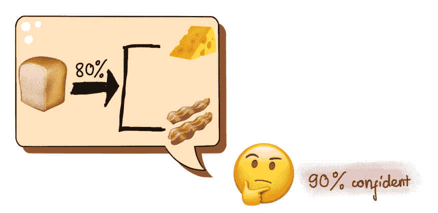
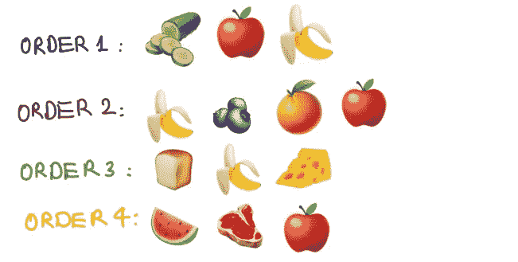
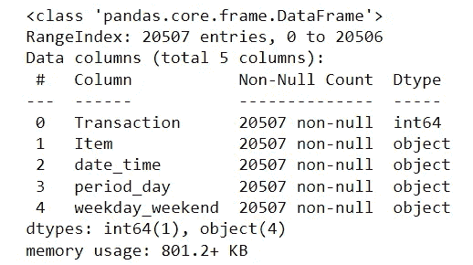
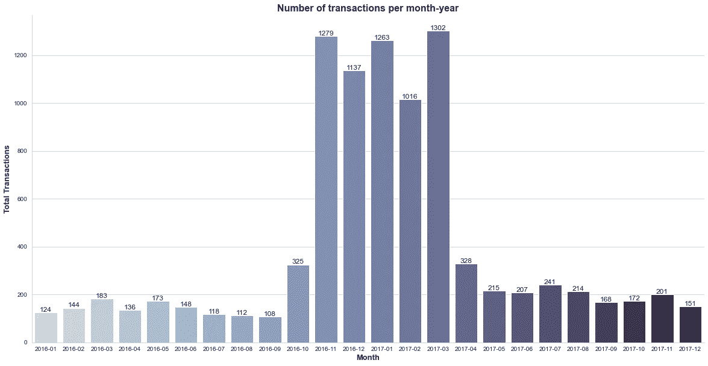
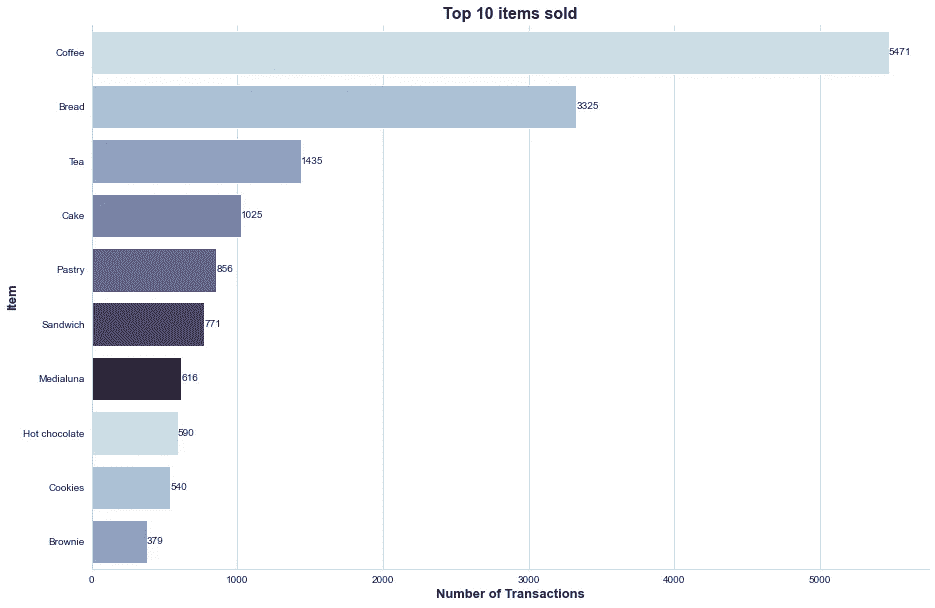
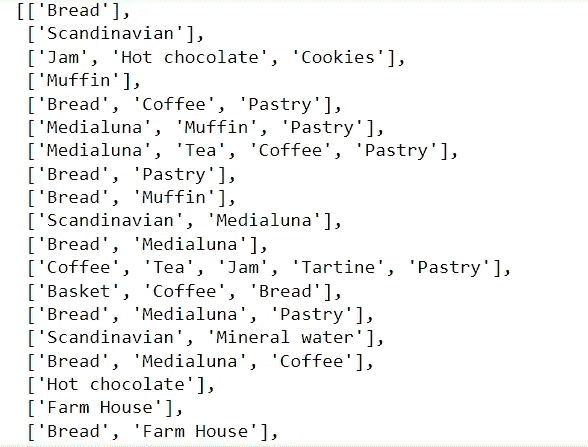
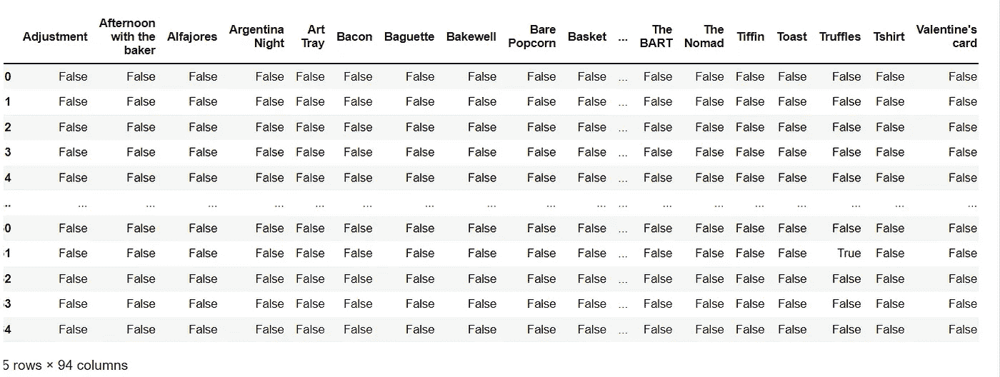

# 基于关联规则挖掘的简单购物篮分析

> 原文：<https://towardsdatascience.com/introduction-to-simple-association-rules-mining-for-market-basket-analysis-ef8f2d613d87>

## 通过概念、关联规则挖掘的工作机制和 Python 代码理解客户行为


照片由[柳文欢·埃尔巴兹](https://unsplash.com/@orenlbz?utm_source=medium&utm_medium=referral)在 [Unsplash](https://unsplash.com?utm_source=medium&utm_medium=referral) 拍摄

# 介绍

你一定已经注意到比萨饼店的售货员做了比萨饼、软饮料和薯条的组合。他也给购买这些套餐的顾客打折。你有没有想过他为什么要这么做？

因为他发现买披萨的顾客也会买软饮料和薯条。通过做组合，他让顾客很容易。同时，他也提高了自己的销售业绩。

从上面的小例子来看，收集和分析用户行为对于在销售中创建有效的交叉销售和追加销售策略的重要性是不可否认的。基于用户行为的数据，我们可以使用 RFM 和聚类分析将客户分成不同的组，以便为每个组提供定制的服务。但是，要预测客户可能购买的其他产品，分析师经常使用的了解客户购买习惯的方法之一是 ***关联规则挖掘*** 。

在今天的文章中，我将向您提供关于这项技术的最全面的信息，以及如何使用它来更好地了解客户。

# 什么是关联规则挖掘？

基于交易历史，可以利用许多模式来理解客户行为。可以实现的洞察之一是所购买的物品之间的关联。使用所有购买商品的数据，我们可以确定哪些商品通常是一起购买的，从而定义和建立产品关联模型。结论必须进行概率和可靠性测试。例如，一个人去超市买面包。他/她有 80%的可能性购买果酱或火腿与面包一起吃，有 90%的把握。



作者图片

然后，零售商可以使用分析结果来定位、推荐和导航商店中的产品，以促进产品或产品类别之间的交叉销售。

# 基于 Apriori 的关联规则挖掘

Apriori 是一种算法，它利用数据中相互关联的对象集。换句话说，它有助于识别频繁出现的项目集。先说一个最小发生阈值为 1 的 apriori。该过程从查找满足最小出现要求的单个对象开始。然后，它一次一个项目地扩展项目集，检查更广泛的项目集是否仍然满足预定义的阈值。当不再有满足最小出现条件的项目要添加时，算法终止。

# 先验的成分

假设我们有 4 个订单，每个订单描述如下:



作者图片

在这 4 个订单中，我们有 3 个包含苹果的订单，3 个包含香蕉的订单，2 个包含香蕉和苹果的订单。利用这些信息，我将计算一些重要的先验指标，包括支持度、信心度和提升度。

## 支持

这是包含项目集的订单比例。正如您在上面的示例中所看到的，3 个订单包括总共 4 个订单中的香蕉，因此:

```
***Support (bananas) 
= Bananas related orders/Total orders 
= 3/4 = 0.75***
```

**信心**

在这个例子中，置信度表达了在购买香蕉之后购买苹果的次数的百分比。所以，公式可以如下所示:

```
***Confidence (bananas -> apples) 
= support (bananas, apples) / support (bananas) 
=(2/4)/(3/4) = 0.6667***
```

66.67%的值意味着购买香蕉的顾客中有 66.67%也购买苹果。然而，这个数字是否暗示了这两种水果之间的关系，或者它们仅仅是偶然一起购买的？为了回答这个问题，我们将不得不看看另一个衡量这两种事物受欢迎程度的指标。

根据业务目的、研究背景和行业领域，支持度和置信度阈值的设置是不同的。例如，在分析金融欺诈时，支持值可能是 1%，因为数据集中出现欺诈的交易相对较少。因此，没有特定的标准来决定一个特定的阈值。

## 电梯

此指标显示商品之间是否实际存在关联，或者购买这些商品是否只是随机组合。从这个例子中，我们可以快速计算升力:

```
***Lift(bananas, apples) = Lift(apples, bananas)
= support(bananas, apples) / (support(bananas) * support(apples))
=(2/4)/(0.75*0.75) = 0.89***
```

因此，该度量意味着，如果香蕉出现在 75%的订单中，苹果出现在 75%的订单中，并且这两个项目之间没有联系，则苹果和香蕉预计会在 75% * 75% = 56.25%的情况下一起购买。同时，分子反映了苹果和香蕉以相同顺序出现的频率。在这个场景中，这是 50%的时间。得到这个值并除以 56.25%显示了苹果和香蕉以相同的顺序出现的次数比它们没有关联时多多少次。

基于升力值的结果，我们可以有一些推论:

*   lift = 1:物品随机一起买。换句话说，项目之间没有关系。
*   lift > 1:物品一起购买的频率高于随机购买。
*   抬起< 1: items are bought together less regularly than random.

In the example above, apples and bananas appear together 0.89 times more than random. Therefore, we can tell there is a negative relationship between these 2 items.

Now, let’s see how the association rules mining works in a real dataset.

# Dataset

For this article, I will use a dataset from a bakery (License: CC0: Public Domain). This dataset includes 20507 entries, over 9000 transactions, and 5 columns. You can download the data from this [连杆](https://www.kaggle.com/datasets/mittalvasu95/the-bread-basket)。

数据集的概述如下所示:



数据类型-按作者分类的图像


最后五行—作者图片

从 2016 年 11 月到 2017 年 3 月，总交易量急剧增加，如下图所示。



每月交易—按作者分类的图像

下表描述了销售额最高的 10 件商品。咖啡、面包和茶是面包店最受欢迎的商品。



现在，让我们看看如何将关联规则挖掘应用于这些数据。

# 转换数据集

因为事务中的项目被拆分到不同的行中，所以我将这些项目分组到一个地方。项目列表的列表转换如下:



Apriori 模块需要一个值为 0 和 1 或 True 和 False 的数据帧。因此，我将使用一个热编码数据，以满足 mlxtend 库给出的 Apriori 模块的要求。



一次热编码后—作者提供的图片

在应用 Apriori 模块之前，我们需要导入一些必要的库:

现在，我们可以轻松地应用 mlxtend 库中的 apriori 模块。只用一行代码就可以找到频繁集。在这个例子中，我将使用`min_support = 0.05`，它意味着选择一个项目集所需的最小支持。同时，`use_colnames = True`为项目集保留列名，使它们更容易理解。


从这些频繁集中，我继续寻找决定**T5 的关联规则，如果** A 被购买， ***那么*** B 也被购买。我将`metric = 'lift'`设置为最小阈值= 1。


关联规则-按作者分类的图像

正如我们所看到的，结果只包含两个关联规则。在`lift = 1.1`和 53%的置信度下，蛋糕和咖啡比随机购买更频繁。


作者图片

# 限制

尽管 Apriori 算法易于应用，但它仍有某些限制，包括:

*   如果事务数量很大并且内存容量有限，则算法的效率会降低。
*   由于它需要扫描整个数据库，因此需要很高的处理能力

# 结论

了解关联规则挖掘技术将有助于更好地了解客户，从而有合适的策略来促进销售。可以从该方法中提取的一些益处可以提及如下:

*   展位安排:您可以将相关商品组合在一起。基于消费者购买习惯的组合商品价格。
*   产品推荐:产品推荐要基于用户购买习惯。如果顾客购买更多的组合，你可以给他们折扣。或者，客户可以用最低总价购买额外的商品。
*   库存管理:市场篮子分析成为预测未来采购的基础。此外，销售数据是同时获取的，因此保持产品供应和控制库存变得更加高效。
*   优化广告成本:充分利用你的广告机会。客户对信息、沟通和产品的反应反映了这一点。

我希望我的文章能为那些想更多了解这种有用方法的人更好地理解客户行为打下良好的基础。

# 参考

<https://www.kaggle.com/code/datatheque/association-rules-mining-market-basket-analysis> 