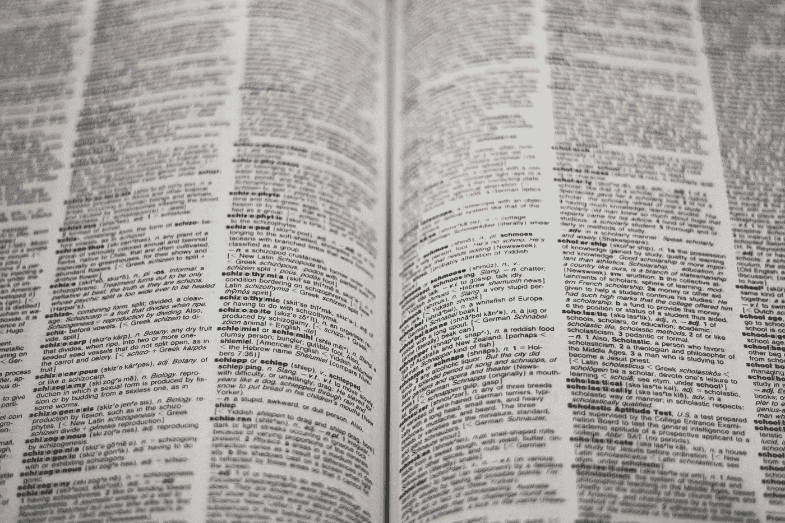

# 使用 ROUGE 评分的文本摘要介绍

> 原文：<https://towardsdatascience.com/introduction-to-text-summarization-with-rouge-scores-84140c64b471>

## 自然语言处理中文本摘要的信息指南



图片由 [Unsplash](https://unsplash.com/) 的 [Joshua Hoehne](https://unsplash.com/@mrthetrain) 拍摄

> 本教程简要介绍了自动文本摘要这一有监督的自然语言处理任务，并详细介绍了量化摘要性能的标准。

在信息爆炸的时代，专业人士在工作或日常生活中可能会消耗大量的文本，通常是报告、文章或科学论文。通常，这些文本包含围绕一些中心主题或思想的细节或阐述。然而，在这些过多的文本文档中，有时我们要么只想捕捉某些文档的要点，要么搜索与主要思想相关的内容。一个类似的类比是浏览报纸的标题，尽管一篇文章的标题，作为一句俏皮话，并不是最好的总结形式。

这也是机器学习和人工智能可以介入的地方，因为**自动文本摘要**是自然语言处理(NLP)任务中的一个重要领域。

# 1.两种类型的文本摘要

自动文本摘要训练通常是受监督的学习过程，其中每个文本段落的*目标*是相应的**金色注释摘要**(人类专家指导的摘要)。另一方面，模型生成的摘要或训练后的*预测*有两种类型:

## 1.1 抽象概括

摘要是文本段落的主旨，是完全转述的，有时会用原文中没有的词和内容。因此，抽象摘要是一项困难的任务，可能会遇到生成的摘要在语法或逻辑上不一致的情况。通常，它需要最先进的变压器架构来实现稳定的结果。

## 1.2 摘要概述

摘要，顾名思义，包含从原文段落中提取的单词和短语。虽然有不同的提取技术，但最常见和最简单的一种是按照正确的顺序从文本段落中提取句子。一般来说，前几个句子对文章的意义起着更重要的作用，并且经常被提取出来，尽管文章后面的句子也可以被提取出来。

值得注意的是，在研究社区中，金色注释摘要通常在本质上是抽象的，因为文本段落经常被人类解释成摘要。因此，用于抽象概括的监督学习过程是直接的，因为目标是明确定义的。但是对于逐句提取摘要，有时需要一个额外的步骤。

基于金色注释摘要及其句子数量，从原始文本段落中提取具有最高相似度的相应句子子集。相似度由一个叫做**胭脂分数**的度量来衡量，我们将在后面讨论。这些提取的句子集，基于金色注释的抽象摘要，在研究界被称为**甲骨文摘要**。然后，用于提取摘要的监督学习过程基于甲骨文摘要的标记句子。最后，任何提取模型的性能都是生成的提取概要的 ROUGE 分数和 oracle 概要的 ROUGE 分数之间的相对比较。

*P.S .由于排列的数量，获得句子的全局最优集合(具有最大 ROUGE 得分)的过程有时在计算上是昂贵的，并且通常用某些算法来近似，例如在 2016 年论文*[*summary runner:用于文档的提取摘要的基于递归神经网络的序列模型*](https://arxiv.org/abs/1611.04230) *中介绍的贪婪方法。*

# 2.总结模型—进一步阅读

总结模型架构通常更加复杂和费解，因此我们不会在这个简单的教程中讨论它们。但是，在下面的段落中，我们将介绍一些研究论文，以及它们相应的代码库，以供进一步阅读和修改。

在变形金刚时代之前，正如 2017 年的论文[所介绍的那样](https://arxiv.org/abs/1706.03762)，无论有无注意机制，由 LSTMs 管理的 NLP 模型都没有那么强大。因此，提取摘要模型更有效。一个这样的模型如下:

## 纽阿尔斯姆

*   *描述*:关注基于 LSTM 编解码模型的摘要提取模型
*   *2016 论文* : [通过提取句子和单词的神经摘要](https://arxiv.org/abs/1603.07252)
*   代码库:[https://github.com/cheng6076/NeuralSum](https://github.com/cheng6076/NeuralSum)

在变形金刚时代之后，尤其是随着 BERT 架构的出现(2018 年论文， [BERT:深度双向变形金刚语言理解的预训练](https://arxiv.org/abs/1810.04805))。这样，抽象摘要和提取摘要的性能都变得健壮。一些模型如下:

## 伯特森(伯特文本和伯特布斯)

*   *描述*:用于抽象和提取总结的类似 BERT 的架构。
*   2019 年论文:[带预训练编码器的文本摘要](https://arxiv.org/abs/1908.08345)
*   代码库:[https://github.com/nlpyang/PreSumm](https://github.com/nlpyang/PreSumm)

## 飞马座

*   *描述*:基于变压器的编码器-解码器模型，具有用于抽象概括的自我监督目标
*   2019 论文: [PEGASUS:用提取的 Gap-sentences 进行抽象概括的预训练](https://arxiv.org/abs/1912.08777)
*   代码库:[https://github.com/google-research/pegasus](https://github.com/google-research/pegasus)

# 3.胭脂分数简介

接下来，我们继续评估指标，比较模型生成的摘要与黄金注释摘要的接近程度。值得注意的是，在研究社区中，ROUGE score 已经发展成为摘要任务的标准评估标准。ROUGE 代表面向回忆的 Gisting 评价替角，在论文 [ROUGE:一个自动评价概要的包](https://aclanthology.org/W04-1013/)中有介绍。虽然 ROUGE 顾名思义是“面向召回的”，但本质上，它同时考虑了**候选**(模型生成的或*预测的*)和**参考**(金色注释的或*目标*)摘要之间的召回率和精确度。此外，胭脂分数分为胭脂-1、胭脂-2 和胭脂-1 分数。例如，让我们考虑下面这段话:

```
John loves data science. He studies data science concepts day and night, forgetting to eat at times.
```

参考摘要:

```
John really loves data science.
```

和候选摘要(考虑提取的情况):

```
John loves data science.
```

## 胭脂-1

ROUGE-1 Precision 和 Recall 比较参考摘要和候选摘要之间**单字**的相似性。对于单字，我们简单的意思是每个比较的记号都是一个单词。例如，我们可以将“John 热爱数据科学”的单词表达为一个 Python 标记列表:

```
['John','loves','data','science']
```

通过**回忆**，我们简单的参考候选摘要所抓取的参考摘要中的*单词比例。*

通过**精度，**我们指的是由候选摘要建议的、实际出现在参考摘要中的单词的*比例。*

例如:

```
Reference Tokens: ['John','*really*','loves','data','science'](**n_r=5**)
Candidate Tokens: ['John','loves','data','science'] (**n_can=4**)
**Captured Tokens**: ['John','loves','data','science'] (**n_cap=4**)**Rouge-1 Recall = n_cap/n_r = 4/5 
Rouge-1 Precision = n_cap/n_can = 4/4**
```

同样地，我们可以看到，对于由候选摘要准确预测单词的数量，召回奖励，而对于候选摘要中出现的不必要的冗长单词，精确惩罚。精确度差的一个例子是下面的候选摘要:

```
John really really really loves data science. (**n_can=**7)
```

在这种情况下，所有的引用标记都被捕获，因此它应该有一个完美的召回分数。但是，由于过于冗长，它的 Rouge-1 精度只有 5/7。

## 胭脂-2

ROUGE-2 Precision 和 Recall 比较参考和候选摘要之间的**二元模型**的相似性。对于二元语法，我们的意思是每个比较标记是来自参考和候选摘要的两个连续单词。例如,“John 热爱数据科学”的双字母组合可以表示为以下符号:

```
['John loves','loves data','data science']
```

因此，可以计算召回率和精确度:

```
Reference Tokens: ['John really','really loves','loves data','data science'](**n_r=**4)Candidate Tokens: ['John loves','loves data','data science'] (**n_can=**3)**Captured Tokens**: ['loves data','data science'] (**n_cap=**2)**Rouge-2 Recall = n_cap/n_r = 2/4 
Rouge-2 Precision = n_cap/n_can = 2/3**
```

## 胭脂-L

ROUGE-L 精度和召回测量参考和候选摘要之间的**最长公共子序列(LCS)** 单词。对于 LCS，我们指的是在序列中的**，但是**不一定是连续的**。为了理解这一点，让我们看一个带有参考摘要的复杂示例:**

```
John really loves data science very much and studies it a lot.
```

以及候选人总结(斜体字代表 LCS):

```
*John* very much *loves data science and* enjoys *it a lot*.
```

参考标记、候选标记和捕获标记以及相应的精度和召回看起来如下:

```
Reference Tokens: ['John','really','loves','data','science','very','much','and','studies','it','a','lot'](**n_r=**12)Candidate Tokens: ['John','very','much','loves','data','science','and','enjoys','it','a','lot'] (**n_can=**11)**Captured Tokens**: ['John','loves','data','science','and','it','a','lot'] (**n_cap=**8)**Rouge-2 Recall = n_cap/n_r = 8/12 
Rouge-2 Precision = n_cap/n_can = 8/11**
```

ROUGE-1、ROUGE-2 和 ROUGE-L Precision/Recall 一起很好地表示了模型生成的摘要如何很好地表示黄金注释的摘要。为了使分数更简洁，通常 F1 分数，即精确度和召回率之间的调和平均值，是为所有 ROUGE 分数计算的。


F1 方程式。图片作者。

此外，可以使用 Python 包轻松计算这些 ROUGE 分数。在终端或命令提示符下:

```
pip install rouge
```

# 4.最后的想法

感谢阅读！我希望这篇文章对自动文本摘要的工作原理有所帮助。摘要是自然语言处理中一个令人兴奋的研究领域，有许多潜在的下游应用，如自动标题生成、报告摘要等，也可能产生商业价值。为了进行实验，可以在这里看到一个有趣的总结一段文字的 web 应用程序:

  

我会写一些关于 NLP 的其他话题。在接下来的相关文章中，我将讨论其他的自然语言处理任务，比如共指消解(即将文章中相互共指的词实体进行聚类)。一定要保持警惕！

干杯！_/\_

我还介绍了 NLP 中的一些其他主题。如果你有兴趣，可以看看我下面的一些文章:

[](https://medium.com/mlearning-ai/introduction-to-hidden-markov-model-hmm-with-simple-ner-d1353ff35842)  [](/dynamic-word-tokenization-with-regex-tokenizer-801ae839d1cd)  

*附:如果你对* ***加速你的数据科学学习*** *感兴趣，这里还有一篇关于养成良好学习习惯的极其有用的文章:*

[](/a-brief-guide-to-effective-learning-in-data-science-637de316da0e)  

> *感谢阅读！如果您喜欢这些内容，请在* [*中的*](https://tanpengshi.medium.com/) *上阅读我的其他文章，并在*[*LinkedIn*](https://www.linkedin.com/in/tanpengshi/)*上关注我。*
> 
> ***支持我！*** —如果你没有*订阅 Medium，并且喜欢我的内容，请考虑通过我的[推荐链接](https://tanpengshi.medium.com/membership)加入 Medium 来支持我。*

[](https://tanpengshi.medium.com/membership) 