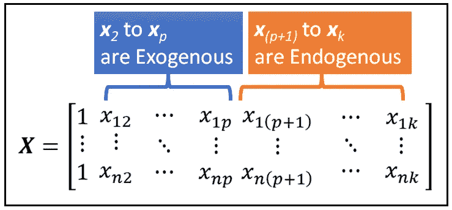
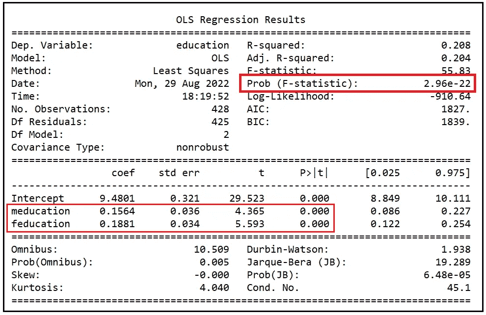
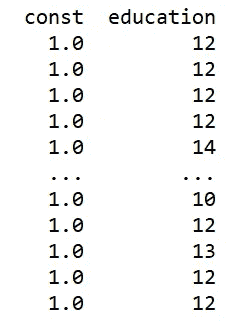
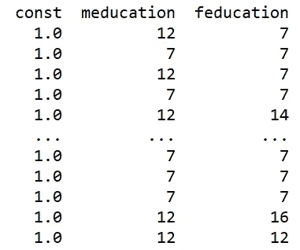
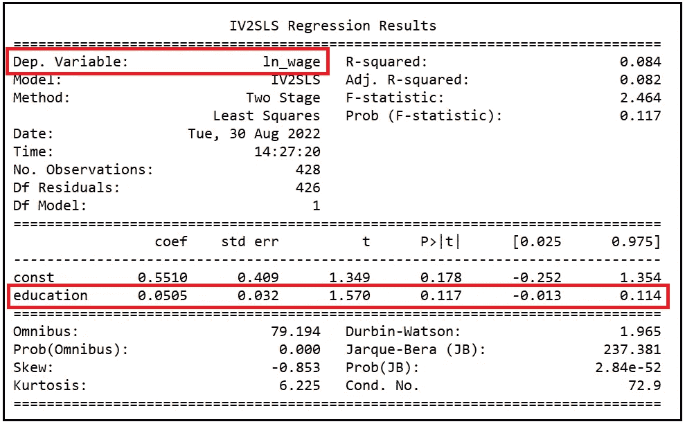

# 两步最小二乘估计简介

> 原文：<https://towardsdatascience.com/introduction-to-two-stage-least-squares-estimation-4dbabdd98102>


图片由 [SpaceX-Imagery](https://pixabay.com/users/spacex-imagery-885857/) 发自 [Pixabay](https://pixabay.com//?utm_source=link-attribution&utm_medium=referral&utm_campaign=image&utm_content=693206) ( [牌照](https://pixabay.com/service/license/))

## 我们将学习如何使用 2SLS 技术来估计包含工具变量的线性模型

在本文中，我们将学习使用**工具变量**技术估计线性模型的两种不同方法。

在上一篇文章中，[我们学习了工具变量](/introduction-to-instrumental-variables-estimation-3eba75a04418)，它们是什么，何时以及如何使用它们。让我们回顾一下我们所学的内容:

考虑以下线性模型:


二元线性模型 **x** _2 和 **x** _3(图片由作者提供)

上式中，**，* ***1，x*** *_2，****x****_ 3*，***【ϵ***为大小为*【n×1】*的列向量。从后面的等式中，为了简洁起见，我们将去掉 ***1*** (它是 1 的向量)。*

*如果一个或多个回归变量，比如说***x****_ 3*，是[](/what-are-exogenous-and-endogenous-regression-variables-c0ea1ba03ce8)**，即它与误差项*相关，则普通最小二乘(OLS)估计量是**不** [**一致**](/the-consistent-estimator-913fab06f4f3) 。它生成的系数估计值偏离了真实值，使人对实验的有用性产生疑问。****

****挽救这种局面的一个办法是想出一个办法，有效地将***×3****_ 3*分成两部分:****

1.  ****与 ***ϵ*** 不相关的块，我们将把它添加回模型中，以代替***x****_ 3*。这是***x****_ 3*的部分，其实是外生的。****
2.  ****与 ***、ϵ*** 相关的第二个块，我们将从模型中切掉。这是内生的部分。****

****而实现这个目标的一个方法就是标识一个变量**_ 3*，“一个用于***x****_ 3*”，具有以下属性:*****

1.  ****与 ***x*** *_3 相关。*认为(在某种程度上)满足了上述两个要求中的第一个，并且****
2.  ****它与满足第二个要求的误差项无关。****

****将***x****_ 3*替换为***z****_ 3*产生以下模型:****

********

****内生变量 **x** _3 替换为变量 **z** _3 的线性模型(图片由作者提供)****

****等式(1a)的 R.H.S 上的所有变量都是外生的。该模型可以使用最小二乘法进行一致估计。****

****上述估计技术可以很容易地扩展到多个内生变量及其相应的工具*，只要每个内生变量与单个唯一的工具变量*一对一配对。****

****上面的例子给出了 IV 估计的一般框架，我们将在下面介绍。****

*******y*** 对 ***X*** 的线性回归采用如下矩阵形式:****

********

****线性模型，其中 **y** 在 **X** 上回归(图片由作者提供)****

****假设数据集的大小为 *n* ，在等式(2)中:****

*   *******y*** 是大小*【n×1】*的向量。****
*   *******X*** 是大小为*【n X(k+1)】*的回归变量的矩阵，即它有 *n* 行和 *(k+1)* 列，其中第一列是一列 1，作为截距的占位符。****
*   *******β*** 是大小为 *[(k+1) x 1]* 的回归系数的列向量，其中第一个元素 *β_1* 是回归的截距。****
*   *******ϵ*** 是回归误差大小*【n x1】*的列向量。*有效保存了*中模型 ***Xβ*** 无法解释的差额余额。******

****下面是上述等式的矩阵格式:****

********

****线性回归模型的矩阵版本(图片由作者提供)****

****不失一般性，且不计截距，让我们假设 ***X*** 中的第一个 *p* 回归变量是外生的，下一个 *q* 变量是内生的，使得 *1 + p + q = k* :****

********

****由 p 个外生变量和 q 个内生变量组成的 **X** 矩阵(图片由作者提供)****

****假设我们能够识别出 *q* 工具变量，这些工具变量将是 ***X*** 中相应的 *q* 回归变量的工具，即***X****_(p+1)*到***X**_ k*中被怀疑是内生的变量。******

****让我们构造一个矩阵 ***Z*** 如下:****

*   *******Z*** 的第一列将是 1 的一列。****
*   ****下一个 *p* 列的 **Z** 即***Z****_ 2*到***Z****_ p*将与 *p* 外生变量***x****_ 2*到 ***x 相同*******
*   *****中的最后一组 *q* 列，即***Z****【p+1】*到***Z****_ k*将保存 *q* 变量的数据，这些变量将作为相应*q*的工具*****

****因此， ***Z*** 的大小也是*【n X(k+1)】*，即与 ***X*** 的大小相同。****

********

******Z** 矩阵(图片由作者提供)****

****接下来，我们将采用转置 ***Z*** 来交换行和列。转置操作实质上是将 ***Z*** 翻转过来。 ***Z*** 的转置记为***Z’***大小为 *[(k+1) x n]。*****

****现在，让我们将等式(2)与***Z’***预先相乘:****

********

****将等式(2)与**Z’**相乘(图片由作者提供)****

****等式(3)在尺寸上是正确的。在左侧，*的大小为*[(k+1)x n]****y***的大小为*【n x 1】*。因此 ***Z'y*** 的大小为 *[(k+1) x 1]* 。*****

****在右侧， ***X*** 的尺寸为*【n X(k+1)】****β***的尺寸为*[(k+1)X 1】*。从左到右， ***Z'X*** 是一个大小为*[(k+1)x(k+1)】*和*(****Z ' x****)**的大小为 *[(k+1) x 1】。******

****同样， ***ϵ*** 大小为*【n×1】*。所以 ***Z'ϵ*** 的大小也是 *[(k+1) x 1]。*****

****现在，让我们应用期望操作符 *E(。)*情商两边。(3):****

********

****将期望算子应用于等式(3)的两边(图片由作者提供)****

*****E(****Z ' y****)*和*E(****Z ' xβ****)*分别解析为 ***Z'y*** 和 ***Z'Xβ*** 。****

****回忆一下 ***Z*** 只包含外生变量。因此，***【z】***和*不相关，因此*(****【z'ϵ****)*的平均值是零的列向量，等式(3a)解析为:*****

********

****(图片由作者提供)****

****接下来，我们将通过将等式(4)的两边乘以方阵的逆矩阵(***Z ' x****)来分离等式(4)的 R.H.S .上的系数向量 ***β*** 。*****

***矩阵的逆在概念上是标量数 *N* 的逆的多维等价(假设 *N* 不为零)*。*矩阵的逆矩阵是用一个复杂的公式计算的，我们将跳过这个公式。***

***有可能表明( ***Z'X*** )是[可逆](https://en.wikipedia.org/wiki/Invertible_matrix)(同样这点我们不会在这里深究)。等式两边的预乘。(4)由*(****z ' x****)*的逆即*(****z ' x****，得到如下结论:****

********

****R.H.S .上的黄色位和绿色位相互抵消，以与 N*(1/N)等于 1 相同的方式产生一个单位矩阵，留给我们以下等式来估计仪表模型的系数向量 ***β*** :****

********

****计算包含工具变量的回归模型的回归系数的公式(图片由作者提供)****

****请注意， ***Z*** 、 ***X*** 和 ***y*** 都是可观测的量，因此只要***×中的内生变量与***【Z***中选择的工具一一对应，就可以使用等式(6)一次性估计所有回归系数。*******

***关于等式(6)，还有最后一点必须提及。严格地说，等式(6)仅可渐近估计，即当数据样本的数量 *n → ∞* 时。但是在实践中，由于一系列数学原因，我们可以用它来计算一个模型的系数估计值，这个模型是通过 IV 对有限大小的样本进行估计的，换句话说，是对真实世界的数据集进行估计的。***

***因此，*的有限样本 IV 估计量 ***β_cap_IV*** 可表述如下:****

********

****含 IVs 模型回归系数的有限样本估计量(图片由作者提供)****

****现在，让我们看看内生变量定义了多个工具变量的情况。****

****考虑以下工资回归模型:****

********

****根据各种变量回归的工资记录(图片由作者提供)****

****在上面的模型中，我们回归了 ***工资*** 的自然对数，而不是原始工资，因为工资数据通常是右偏的，记录它可以减少偏斜。 ***学历*** 是以受教育年限来衡量的。 ***学院*** 和 ***城市*** 是布尔变量，表示这个人是否上过大学，是否居住在一个城市。 ***Unemp*** 包含居住县的失业率百分比。****

****我们的 ***X*** 矩阵是****1*******年龄*******经历*******学院******城市*T53************

*****我们会认为 ***教育*** 是内生的。因此，学校教育年数只掌握了在学校或大学里教授的内容。它还忽略了一些方面，如这个人对材料的掌握程度，他们对课程之外的主题的了解程度等等，所有这些都没有被观察到，因此在错误术语*中被捕捉到。******

*****我们将提出两个变量，母亲的受教育年数(*)和父亲的受教育年数(***feeducation***)作为个人的*的 IVs。*******

## *****关联性和外生性条件*****

*****我们选择的 iv 需要通过**关联条件**。如果对 ***教育*** 进行一次回归，对其余变量进行*X***教育*** 和 ***教育*** 揭示(通过一次 [**F 检验**](/fisher-test-for-regression-analysis-1e1687867259) )即 ***教育*** 和 ***教育*********

****误差项 ***ϵ*** 本来就是不可观测的。因此不能直接检测 IVs 的**外源性条件**。相反，我们相信父母的受教育年限不太可能与孩子对材料的掌握等因素相关，即隐藏在错误术语中并使教育成为内生的因素。但是我们可能错了。我们很快就会知道了。****

## ****包含 IVs 的回归模型****

****我们的 IVs 回归模型如下:****

********

****各种变量的工资回归记录，包括两个变量:教育和非教育(图片由作者提供)****

****我们的*矩阵是****1*******年龄*******经验*******学院*** ***其中每个变量是大小为*【n×1】*的列向量，大小为*的列向量是*【n×8】。 注意我们是如何用它的两个 IVs 取代了 education。**************

****并且待估计的系数向量是:****

*******β_ cap _ IV =[****β* _ 1 _ cap，β*_2_cap，β*_3_cap，β*_4_cap，β*_5_cap，β*_6_cap，β*_7_cap，β*_8_cap]*****

****其中大写字母表示估计值。****

****定义了 ***X*** 和 ***Z*** 之后，是否可以用 Eq (6a)对***β_ cap _ IV****进行单次计算？*****

********

****含 IVs 模型回归系数的有限样本估计量(图片由作者提供)****

****很遗憾，答案是，没有。****

****回想一下 ZT3 的大小 ***是*【n×8】。*所以， ***Z'*** 的大小为*【8 x n】*。 ***X*** 的大小为*【n X 7】*。因此***Z’x***的尺寸*【8×7】*不是方阵，因此 ***不可逆*** 。于是，Eq。(6a)当多个工具变量如****教育*** 用于代表单一内生变量如*时，不能使用。*********

****这个困难建议我们探索一种不同的方法来估计 ***β_cap_IV。*** 这种不同的方法是两阶段 OLS 估计量。****

# ****两步 OLS 估计量****

****我们从开发这个估计器的第一阶段开始。****

## ****第一阶段****

****在这个阶段，我们将倒退 ***学历**年龄*******阅历*******学院*******城市*** *，********

****假设我们已经通过 f 检验确定 ***教育*** 确实与 IVs ***教育*** 和 ***教育*** 相关。****

****我们现在将回归 ***教育*** 不仅关于 ***教育*** 和 ***教育*** 而且关于其他变量，这允许我们考虑非 IV 变量和 IV 变量之间可能的相关性的影响。参见我之前关于[工具变量](/introduction-to-instrumental-variables-estimation-3eba75a04418)的文章，了解这种效应的详细解释。****

********

****教育在 ***Z*** 矩阵上退步(图片由作者提供)****

*******ν*** 是误差项。由于所有回归变量都是外生的，因此可以使用 OLS 对上述模型进行一致估计。估计模型具有以下形式:****

********

****拟合模型后教育的估计值，该模型在 **Z** 矩阵上回归教育(图片由作者提供)****

****在上面的等式中， ***education_cap*** 是 ***education*** 的估计值(又称预测值)。系数上的上限同样表示估计值。****

****上述基于 OLS 的回归代表了我们即将进行的两阶段 OLS (2SLS)估算的第一阶段**。******

## ****第二阶段****

*****关于第一阶段的关键见解是****education _ cap****仅包含****education****的方差的一部分，即外生的，即与错误项不相关。*****

****因此，我们可以将原模型中的 *ln(* ***工资*** *)* 替换为***education _ cap***，形成一个只包含外生回归变量的模型，如下:****

********

******工资**日志在 **X** 回归，用其外生部分替换**学历**(图片由作者提供)****

****由于上述模型仅包含外生回归变量，因此可以使用 OLS 对其进行一致估计。该估计形成了 2 级 OLS 估计器的第二级。****

# ****2sl 的总体框架****

****对于那些对线性代数有天赋的人来说，2 阶段最小二乘法的一般框架如下(如果你愿意，你可以跳过这一节直接进入 Python 教程 2sl):****

****让我们开始第一阶段的工作。****

## ****第一阶段****

****在第一阶段，我们估计以下模型。为了保持事物的一般性， ***X*** 不仅包含内生教育，还包含其余变量， ***γ*** 是回归系数的向量， ***ν*** 是误差项:****

********

******X** 对 **Z** 的线性回归(图片由作者提供)****

*******γ*** 的最小二乘估计量可以显示为使用基于最小二乘的估计量的标准公式计算如下:****

********

*******γ*** *的 OLS 估计量(图片由作者提供)*****

****使用 ***γ*** _cap， ***X*** 的估计值由下式给出:****

********

****使用估计的*系数****γ****_ cap【图片由作者提供】*估计 **X******

****这就完成了 2-SLS 的第一阶段。****

****现在，让我们开始第二阶段的工作。****

## ****第二阶段****

****让我们回忆一下等式 6(a ),它是我们针对*中的内生变量与*中的工具之间存在一一对应关系的情况构建的 IV 估计量:******

**********

*****含 IVs 模型回归系数的有限样本估计量(图片由作者提供)*****

*****我们将等式(6c)中的***X****_ cap*代入等式(6a)中的 ***Z*** 得到**_ cap _ 2 SLS*如下:******

********

****使用 2 阶段最小二乘法估算的仪器模型的系数(图片由作者提供)****

****这就完成了 2-SLS 估计器的公式化。实验者完全可以观察到方程(6b)的 R.H.S .上的所有矩阵。系数的估计可以通过简单地按顺序应用等式(6bb)、(6c)和(6d)来实现:****

********

****二阶段最小二乘估计器(图片由作者提供)****

# ****使用 Python 和 statsmodels 使用 2SLS 估计线性模型的教程****

****我们将使用 1976 年基于前一年 1975 年数据的已婚妇女收入动态研究的截面数据。****

********

****PSID76 数据集(来源: [R 数据集](https://vincentarelbundock.github.io/Rdatasets/doc/AER/PSID1976.html)在 [GPL v3](https://vincentarelbundock.github.io/Rdatasets/index.html) 下)****

****每行包含一个已婚女性参与者的时薪数据和其他变量。数据集包含几个变量。我们感兴趣的问题如下:****

*****工资*:1975 年平均小时工资
*学历*:参与者的受教育年限
*学历*:参与者母亲的受教育年限
*学历*:参与者父亲的受教育年限
*参与度*:个人是否于 1975 年参加劳动？(1/0).我们只考虑那些在 1975 年参加的人。****

****我们的目标是**估计教育对 1975 年已婚女性受访者小时工资的影响，具体来说是小时工资的对数**。****

********

****估计教育对小时工资日志影响的模型(图片由作者提供)****

****正如我们之前看到的，教育是内生的，因此使用 OLS 的直接估计将产生所有系数的有偏估计。具体来说，OLS 对 *β_1* 和 *β_2* 的估计可能会高估它们的值，也就是说，它会高估教育对时薪的影响。****

****我们将尝试通过使用*教育*和*教育*作为教育的**工具**来补救这种情况。****

****我们将使用 Python、 [Pandas](https://pandas.pydata.org/) 和 [Statsmodels](https://www.statsmodels.org/dev/gettingstarted.html) 来加载数据集并构建和训练模型。让我们从导入所需的包开始:****

```
****import** pandas **as** pd
**import** numpy **as** np
**import** statsmodels.formula.api **as** smf
**from** statsmodels.api **import** add_constant
**from** statsmodels.sandbox.regression.gmm **import** IV2SLS**
```

****让我们将数据集加载到熊猫`Dataframe`:****

```
**df = pd.**read_csv**(**'PSID1976.csv'**, **header**=0)**
```

****接下来，我们将使用数据集的一个子集，其中 participation=yes。****

```
**df_1975 = df.**query**('participation == \'yes\'')**
```

****我们需要验证仪器*教育*和*教育*满足**相关条件**。为此，我们将对*教育*和*教育*的*教育*进行回归，并使用 f 检验验证*教育*和*教育*在此回归中的系数*和*共同显著。****

```
**reg_expr = **'education ~ meducation + feducation'**olsr_model = smf.**ols**(**formula**=reg_expr, **data**=df_1975)olsr_model_results = olsr_model.**fit**()**print**(olsr_model_results.**summary**())**
```

****我们看到以下输出:****

********

****线性模型的训练摘要，该模型对教育、教育和常数进行回归(图片由作者提供)****

*****教育*和*教育*的系数在<的 p 为 0.001 时各自显著，如其 p 值基本为零所示。这些系数在 p 为 2.96e-22 时也是共同显著的，即< .001。*教育*和*教育*明显满足*教育*的 IVs 的**关联条件**。****

****我们现在将为工资方程建立一个线性模型，并使用 statsmodels，我们将使用 2SLS 估计量来训练该模型。****

****我们将从构建设计矩阵开始。因变量为 *ln(工资)*:****

```
**ln_wage = np.**log**(df_1975['**wage**'])**
```

****Statsmodel 的 IV2SLS 估计量定义如下:****

****`statsmodels.sandbox.regression.gmm.IV2SLS(***endog***, ***exog***, ***instrument****=None*)`****

****Statsmodels 需要以如下特定方式构建`***endog***`、`***exog***`和`***instrument***`矩阵:****

****`***endog***`是包含因变量的*【n×1】*矩阵。在我们的示例中，它是 *ln_wage* 变量。****

****`***exog***`是一个*【n x(k+1)】*大小的矩阵，它必须包含所有的内生变量和外生变量，加上常数。在我们的例子中，除了常数之外，我们没有在工资方程中定义任何外生变量。所以它看起来像这样:****

********

****`***instrument***`是包含工具变量的矩阵。此外，Statsmodels 的`IV2SLS`估计器要求`instrument`也包含`exog`矩阵中*未被检测的*的所有变量。在我们的例子中，工具变量是*教育*和*教育*。`exog`中的变量是*而不是*被检测的，它们只是截距的占位符列。因此，我们的仪器矩阵将如下所示:****

********

****让我们构建三个矩阵:****

```
**df_1975[**'ln_wage'**] = np.log(df_1975[**'wage'**])exog = df_1975[[**'education'**]]
exog = **add_constant**(exog)instruments = df_1975[[**'meducation'**, **'feducation'**]]
instruments = **add_constant**(instruments)**
```

****现在让我们构建并训练`IV2SLS`模型:****

```
**iv2sls_model = **IV2SLS**(**endog**=df_1975[**'ln_wage'**], **exog**=exog, **instrument**=instruments)iv2sls_model_results = iv2sls_model.**fit**()**
```

****让我们打印培训总结:****

```
****print**(iv2sls_model_results.**summary**())**
```

********

****2SLS 模型的训练总结(图片由作者提供)****

## ****2SLS 模型结果的解释****

****由于我们的主要兴趣是估计教育对小时工资的影响，我们将把注意力集中在教育变量的系数估计上。****

****我们看到 2SLS 模型已经估计出*教育*的系数为 0.0505，标准差为 0.032，95% [置信区间](/interval-estimation-an-overview-and-a-how-to-guide-for-practitioners-e2a0c4bcf108)为-0.013 到 0.114。p 值为 0.117 表明显著性为(1–0.117)100% = 88.3%。总的来说，正如 2-SLS 模型所预期的那样，该模型缺乏精确性。****

****注意因变量是 *log* (工资)。要计算教育每单位变化(即一年)的小时工资变化率，必须对*教育*的系数取指数。****

****e^(0.0505)=1.05179 暗示，教育年数每增加一个单位，小时工资估计会增加 1.05179 美元，反之亦然。****

## ****IV 估计量与 OLS 估计量的比较****

****让我们比较一下 2SLS 模型和简单的 OLS 模型的表现，后者回归了关于教育的 log(工资)T1 和 T2 T3。****

```
**reg_expr = **'ln_wage ~ education'**olsr_model = smf.**ols**(**formula**=reg_expr, **data**=df_1975)olsr_model_results = olsr_model.**fit**()**print**(olsr_model_results.**summary**())**
```

********

****OLS 模式的培训总结(图片由作者提供)****

****我们将关注*教育*系数的估计值。0.1086，是 2SLS 模型报告的估计值的两倍。****

****e^(0.1086)=1.11472，这意味着教育年数的单位增加(减少)估计会转化为每小时工资增加(减少)1.11472 美元。****

****由于怀疑教育的内生性，预计 OLS 的估计值会更高。实际上，根据我们正在建模的情况，我们可能希望接受由 2SLS 模型报告的更保守的估计值 0.0505。然而，(相对于 2SLS 模型)，OLS 模型的系数估计非常显著，p 值基本为零。回想一下，来自 2SLS 模型的估计仅在 88%的置信水平下是显著的。****

****此外，(再次如 OLS 模型所预期的那样)，OLS 模型报告的*教育*的系数估计值的标准误差(0.014)比 2SLS 模型的标准误差(0.032)小得多。因此，来自 OLS 模型的相应的 95% ci 比由 2SLS 模型估计的那些要紧密得多。****

****为了比较，下面是两个模型中*教育*和相应 95%置信区间的系数估计值:****

********

****2sl 和 OLS 模型报告的教育系数估计值的比较(图片由作者提供)****

> ****使用 IV 估计量，可以用估计精度来换取估计中内生性和随之而来的偏差的消除。****

****下面是两个模型估算的*教育*的 [**主效应**](/understanding-partial-effects-main-effects-and-interaction-effects-in-a-regression-model-54e8a127c62d) 对时薪的比较:****

********

****教育对 2sl 和 OLS 模型估算的时薪的主要影响的比较(图片由作者提供)****

# ****数据集和教程代码****

****文章中使用的工资数据集可以通过[此链接](https://vincentarelbundock.github.io/Rdatasets/csv/AER/PSID1976.csv)访问。相关文件可以在这里找到。****

****下面是本文中显示的完整源代码:****

# ****相关阅读****

****[](/introduction-to-instrumental-variables-estimation-3eba75a04418) **** 

# ****参考文献、引文和版权****

## ****数据集****

****劳动力参与数据集是 R 数据集的一部分。Vincent Arel-Bundock 根据 [GPL-3](https://www.r-project.org/Licenses/GPL-3) 许可将其作为 [Rdatasets](https://vincentarelbundock.github.io/Rdatasets/) 包的一部分提供。****

## ****形象****

****本文中的所有图片版权归 [Sachin Date](https://www.linkedin.com/in/sachindate/) 所有，版权归 [CC-BY-NC-SA](https://creativecommons.org/licenses/by-nc-sa/4.0/) 所有，除非图片下面提到了不同的来源和版权。****

*****如果您喜欢这篇文章，请关注我的*[***Sachin Date***](https://timeseriesreasoning.medium.com)*以获得关于回归、时间序列分析和预测主题的提示、操作方法和编程建议。*****