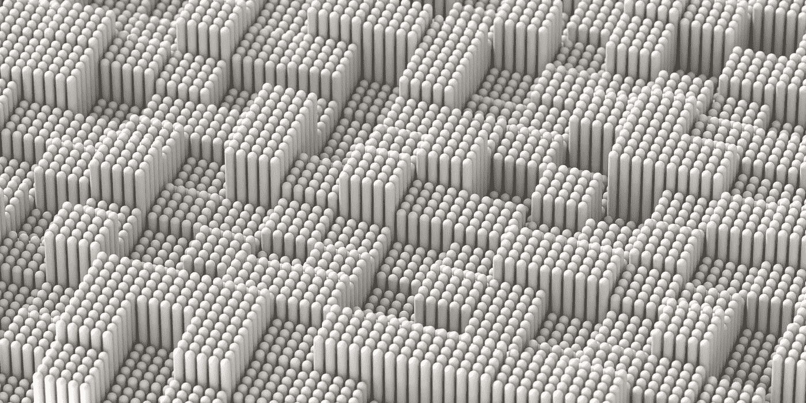
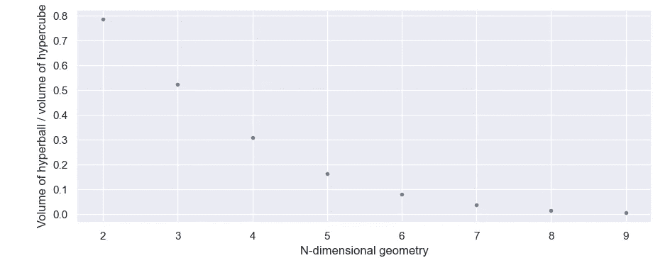

# 高维空间中的直觉

> 原文：<https://towardsdatascience.com/intuitions-in-high-dimensional-spaces-c22f0441ce19>

## 高维空间的反直观几何性质

我们对距离、面积和体积的许多直觉在高维空间中会失效。在 AI/ML 和数据科学中，我们处理的是高维特征数据；重要的是要理解我们在二维和三维空间中的日常经历是如何没能让我们为更高维空间做好准备的！

> **为什么重要**:我们对距离、体积和点数分布的假设并不总是正确的！当处理高维数据时，我们现有的直觉会将我们引入歧途。

我第一次遇到这些想法是在“[关于高维空间中距离度量的惊人行为](https://citeseerx.ist.psu.edu/viewdoc/download?doi=10.1.1.23.7409&rep=rep1&type=pdf)”[1]。看看吧！

由 [Andrew Kliatskyi](https://unsplash.com/@kirp?utm_source=medium&utm_medium=referral) 在 [Unsplash](https://unsplash.com?utm_source=medium&utm_medium=referral) 上拍摄

# 距离

通常，我们想要测量一个样本离它的邻居有多远，一个质心，或者一些“正常”的度量通常，我们将距离量化为一个范数。

*Lp* 定额定义。等式来自维基百科，文本在[CC Attribution-share like License](https://en.wikipedia.org/wiki/Wikipedia:Text_of_Creative_Commons_Attribution-ShareAlike_3.0_Unported_License)下可用。

因为 *p* 等于 1，这恢复了 *L1* 范数。因为 p 等于 2，这恢复了 L2 范数。

计算两个 n 维点之间的距离。

现在，我们随机生成一些 n 维正态数据。

采样 100 个同内径高斯 n 维点。

为了识别异常值，我们可能希望找到离某个已知分布中心更远的点。因为我们使用零中心高斯模拟了这些点，所以我们可以计算到原点的距离。

到原点的最远距离和最近距离的比值。

令人惊讶的是，当我们增加维度时，我们遇到了一些奇怪的事情:离原点最远的点与离原点最近的点的距离几乎相同！我们可以将此形式化为最远样本到原点的距离除以最近样本到原点的距离的比值。

作为维数函数的 Lp 范数比。

我们常用的两种距离度量——*L1*和*L2——*在高维空间中变得信息量更少了！对于我们的二维数据，离原点最远的点比离原点最近的点远将近 75 倍。然而，在我们的 100 维数据中，这个比率大约是 1.1。

# 面积/体积

所以距离与我们的期望不符。让我们来看看另一个同样基本的属性:面积/体积。我们来考虑一下圆的 n 维类比和正方形的 n 维类比的区别！

我们可以在一个二维正方形中内接一个二维圆，我们知道它们的面积比:πr 对(2r)其中 r 是圆的半径和正方形边长的一半。如果我们估计 r 的比值为 1，我们就能把π恢复到 4。我们可以在三维空间中做同样的事情，球体的体积为-(4πr)/3，立方体的体积为-(2r)！同样，我们可以检查 1，4π/3 与 8 的比值。我们的正方形的面积大约是我们的圆的面积的 1.27 倍。我们的立方体的体积大约是球体面积的 1.91 倍。

我们可以继续向更高维度发展！圆形进步到球形进步到 n 维 n 球/超球。正方形进展到立方体进展到 n 维超立方体。这些更高维度几何的体积复制如下！

超球和超立方体体积的定义。

现在让我们假设半径和半边长为 1，再来看看比率。我们将增加维度，并绘制 n 球的体积除以超立方体的体积。

计算体积比作为维度的函数。

超球的体积除以超立方体的体积的极限，当我们缩放维度接近零时！

难以置信！在高维空间中，球体模拟占据的立方体模拟越来越少。立方体中几乎所有的体积都在角上！当沿大量维度对特征数据进行切片时，这是一个重要的考虑因素。

# 关键要点

这些观察提出了一个重要的实际挑战。在高维数据中，Lp 范数*不是*相似性的有效度量。随着维度的增加，我们对 2D 和 3D 空间的直觉不再成立，即使是我们熟悉的高斯分布也是如此。当采样或过滤数据时，我们需要注意我们空间的几何形状！

# 参考

[1]阿格沃尔 CC，欣内堡 A，凯米达。高维空间中距离度量的惊人行为。数据库理论国际会议，2001 年 1 月 4 日(第 420-434 页)。斯普林格，柏林，海德堡。

感谢阅读！如果你有更正，问题，或者其他你想看到我解释的内容，请在评论中告诉我。