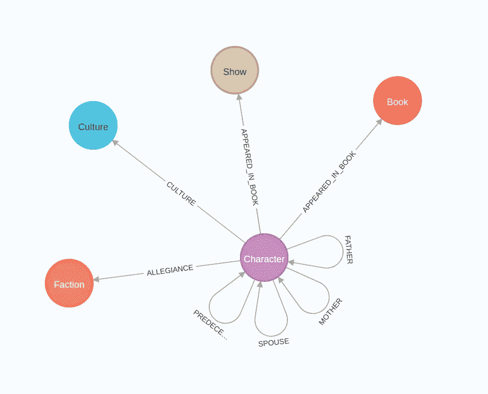
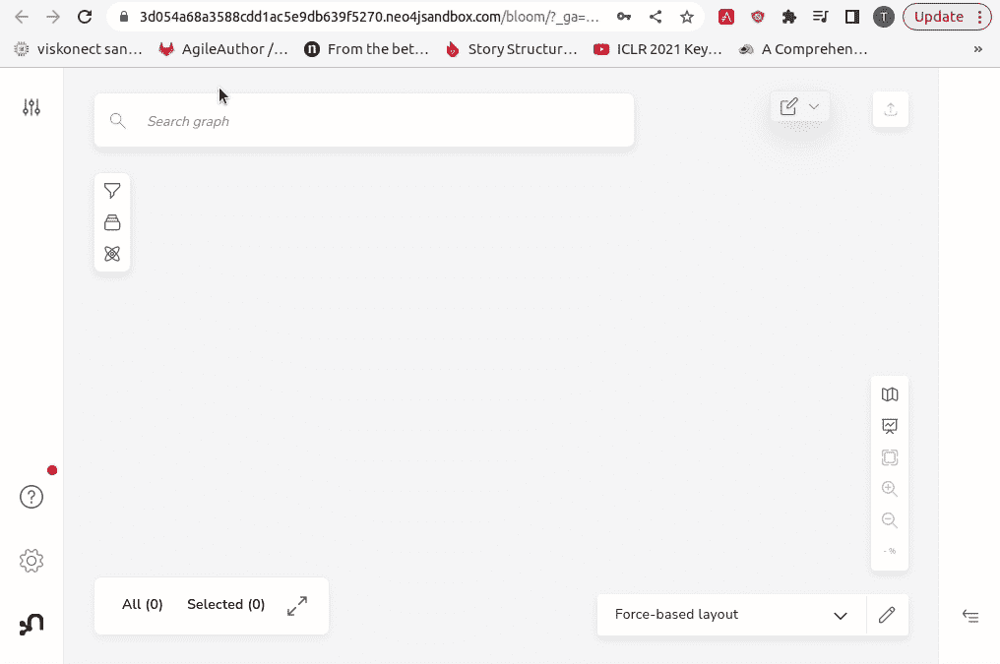
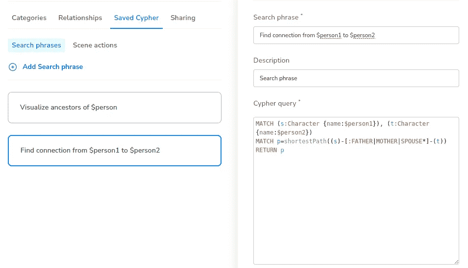
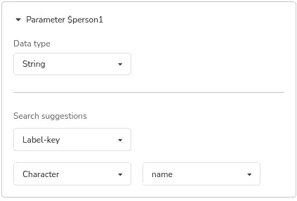
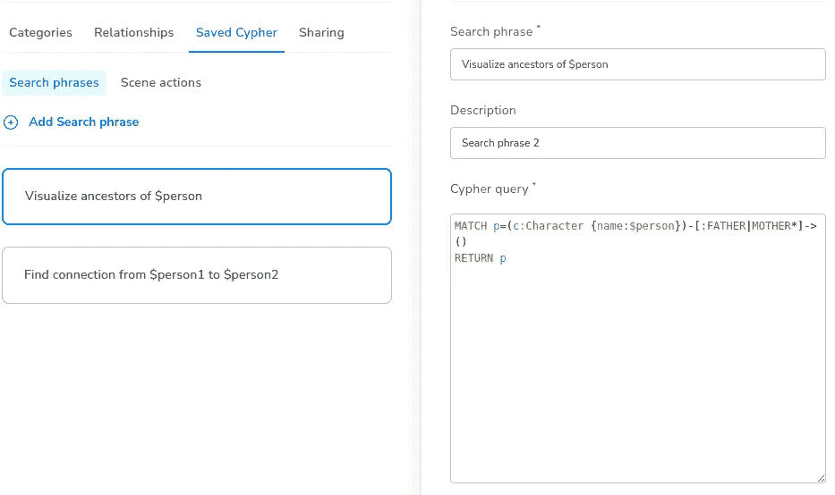
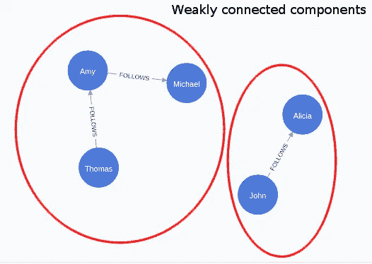
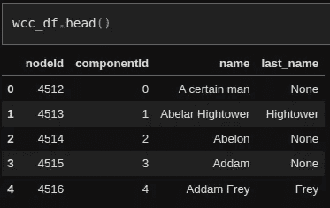

# 调查《龙屋》和《权力的游戏》角色之间的家庭关系

> 原文：<https://towardsdatascience.com/investigate-family-connections-between-house-of-dragon-and-game-of-thrones-characters-ff2afd5bdb82>

## 使用 Neo4j 交互式分析和可视化家谱

我已经有一段时间没有写博客了。一直在忙着看《龙族之家》节目。然而，现在第二季的等待已经开始，我突然有了一些空闲时间。我看到一些社交帖子描述了《龙屋》和《权力的游戏》中角色之间的联系。由于任何类型的联系都在我的领域内，并且我喜欢写它们，所以我决定写一篇帖子来展示在 Neo4j 生态系统中快速分析和可视化家庭联系是多么容易。

《龙屋》的故事情节发生在《权力的游戏》之前大约 200 年。所以《权力的游戏》中的部分角色是龙之家角色的后代。例如，丹妮莉丝·坦格利安的祖先是韦赛里斯和雷妮拉·坦格利安。有一些特定家谱的可视化，但是我还没有看到任何把它们放在一起的尝试。你可能知道，冰与火宇宙中的皇室家族利用婚姻作为政治工具来传播他们的影响力。因此，许多皇室家族在某种程度上通过婚姻结合在一起。

这篇博文将教你如何交互式地搜索和可视化各种角色之间的关系，不需要任何编码或密码知识。如果你是一名数据分析师或渴望成为一名数据分析师，我将在这篇博客的最后部分向你展示如何从 Python 笔记本中执行图形算法，并评估它们的结果。


从珊莎·史塔克的角度看家谱的一个子集。图片由作者提供。

家谱由人和他们的关系组成。在图论中，[树](https://en.wikipedia.org/wiki/Tree_%28graph_theory%29)是一种特殊类型的图。假设数据集最好用图模型来表示，那么使用图数据库来存储和分析信息是有意义的。如果你读过我的帖子，你会知道我喜欢在我的例子中使用 Neo4j，因为它提供了开箱即用的可视化和算法支持，而无需在你的计算机上安装任何东西。这使得像您这样的读者更容易理解这些示例，因为您不必在本地计算机或。然而，如果你想在你的分析中使用任何其他工具，你是非常受欢迎的。

## Neo4j 沙盒

如果您想跟随代码示例，您需要设置一个 Neo4j 数据库。建议你在 Neo4j 沙盒上使用一个[空白项目。沙盒选项附带预装的 APOC 和图表数据科学库，以及 Neo4j Bloom，这是一种可视化工具，允许您以交互方式探索和分析图表。](https://sandbox.neo4j.com/?usecase=blank-sandbox)

另一方面，如果你想创建一个本地环境，你可以随时下载并安装 [Neo4j 桌面应用](https://neo4j.com/download/)。

## 资料组

我们需要一个数据集，其中包含来自《龙之家》和《权力的游戏》时间轴的角色。幸运的是，我们有一些选项不包括组合不同的数据集。像以前很多次一样，我搜索了所有相关信息的社区维基。我偶然发现了冰与火网页的一个[维基](https://awoiaf.westeros.org/index.php/Main_Page)，它看起来像是一个很好的候选，包含了我们需要的所有信息。网站上的所有内容都可以在 CC BY-SA 3.0 许可下使用。

像其他 wikis 一样，冰与火页面包含所有角色的列表，以及每个角色的信息框中结构良好的信息。


给雷妮拉·坦格利安的一些信息。数据来自 [冰与火](https://awoiaf.westeros.org/index.php/Rhaenyra_Targaryen)的[维基。](https://awoiaf.westeros.org/index.php/Rhaenyra_Targaryen)

正如你所看到的，从家庭关系到皇室职责和忠诚，有很多关于角色的信息。我制作了一个 CSV 文件，以便更容易地构建一个图表，而不必每次都去浏览网站。在导入数据时，我注意到需要几个数据清理步骤，所以我发布了一个 Jupyter 笔记本，专门用于将数据集导入和清理到 Neo4j 中。

[](https://github.com/tomasonjo/blogs/blob/master/ice%26fire/Ice%26Fire_import.ipynb)  

您只需要更改 Neo4j 凭证，然后就可以运行所有的单元格来生成下面的图形模型。



图形模型。图片由作者提供。

字符位于我们图形模型的中心。我们知道他们的家庭关系，这些关系被标记为**父亲**、**母亲**和**配偶**关系。我们也知道他们属于哪种文化，以及他们对不同派别的忠诚。最后，我还输入了角色出现在哪些书籍或电视节目中。

冰与火的宇宙是巨大的，因为我们在图表中有 3653 和 563 个派别。冰与火的维基提供了更多关于派系、文化、地点和其他实体的信息，我跳过了这些，因为这次分析的重点是家庭关系。

## 交互式可视化

我们将从通过 Neo4j Bloom 中的网络可视化交互分析角色之间的关系开始。Neo4j Bloom 允许没有编码或密码知识的用户有效地探索和分析任何图形数据集，这意味着你可以用它来打动你的朋友和家人，并帮助他们以令人信服的方式探索冰与火的世界。

您可以通过单击下拉箭头并选择 Neo4j Bloom 选项，在 Sandbox 中打开 Neo4j Bloom。


如何在沙盒环境下打开 Bloom？图片由作者提供。

接下来，您需要点击屏幕右侧的**创建新的**按钮，并选择**生成透视图**，这将自动推断图形模式。


自动生成 Bloom 透视图。图片由作者提供。

现在你已经准备好了。Bloom 提供了接近自然的语言搜索，您可以使用它来探索图表。



Neo4j Bloom 中的近自然搜索。作者视频。

Neo4j Bloom 提供了一个搜索栏，可以用来查找相关节点并检查它们的关系和属性。我们还能够在搜索栏中定义更复杂的图形模式，这超出了本文的范围。你可以在由乔纳森·登撰写的文章之后的[中查看一些更新的功能。](https://medium.com/neo4j/autumn-is-bloom-ing-with-new-visualization-features-4119725590ee)

我喜欢在 Neo4j Bloom 中定义[自定义搜索短语](https://neo4j.com/docs/bloom-user-guide/current/bloom-tutorial/search-phrases-advanced/)，可以帮助你更快地找到相关的图形模式。不用在搜索栏中描述整个图形模式，您可以使用 Cypher 语句简单地定义它。Cypher 语句还支持可选参数。

例如，假设我们想要定义一个自定义的搜索短语来帮助我们找到任意字符对之间的联系。在实践中，我们将试图找到两个角色之间的最短路径，同时只考虑家谱的关系。

下面的 Cypher 语句查找两个角色之间的最短路径，并限制该路径只能遍历**父亲**、**母亲**或**配偶**关系。

```
MATCH (s:Character {name:$person1}), (t:Character {name:$person2})
MATCH p=shortestPath((s)-[:FATHER|MOTHER|SPOUSE*]-(t))
RETURN p
```

Cypher 语句中的参数以美元符号($)为前缀。您可以观察到，我们没有为角色名称硬编码任何值，因为我们想要创建一个工具来帮助用户找到任何一对角色之间的联系。

要定义带参数的搜索短语，我们需要在搜索短语和 Cypher 语句中包含参数。在这两种情况下，参数都以美元符号为前缀。此外，搜索短语中的参数名必须与 Cypher 查询中的参数名相匹配。



在 Neo4j Bloom 中定义自定义搜索短语。图片由作者提供。

每当我们在搜索栏中键入“查找连接自”时，搜索短语将被激活。Neo4j Bloom 的一个很好的特性是它提供了开箱即用的自动补全参数。要启用自动完成，您必须在搜索短语定义的下半部分描述 Bloom 应该提供哪些建议。



布隆自动完成建议定义。图片由作者提供。

从图中可以看出，我们需要定义自动完成建议应该使用 Label-key 特性并设置标签值**字符**和属性值**名称**来提供。本质上，建议将通过使用字符节点的 name 属性来提供。

现在我们可以继续测试我们刚刚定义的自定义搜索短语。在这个例子中，我想找到《权力的游戏》系列中的主要人物之一提利昂·兰尼斯特和出现在《龙之家》故事情节中的韦赛里斯一世之间的最短路径。


提利昂·兰尼斯特和韦赛里斯之间的最短路径。

有趣的是，从提利昂到韦赛里斯的连接是从穿越到瑟曦·兰尼斯特和劳勃·拜拉席恩一世开始的。我从来不知道劳勃的祖母是瑞艾尔·坦格利安，在这个例子中，她是坦格利安家族的切入点。坦格利安的名字对我来说很困惑，所以我甚至不想去破译剩下的通往韦赛里斯一号的路。

如果你还记得的话，劳勃·拜拉席恩从疯狂的伊里斯·坦格利安国王那里篡夺了王位。由于劳勃·拜拉席恩至少有坦格利安的四分之一，我想知道他们的关系有多密切。幸运的是，我们可以简单地改变搜索短语中的名称并检查最短路径。


罗伯特·巴拉森和伊里斯·坦格利安之间的最短路径。图片由作者提供。

贝萨·布莱克伍德似乎是劳勃·拜拉席恩和疯王艾瑞斯二世最近的共同祖先。它们的关系比人们想象的更密切。在冰与火的宇宙中探索联系是很容易的。因此，我想你会想要探索更多的关系。

接下来，我们将准备另一个搜索短语，它将一个特定人的所有已知祖先可视化。定义这个图形模式的 Cypher 语句如下。

```
MATCH p=(c:Character {name:$person})-[:FATHER|MOTHER*]->()
RETURN p
```

我们只需要将这个 Cypher 语句和搜索短语定义一起输入 Neo4j Bloom。



定义 Neo4j Bloom 中的祖先搜索短语。图片由作者提供。

一旦定义了搜索短语，我们就可以在搜索栏中使用它。在这个例子中，我们可以想象一个人的所有祖先。我决定研究玛格丽·提利尔的祖先。


玛格丽·提利尔的家谱。图片由作者提供。

关于玛格丽·提利尔的祖先，我们知道的并不多。然而，你可能对海托华家族的名字很熟悉。据说玛格丽·提利尔是龙之家的奥托和艾丽森·海塔尔的远亲，尽管没有明确的联系。

## 图形数据科学

也许你是一名数据科学家，或者你渴望成为一名数据科学家。图表分析和数据科学提供了各种各样的算法，可以增强您的分析工具箱，并帮助您找到对高度关联的数据集的有意义的见解。在这一节中，我将展示如何轻松地将图形算法集成到您的分析工作流中。Neo4j 为 Neo4j Graph Data Science library 提供了一个 [Python 客户端，可以让你只使用 Python 代码无缝地执行图形算法。](https://medium.com/neo4j/how-to-get-started-with-the-neo4j-graph-data-science-python-client-56209d9b0d0d)

在这个例子中，我们将在家庭关系网络上执行弱连通分量算法。弱连接组件算法(WCC)用于在给定网络中寻找不同的岛或节点组件。当您忽略关系方向时，一个节点可以到达同一组件中的所有其他节点。



样本图中的可视化弱连通分量。图片由作者提供。

托马斯、艾米和迈克尔形成弱连接部分，艾丽西娅和约翰形成另一部分。例如，Alicia 和 Michael 不在同一个组件中，因为两者之间不存在路径。

在家庭网络的上下文中，WCC 算法可以帮助您检测在某个时间点哪些家庭通过婚姻或孩子结合在一起。此外，WCC 可能会帮助我们评估是否有更大的系列组件在争夺权力。举个例子，如果兰尼斯特和史塔克联姻，而坦格利安和巴拉瑟昂组成另一个阵营，那么我们可以假设这两个阵营正在争夺七大王国的控制权。请注意，这只是一个虚构的例子，与实际的冰与火世界没有任何关系。

我已经准备了一个 Jupyter 笔记本，其中包含了 WCC 示例的所有代码。

[](https://github.com/tomasonjo/blogs/blob/master/ice%26fire/Ice%26Fire_analysis.ipynb)  

首先，我们需要为我们的用例设计一个包含相关节点和关系的内存图。例如，因为我们想关注家庭关系，我们将包括**角色**节点和**母亲**、**父亲**以及**配偶**关系。

```
G, res **=** gds**.**graph**.**project("family", "Character", ["MOTHER", "FATHER", "SPOUSE"])
```

为了在家庭网络投影上执行弱连通分量算法，我们简单地运行`gds.wcc.stream`方法。算法的`stream`模式以 Pandas 数据帧的形式检索算法结果。

```
# Execute WCC algorithm
wcc_df **=** gds**.**wcc**.**stream(G)
# Fetch name property from the database
wcc_df["name"] **=** [el["name"] **for** el **in** gds**.**util**.**asNodes(wcc_df["nodeId"]**.**to_list())]
# Derive the last name  
wcc_df["last_name"] **=** [
    el**.**split(" ")[**-**1] **if** len(el**.**split(" ")) **>** 1 **and** len(el**.**split(" ")[**-**1]) **>** 3 **else** **None**
    **for** el **in** wcc_df["name"]
]
```

*结果*



我们添加了两行代码，用于从数据库中检索字符的 name 属性并提取姓氏。如果您对 Python 代码有所了解，您会发现姓氏是从姓名中包含多个单词的人提取的，并且姓名中的最后一个单词包含 3 个以上的字符。姓氏提取并不完美，但对于我们的演示来说已经足够好了。

`componentId`列描述了一个节点所属的社区。如果我们想要计算组件的大小，我们使用 Pandas `groupby`方法来聚合和计算组件的大小。

```
wcc_df**.**groupby("componentId")**.**size()**.**sort_values(ascending**=False**)**.**to_frame(
    "componentSize"
)**.**reset_index()**.**head()
```

*结果*

看起来最大的组件包含 785 个成员。信不信由你，这在现实网络中是很常见的，网络由一个超级组件和几个更小的组件组成。

*附:如果你更喜欢 Cypher 聚合而不是 Pandas 聚合，你总是可以用 Cypher 来代替。*

可能需要很多不同的家庭加入才能在一个社区中获得总共 785 个成员。此外，请注意，两个皇室家族之间只需要有一次婚姻，并且它们在单个组件中连接在一起。作为分析的最后一部分，我们将检查哪十大家族及其成员中有多少属于最大的组成部分。

```
largest_component = wcc_df.groupby('componentId').size().sort_values(
  ascending=False
).reset_index()['componentId'][0]wcc_df[wcc_df["componentId"] == largest_component].groupby("last_name").size().sort_values(
  ascending=False
).to_frame("count").reset_index().head(10)
```

*结果*

我会说冰与火宇宙的历史就是皇室联姻和互相残杀。有趣的是这是如何工作的。例如，我们通过他的祖母了解到劳勃·拜拉席恩至少有四分之一的坦格利安血统，但他执意要杀死最后一个真正活着的坦格利安。

由于我们有一些关于人物出生和死亡时间的信息，在家族网络上运行 WCC 算法并评估婚姻如何影响家族的联盟和权力可能是有趣的。

## 摘要

图表是一种很好的数据模型，用于表示高度关联的数据集。当处理数据点之间的许多显式或隐式关系时，可能值得通过图形数据科学的视角来研究它们。图表数据科学工具箱提供了多种算法，通过分析数据点的连接方式来获得有价值的见解。冰与火宇宙是一个可爱的第一个网络数据集，它可以帮助您学习图形可视化和分析的基础知识，您可以在现实世界的问题中使用这些知识。因此，我鼓励你[创建一个沙盒项目](https://neo4j.com/sandbox/)并开始你的图表分析之旅。

如前所述，导入和分析笔记本都可以在 GitHub 的[上获得。](https://github.com/tomasonjo/blogs/tree/master/ice%26fire)