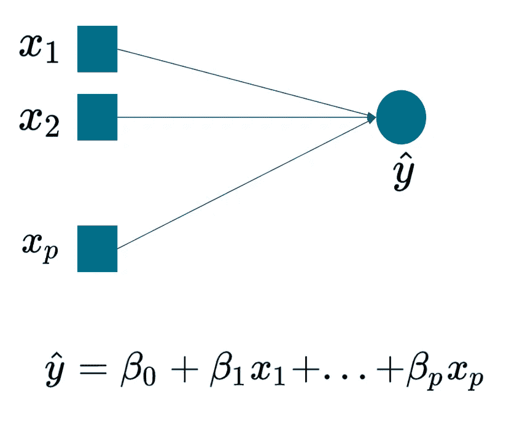

# 解释 ML 模型是死路一条吗？

> 原文：<https://towardsdatascience.com/is-interpreting-ml-models-a-dead-end-f5b9dd78ba77>

## 解释过程可以脱离模型架构

解释 ML 模型是死路一条吗？(图片由作者提供)

如今，模型是我们理解周围现象的主要工具，从恒星的运动到社会群体的观点和行为。随着机器学习(ML)理论及其技术的发展，我们已经拥有了科学史上最强大的工具来理解现象并预测给定条件下的结果。到目前为止，我们已经能够检测欺诈、设计运输计划，并在自动驾驶汽车方面取得了进展。

随着机器学习对一种现象建模的潜力，其复杂性的问题已经超越了其民主化。虽然许多模型无疑有能力给出我们正在寻找的预测，但由于缺乏计算能力或软件可用性有限等原因，它们在许多行业中的使用仍然有限。另一个很少讨论的限制因素是，据称不可能解释高度复杂的黑盒或深度学习(DL)模型。在这种说法中，许多从业者发现自己在较低的预测准确性和较高的模型可解释性之间做出了妥协。

我们在统计或机器学习的方法论方面取得了前所未有的进展，从经典的统计范式到当前的深度学习解决方案。可解释性的问题随着方法的演变而出现，在解释模型的能力和预测的准确性之间画出一个反比关系。这种权衡已经将社区分成了两部分，一部分实现模型进行解释，另一部分采用模型提供准确的预测。这种分离似乎为用户建立了一个死胡同，迫使他们采取两种途径之一:可解释性或准确性。

## 真的是死路一条吗？

模型就是机器。就像汽车或计算机一样，机器学习模型是由一些材料(数据和算法)构建的机器，通过向它们提供输入来获得输出。当我们驾驶汽车时，我们结合不同的输入特征，如齿轮，方向盘位置和加速器，汽车机器会做一些事情，它会开始移动或不移动，取决于这些特征的组合。同样，当我们使用计算机时，我们有鼠标、键盘或麦克风，我们操作它们向计算机提供输入，计算机将在屏幕或扬声器上显示相应的输出。虽然我们中的大多数人不是会详细了解汽车或计算机内部每个部件的工程师，但我们通常能够通过理解输入组件和预期输出之间的关系来学习如何操作它们。因此，如果我们的模型就是这样的机器，那么理解或解释它们可能与它们内部的工程无关。

直到现在，统计学的经典范式告诉我们，解释一个模型就是围绕这个模型的系数建立一个故事。我们有这样的例子，如线性回归，其中的解释是关于模型的贝塔系数的上下文，或逻辑回归，其中所谓的“优势比”是系数的最佳安排，以找到关于模型的叙述。在这种概念下，解释一个可能由数百层、数百万个系数组成的深度学习模型，看起来确实像是一个死胡同。事实证明，在计算最大似然模型预测的数字周围寻找叙述，相当于理解晶体管的基本操作来解释计算机。我们也许能够重新定义解释模型的过程。

线性模型的架构(图片由作者提供)

深度学习模型的架构示例。(图片由作者提供)

## 让我们问神经网络我们会问物理机器什么:如果会发生什么？

我们在这里关注一个实用而有效的解决方案来实现模型的可解释性，而不管下面构建的数学方程或算法:通过询问如果发生什么来玩它们。这种类型的解释通常被称为“假设”。因为我们的模型在给定特征组合作为输入的情况下提供预测，所以我们有能力设计不同的输入组合并观察模型给出的输出。如果我们用线性模型来做这件事，输入的线性变化将提供输出的线性变化。如果我们用一个 DL 模型来做这件事，输入的线性变化将揭示输出的非线性变化的类型。这是模型的“假设”解释发生的时候。请注意，模型的用户能够定义输入模型的输入组合，以便将观察到的变化联系起来。输入特征的这种组合是受背景知识支配的问题，而不再是构建模型所需工程的问题。

## 一个例子

这里，我们描述了一个模型的例子，该模型将芒果果实的光谱信号作为输入来预测它们的干物质含量。这个例子在现代质量控制过程中非常典型，在这种过程中，使用收集信号的设备监控产品，并检索产品的化学信息预测。输入可以被可视化为信号，其中信号的每个波长是一个输入特征。利用它们，预测被计算，呈现化学信息的连续值。我们这里有一个可视化，使用相同的数据提供线性和 DL 模型的解释。定义一个波长的线性变化范围，以观察预测化学值的变化。自然，线性模型的预测值的变化是线性的。在 DL 模型的情况下，我们检测到由输入特征的线性变化在预测中引起的非线性类型。使用 DL 模型，化学家现在知道干物质含量在波长 993 nm 处呈抛物线变化。

线性模型解释示例。输入在波长 933 处的线性变化(左)和预测值的线性变化(右)。颜色代表变化的程度。(图片由作者提供)

DL 模型解释示例。输入波长 933 处的线性变化(左)和预测值中检测到的抛物线变化(右)。颜色代表变化的程度。(图片由作者提供)

> 解释过程不是讲述模型的系数

解释过程不是讲述模型的系数。它超越了模型下的架构或引擎。其他的机器学习模型，不管有多深，都可以以假设的方式或者其他方式使用。解释模型的过程传统上被限制在叙述模型架构的数字，关闭了有效使用预测模型来理解它的大门。假设型解释可能是最基本的解释工具。根据对模型的理解，可以定义许多其他策略。

关于不同类型的统计模型和算法的模型解释的一些见解可以在[中找到。解释模型是为了人类，而不是为了计算机](/interpreting-the-model-is-for-humans-not-for-computers-9a857011ff3)。模型解释的过程可以从模型构建和模型部署的阶段中分离出来。虽然模型构建阶段负责寻找将我们的输入特征连接到期望输出的基本机制的近似值，但是模型构建之后的模型解释阶段是一个需要专家研究员的知识的过程，该专家研究员能够向模型提出精确的问题，以便理解模型正在创建的连接。在这些问题的驱动下，我们可以创建探索性的工具，比如示例中展示的可视化，这使得研究者和模型之间能够进行交互。

致谢:

用于 DL 示例的 CNN 模型取自库[https://github . com/Dario-passos/deep learning _ for _ VIS-NIR _ Spectra](https://github.com/dario-passos/DeepLearning_for_VIS-NIR_Spectra)