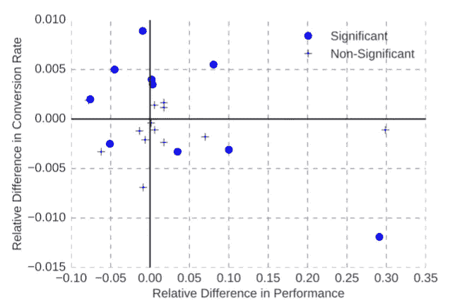

# 我的模型真的更好吗？

> 原文：<https://towardsdatascience.com/is-my-model-really-better-560e729f81d2>

## 为什么理论上看起来不错的 ML 模型不能保证在生产中很好地工作

弗洛里安·施梅兹在 [Unsplash](https://unsplash.com?utm_source=medium&utm_medium=referral) 上的照片

如今，一篇典型的 ML 研究论文是这样写的:

> 我们提出了一个新的模型架构 X。我们证明了 X 优于 SOTA Y %。我们的结论是 X 比现在的 SOTA 更好。我们的代码可在线获取。

这也是学术研究通常结束的地方。然而，从生产的角度来看，这远远不够。不能保证一个在纸面上看起来不错的模型实际上会成为一个好的生产模型。

在本帖中，我们将深入探讨在构建模型时所面临的额外挑战，不仅是为了研究，也是为了生产。我们将学习:

*   为什么离线性能不能保证在线性能，
*   为什么所有的错误都不一样，
*   为什么，除了对性能建模，延迟和可解释性也很重要
*   为什么你不一定要相信 ML 排行榜？

让我们开始吧。

## 离线性能不能保证在线性能

ML research 专注于*的离线性能*:该模型在静态的历史测试集上表现如何？另一方面，在 ML 生产中，我们关心的是在线性能:一旦模型被部署并对真实世界中的真实用户采取行动，我们的业务表现如何？

举个例子，

*   在欺诈检测中，合适的离线指标可以是 ROC-AUC，合适的在线指标可以是错过的欺诈交易的退款损失。
*   在搜索排名中，合适的离线度量是 NDGC，合适的在线度量可以是点击率。
*   在广告排名中，一个合适的离线指标也是 NDGC，但我们可能希望衡量在线广告总收入。

几个工业 ML 研究团队，如 Booking.com 的[网飞](https://ojs.aaai.org/index.php/aimagazine/article/view/18140)和[已经发现，线下模型性能的改善并不能保证模型在网上确实更好。一些线下表现较好的机型，线上表现甚至更差。Booking.com 研究报告中的线下和线上表现散点图显示两者完全没有相关性:](https://blog.kevinhu.me/2021/04/25/25-Paper-Reading-Booking.com-Experiences/bernardi2019.pdf)

更好的离线性能(x 轴)并不能保证更好的在线性能(y 轴)。来源:Bernardi 等人，KDD 2019 ( [链接](https://blog.kevinhu.me/2021/04/25/25-Paper-Reading-Booking.com-Experiences/bernardi2019.pdf))

为什么更好的离线性能不能保证更好的在线性能？

原因之一是离线指标只是我们实际想要优化的业务指标的一个*代理*。这两者可能有关联，但这种关联并不完美。如果一个模型过度适应代理度量，那么它可能会偏离真正感兴趣的度量。这对于深度神经网络可能特别成问题，因为它们有大量的自由参数。网飞论文的作者警告说:

> “如果深度学习模型被指定解决错误的问题，它会比功能较弱的模型更准确地解决问题。”

提高代理指标会有所帮助。例如，来自 [YouTube](https://dl.acm.org/doi/10.1145/2959100.2959190) 的研究人员发现，优化观看时间的模型比优化点击更有效，因为优化点击的模型最终会偏向于对用户几乎没有价值的点击诱饵视频。

## 错误不是错误

代理指标的另一个问题是，我们做了一个隐含的假设，即产生错误的人群之间没有质的区别。然而，这个假设并不总是成立的。错误并不都一样。

例如，在电子商务欺诈检测中，产品速度至关重要。速度更高的产品(如数字视频游戏)的假阴性更有影响力，因为不良行为者可以在短时间内造成巨大的破坏。因此，一个整体错误较少但高速产品错误较多的模型可能会导致更多的坏账，从而导致更糟糕的业务表现。

另一个领域，其中的错误已被证明有质的差异是广告排名。来自[微软](https://chbrown.github.io/kdd-2013-usb/kdd/p1294.pdf)的研究人员发现，与高概率错误相比，低概率错误对商业利益指标广告收入有更大的影响。这是因为向用户展示一个不相关的广告比忽略一个相关的广告要糟糕得多:在最糟糕的情况下，用户可能会恼怒到离开。

## 延迟很重要

ML 研究论文很少讨论潜伏期。毕竟测试集是固定的，我们只需要评估一次就可以在论文中报出一个数字。

然而，在生产中，模型需要作为每天被数百万甚至数十亿用户使用的服务的一部分来运行。面向用户的应用程序中的一个关键指标是*单请求延迟*，这是单个用户请求从服务器收到响应所花费的时间。

模型的延迟有多重要？在一项实验中，Booking.com 大学的研究人员在他们的服务中引入了合成延迟，以便找到答案。结果呢？从统计数据来看，延迟与用户转化率之间存在显著的负相关关系。延迟增加 30%会损失大约 0.5 个百分点的转化率。“我们业务的相关成本”，研究人员在他们的论文中写道。

作者报告说，基于这一发现，Booking.com 优化了他们的 ML 系统的延迟，使用内部建立的简单线性模型，具有最少的功能集。

## 可解释性很重要

纸上的模型和生产中的模型的区别在于，生产中的模型会采取影响真实用户的行动。误报和漏报会导致问题升级。如果发生这种情况，我们最好能解释为什么我们的模型会出错。*因此，可解释性*是另一个在生产中很重要的模型属性，但在学术论文中并不经常讨论。

一般来说，模型越复杂，就越难解释它的预测。对于一个简单的线性模型，模型权重本身编码了模型所关注的内容，并可以让我们了解为什么会出现某些错误。对于随机森林或增强树来说，这变得更加棘手，对于深度神经网络来说更是如此。像 [SHAP](https://github.com/slundberg/shap) 这样的工具可以帮助解释复杂模型的决策，但是增加了延迟。正如我们之前看到的，在面向用户的应用中，延迟非常重要。

如果可解释性*和*延迟是硬需求，那么简单的线性模型可能是生产的最佳选择，即使建模性能可能不如更复杂的模型。

## 看别处效果和 ML 排行榜

ML 研究中的一个常见做法是在同一个测试集上评估多个模型，以便比较它们的性能。这种做法的问题是，仅仅由于随机的机会，一些模型被认为比其他模型更好，即使它们彼此一样好。

换句话说，只要我们在测试集上尝试足够多的模型，我们迟早会找到一个比我们只是偶然试图“击败”的模型更好的模型。这也被称为 [*望向别处效应*](https://medium.com/towards-data-science/the-statistics-of-the-improbable-cec9a754e0ff) 。

通常，离线模型性能的差异越大，测试集越大，结果的统计意义就越大。确切的统计显著性可以用一个叫做*多重假设检验*的统计框架来计算。

使用这个框架，人工智能研究人员劳伦·奥克登-雷纳[计算了](https://laurenoakdenrayner.com/2019/09/19/ai-competitions-dont-produce-useful-models/)一场关于医学图像分割问题的 Kaggle 竞赛中排行榜的统计显著性。结果呢？在给定数据量和分数差异的情况下，模型#1 和模型#192 之间的差异可以显示为具有统计学意义。等级 1-191 之间的所有型号？从统计学的角度来说，我们不能断定其中任何一个比另一个好！

回到题目中提出的问题:*我的模型真的更好吗？可能不是，可能只是偶然看起来更好。*

## 外卖:给 ML 从业者的一些建议

让我为你的下一个 ML 项目总结一些实用技巧:

*   对离线性能指标有所保留。将它们视为健康检查，而不是生产性能的保证。相反，依靠随机对照试验来评估你的模型在生产中的表现。
*   除了离线性能，还要测量模型的延迟。延迟与用户体验有明显的负相关性，除非模型可以通过大幅提高性能来抵消负面影响，否则您会希望避免增加延迟。如果可解释性*和*延迟是硬约束，那么简单的线性模型可能是最好的方法。
*   错误并不都一样。研究来自不同人群的不同类型的错误对您试图优化的业务指标的影响。具有更好 AUC 的模型可能会犯更少但更严重的错误，从而导致更差的整体性能。
*   不要盲目依赖 ML 竞赛排行榜上的顶级模特。可能只是运气好。

## 在你走之前…

*享受这个内容？请留下一些掌声(你最多可以留下 50 个)，这有助于我保持光明。在 Medium 上关注/订阅，这样你就不会错过我以后写的新帖。* [*成为中等会员*](https://medium.com/@samuel.flender/membership) *这样你就可以无限制的查看文章了。并在*[*LinkedIn*](https://www.linkedin.com/in/sflender/)*和/或*[*Twitter*](https://twitter.com/samflender)*上关注我！*