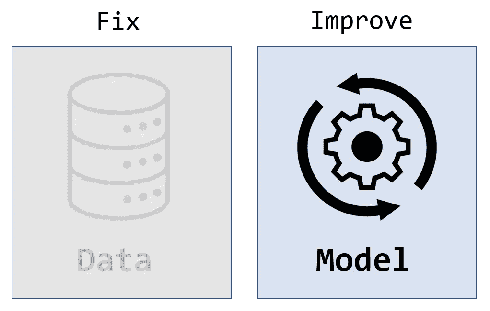
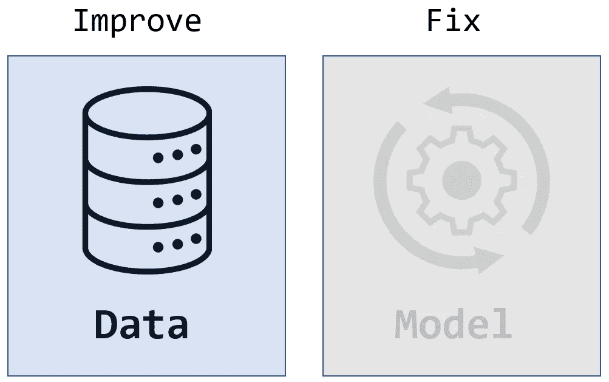

# “小数据”是数据科学的下一个大事件吗？

> 原文：<https://towardsdatascience.com/is-small-data-the-next-big-thing-in-data-science-9acc7f24907f>

## 人工智能先驱吴恩达预测，未来十年将围绕以数据为中心的人工智能。如果我们有 50 个精心制作的样本，我们可能不需要几百万个嘈杂的样本。

我们可能正处于一个小数据时代的边缘【图片由 [Daniel K Cheung](https://unsplash.com/@danielkcheung?utm_source=medium&utm_medium=referral) 在 [Unsplash](https://unsplash.com?utm_source=medium&utm_medium=referral) 上拍摄】

在过去二十年左右的时间里，我们生活在一个“大数据”时代。随着存储容量和计算能力变得越来越便宜，我们可以存储和处理大量数据以产生新的见解。在谷歌、亚马逊和脸书的成功推动下，**大规模数据分析**取得了实质性突破，数据驱动决策成为许多企业的当务之急。

我们目睹了巨大的神经网络，有数百万个参数需要调整。大量实时处理的社交媒体信息流。从高频传感器和用户日志中提取数 Pb 的细粒度信息，存储在巨大的服务器群中。突破是丰富而令人振奋的。

毫无疑问，这样的**大数据趋势**将会持续。只要有更多的数据要收集，我们就会找到新的方法来利用它。例如，自然语言处理已经成熟，但视频分析仍然是一个绿色领域，仍然等待技术进步来推动发展。

尽管如此，硅谷之外的世界往往会被忽视。数以百万计的中小企业(和其他组织)正在处理需要全面数据解决方案的问题。这些组织只是想从他们的**小数据集中提取有价值的见解——利用机器学习的最新技术——而不依赖于怪异的大数据集。对他们来说，这一时刻可能已经到来。**

为了使潜在的应用更加具体，只需考虑以下几个例子:

*   **成本会计**:预测定制机器的成本
*   **医疗保健**:在 X 射线图像上识别肿瘤
*   **制造**:自动检测生产线上的缺陷

这些例子的相关性是显而易见的，因为数据可以发挥关键作用。然而，这些并不一定是数十亿数据点随时可用的任务，尤其是在考虑罕见的缺陷或疾病时。为了充分利用现代机器学习，需要一个不同的角度。

制造业是可能受益于数据驱动的缺陷检测的领域之一，然而相关缺陷实例的数量对于有效的机器学习来说往往太少【图片由 [Mulyadi](https://unsplash.com/@mullyadii?utm_source=medium&utm_medium=referral) 在 [Unsplash](https://unsplash.com?utm_source=medium&utm_medium=referral) 上拍摄】

# 范式转变？

引进**吴恩达**。他创建了谷歌大脑，在斯坦福大学任教，共同创建了在线学习平台 Coursera(包括非常受欢迎的“机器学习”课程)，并率先使用 GPU 进行机器学习，可以肯定地说他有一些可信度。当他发现数据科学中的一个新兴趋势时，倾听是值得的。

安德鲁认为——为了释放人工智能的全部潜力——是时候开始关注数据的*质量*，将这一运动命名为**以数据为中心的人工智能**。在过去的几年里，社区的焦点一直是以*模型*为中心，重点是设计、微调和改进适用于各种任务(文本挖掘、图像识别等)的算法。).

以模型为中心的研究非常富有成果，最终产生了许多高质量的架构。然而，要保持势头，仅仅设计和改进算法是不够的。对于真正的进展，模型输入的**质量应该与转换的质量相匹配。**

我们将更深入地重新审视以数据为中心的人工智能，但首先我们必须解决目前主导该领域的以模型为中心的人工智能。

# 以模型为中心的人工智能

在以模型为中心的人工智能中，数据被假设为给定的。重点是改进模型，试图从固定数据集获得最佳性能[图片由作者提供]

传统上，数据被认为是算法的给定输入。主要问题是什么**机器学习算法**从数据中榨取最多。我们需要梯度增强树还是神经网络？多少层，哪些激活函数，哪些梯度下降算法？过多的选项给确定合适的架构带来了许多挑战。大型数据集允许克服噪音和缺失数据。

吴恩达假设以模型为中心的人工智能现在已经达到了一个饱和点。许多悬而未决的问题已经解决，广泛评估了各种任务的架构。例如，谷歌的自然语言处理算法 BERT 已经在英语语言上进行了训练。对于另一种语言，我们可以使用 BERT 体系结构作为起点——在这个过程中进行调整和剪裁——而不是从头开始。

以模型为中心的 AI，通过才华和经验，给我们带来了很多。对于许多常见的问题，我们现在已经有了合适的算法，这些算法已经被经验证明能够很好地工作。这意味着我们可以对某些问题类别使用现有的模型，而不是为我们遇到的每个问题实例重新发明轮子。结合可用的工具，人们不再需要成为算法专家来部署行业就绪的人工智能。

显然，以模型为中心的人工智能不是一条死胡同——算法的进步将永远继续。然而，开源库和示例架构对解决人工智能问题大有帮助。就改进潜力而言，现在**在数据方面比在模型方面有更多的收获。**

# 以数据为中心的人工智能

在以数据为中心的人工智能中，模型或多或少是固定的。相反，重点是提高数据质量，旨在深入理解小数据集[图片由作者提供]

尽管每天都有令人眼花缭乱的数据产生，但这些数据的**质量**可能相当差(任何数据科学家都知道)。缺失数据、输入或测量错误、重复、不相关的预测因素——这些都使得训练模型变得困难。足够大的数据集可能会克服这样的障碍，然而一个既小又质量差的数据集是一个灾难。

此外，我们通常只对数据的特定**子集感兴趣。一千万张健康肺的图像或者一堆非欺诈性交易对于手头的用例帮助不大。即使数据集乍一看足够大，我们也经常处理严重的 [**类不平衡**](/precision-and-recall-a-comprehensive-guide-with-practical-examples-71d614e3fc43) ，只有很少有意义的例子可以学习。**

承认数据质量的重要性并不新奇——众所周知的是亚当****垃圾输入=垃圾输出****。数据清理通常是临时进行的，依赖于单个数据科学家的独创性。更糟糕的是，预先确定哪些数据属性(异常值、缺失值、转换等)并不清楚。)对模型性能的影响最大，导致令人沮丧的反复试验循环。**

**相比之下，以数据为中心的人工智能传播一种**系统化和系统化的方法** **来提高数据质量**，针对对性能影响最大的数据段。通过识别显著特征、消除噪声、分析错误和一致地标记，训练的有效性可以显著提高。关键是推广和自动化这样的程序。**

**到目前为止，重心一直在改进模型上，而不是改进数据本身。以数据为中心的人工智能旨在改变这一点。**

# **向小数据的转变**

**系统地提高数据质量的概念是有道理的，但是具体来说，我们能期待什么样的发展呢？向“**小型智能数据**的转变是关键，关注高质量的数据和可解释的例子。**

**经过验证的架构只需做一些修改就可以重用，或多或少地修复模型。在这种情况下，数据本身成为感兴趣的对象。通过固定一个变量(模型)，对另一个变量(数据)的分析就容易多了。然而，很难从大型数据集中找到意义。深入的人体分析需要小而全面的数据集。**

**以数据为中心的人工智能将需要文化上的重大**转变。**我们将花更多的时间对数据集进行标记和切片，而不是摆弄层和超参数。因为这些是我们大多数人不一定喜欢的任务，所以这种文化转变不可等闲视之，即使长期愿景包括单调乏味的清洁任务的自动化。**

**最后，以数据为中心的人工智能传播了一种关于提高数据质量的系统方法。可以区分两个主要方向:**

*   ****开发检测不一致性的工具。**要真正扩展和推广数据改进，必须自动化检测和清理，摆脱耗时且容易出错的手动数据清理例程。至关重要的是，清洁操作应该是一致的和可解释的。**
*   ****利用领域知识。**为了准确解释所传达的信息，需要专家仔细检查数据集。需要精确和准确的特征和阈值来充分利用数据，以及识别潜在的遗漏示例。**

**人类的可解释性是这些趋势的核心，促使人们转向小的、可解释的数据集。吴恩达声称，50 个优秀的例子可以同样好地训练一个 ML 算法，而不是数百万个嘈杂的例子。显然，这些例子的设计工作将是实质性的，每一个例子都会产生有意义的贡献。**

**实际上，想要的数据可能并不总是容易得到。为了扩充现有数据(基于特征分析，我们可以识别快速获胜)，一个有希望的方向是 [**生成式 AI**](/bring-your-childhood-drawings-to-life-within-seconds-a-demo-of-metas-creative-ai-1e8695d9f3b6) ，能够构建与现实无法区分的合成数据。基于例子和领域知识，我们可以精确地构造具有我们需要的属性的人工例子，例如，一种罕见的缺陷的图像或特定的股票市场跳跃。**

**向小数据的转变将对数据科学产生巨大影响。它为许多没有大量相关数据集的问题打开了大门。它允许生成高质量的人工数据集。它与已经获得牵引力的可解释的人工智能运动相一致。事实上，这将是该领域的一个**根本性突破**。**

# **关键要点**

**随着过去几十年来机器学习算法的许多突破，似乎已经达到了一个饱和点。我们有大量的(开源)库和经过验证的架构来处理各种任务，因此模型可以在很大程度上保持固定。考虑到这一点，以数据为中心的人工智能可能是下一个突破，重点是在最重要的地方提高数据质量的系统方法。**

**当前的训练方法通常依赖于足够大的集合来克服噪声和缺失数据。然而，许多现实世界的问题只产生**小数据集**。如果我们通过仔细检查例子来精心制作代表性的输入，小集合可能足以训练高质量的模型。为了实现这一点，人类的专业知识和系统的改进方法对于实现可推广的进步都是至关重要的。**

**具体来说，数据科学的不久的将来可能需要重新关注一些活动，如(I)专家分析，(ii)一致标记，(iii)噪声去除，(iv)误差校正，(v)特征工程，以及(v) [人工数据生成](https://medium.com/mlearning-ai/top-data-science-trends-for-2022-what-do-ceos-have-to-say-86d3d3ea6e9f)。**领域专业知识和人的可解释性**将在小型数据集的深度评估中占据更重要的位置，但长期目标是提供**系统化和自动化的解决方案**来调查和提高数据质量。**

**以数据为中心的人工智能可能会在很大程度上改变许多数据科学家的日常任务。快速的胜利会积累竞争优势，现在看来，大多数胜利可以通过改进数据而不是算法来实现。**

# **进一步阅读**

**               **