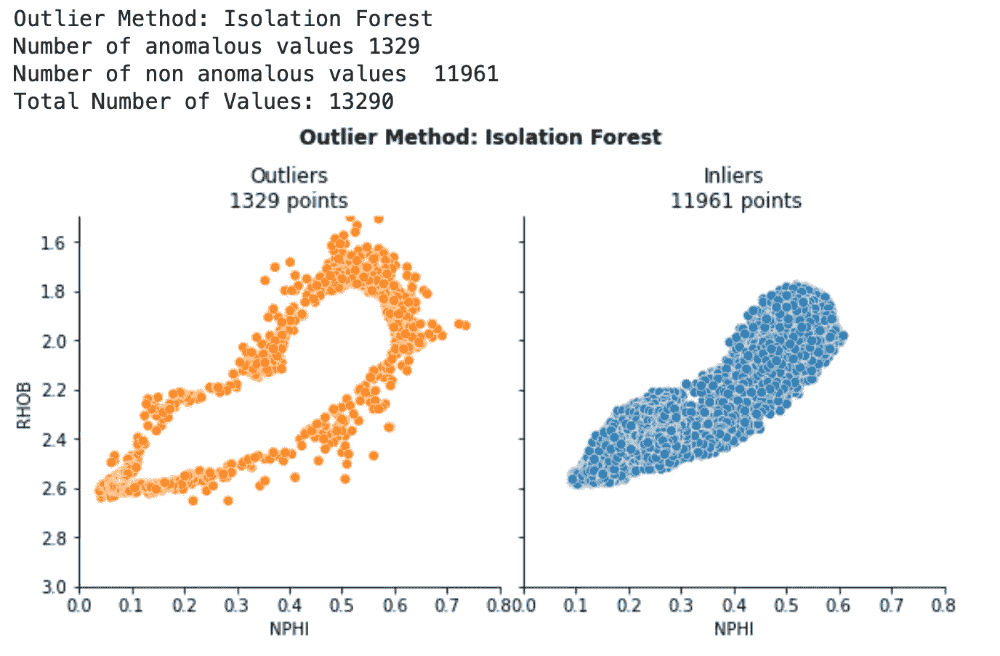
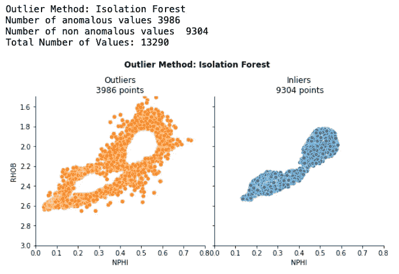
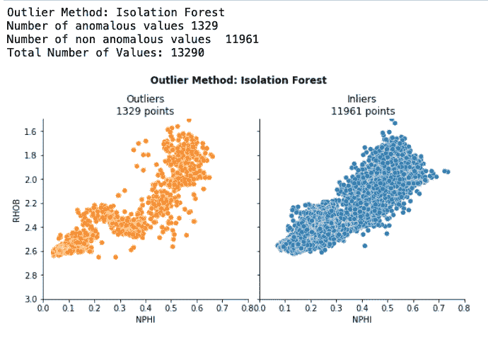
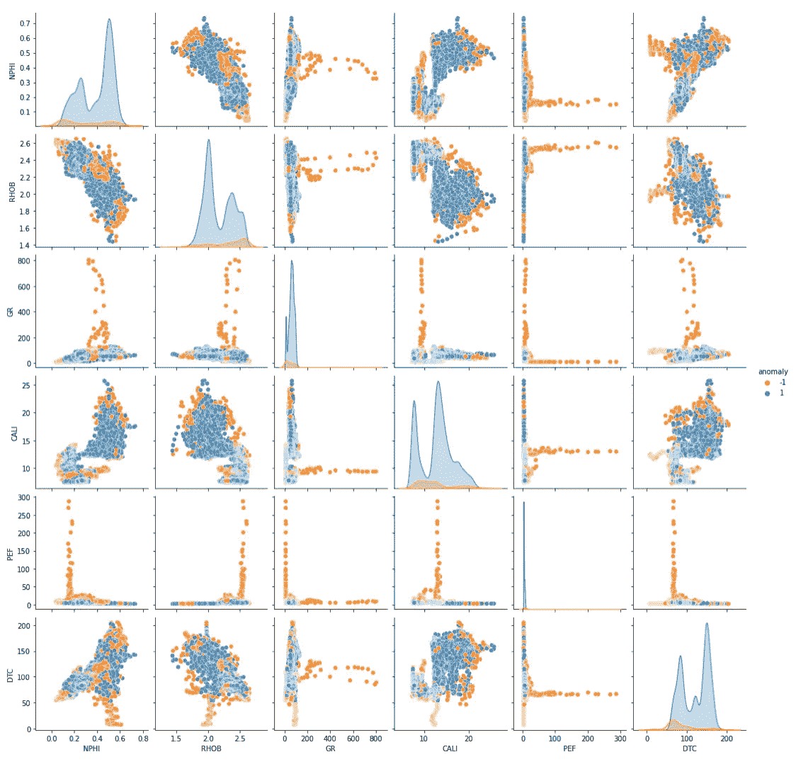

# 隔离林—使用 Python 自动检测异常

> 原文：<https://towardsdatascience.com/isolation-forest-auto-anomaly-detection-with-python-e7a8559d4562>

## 使用 Python 的 Scikit-learn 库检测异常值

照片由 pix abay:[https://www . pexels . com/photo/black-tree-near-body-of-water-35796/](https://www.pexels.com/photo/black-tree-near-body-of-water-35796/)

[隔离森林](https://scikit-learn.org/stable/modules/generated/sklearn.ensemble.IsolationForest.html)是一种流行的无监督机器学习算法，用于检测数据集内的异常(离群值)。异常检测是任何机器学习和数据科学工作流的关键部分。没有在早期识别的错误值会导致机器学习模型的预测不准确，因此会影响对这些结果的解释。

在这篇短文中，我们将介绍算法的基础，以及如何使用 [Scikit-learn](https://scikit-learn.org/stable/index.html) 用 [Python](https://www.python.org/) 轻松实现它。

但是首先，我们需要知道异常值到底是什么。

# 什么是离群值？

处理真实世界的数据时，经常会遇到超出正常趋势的数据点。这些通常被称为**异常值**或**异常值**。检测异常非常有用，原因有很多，包括:

*   检测欺诈性信用卡交易
*   识别可能表明未经授权访问的异常网络流量
*   探测深空图像中有可能成为新星的异常点/像素
*   检测医学扫描中的异常“特征”

在测井测量和岩石物理数据中，异常值可能由于被冲刷的钻孔、工具和传感器问题、罕见的地质特征以及数据采集过程中的问题而出现。

在数据科学/机器学习工作流的早期识别和调查异常值是非常重要的，因为它们可能导致机器学习模型的预测不准确。

Python 中有许多算法，无论是有监督的还是无监督的，都可以用来检测这些异常。

在监督学习的情况下，我们可以使用我们已经检查过并标记为好或坏的数据样本来训练模型，并使用它来预测新的数据样本是否异常。

然而，这些方法具有许多问题，包括减少计算时间所需的小数据集大小和低维度，并且异常在标记的数据中可能是罕见的，导致检测到假阳性。

其中一种无监督的方法叫做**隔离森林。关于该算法如何工作的全部细节可以在刘等人(2008)的原始论文中找到，并且可以在这里免费获得**<https://cs.nju.edu.cn/zhouzh/zhouzh.files/publication/icdm08b.pdf>**。******

# ****隔离林方法****

****[隔离森林](https://scikit-learn.org/stable/modules/generated/sklearn.ensemble.IsolationForest.html)是一种基于模型的异常值检测方法，它试图使用决策树集合将异常从其余数据中隔离出来。它不依赖于在标记数据上训练模型。****

****该方法选择一个要素，并在最小值和最大值之间随机分割数据。然后，该过程沿着决策树继续进行，直到数据中所有可能的拆分都已完成，或者达到拆分数量的限制。****

****任何异常/异常值都将在流程的早期被分离出来，使其易于识别并与其余数据隔离。****

****用这种方法检测异常假设:****

*   ****异常的存在是很小的****
*   ****异常值不同于正常值****

****下图展示了一个非常简单的例子，它使用了一个变量——体积密度(RHOB)和一棵树。****

********

****测井数据隔离林示例。图片由作者提供。****

****由于我们使用的是随机拟合数据的树的集合(组),因此我们可以取出现异常值的树内深度的平均值，并对该数据点的“异常值”进行最终评分。****

## ****隔离林的优势****

****与传统的基于距离和密度的模型相比，隔离林有许多优势:****

*   ****减少计算时间，因为异常情况可以尽早快速识别****
*   ****可轻松扩展到高维度和大型数据集****
*   ****在一定程度上对数据进行子采样，这是其他方法无法做到的****
*   ****包含不相关的功能时有效****

# ****隔离林 Python 教程****

****在下面的例子中，我们将看到如何用 [seaborn](https://seaborn.pydata.org/) 增强散点图。****

## ****数据源****

****为此，我们将使用一个更大数据集的子集，该数据集曾被用作 Xeek 和 FORCE 2020 *(Bormann 等人，2020)* 举办的机器学习竞赛的一部分。它是在挪威政府的 NOLD 2.0 许可下发布的，详细信息可以在这里找到:[挪威开放政府数据许可(NLOD) 2.0](https://data.norge.no/nlod/en/2.0/) 。****

****完整的数据集可以通过以下链接获得:【https://doi.org/10.5281/zenodo.4351155[。](https://doi.org/10.5281/zenodo.4351155)****

****本文中的所有示例都可以用于任何数据集。****

## ****导入库和数据****

****对于本教程，我们将需要从 Scitkit-Learn 导入 [seaborn](https://seaborn.pydata.org/) 、 [pandas](https://pandas.pydata.org/) 和 [IsolationForest。](https://scikit-learn.org/stable/modules/generated/sklearn.ensemble.IsolationForest.html)****

****导入这些数据后，我们接下来需要加载我们的测井数据。在本例中，数据存储在一个 CSV 文件中，包含单井的测量值:15/9–15。****

****如果您不熟悉这种类型的数据，请不要担心，本教程中展示的技术同样可以应用于其他数据集。****

****这将返回以下数据帧摘要:****

********

****上面的总结只显示了文件中的数字数据。如果我们想要查看数据帧中的所有特性，我们可以调用`df.info()`，这将通知我们有 12 列数据，以及不同级别的完整性。****

********

****数据框内的特征概述。图片由作者提供。****

****与许多机器学习算法一样，我们需要处理丢失的值。如上所示，我们有几列，如 NPHI(中子孔隙度)有 13，346 个值，伽马射线有 17，717 个值。****

****处理这些缺失值的最简单方法是删除它们。尽管这是一个快速的方法，但也不应该盲目地去做，你应该尝试去理解丢失值的原因。在构建机器学习模型时，删除这些行会导致数据集减少。****

****如果你想了解更多关于处理缺失数据的信息，我建议你看看我的这些文章:****

*   ****[在机器学习之前，使用 missingno Python 库识别和可视化缺失数据](/using-the-missingno-python-library-to-identify-and-visualise-missing-data-prior-to-machine-learning-34c8c5b5f009)****
*   ****[在岩石物理机器学习之前识别和处理缺失的测井数据](/identifying-and-handling-missing-well-log-data-prior-to-machine-learning-5fa1a3d0eb73)****

****要删除丢失的行，我们可以调用:****

****如果我们再次调用`df`，我们将会看到每一列的值减少到了 13，290。****

********

****移除空值后数据帧中的要素概述。图片由作者提供。****

# ****用 Scikit-Learn 构建隔离林模型****

****从我们的数据框架中，我们需要选择用于训练隔离森林模型的变量。****

****在这个例子中，我将只使用两个变量(NPHI 和 RHOB)。实际上，我们会使用更多，稍后我们会看到一个例子。使用两个变量可以让我们看到算法做了什么。****

****首先，我们将创建一个列名列表:****

****接下来，我们将创建隔离林模型的一个实例。这是通过首先创建一个名为`model_IF`的变量，然后将它赋给`IsolationForest()`来完成的。****

****然后我们可以为我们的模型传入一些参数。我在下面的代码中使用的是:****

*   ******污染**:这是我们期望被视为异常值的总数据量。我们可以传入一个 0 到 0.5 之间的值，或者将其设置为 auto。****
*   ******random_state** :这让我们可以控制分裂树的随机选择过程。换句话说，如果我们用相同的数据和参数重新运行这个模型，并且这个参数的值是固定的，那么我们应该得到可重复的输出。****

****一旦我们的模型被初始化，我们就可以用数据来训练它。为此，我们调用`.fit()`函数，并将其传递给我们的 dataframe ( `df`)。当我们传递 dataframe 参数时，我们还将选择我们之前定义的列。****

****拟合模型后，我们现在可以创建一些预测。为此，我们将在数据框架中添加两个新列:****

*   ****`anomaly_scores`:通过调用`model_IF.decision_function()`生成，提供数据集中每个样本的异常分值。分数越低，样本越不正常。负值表示样本是异常值。****
*   ****`anomaly`:调用`model_IF.predict()`生成，用于标识一个点是**离群点(-1)** 还是**内界点(1)******

****一旦发现异常，我们就可以查看我们的数据框架并看到结果。****

********

****显示异常检测结果的熊猫数据框。值为 1 表示数据点是好的。图片由作者提供。****

****在上面的返回值中，我们可以看到原始输入要素、生成的异常得分以及该点是否为异常。****

# ****使用 matplotlib 可视化异常数据****

****查看数值并尝试确定该点是否已被识别为异常值可能会很乏味。****

****相反，我们可以使用 seaborn 生成一个基本图形。我们可以使用我们用来训练模型的数据，并在视觉上将它分成离群值或内联值。****

****这个简单的函数旨在生成图表，并以文本形式提供一些额外的指标。该函数采用:****

*   ****`data`:包含数值的数据帧****
*   ****`outlier_method_name`:我们正在使用的方法的名称。这只是为了展示的目的****
*   ****`xvar`、`yvar`:我们要分别绘制在 x 轴和 y 轴上的变量****
*   ****`xaxis_limits`、`yaxis_limits`:x 轴和 y 轴范围****

****一旦定义了函数，我们就可以传入所需的参数。****

****这产生了下面的图。****

********

****Seaborn 散点图显示了隔离林模型确定的异常值和内部值。图片由作者提供。****

****我们可以马上知道有多少值被识别为异常值，以及它们位于何处。由于我们只使用了两个变量，我们可以看到，我们基本上已经在数据边缘的点和数据中心的点之间形成了分离。****

## ****增加隔离林污染值****

****前面的示例使用 0.1 (10%)的值作为污染参数，如果我们将该值增加到 0.3 (30%)会怎么样？****

****当我们运行上面的代码时，我们得到了下面的图。我们可以看到更多的点被选择并识别为异常值。****

********

****Seaborn 散点图显示了隔离森林模型确定的 30%污染的异常值和内部值。图片由作者提供。****

## ****我们如何知道设置哪个污染值？****

****通过设置污染值，我们可以确定哪些百分比的值应该被识别为异常值，但选择该值可能会很棘手。****

****选择这个值没有严格的规则，它应该基于围绕数据及其预期应用程序的领域知识。****

****对于这个我非常熟悉的数据集，我会考虑其他特征，如井径和δ-rho(DRHO ),以帮助识别潜在的不良数据。****

# ****对隔离林使用 2 个以上的功能****

****现在，我们已经看到了使用只有两个变量的隔离林的基础，让我们看看当我们使用更多的变量时会发生什么。****

********

****Seaborn 散点图显示了隔离森林模型使用多个输入要素和 10%污染确定的异常值和内界值。图片由作者提供。****

****我们现在看到，被识别为异常值的点在散点图上更加分散，并且在一组核心点周围没有硬边界。****

## ****用 Seaborn 的配对图显示异常值****

****我们可以看看我们用过的所有变量，而不是只看两个变量。这是通过使用 seaborn pairplot 来完成的。****

****首先，我们需要设置调色板，这将允许我们控制在情节中使用的颜色。****

****然后，我们可以调用`sns.pairplot`并传入所需的参数。****

****它返回:****

********

****隔离森林后数据集中所有要素的 Seaborn pairplot。橙色点表示异常值(-1)，蓝色点表示内部值(1)。图片由作者提供。****

****这为我们提供了一个更好的数据概览，我们现在可以清楚地看到其他特性中突出显示的一些异常值。尤其是在 PEF 和 GR 特性中。****

# ****摘要****

****隔离森林是一种易于使用和理解的无监督机器学习方法，可以将异常数据点从良好数据中隔离出来。如果需要，该算法可以扩展到处理大型和高维数据集。****

****如果您有兴趣了解这种方法与其他方法的比较，您可能会喜欢下面的文章:****

****</well-log-data-outlier-detection-with-machine-learning-a19cafc5ea37> **** 

*****感谢阅读。在你走之前，你一定要订阅我的内容，把我的文章放到你的收件箱里。* [***你可以在这里做！***](https://andymcdonaldgeo.medium.com/subscribe)**或者，您也可以* [***注册我的简讯***](https://fabulous-founder-2965.ck.page/2ca286e572) *免费将更多内容直接发送到您的收件箱。******

*****其次，通过注册会员，你可以获得完整的媒介体验，并支持我和其他成千上万的作家。每月只需花费你 5 美元，你就可以接触到所有精彩的媒体文章，也有机会通过写作赚钱。如果你用 [***我的链接***](https://andymcdonaldgeo.medium.com/membership)**报名，你直接用你的一部分费用支持我，不会多花你多少钱。如果你这样做了，非常感谢你的支持！*******

## ******参考******

******博尔曼，彼得，奥桑德，彼得，迪里布，法哈德，曼拉尔，投降，&迪辛顿，彼得。(2020).机器学习竞赛 FORCE 2020 井测井和岩相数据集[数据集]。芝诺多。[http://doi.org/10.5281/zenodo.4351156](http://doi.org/10.5281/zenodo.4351156)******