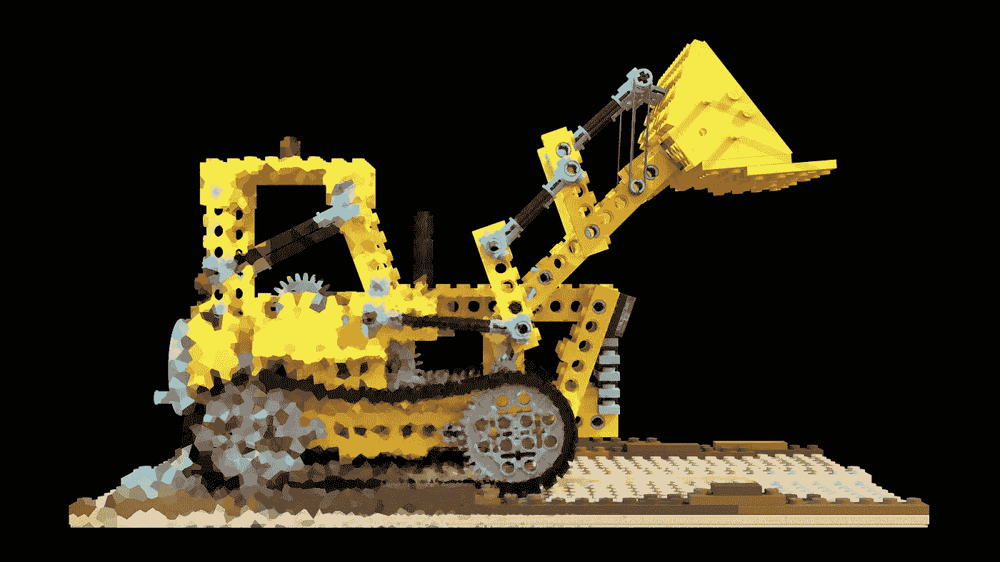
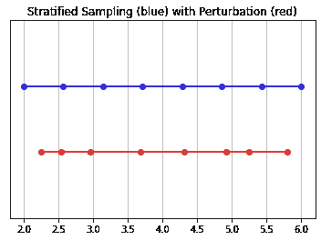
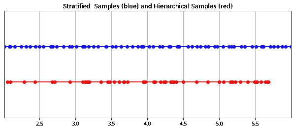

# 这是从无到有的 NeRF:用 PyTorch 构建一个完整的 NeRF

> 原文：<https://towardsdatascience.com/its-nerf-from-nothing-build-a-vanilla-nerf-with-pytorch-7846e4c45666>

## 一个关于如何在 PyTorch 中构建自己的 NeRF 模型的教程，包含对每个组件的逐步解释

Matthew Tancik 的 3D 模型。作者照片。

【注:本文包括一个[谷歌 Colab 笔记本](https://colab.research.google.com/drive/1TppdSsLz8uKoNwqJqDGg8se8BHQcvg_K?usp=sharing)。如果您想继续学习，请随意使用它。]

# 介绍

## NeRF 爆炸

神经辐射场(NeRF)是深度学习和计算机视觉领域中一个相当新的范式。在 ECCV 2020 年的论文“NeRF:将场景表示为用于视图合成的神经辐射场”(该论文获得了最佳论文的荣誉奖)中介绍了这一技术，该技术自此广受欢迎，迄今为止已被引用近 800 次[1]。该方法标志着机器学习处理 3D 数据的传统方式的巨大变化。视觉效果当然也有“哇”的因素，你可以在[的项目页面](https://www.matthewtancik.com/nerf)和他们的原始视频(如下)中看到。

NeRF 介绍视频由 NeRF 论文作者之一 [Matthew Tancik](https://www.matthewtancik.com/) 创作。

在本教程中，我们将浏览一个 NeRF 的基本组件，以及如何将它们放在一起训练我们自己的 NeRF 模型。然而，在我们开始之前，让我们先来看看什么是 NeRF，是什么让它成为这样一个突破。

## 什么是 NeRF？

简而言之，NeRF 是一种生成模型，以一组图像和精确的姿态(如位置和旋转)为条件，允许您生成图像共享的 3D 场景的新视图，这一过程通常被称为“新视图合成”不仅如此，它明确地将场景的 3D 形状和外观定义为一个连续的函数，使用它你可以做一些事情，比如通过[移动立方体](https://en.wikipedia.org/wiki/Marching_cubes)生成 3D 网格。关于 NeRFs，你可能会发现一件令人惊讶的事情:尽管它们直接从图像数据中学习，但它们既不使用卷积层，也不使用变换层(至少不是原始层)。NeRFs 的一个被低估的好处是压缩；在 5-10MB 时，NeRF 模型的权重可能小于用于训练它们的图像集合。

为机器学习应用程序表示 3D 数据的适当方式已经成为多年来争论的主题。出现了许多技术，从 3D 体素到点云到带符号的距离函数(关于一些常见 3D 表示的更多细节，请参见我的 [MeshCNN 文章](/3d-object-classification-and-segmentation-with-meshcnn-and-pytorch-3bb7c6690302))。它们最大的共同缺点是一个初始假设:大多数表示都需要 3D 模型，这要求您要么使用摄影测量(非常耗费时间和数据)和激光雷达(通常昂贵且难以使用)等工具生成 3D 数据，要么付钱给艺术家为您制作 3D 模型。此外，许多类型的物体，如高反射性物体，“网状”物体，如灌木丛和链环栅栏，或透明物体，都不适合按比例扫描。3D 重建方法通常也具有重建误差，这会导致阶梯效应或漂移，从而影响模型的准确性。

相比之下，NeRFs 依赖于一个古老而优雅的概念，称为[光场](https://en.wikipedia.org/wiki/Light_field)，或辐射场。光场是描述光如何在整个 3D 体积中传输的函数。它描述了光线穿过空间中每一个 ***x*** = *(x，y，z)* 坐标和每一个方向*的方向，描述为 *θ* 和 *ϕ* 角或单位矢量。它们共同形成了描述 3D 场景中光传输的 5D 特征空间。受这种表示的启发，NeRF 试图逼近一个从该空间映射到 4D 空间的函数，该空间由颜色 **c** =(R，G，B)和密度 ***σ*** 组成，这可以被认为是光线在该 5D 坐标空间被终止的可能性(例如，被遮挡)。因此，标准 NeRF 是以下形式的函数:*F:(****x****，****d****)->(****c****，****σ****)*。*

*最初的 NeRF 论文使用一个多层感知器来参数化这个函数，该感知器直接在一组具有已知姿态的图像上训练(这些图像可以通过任何基于运动的结构应用程序获得，例如 [COLMAP](https://colmap.github.io/) 、[Agisoft metashpe](https://www.agisoft.com/)、 [Reality Capture](https://www.capturingreality.com/) 或 [Meshroom](https://alicevision.org/#meshroom) )。这是被称为*广义场景重建*的一类技术中的一种方法，旨在从一组图像中直接描述 3D 场景。这种方法给了我们一些非常好的特性:*

*   *直接从数据中学习*
*   *场景的连续表示允许非常薄和复杂的结构，例如树叶或网格*
*   *隐含地说明了物理属性，如镜面反射率和粗糙度*
*   *隐式表示场景中的照明*

*此后，一系列论文试图通过一些功能来扩展原始图像的功能，如少量拍摄和单次拍摄学习[2，3]，支持动态场景[4，5]，将光场归纳为特征场[6]，从网络上未校准的图像集合中学习[7]，结合激光雷达数据[8]，大规模场景表示[9]，无神经网络学习[10]等等。对于 NeRF 研究的一些很好的概述，请参见 Frank Dellaert 从 2020 年开始的这个很好的[概述和从 2021 年](https://dellaert.github.io/NeRF/)开始的另一个[概述。](https://dellaert.github.io/NeRF21/)*

## *NeRF 建筑*

*仅仅使用这个函数，还不太清楚如何生成新颖的图像。总的来说，给定一个训练好的 NeRF 模型和一个已知姿态和图像尺寸的相机，我们通过以下过程构建一个场景:*

1.  *对于每个像素，相机光线穿过场景，在( **x，d** )位置收集一组样本。*
2.  *使用每个样本处的( **x，d** )点和观察方向作为输入来产生输出*(****c****，****σ****)*值(本质上是 rgbσ)。*
3.  *使用经典的体绘制技术构建图像。*

*辐射场功能只是几个组件中的一个，一旦结合起来，就可以创建您在前面看到的视频中看到的视觉效果。还有几个组件，我将在本教程中逐一介绍。总的来说，我们将涵盖以下组件:*

*   *位置编码*
*   *辐射场函数近似器(在这种情况下，是 MLP)*
*   *可区分体积渲染器*
*   *分层抽样*
*   *分层体积取样*

*我在这篇文章中的意图是最大程度的清晰，所以我将每个组件的关键元素提取到尽可能简洁的代码中。我使用了 GitHub 用户[bmid](https://github.com/bmild/nerf)的原始实现和 GitHub 用户 [yenchenlin](https://github.com/yenchenlin/nerf-pytorch) 和 [krrish94](https://github.com/krrish94/nerf-pytorch/) 的 PyTorch 实现作为参考。*

# *辅导的*

## *位置编码器*

*很像 2017 年推出的疯狂流行的变压器模型[11]，NeRF 也受益于位置编码器作为其输入，尽管原因不同。简而言之，它使用高频函数将其连续输入映射到更高维度的空间，以帮助模型学习数据中的高频变化，从而产生更清晰的模型。这种方法避免了神经网络对低频函数的偏见，允许 NeRF 表示更清晰的细节。作者参考了 ICML 2019 上的一篇论文，以进一步了解这一现象[12]。*

*如果您熟悉位置编码器，NeRF 实现是相当标准的。它有相同的正弦和余弦交替表达，是原件的标志。*

*标准位置编码器实现。*

## *辐射场函数*

*在原始论文中，辐射场函数由 NeRF 模型表示，这是一种相当典型的多层感知器，它将编码的 3D 点和视图方向作为输入，并将 RGBA 值作为输出返回。虽然本文使用神经网络，但这里可以使用任何函数逼近器。例如，Yu 等人的后续论文“Plenoxels”使用球谐函数的基础来代替数量级更快的训练，同时实现有竞争力的结果[10]。*

*NeRF 模型有 8 层深，大多数层的特征尺寸为 256。剩余连接位于第 4 层。在这些层之后，产生 RGB 和 *σ* 值。RGB 值通过线性层进一步处理，然后与视图方向连接，然后通过另一个线性层，最后在输出端与 *σ* 重新组合。*

*NeRF 模型，实现为 PyTorch 模块。*

## *可区分体积渲染器*

*RGBA 输出点在 3D 空间中，因此为了将它们合成为一幅图像，我们需要应用本文第 4 节中等式 1-3 所述的体积积分。本质上，我们沿着每个像素的光线对所有样本进行加权求和，以获得该像素的估计颜色值。每个 RGB 样本通过其 alpha 值进行加权。较高的 alpha 值表示采样区域不透明的可能性较高，因此光线上较远的点更有可能被遮挡。累积积确保了那些更远的点被抑制。*

*原始 NeRF 模型输出的体绘制。*

## *分层抽样*

**

*分层抽样的例子。在这种情况下，从范围[2，6]中收集了 8 个样本。(图由作者创作)*

*在这个模型中，相机最终拾取的 RGB 值是沿着穿过该像素的光线的光样本的累积。经典的体绘制方法是沿着这条射线累积点，然后积分点，在每个点估计射线传播而不碰到任何粒子的概率。因此，每个像素都需要沿着穿过它的光线对点进行采样。为了最好地逼近积分，他们的[分层抽样](https://en.wikipedia.org/wiki/Stratified_sampling)方法是将空间均匀地分成 N 个箱，并从每个箱中均匀地抽取一个样本。分层采样方法不是简单地以规则的间距抽取样本，而是允许模型对连续的空间进行采样，因此使网络能够在连续的空间内进行学习。*

*PyTorch 中的分层抽样。*

## *分层体积取样*

*之前我说辐射场是用多层感知器表示的，我可能撒了点小谎。实际上是用两个多层感知器来表示的！一种在粗略的水平上操作，对场景的广泛结构属性进行编码。另一种是在精细的层次上细化细节，从而能够实现像网格和分支这样的细而复杂的结构。此外，它们接收的样本是不同的，粗模型在整个射线中处理广泛的、大部分规则间隔的样本，而细模型在具有显著信息的强先验的区域中进行琢磨。*

**

*分层抽样(蓝色)和分层抽样(红色)的例子。分层采样以均匀的间距(受噪波影响)捕捉整个光线长度，而分层体积采样基于区域对渲染的预期贡献按比例对区域进行采样。(图由作者创作。)*

*这种“磨合”过程是通过分层体积取样程序完成的。3D 空间实际上非常稀疏，有遮挡，所以大多数点对渲染图像没有太大贡献。因此，对对积分有贡献的可能性高的区域进行过采样更为有益。他们将学习到的归一化权重应用于第一组样本，以创建跨射线的 PDF。然后，他们将[逆变换采样](https://en.wikipedia.org/wiki/Inverse_transform_sampling)应用于该 PDF，以收集第二组样本。该集合与第一集合相结合，并被馈送到精细网络，以产生最终输出。*

*PyTorch 中的分层抽样。*

## *培养*

*这篇文章中训练 NeRF 的标准方法大部分是你所期望的，有一些关键的不同。每个网络 8 层、每层 256 维的推荐架构在训练时会消耗大量内存。他们缓解这种情况的方法是将正向传递分成更小的块，然后在这些块上累积梯度。注意与迷你批处理的区别；梯度是在单个小批采样射线上累积的，这些射线可能是成块收集的。如果你没有论文中使用的 NVIDIA V100 GPU 或性能相当的东西，你可能需要相应地调整你的块大小，以避免 OOM 错误。Colab 笔记本使用更小的架构和更适中的分块大小。*

*我个人发现由于局部最小值，训练 NeRFs 有些棘手，即使选择了许多默认设置。一些有帮助的技术包括在早期训练迭代和早期重新启动期间的中心裁剪。随意尝试不同的超参数和技术，以进一步提高训练收敛。*

# *结论*

*辐射场标志着机器学习从业者处理 3D 数据的方式发生了巨大变化。NeRF 模型，以及更广泛的可区分渲染，正在迅速弥合图像创建和体积场景创建之间的差距。虽然我们走过的组件可能看起来非常复杂，但受这种“香草”NeRF 启发的无数其他方法证明，基本概念(连续函数逼近器+可微分渲染器)是构建各种适合几乎无限情况的解决方案的强大基础。我鼓励你亲自尝试一下。快乐渲染！*

# *参考*

*[1] Ben Mildenhall，Pratul P. Srinivasan，Matthew Tancik，Jonathan T. Barron，Ravi Ramamoorthi，Ren Ng — [NeRF:将场景表示为用于视图合成的神经辐射场(2020)](https://arxiv.org/abs/2003.08934) ，ECCV 2020*

*[2] Julian Chibane，Aayush Bansal，Verica Lazova，Gerard Pons-Moll — [立体辐射场(SRF):学习视图合成用于新颖场景的稀疏视图](https://arxiv.org/pdf/2104.06935.pdf) (2021)，CVPR 2021*

*[3] Alex Yu，Vickie Ye，Matthew Tancik，ang joo Kanazawa——[pixelNeRF:来自一个或几个图像的神经辐射场](http://arxiv.org/abs/2012.02190) (2021)，CVPR 2021*

*[4]李政奇，西蒙·尼克劳斯，诺亚·斯内夫利，奥利弗·王——[动态场景时空视图合成的神经场景流场](https://www.cs.cornell.edu/~zl548/NSFF/) (2021)，2021*

*[5]阿尔伯特·普马罗拉，恩里克·科罗纳，杰拉德·庞斯-莫尔，弗朗切斯克·莫雷诺-诺盖尔—[D-内尔夫:动态场景的神经辐射场](https://arxiv.org/abs/2011.13961) (2021)，CVPR 2021*

*[6]迈克尔·尼迈耶，安德烈亚斯·盖格— [长颈鹿:将场景表现为合成生成神经特征场](https://arxiv.org/abs/2011.12100) (2021)，CVPR 2021*

*[7]郑飞·匡，凯尔·奥尔谢夫斯基，·柴，，帕诺斯·阿契里奥普塔斯，谢尔盖·图利亚科夫— [NeROIC:从在线图像集合中捕获和绘制神经对象](https://formyfamily.github.io/NeROIC/)，计算研究储存库 2022*

*[8]康斯坦丁诺·雷马塔斯、廖骏伦、普拉图尔·p·斯里尼瓦桑、
乔纳森·t·巴伦、安德里亚·塔利亚萨基、汤姆·冯克豪泽、维托里奥·费拉里— [城市辐射场](https://urban-radiance-fields.github.io/) (2022)、CVPR 2022*

*[9] Matthew Tancik，Vincent Casser，Yan，Sabeek Pradhan，Ben Mildenhall，Pratul P. Srinivasan，Jonathan T. Barron，Henrik Kretzschmar—[Block-NeRF:可扩展的大场景神经视图合成](https://waymo.com/research/block-nerf/) (2022)，arXiv 2022*

*[10] Alex Yu，Sara Fridovich-Keil，Matthew Tancik，Chen，Benjamin Recht，ang joo Kanazawa—[Plenoxels:Radiance Fields without Neural Networks](https://alexyu.net/plenoxels/)(2022)，2022(口述)*

*[11]阿希什·瓦斯瓦尼、诺姆·沙泽尔、尼基·帕尔马、雅各布·乌兹科雷特、利永·琼斯、艾丹·戈麦斯、卢卡斯·凯泽、伊利亚·波洛舒欣— [你只需要关注](https://arxiv.org/abs/1706.03762) (2017)，NeurIPS 2017*

*[12]纳西姆·拉赫曼，阿里斯蒂德·巴拉廷，德万什·阿皮，菲利克斯·德拉克斯勒，林敏，弗雷德·a·哈姆普雷希特，约舒阿·本吉奥，亚伦·库维尔— [关于神经网络的光谱偏差](https://arxiv.org/abs/1806.08734) (2019)，第 36 届机器学习国际会议(PMLR)会议录 2019*