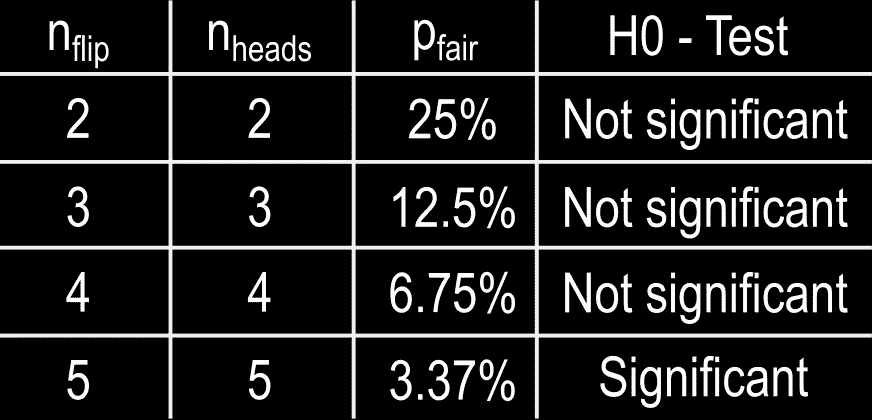
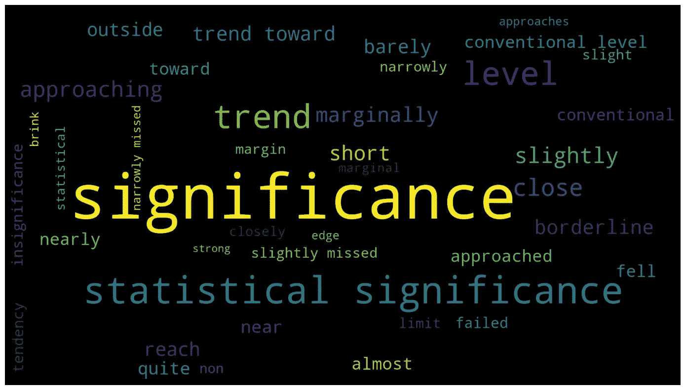
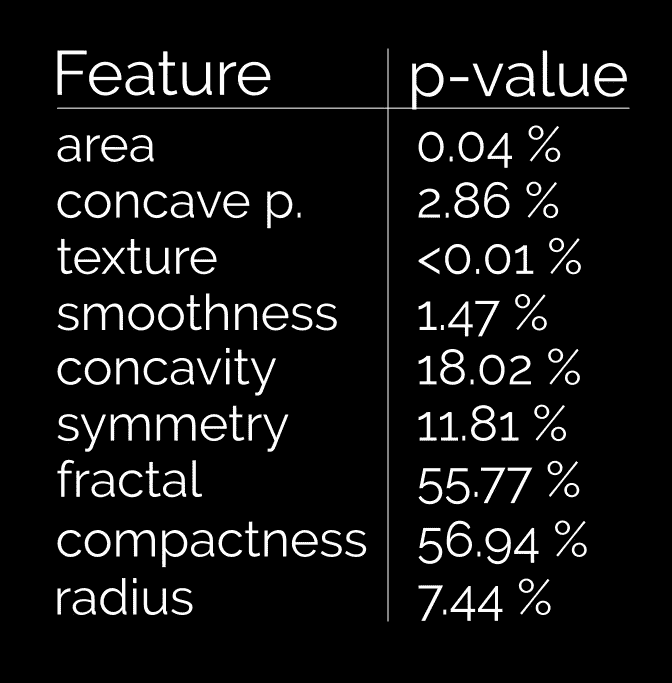
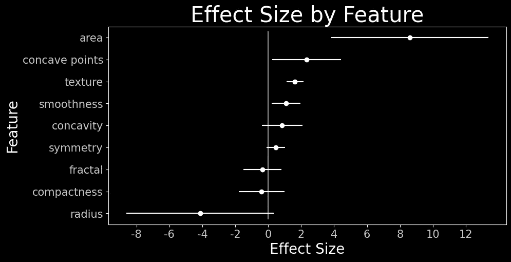

# 应该让你吃惊的是数据，而不是 P 值

> 原文：<https://towardsdatascience.com/its-the-data-that-should-surprise-you-not-the-p-values-79fce3963d35>

## 你的结论不应该建立在统计显著性测试的基础上，也不应该建立在丹尼尔·塔特尔和 T2·昂斯佩思的基础上

统计学是在不确定性下改变我们想法的领域[1]。我们的思维(即，对某事物的先入之见)通常被表述为一个无效假设，它总结了我们认为知道的东西。然后可以通过收集和分析数据来检验这种无效假设的有效性。**如果这个数据足够令人惊讶，我们拒绝零假设**。对这些数据感到惊讶需要两件事:

数据必须与我们相信的事实相矛盾

*   当零假设为真时，这种矛盾不太可能是偶然发生的。
*   例如，我们通常假设一个特定的硬币是公平的，即有相等的概率得到正面和反面。举例来说，如果我们现在观察到抛硬币两次时有两个头像，这与我们最初的预期相矛盾。另一方面，这样的结果很可能是公平的(25%的情况)。因此，这些数据不足以令人惊讶地否定零假设。相反，如果我们抛硬币十次，观察十个头像，这个结果可能会非常令人惊讶，因为公平的硬币出现这种结果的几率只有 0.1%。这直接引出了一个不可避免的问题:

确切地说，什么时候数据令人惊讶到足以改变我们的想法，也就是说，什么时候我们应该拒绝零假设？

> 统计假设检验有一个简单的答案:如果零假设实际上为真，那么产生结果的概率(p)应该小于某个*先验定义的*显著性水平(ɑ)。根据不同的领域，一个常用的惯例是\\ = 5%—因此，任何 p < 5%的发现都被称为具有统计显著性。

当应用于抛硬币的例子时，这个定义变得更加明显。如果我们观察到与这种信念相矛盾的数据**和**如果硬币实际上是公平的，这种数据在不到 5%的情况下出现的开始，我们将拒绝我们对公平硬币的信念。正如我们从下表中看到的，如果连续观察到四个以上的头像，我们会拒绝我们对公平硬币的信念。换句话说，我们可以说这个发现(即硬币是不公平的)在统计学上是显著的，因为 p < 5%。

作者图片

但是，统计上显著的东西实际上意味着什么呢？让我们假设你会在下一次掷硬币时下相当大的赌注。当之前的四次抛硬币是正面对之前的五次抛硬币是正面时，你的决定会不同吗？可能不会，但你会更有信心下一次掷硬币也是五个正面，对吗？

一个结论不会在分割线的一边立即变为真(或更重要)，而在另一边变为假(或不重要)

> 这实际上是统计显著性测试的一个问题:对许多人来说，统计显著性结果比非显著性结果更有说服力。例如，当科学结果“具有统计学意义”时，更容易发表。因此，许多研究人员试图通过选择创造性的描述，将不重要的发现转化为更有说服力的东西。下面的单词云显示了同行评审期刊文章中的一些常用表达，其中作者设置了 p < 5%的阈值，但未能实现[2]。

图片由作者提供，资料来源于[1]

这种措辞很吸引人，因为它经常描述不存在的结果的一个方面。例如，趋向、接近或趋向显著性不成立，因为 p 值是一个没有任何方向趋势的数字。

**重要并不意味着重要**

## 这给我们带来了另一个重要的方面:p 值并不意味着重要性，也不反映效果的大小。

例如，让我们使用逻辑回归调查[乳腺癌威斯康星州(诊断)数据集](https://archive-beta.ics.uci.edu/dataset/17/breast+cancer+wisconsin+diagnostic) [4]中恶性或良性肿瘤的预测因子。下表总结了每个预测值的 p 值。

[乳腺癌威斯康星(诊断)数据集](https://archive-beta.ics.uci.edu/dataset/17/breast+cancer+wisconsin+diagnostic)的每个预测值的 p 值。图片由作者提供。

具有低 p 值的预测因子不可能与反应变量(即恶性或良性肿瘤)无关。仅从这些 p 值，人们可能倾向于判断，例如，半径不如平滑重要，因为它的 p 值更大。然而，p 值并不能得出这些预测因子在多大程度上降低或增加恶性肿瘤发生几率的结论。

要回答这个问题，我们需要分析效应大小:大的绝对效应大小意味着一个研究发现具有实际意义。相比之下，小的绝对效应大小表明实际应用有限。

[乳腺癌威斯康星(诊断)数据集](https://archive-beta.ics.uci.edu/dataset/17/breast+cancer+wisconsin+diagnostic)的每个预测值的效应大小。图片由作者提供。

在乳腺癌数据集中，效应大小及其不确定性传达了比单独的 p 值更多的信息。例如，我们现在可以得出结论，我们发现了光滑度和恶性肿瘤之间适度联系的有力证据。然而，对于桡骨，我们可以得出结论，我们发现了适度的证据表明桡骨和恶性肿瘤之间存在潜在的密切联系。
因此，尽管我们基于现有数据确信平滑度与肿瘤的恶性程度密切相关，但其影响相对较小。因此，临床上可能更关注桡骨，收集更多数据以减少不确定性。

总之，具有“显著”p 值的小效应可能具有有限的实际重要性。

结论

## 这让我们回到这篇博文的第一句话(顺便说一句，这是我从 Cassie Kozyrkov 的一篇优秀博文中抄来的。):

[统计学是在不确定性下改变我们想法的领域](/whats-the-point-of-statistics-8163635da56c)

> 不确定性是存在的，并将永远存在。这种不确定性不能仅仅依靠一个单一的值来消除。相反，我们必须接受不确定性，并将它们包含在我们的结论中。美国统计协会关于 p 值的声明总结道:

[任何单一指标都不能替代科学推理](https://amstat.tandfonline.com/doi/full/10.1080/00031305.2016.1154108#.Y4Dpjn3MKUm)

> 感谢阅读！

**参考文献**

[1]不要在统计上浪费你的时间，作者 Cassie Kozyrkov[https://towardsdatascience . com/what-the-point-of-statistics-8163635 da 56 c](/whats-the-point-of-statistics-8163635da56c)

[2]当您的结果只是“几乎显著”时:[仍然不显著|可能的误差(wordpress.com)](https://mchankins.wordpress.com/2013/04/21/still-not-significant-2/)

[3] [美国儿科学会关于 p 值的声明](https://amstat.tandfonline.com/doi/full/10.1080/00031305.2016.1154108#.Y4Dpjn3MKUm)

[4]沃尔伯格，威廉，斯特里特，w .和曼加萨里安，奥尔维。(1995).乳腺癌威斯康星州(诊断)。UCI 机器学习知识库(CC BY 4.0 许可数据集)。

[4] Wolberg, William, Street,W. & Mangasarian,Olvi. (1995). Breast Cancer Wisconsin (Diagnostic). UCI Machine Learning Repository (CC BY 4.0 licensed dataset).