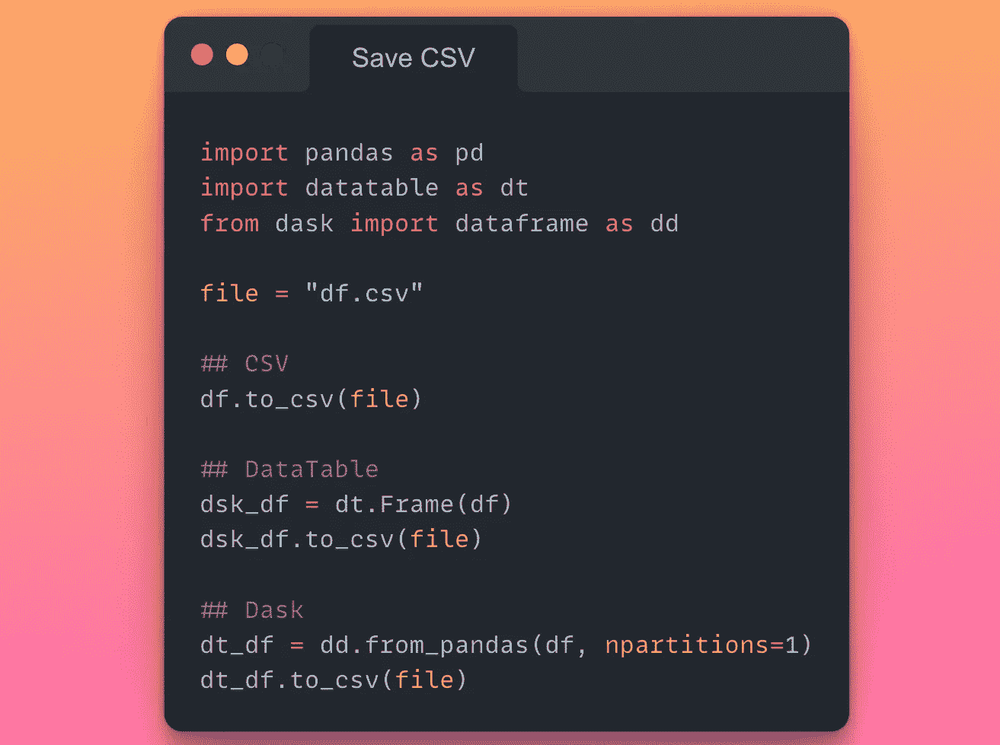
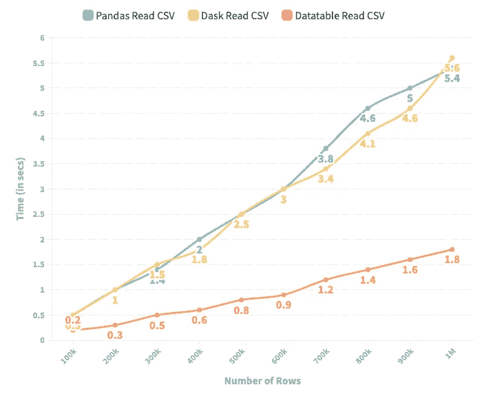
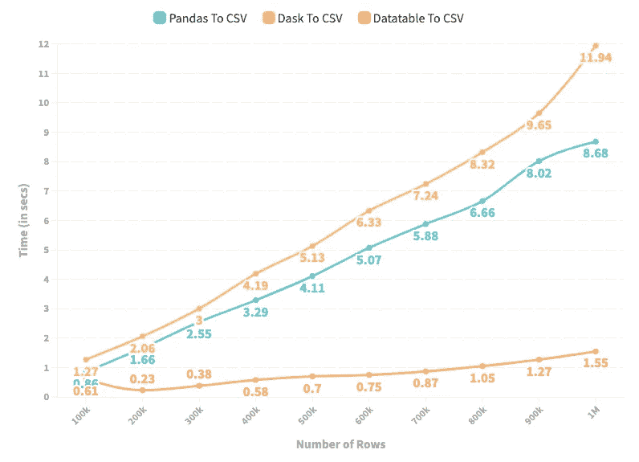
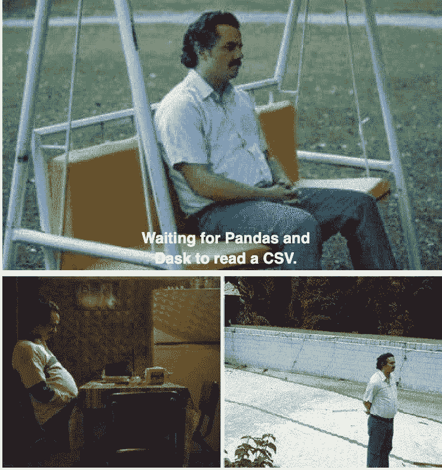

# 是时候告别 pd.read_csv()和 pd.to_csv()了

> 原文：<https://towardsdatascience.com/its-time-to-say-goodbye-to-pd-read-csv-and-pd-to-csv-27fbc74e84c5>

## 讨论熊猫的另一个重要警告

黑白情缘印花纺织品(来源: [Pexels](https://www.pexels.com/photo/wood-laptop-writing-business-4271925/)

Pandas 对 CSV 的输入输出操作是串行的，这使得它们非常低效和耗时。当我看到这里有足够的并行化空间时，我感到很沮丧，但不幸的是，Pandas 还没有提供这种功能。虽然我从来不赞成首先用熊猫创建 CSV(阅读我下面的帖子就知道为什么)，但我知道可能会有除了使用 CSV 别无选择的情况。

  

因此，在本帖中，我们将探索 **Dask** 和 **DataTable** ，这是数据科学家最喜欢的两个类似熊猫的库。我们将根据 Pandas、Dask 和 Datatable 在以下参数上的表现进行排名:

1.  **读取 CSV 并获取熊猫数据帧所花费的时间**

如果我们通过 Dask 和 DataTable 读取 CSV，它们将分别生成 Dask 数据帧和 DataTable 数据帧，**而不是 Pandas 数据帧**。假设我们想要坚持传统的 Pandas 语法和函数(由于熟悉的原因)，我们必须首先将它们转换成 Pandas 数据帧，如下所示。

描述将 Pandas 数据帧转换为 Dask 和 DataTable 数据帧的代码片段(图片由作者提供)

2.**将熊猫数据帧存储到 CSV 所需的时间**

目标是从给定的熊猫数据帧生成一个 CSV 文件。对于熊猫，我们已经知道了 *df.to_csv()* 方法。然而，要从 Dask 和 DataTable 创建 CSV，我们首先需要将给定的 Pandas 数据帧转换成它们各自的数据帧，然后将它们存储在 CSV 中。因此，在本次分析中，我们还将考虑数据帧转换所需的时间。

使用 Pandas、Dask 和 DataTable 将数据帧保存到 CSV 的代码片段(图片由作者提供)

# 实验设置:

1.  出于实验目的，我用 Python 生成了一个随机数据集，包含可变的行和三十列——包括字符串、浮点和整数数据类型。
2.  我将下面描述的每个实验重复了五次，以减少随机性，并从观察结果中得出公正的结论。我在下面报告的数字是五次实验的平均值。
3.  Python 环境和库:

*   Python 3.9.12
*   熊猫
*   数据表 1.0.0
*   Dask 2022.02.1

# **实验 1:读取 CSV 花费的时间**

下图描述了 Pandas、Dask 和 DataTable 读取 CSV 文件并生成 Pandas 数据帧所用的时间(秒)。CSV 的行数范围从 100k 到 500 万。

描述熊猫、数据表和 Dask 读取 CSV 所用时间的折线图(图片由作者提供)

1.  实验结果表明，当行数小于一百万时，Dask 和 Pandas 从 CSV 生成 Pandas 数据帧所用的时间大致相同。
2.  然而，当我们超过一百万行时，Dask 的性能会恶化，并且生成 Pandas 数据帧比生成 Pandas 本身要花费更多的时间。
3.  在这两种情况下，Datatable 在 Pandas 中生成一个数据帧所需的时间最少，提供了 4 到 5 倍的速度提升——这使它成为目前为止最好的选择。

# 实验 2:保存到 CSV 所需的时间

下图描述了 Pandas、Dask 和 DataTable 从给定的 Pandas 数据帧生成 CSV 文件所用的时间(秒)。行数范围从 100k 到 500 万。

描述 Pandas、DataTable 和 Dask 将数据帧存储到 CSV 所需时间的折线图(图片由作者提供)

1.  在所有情况下，Dask 在将 Pandas 数据帧存储到 CSV 时的表现都不如 Pandas。
2.  与实验 1 类似，DataTable 表现最好——将相对于熊猫的保存过程提高了近 **8 倍。**

# 结束语

老实说，我不太喜欢 CSV。如果你仔细阅读了我之前的帖子(我在上面链接过，或者你可以在这里阅读)和你现在正在阅读的帖子，你可能也会和我产生共鸣。自从我发现与 CSV 相关的众多问题后，我尽可能地停止使用它们。

总之，我认为除非您需要在非 pythonic 环境(如 Excel)之外查看数据框架，否则根本不需要 CSV。更喜欢像拼花地板、羽毛或泡菜这样的格式来存储你的数据帧。尽管如此，如果您看不到其他选择，至少通过利用 DataTable 而不是 Pandas 来优化您的输入和输出操作。

毒枭迷因由作者使用迷因创造者。