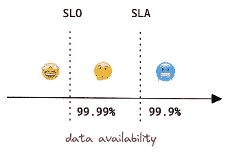
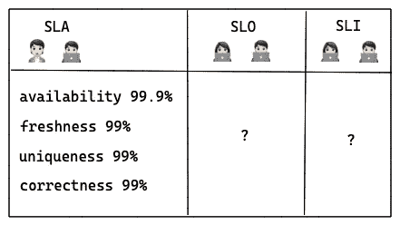
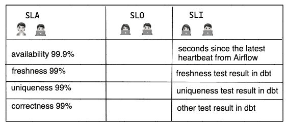

# 是时候为您的数据团队设置 SLA，SLO，SLI 了—只需 3 个步骤

> 原文：<https://towardsdatascience.com/its-time-to-set-sla-slo-sli-for-your-data-team-only-3-steps-ed3c93009aa5>

## 让利益相关者满意的关键指标

克劳迪奥·施瓦兹在 [Unsplash](https://unsplash.com/) 上的照片

F 对于今天的数据团队来说，对实时、准确数据的需求从未像现在这样高，但数据可靠性从未得到充分重视。数据每天都在快速增长，其来源和格式比以往任何时候都多。为了跟上这一趋势，数据团队在管理可扩展的实时数据基础架构和构建不断增长的仪表板方面投入了大量资金，以做出明智的业务决策。做出正确的决策是具有挑战性的，只有在高度可靠的数据下才能做出正确的决策。

以下是几个可靠数据对企业意味着什么的示例:

*   以**预期格式**向第三方(如监管机构、审计机构)交付**准确完整的**数据，以满足合规要求。
*   无论何时利益相关者想要检查数据，它总是**可用**。
*   **在上午 9 点之前，当利益相关者查看指标时，刷新**仪表板。
*   将**准确的**指标带到仪表盘上，帮助企业做出正确的决策。
*   ……

作为一个成熟的数据团队，你应该从今天开始思考数据的可靠性。这还不是[行业中的*热门*话题](https://trends.google.com/trends/explore?q=data%20reliability,%2Fm%2F0hzr4kb)，但是它为团队带来了长期价值，因为数据正在成为组织的支柱。这也是你的团队与众不同的地方。

## 什么是数据可靠性？

[巴尔·摩西](https://barrmoses.medium.com/?source=post_page-----66ec88578950--------------------------------)，[蒙特卡洛](https://www.montecarlodata.com/)的联合创始人，是数据可靠性的倡导者。她说:

> 数据可靠性是组织在整个数据生命周期中提供高数据可用性和健康的能力。—巴尔·摩西

从用户故事中，您可能会对数据可靠性的含义有所了解。我们可以将其分解为几个可测量的指标:

*   可用性—数据是否可用。网络问题或基础设施问题等可能会阻止用户访问数据。
*   新鲜度—数据表的最新程度，以及表更新的节奏。
*   完整性(In)——意外缺失数据条目的百分比，可以是行级别，也可以是列级别。例如，上游表中是否有任何行没有被处理？对于超过 X%的行，目标表中是否有任何字段缺少数据？
*   Duplicates 意外重复主键的百分比。
*   分布—某些字段的可接受范围。它可以是一个枚举或一个数字范围。
*   格式—数据的预期格式和模式，如 CSV 或 BigQuery 表以及列的定义。
*   关系——对涉及多个列或表的复杂业务逻辑的任何测试。

我希望一些指标能引起你的共鸣。如果是这样，太好了！现在，让我们把它们变成可操作的步骤。

## SLI SLO SLA 简介

由作者创建

测量是实现高数据可靠性的关键。如果没有人监控，前面提到的指标毫无意义，并且临时解决数据问题不是运行数据团队的可持续方式。

当利益相关者在数据工程师之前发现明显的数据问题时，会感到羞耻。

此外，当利益相关者说“数据是错误的”时，每个数据工程师都会问“什么意思..?"

SLA、SLO 和 SLI 是一系列概念，可以帮助数据工程师和利益相关者理解数据发生了什么，以及“错误数据”的确切含义。首先，这里是每个概念的定义。它们非常相关，但又非常不同。

**SLA(服务水平协议)** —是服务提供商向客户承诺的服务可用性、性能等方面的合同，以及如果他们未能交付可能的补偿。它适用于内部和外部数据消费者。定义 SLA 的一些好处:

1.  它通过明确定义数据可靠性的范围以及“可以”和“不可以”的含义，改善了工程师和利益相关者之间的沟通。让它变得非常清楚，可以避免对什么需要关注，什么不需要关注的不必要的讨论。
2.  它帮助工程师决定应该在交付特性上花费多少时间，应该在使现有管道更加可靠上花费多少时间。
3.  它提供了更多关于数据可靠性的可见性。只有错误会引起注意，而事情进展顺利时却不会，这是不公平的。SLA 帮助团队领导了解他们的数据管道(和团队)有多好，并在整个组织中分享成功。
4.  它让涉众对数据(和数据团队)更有信心。借助合适的工具，他们可以查看数据的 SLA 实时状态，而无需反复询问数据是否正常。他们知道这个问题会很快得到解决，不会升级。

SLA 不仅定义了数据可靠性的范围，还定义了**错误预算**，这是一个防止工程师筋疲力尽的指标，它有助于团队明智地分配时间。例如，从涉众的角度来看，该表应该随时可用并且正确，这意味着 100%的可靠性。但是没有必要，也不可能。随着 [0.1%的停机时间](http://www.slatools.com/sla-uptime-calculator)，业务不会崩溃。工程师们更愿意提供新的功能和做更多创造性的工作，而不是追求 100%的可靠性。数据团队应该让涉众知道这个事实。

**【服务水平目标】** —是服务提供商想要达到的内部目标。通常，它类似于 SLA，但更严格。例如，如果在 SLA 中将数据可用性阈值设置为 99.9%，那么在 SLO 应该是 99.99%。如果一项服务违反了 SLO，随叫随到的工程师需要迅速做出反应，以避免它违反 SLA，否则，公司(或团队)将会损失金钱(或声誉)。

由作者创建

通常，SLO 比 SLA 包含更多的度量。例如，为了实现 99.9%的总体可用性，团队需要监控一些内部工具的正常运行时间，并且每个工具都有自己的 SLO 阈值。

由作者创建

**SLI(服务水平指标)** —是服务提供商用来达到 SLA 目标的服务某些方面的量化指标。这是一个具体的指标，而不是一个目标。例如，为了达到可用性目标，SLIs 可能是“自 toolA 的最后一次心跳以来的秒数”。对于刷新目标，SLIs 可能是“数据集刷新后的小时数”。SLIs 的选择是基于 SLA 中的约定。

实际上，sli 是监控系统中的度量标准；SLO 是随叫随到工程师的提醒规则，SLA 比 SLO 更严格，它们应该让利益相关者满意。

## 在您的数据团队中设置 SLA / SLO / SLI 的 3 个步骤

让我们看一个例子。在本例中，数据工程师和利益相关者定义了包含公司收入数据的关键 BigQuery 表的 SLA。工程师将进一步定义 sli 和 SLO。

由作者创建

**步骤 1 —与利益相关方一起定义 SLA**

在步骤 1 之前，有一个步骤 0，用于确定值得应用 SLA 的服务。它可以是显示公司 OKRs 的关键仪表板，或者在本例中是组织中最常用的表。

然后，与您的利益相关方一起定义什么是可靠的数据。首先，数据工程师可以评估数据的历史性能，以获得基线并了解其使用模式、最常查询的字段以及查询频率。工程师可以要求利益相关者考虑他们对可靠性的要求。他们最关心的是什么？新鲜感？准确性？可用性？重复？

在与利益相关者的讨论中，双方需要就可使用的实际数字达成一致。[一种常见的模式](https://cloud.google.com/blog/products/devops-sre/availability-part-deux-cre-life-lessons)是从较低的 SLA 和 SLO 开始，因此工程师不需要 24/7 轮换，利益相关者也可以接受最初几个小时的停机时间。随着情况越来越稳定，可以增加到理想的数字。

回到这个例子，工程师从涉众那里得到了一些需求:

1.  每天上午 9 点前，应使用昨天的收入刷新表格。
2.  表应该总是可访问的。
3.  表不应该在组合键上包含任何重复项。
4.  `gross_booking`、`net_booking`、`net_revenue`等金额字段应计算正确。

由作者创建

基于工程师对历史性能的评估，他们提出了上述 SLA。可用性具有更高的 SLA，因为它主要依赖于 BigQuery 服务，该服务承诺 [99.99%的正常运行时间](https://cloud.google.com/bigquery/sla)。

**步骤 2——定义 SLI 来衡量可靠性**

一旦就 SLA 达成一致，您就可以开始选择有助于满足 SLA 的指标。指标的选择对于团队正在使用的数据基础设施来说是非常具体的。在这个例子中，假设团队使用 Airflow + BigQuery + dbt 来交付数据。所以 SLI 可能是:

1.  自 Airflow 最近一次心跳*以来的秒数(Airflow 的停机时间不会对 BigQuery 表的可用性产生直接影响，但是如前所述，监视有助于最终 SLA 的内部工具是值得的)。*
2.  自上次更新该表以来的小时数。
3.  dbt 中唯一性测试的测试结果。
4.  dbt 中其他值检查的测试结果。

由作者创建

**步骤 3 —定义 SLO 并设置警报**

定义 SLIs 后，您可以设置每个指示器的内部可接受的故障范围。如前所述，为了给随叫随到的工程师足够的反应时间，SLO 应该比 SLA 更严格。

就这些指标达成一致后，团队可以创建警报规则，并根据严重程度对事件进行评级。使用正确的监控工具，这些信息可以清楚地显示在仪表板上，从而有效地沟通和解决问题。

由作者创建

## 为具有依赖关系的服务定义 SLO

最后，我想说一个有趣的问题:如何为有依赖关系的服务定义 SLO。任何重要的服务都有依赖关系，每个服务可能有也可能没有自己的 SLO。如何将它们结合起来？

谷歌的这篇博客给出了一个明确的答案:不要确定你的 SLO 自下而上(“基于我所有的依赖，我的服务能实现什么？”)，**自上而下**:“我的客户需要什么 SLO 才能开心？”把它作为你的 SLO。一旦你有了 SLO，你的依赖关系**就代表了风险的来源**。如果他们有更高的 SLO，那么很好。否则，你需要通过这篇[博客](https://cloud.google.com/blog/products/devops-sre/defining-slos-for-services-with-dependencies-cre-life-lessons)中的建议之一来降低风险。

如果您的依赖项没有自己的 SLO，您可以使用历史性能来代替。如果它也不可用，你必须使用你最好的猜测。该博客提供了一个[电子表格](https://docs.google.com/spreadsheets/d/1XTsPG79XCCiaOEMj8K4mgPg39ZWB1l5fzDc1aDjLW2Y/view)来模拟风险，并帮助您了解您的依赖性如何影响您的服务的 SLO 性能。

## 结论

一如既往，我希望这篇文章对你有用，并能给你启发。SLA/SLO/SLI(SRE 的一部分)的概念是由谷歌发明的，到目前为止，它主要应用于软件工程团队。但是现在，随着数据系统在组织中达到相似的复杂性和重要性水平，数据团队也该应用相同的概念了。实现 SLA 将是一场文化变革。这需要时间，并且需要数据工程师和用户之间的协作。但它将使沟通方式更容易和更有效。从长远来看，团队将从中受益。希望你喜欢，干杯！

## 参考

<https://www.montecarlodata.com/blog-how-to-make-your-data-pipelines-more-reliable-with-slas/>  <https://cloud.google.com/architecture/building-production-ready-data-pipelines-using-dataflow-planning>  <https://cloud.google.com/blog/products/devops-sre/defining-slos-for-services-with-dependencies-cre-life-lessons> 