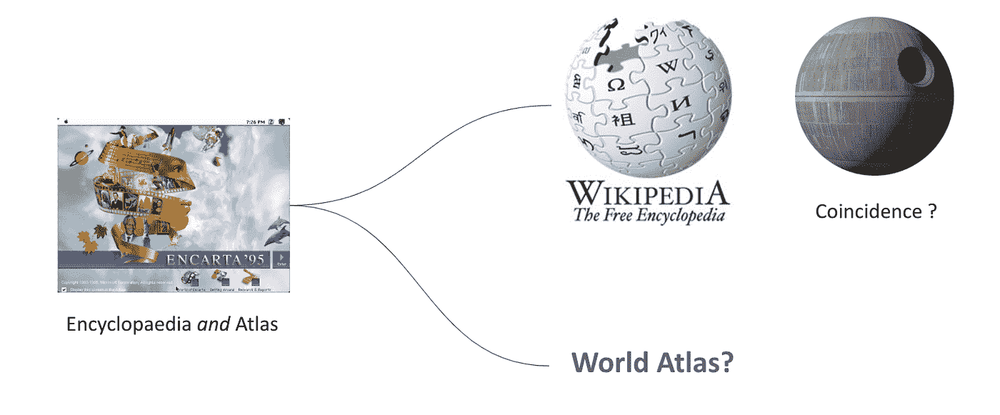
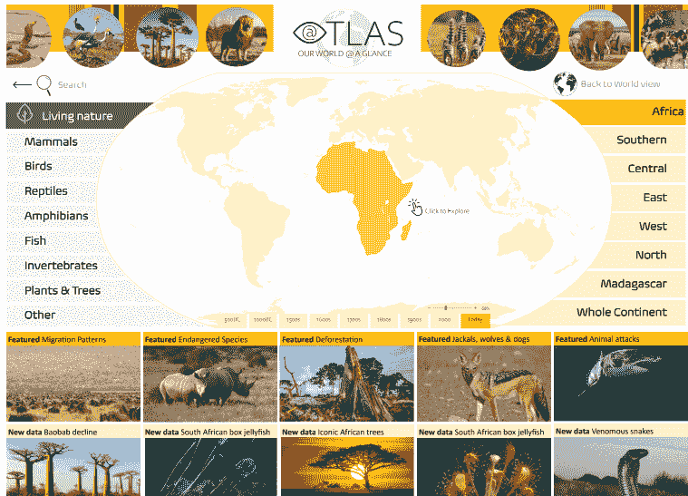
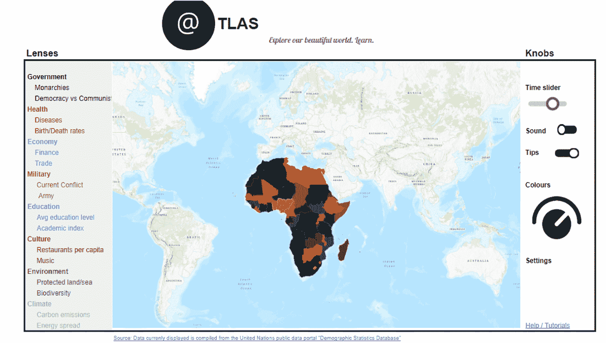
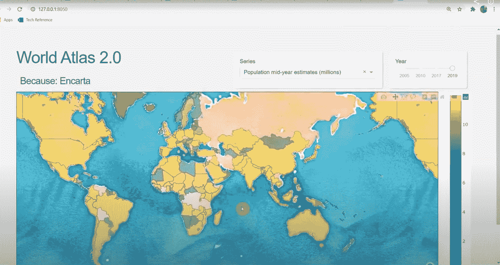
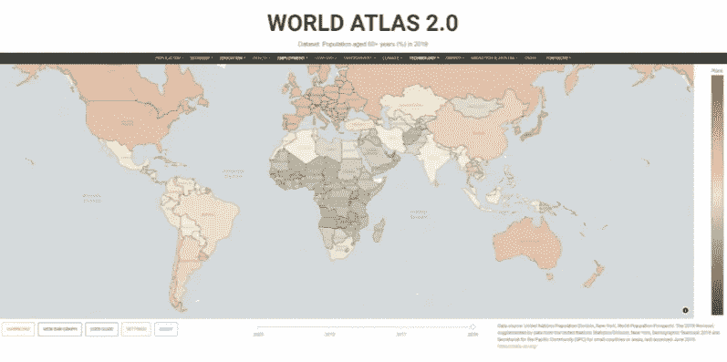

# 我建立了一个公共世界地图集，有 2500 个数据集可供探索

> 原文：<https://towardsdatascience.com/ive-built-a-public-world-atlas-with-2-500-datasets-to-explore-8b9ae799e345>

图片由 Ylanite Koppens 免费提供。来源:https://www.pexels.com/photo/beige-analog-compass-697662/

## 灵感来自 Encarta，用 Python 制作，可在 worldatlas.org 访问

这是一个自筹资金的思想实验，历时 18 个月，目标是坚持一件事:“我们可以在让每个人都能访问重要数据方面做得更好”。

## **给我看货**

前往 worldatlas.org 的，点击*用户指南*按钮，进行一次快速视频飞越。在台式机或笔记本电脑上使用 Chrome (MacOs，Win，Linux)或 Firefox (MacOs，Win)的体验最佳。

## 在 Github 上开源

在[https://github.com/danny-baker/atlas](https://github.com/danny-baker/atlas)查看项目源代码。拉请求非常欢迎❤️

## **螺距**

你有没有想过为什么我们没有一个世界地图集来取代纸质地图集，就像维基百科取代了纸质百科全书一样？

你有没有想过你生活的国家在教育、文化、健康、犯罪、生物多样性、性别平等、预期寿命、经济等领域与其他国家相比如何？也许这些因素是如何衡量的，它们是如何随着时间的推移而变化的？你是否夜不能寐，想念 20 世纪 90 年代的微软 Encarta？

如果你对以上任何一个问题的回答是“我的天，是的！”或者“恩卡塔到底是什么？”那么你来对地方了，我的朋友。你也很有可能需要治疗。准备见证我第一次尝试公共网络应用。如果你能看穿这些问题，我希望这个狂热的创造能点燃一点兴趣，让我们如何让每个人更容易(理智地)获得关于世界的重要事实和统计数据。

我建立了一个世界地图集网站，包含了 2500 多个数据集供你探索。拥有跨越 100 个类别的超过 1200 万个数据点，找到您感兴趣的数据集，并使用一套交互式图表对其进行分析。所有数据都有完整的来源，可供下载。它旨在易于使用和有趣的学习。让我告诉你我的意思。

## 现代世界地图集会是什么样子？

如果我们要把世界地图集重新想象成一个网站，它应该仍然以地图为核心。地图=好。但是等等……我们难道不能做更多的事情，用漂亮的颜色和交互式图表来可视化数据吗？我们当然可以。我们可以用数据科学中的现代工具让数据变得生动。例如，看看下面这些不是很有趣吗:

*   [2018 年全球电力接入图](https://worldatlas.org/Access-to-electricity-(percent-of-population)/2018/map)
*   [2017 年所有国家互联网接入排名](https://worldatlas.org/Technology---Percentage-of-individuals-using-the-internet-(percent)/2017/bar)
*   [在过去的 20 年里，清洁水和卫生设施的获得发生了怎样的变化](https://worldatlas.org/At-least-basic-sanitation--overall-access-(percent)/x/line)
*   [一个交互式 3d 世界地图，显示每个国家在道路的哪一边行驶](https://worldatlas.org/Which-side-of-the-road-do-they-drive/2020/globe)

上图:我的原型生成的地图和图表，对应上面的四个链接。几乎任何数据集都可以被可视化为地图，并使用一套图表和 3d 可视化进行分析。

## **我的上帝…想想这些可能性**

这只是开始。从跨越经济、金融、卫生、教育、环境和技术等 100 个类别的 2，500 多个开放数据集中进行选择。所有数据都可以直接下载到您的本地机器上。所有数据都可以通过交互式图表进行实时分析。所有数据集都是完全来源的，所以你可以追踪它们的来源和发布它们的权威，以及注意事项。任何可视化(图表或地图视图)都可以通过完整的 URL 路径再现，因此您可以随时随地与任何人分享特定的见解。

比如 2013 年[人均糖消费量图](https://worldatlas.org/Sugar-per-person-(g-per-day)/2013/map)和附图[按顺序排列的各个国家的图表](https://worldatlas.org/Sugar-per-person-(g-per-day)/2013/bar)。或者一张 2018 年每个国家的手机使用地图(每 100 人拥有的手机数量)和一张显示过去 40 年手机使用变化的图表。

无论你是学生、婴儿潮一代还是祖父母，我认为世界上的每个人都应该以一种简单直观的方式访问这些数据集，让他们能够理解。现在的问题是，我认为公众根本无法获得这些数据。我说的不可访问并不意味着数据集找不到，只是当它们被定位时，它们并不是一种普通人在智力上可以消费的格式。它们必须以. csv 文件的形式下载、清理，然后手动绘制(需要技术技能)，或者出于特定目的隐藏在某个报告中。这些有价值的数据集对普通人来说毫无意义。

像 [GapMinder](https://www.gapminder.org/) 、[联合国数据](https://data.un.org/)、[世界银行](https://databank.worldbank.org/)和 [OpenNumbers](https://github.com/open-numbers) 这样的组织(以及许多其他组织)已经完成了制作、编目和维护许多伟大数据集的英勇工作。一个由贡献者组成的全球社区帮助构建了开源图表库和其他令人惊叹的 web 工具，使现代 web 应用程序可以做我们五年前认为不可能的事情。数据在这里。工具在这里。这个难题的最后一块(我相信)是将所有这些数据集中在某种集中的平台上，以一种对尽可能多的人有意义的方式来可视化这些数据。

> “我们需要的是一个迭代进化的产品；一个将重要数据集带入生活的舞台。”

这就是我用这个原型想要证明的。这篇文章是我的提案的白皮书，该提案是由开源开放数据社区资助的面向公众的世界地图集。Encarta 世界地图集的现代免费替代品，使用数据科学的最新工具，与维基百科泛滥的“文本世界”截然不同。

## **我们正在解决的问题是什么？(为什么要建这个？)**

**关键问题 1:维基百科不是用来可视化统计数据的**

随着 2009 年 Encarta 的消失，我们失去了两样东西:一本百科全书和一本世界地图。维基百科已经牢牢占据了世界百科全书事实标准的衣钵，它是互联网上仅存的几个奇迹之一。我会在有生之年继续向它捐款。维基百科不是一个可视化和理解统计数据的合适平台；这不是地图集。

当然，你可以找到世界人口之类的表格和数据，但是，从根本上说，维基百科(更准确地说，它是建立在基础‘维基’引擎之上的)是围绕显示相互链接的文本页面而构建的。这就是它所做的，而且做得非常好。几乎太好了。

拥有超过 600 万篇英文文章的维基百科现在是一个被淹没的文本世界。用户每一次都受到大量文本的冲击，图像和表格笨拙地扔进来，几乎是事后才想到的。没有实时图表或分析工具。维基引擎并不是为此目的而设计的；这是过时的技术，20 年来基本没有变化。那不是批评，那只是事实。新工具已经到了，它们很好。我还认为维基百科对普通大众中文化程度较低的成员(存在于所有年龄段)来说是一个障碍。我们都知道数据洞察力作为视觉表现更强大，因为我们可以使用我们最强大的主要感觉:空间推理来解释我们看到的东西。我认为这里有一个被错过的机会，因为我们没有一个主流的、视觉第一的资源作为维基百科的姐妹网站；我们没有世界地图集来补充我们的世界百科全书。

**关键问题 2:数据不可访问性(数据素养)**

如果我们同意公众了解(或至少容易获得)关于世界的事实是一件好事，如碳排放、森林砍伐、经济财富、健康和教育因素等，那么我会断言，问题是这种类型的数据并不尽如人意，我们可以做得更好。好多了。我说的更好是指提供在一个地方找到这些信息的机会，用于视觉学习，以及以一种比查看表格中的数字更强大的方式对数据进行交互式探索。

这些数据大多分散在各处，由发布这些数据的不同机构和机关托管在无数不同的网站上，写在单独的报告中，散布在网页上。这简直是一场噩梦。在许多情况下，当你最终找到好的数据时，它通常是针对周围行业的专业人士，并且不是以学龄学生等可以容易消化的格式。这让我很难过。目前，你基本上需要成为一名数据工程师、技术专家或学者，才能知道在哪里可以找到好的全球统计数据，更不用说你将如何开始清理、分析和可视化这些数据，以发现真知灼见。

虽然我们可以访问诸如联合国数据、世界银行和 Gapminder 等精选的开放数据集是件好事，但这还不够。我认为，缺乏一个众所周知的直观的教育工具来可视化数据并获得洞察力，这意味着这些数据在很大程度上被公众遗忘了。学龄学生不知道去哪里找，也不知道如何解释或分析. csv 文件。这是我着手解决的核心问题。我想让每个人都能超级访问重要数据。我还想让用户能够自己形成见解，而不是填鸭式地灌输给他们。

简而言之，我主张的核心问题是:“许多伟大的地理统计数据集存在，但他们目前不能以一种有意义的格式提供给公众”。更直白地说:“我们可以在让每个人都能访问重要数据方面做得更好”。

## **设计原则**

如果任务是“让每个人都能超级访问国家级的统计数据”，那么我们设计的核心原则可能是什么？以下是我对如何将纸质地图集的精神与恩卡塔的魅力结合起来的想法，或许还可以加点神奇的巨美莓汁。

上图:我认为我们需要八个指导原则来制作一个公众能够参与并喜欢的世界地图集。图片由迪士尼的巨美熊提供。

我把它浓缩成了你在这里看到的八条原则。地图必须是这一创造的核心，但当然，随着我们摆脱纸张的束缚，拥抱现代网络浏览器的力量，我们可以极大地丰富地图集的体验。我们可以添加按钮、刻度盘、滑块、配色方案、分析工具和图表，以及其他交互式小工具。如果做得有品味，这可能会带来极好的用户体验。

它还需要足够通用，以便我们可以不断添加数据集，并在新工具可用时扩展其功能。(即从单一用户网站向真正可重复使用的模式转变)。最后，人们需要喜欢它，享受使用它的乐趣。它需要有趣和有一些风格。(这里确实需要帮助，但我已经尽力了)。

## **到目前为止我已经建立了什么**

本着以上原则，我做了一个尝试。这是一个网站。它充当用户可视化访问数千个数据集的前端。

它提供了一个可以缩放和平移的完全交互式地图，一个用于选择数据集的导航菜单，一个用于在不同年份之间快速切换的时间滑块，以及用于显示实时图表进行分析的按钮。所有的数据都是可下载的和完全来源的。

上图:当前的原型允许用户从 2500 多个数据集中查找和选择，在地图上可视化它们，查看源数据，并通过一套交互式图表进行基本分析。住在[https://worldatlas.org](https://worldatlas.org)。在 Github [这里](https://github.com/danny-baker/atlas)开源。

## **工作原理(书呆子部分)**

对于像我这样只想要纯粹细节的书呆子来说:原型是一个用 Python 编写的 web 应用程序，旨在成为一个通用平台，用于接收国家级数据集并以各种方式可视化显示它们。

前端是一个典型的网站，由顶部的导航菜单、主地图和各种组件组成。这一切都内置于 [Plotly Dash](https://plotly.com/dash/) 开源中，允许整个网站用 Python 编写，同时获得开箱即用的令人敬畏的 Javascript 图表。为了在后端创造奇迹，我从[Natural Earth Data](https://www.naturalearthdata.com/)(geo JSON polygons)中提取了国家/地区边界，这允许我们在每个地区周围绘制边界，并给它们独特地着色。我已经找到、下载、清理和格式化了数以千计的开放数据集，将它们标准化，以便在这个通用平台上使用。我整理了大约 2500 个数据集的当前列表，重新标记了许多系列名称，以便用一致的测量单位更容易理解。我还根据数据类型(例如，分类、连续、比率、定量)标记了每个系列，以确定哪些图表应该可用以及它们的行为方式。最后，我对每个系列进行了分类和子分类，这样它们就可以被搜索并很容易地构建到一个嵌套的导航菜单中，包括“人>教育”、“环境>气候”等类别。

上图:我采用的基本方法是结合区域边界(多边形)、国家级数据集和标准化国家标识符，在浏览器中以地图或图表的形式提供任何数据集的可视化界面。

一旦处理完毕，我就存储并压缩所有的。csv 数据到[。拼花](https://arrow.apache.org/docs/python/parquet.html)二进制格式。这是一种存储大型表格数据的极好格式，因为它使用了列压缩(如果有许多行重复的数据，这种格式尤其有用)。为了让你知道这有多疯狂，我浓缩了 5GB 的。csv 文件(5 列 x 1200 万行)压缩为一个 100MB 的拼花文件，压缩率为 98%。Python 应用程序在运行时读入 parquet 文件，并在 4 秒内将其作为 pandas Dataframe 加载到内存中，从而可以即时访问 1200 万条唯一记录。因为所有数据在运行时都在内存中，所以这允许图表和地图快速地重新查询数据，并在几秒钟内将不同的数据系列提供给客户端浏览器。可能有更好的方法，但这是我发现的最快的方法来快速访问如此大的数据集。保持简单:熊猫数据帧和一吨狗屎内存。

我在这里补充一下，我已经考虑过使用非熊猫数据结构，如 [Dask](https://docs.dask.org/en/stable/dataframe.html) 和 [Vaex](https://vaex.io/docs/index.html) ，但这些增加了很多复杂性，减少了功能，我不认为它们真的有必要，除非主数据集超过 10GB。通过对 dataframe 列进行强数据类型化(例如，对国家和系列名称使用类别，对年份使用无符号整数(uint16 )),我已经将主数据帧大小减少了 87%,降低到每个应用实例大约 1GB，并快速加快了查询速度。

对于 web 开发人员来说，web 应用程序本身是一个独立的 Flask 应用程序，包含一个 Plotly Dash Python 应用程序，提供 Flask 框架的全部功能和 Plotly 开源图表的强大功能。关于如何做到这一点的完整文章来自黑客和懒鬼[这里](https://hackersandslackers.com/plotly-dash-with-flask/)。最后，为了部署它，我通过 Docker 将应用程序与 NGINX 负载平衡器容器和 certbot 容器一起容器化，以管理 TLS (HTTPS)证书，并在 Azure 基础架构上的专用虚拟机上运行。我肯定有更好的方法，但是(1)我不知道它们是什么；(2)我更喜欢通过虚拟机完全控制硬件，而不是依赖 Heroku 这样的应用服务。我试过这些，但由于应用程序的高 ram 要求，专用虚拟机最终变得更便宜、更通用。

对于 DevOps-y 人员来说，该站点由 2 个 NGINX workers(带 HTTP 缓存)提供服务，它们充当 3 个 Gunicorn workers(应用程序实例)的反向代理，每个 workers 运行 5 个线程。这允许应用程序以真正的并行方式为客户端请求提供服务，并且线程可以共享其父 gworker 的内存(即主数据集)。理论上，该网站应该能够同时为数百名用户提供服务，但我还没有对其进行适当的负载测试。目前，我没有使用 CDN，它只是一个在英国 Azure 数据中心运行的单一主机，因此不幸的是，根据您与英国的距离，存在地理延迟。

书呆子区结束。

## **我为什么这么做**

我想念恩卡塔。我当时在场。

上图:微软 Encarta 于 1993 年推出，售价约 400 美元(相当于今天的 750 美元)。它用图像、视频、文本、声音以及后来的版本中的完全交互式的世界地图让我们惊叹不已。(图片来源于各种 YouTube 视频的快照。)

微软在 1993 年首次发布 Encarta 时给人留下了深刻印象。在嘎嘎作响的拨号调制解调器、收音机里的“贝斯高手”和壁式百科全书的黄金时代，微软发布了一张闪亮的光盘，里面包含了似乎所有人类知识的总和。这是一个激动人心的展示，展示了我们如何使用新兴数字技术空间的工具来呈现信息。随着 90 年代末高速互联网进入数百万家庭，基于新网站的知识平台(如维基百科)能够以令人难以置信的速度扩展。这最终导致了 Encarta 在 2009 年的消亡。

上图:如今，Encarta 推出已近 30 年，我们有了一部令人惊叹的世界百科全书(维基百科)，但仍缺少一些东西……*我们的世界地图集在哪里？*

我认为这个世界仍然缺少 Encarta 的创造者们刚刚确定的一种品质:他们以一种所有年龄段的人都可以理解的格式传递精选的、可访问的信息。他们做得很有风格:颜色、声音、图像、视频、互动地图，这是一个胜利。从孩子到祖父母的整个家庭都会为光盘而争斗。

在我们从 Encarta 的阳光灿烂的日子到今天的反乌托邦智能手机噩梦的道路上，某个地方出现了可怕的错误。

尽管我很努力地寻找，但我还没有找到任何符合 Encarta 为信息可访问性设定的标准并提供我喜欢的世界地图集式体验的免费公共资源。在我找不到满足感后，我带着白痴的天真开始建造它。会有多难呢？

## **产品进化**

下面是一个早期设计想法的滑稽集合，它把我们带到了网站的当前版本。

上图:模型 1。最初的想法是去完整的国家地理，用户可以深入分类，或按国家钻取。我仍然认为有这样的公共资源会很酷。它几乎可以成为维基百科相关文章的替代前端界面。

上图:Mockup 2，一个非常糟糕的线框(我的第一个)，试图将导航菜单、地图和控制面板结合在一起，类似于 GIS 软件。

上图:第一个在本地网络服务器上运行的带有世界人口的地图盒 Choropleth 和时间滑块的原型。非常幸福的时刻。计算机科学的一年级学生可能在 2 小时的教程中做得比这更好，但就我而言，是时候点一支烟放松一下了。从这里开始都是山下的，当然。

上图:增加了一些新的数据集。时间滑块和源信息，以及图表按钮。

上图:最新的版本加入了更多的润色，用透明覆盖给地图最大的屏幕覆盖。增加了搜索栏，完整的导航菜单，和更多的数据集。

该网站目前的状态是我真的想去作为一个演示或原型。这个项目现在正处于我想对陌生人(不是朋友和家人)进行验证的阶段，看看它是否有任何价值。如果没有，那也很有趣。

## **看一看竞争对手**

在我寻找世界地图集式体验的圣杯的过程中，我发现了一些真正伟大的资源和一些令人失望的资源。我将在下面列出这些，以及一个不请自来的尖锐的批评，为什么我仍然对那里的一切不满意。

我对竞争对手进行这种完全自以为是的评估的标准大致基于用户体验、吸引所有年龄层的能力、数据的表面质量和验证能力、分析或询问数据的能力、所有权和使命。但我主要是根据我是否认为该资源符合 Encarta 标准来评估，为所有年龄段的人提供良好的学习体验。(我完全承认许多竞争对手瞄准了更多精选的受众，这很好)。在我们开始这次探索之旅之前，让我们从黄金标准开始:微软的 Encarta。

## **标准:微软 Encarta 世界地图集**

上图:Encarta 和 1997 年的世界地图一起发行。它提供了一个完全交互式的地图和地球仪，各种统计数据集覆盖了文化、政治、动物、地理等类别。在这里看它的行动[。](https://www.youtube.com/watch?v=gIrY3S-usQ4)

几乎 30 年前，微软凭借这款产品所取得的成就，其意义不言而喻。你必须记住，这是一个拨号调制解调器和奔腾电脑的时代，在高速互联网出现之前，在 MP3 和许多突破性的音频和视频压缩技术出现之前，在 GIS 软件成为主流之前，在谷歌作为一家公司存在之前，在 YouTube 出现之前 10 年，在 Mozilla Firefox 浏览器出现之前 5 年，几乎在 USB 标准发布之前(1996 年)。那是一个拥有 8x (8 速)光盘让你在朋友中很受欢迎的时代。

微软建立了地图软件应用程序(他们的 MapPoint 软件),并把它放在光盘上。世界地图集是在 1997 年左右随微软 Encarta 一起推出的，面向家庭和所有年龄段的教育。在家用电脑飞速发展的激动人心的时代，使用和导航非常有趣，提供了交互式的全球和地图体验，用户可以直观地缩放和平移。它还以一种不太好的方式显示数据。用户可以选择显示有趣的地理数据，包括自然、土地和气候、人类、政治等类别。学习确实是一种乐趣，你可以花几个小时浏览它所提供的内容。我认为它今天仍然令人印象深刻，我不知道一个现代化的，免费提供的版本或类似的产品目前可用。

评分:10/10 恩卡塔爱情计

## **竞争对手 1:**[**Worldatlas.com**](https://www.worldatlas.com/)

上图:[Worldatlas.com](https://www.worldatlas.com/)提供了互动地图和大量国家信息，然而没有广告拦截器的体验破坏了教育价值的每一个可能的部分。

光是名字，我就想喜欢这个资源。真的。它有一个很好的域名和一个互动地图作为核心，有一些伟大的想法和关于世界各地有趣历史的文章，以及漂亮的国家汇总表。它似乎也面向所有年龄层。不过，坦白地说，我觉得这段经历已经过时，令人失望。以今天的标准来看，主地图很笨重，交互性也不好，如果这个网站没有广告的话，我可以原谅。即使有广告拦截器，这也是一种令人沮丧的用户体验，我认为如果网站所有者真的像他们声称的那样关心教育，他们会找到一种方法来做到这一点，而不会有明显的，分散注意力的广告，完全破坏教育体验。

也不可能核实表格中的任何数据和文章中的内容，因为没有来源信息，只是一个松散的说法，即他们事实上检查了一切。我想我们只能相信他们的话了，都很准确。我不知道他们是如何得到资助的，但似乎是由一家私人公司资助的。在将世界地图集的媒介从纸质转移到网站的过程中，我觉得这个网站成功地吸收了网络体验中一些最糟糕的方面(例如，闪烁的广告)，而未能利用网络的最佳方面(获得真正沉浸式体验的可能性)。我更喜欢使用纸质地图集。

评分:1/10 恩卡塔爱情计。

## **竞争对手 2:**[**CIA World Factbook**](https://www.cia.gov/the-world-factbook/)

上图:美国中央情报局(CIA) [世界概况](https://www.cia.gov/the-world-factbook/)提供了 266 个国家/地区的数据表和概况，以及许多可以下载的静态地图。

在我的阿特拉斯朝圣之旅中，许多和我交谈过的人都建议我去看看中情局的《世界概况》。我已经检查过了，它确实以一种结构良好的方式展示了世界上 266 个国家/地区的信息，有静态地图、统计表、漂亮的分类和令人惊讶的好的解释内容。它当然提供了一个好的地图集的一些组成部分。你可以下载地图，我真的很喜欢你可以下载各种数据表作为一个. csv 文件(大勾这里)。整个体验和布局都很完美。

然而，有一些令人担忧的主要原因。很明显，整个资源由一个主权国家(美国)托管是有问题的，所以它不像联合国数据服务那样全球独立。我也很失望地发现，没有地图或统计数据(我的意思是没有)是来源。大部分数据表都只是写着‘est 2021’什么的。这意味着没有可能的方法来验证这个网站上的任何东西是真实和准确的。人们可能只是编造数字，然后把它们扔进表格里，没有人会知道。我一次又一次地看到，正是这种完整性的缺乏让用户能够检查数据的来源，我认为这是许多这些“可信”公共资源的一个主要问题。就我而言，任何地方发布的没有参考来源的统计数据都是 100%无用的，100%未经证实的。也许这太苛刻了，但我只是认为我们必须对公布的统计数据采用比这更好的标准。对于一个自称为事实的资源来说，讽刺的是没有办法核实事实。

评分:3/10 恩卡塔爱情计。

## **竞争对手 3:** [**谷歌地球**](https://earth.google.com/web/)

上图: [Google earth](https://earth.google.com/web/) 为世界提供了美好的用户体验，但它(据我所知)不支持叠加统计数据。

如果我们在考虑一个数字地图，我们不能不看谷歌地球就过去。从界面和用户体验的角度来说，我觉得没有什么东西可以碰它；这是一款卓越的产品，从太空到街道几乎可以无限放大。它已经从地球在平面上的不完美投影(例如墨卡托投影)到没有投影失真权衡的唯一真实和正确的地球可视化方式:球形球体，实现了巨大的飞跃。

关键是它真的只是为了显示物理地标而建造的，它没有(据我所知)一个全面的地理信息系统(GIS)组件，可以让你可视化特定地区的统计数据，如人口密度。我知道你可以添加地理点和系列，以及一些元数据等，但这更多的是为了制图应用。也不能用图表等实时绘制数据。它并不是真正为显示地理状态而设计的，它更多的是为了显示地球的高分辨率照片图像。

总之，我认为 Google Earth 从界面和用户体验的角度捕捉到了 Encarta 风格的魔力(++分)，但未能提供如何显示地理状态(数据)本身。即界面是疯狂的，它只是没有我想要的统计数据。这也是一个私人公司拥有的资产，所以没有社区控制的内容。

得分 4/10 恩卡塔爱情量表

## **竞争对手 4:联合国数据门户(** [**联合国数据**](https://data.un.org/) **)**

上图:[联合国数据门户](https://data.un.org/)和其他类似的数据服务为用户免费查找和下载大型地质统计数据库提供了基本设施。没有提供数据的可视界面。

我选择了联合国数据公司作为其他一些地质统计数据集出版商的代表性竞争者(其他出版商包括[世界银行](https://databank.worldbank.org/)和 [OpenNumbers](https://github.com/open-numbers) )。这些资源收集、管理并精心维护一些我所知道的最重要的全球统计数据。所有的数据都可以免费下载，其中许多都有 API(应用编程接口)，允许直接的机器对机器连接来访问他们的数据，这太棒了。如果您不熟悉 API，在这种情况下，这意味着您可以连接到他们的系统，并直接从您的代码(运行 app)下载他们的数据，而不是作为用户从浏览器手动下载. csv 文件。这就像是数据的后门。在任何情况下，他们没有提供任何数据的可视化界面；只有原始权限。

实际上，这些网站是你从货架上下载特定数据集的购物车。获得好的数据是 Atlas 难题的关键部分，这些组织提供这种服务。但当然，从原始数据到洞察时刻需要额外的努力和技术能力，以有意义的方式可视化数据。

我想挑出联合国的数据，因为它们是资助的，不像 OpenNumbers 都是志愿者。我必须说，我很失望，像联合国这样一个受资助的组织没有挺身而出，为他们拥有的精彩数据集注入一点活力。我认为托管供下载的数据是最简单的工作。他们的部分目的和意图肯定是将这些数据提供给那些可以从中受益的人，尤其是普通大众。直接引用他们的网站:

*“un data 是 2005 年作为一个名为“统计作为一种公益”的项目的一部分推出的，其目标是免费提供全球统计数据，教育用户了解统计对循证政策和决策的重要性，并协助成员国的国家统计局加强其数据传播能力。”*

我喜欢它的意图，并且永远感谢它托管了这些开放的数据集。然而，我要说的是，由于将他们提供的原始数据转换成有意义的见解(如地图或图表)所需的不可逾越的技术桥梁，这一资源被公众所知甚少，利用不足。对一般学校学生或非技术人员没用。如果我根据他们的核心目标(如上)来评估他们，我会说这是一个彻底的失败，因为他们未能真正实现“公共利益”的结果，使这些数据在智力上可以为公众所用。如果没人看得懂，就算可以下载也没关系。

得分:不适用，因为他们只是数据服务提供商。

## **竞争对手 5: ArcGIS Living Atlas 地图查看器**

上图: [ArcGIS Mapviewer](https://www.arcgis.com/apps/mapviewer/index.html) 无需付费账户即可免费使用。这个例子显示了 2022 年初太平洋地区汤加和新西兰附近的火山活动。

我承认，最初我对 ArcGIS 很恼火，因为它们主要面向付费订阅，我没有意识到你可以免费访问一堆东西。这是一个很好的探索资源。我还没能找到任何像世界人口和 GDP 之类的基本统计数据。但我猜是因为这个数据一般更多的是为了统计分析。我们显然是在铁杆 GIS 空间中，我没有资格评论你应该如何(正确地)表示大部分统计信息。

这里看起来有一些很棒的数据集，适合在特定领域学习。这是一个专业级的工具。我想说，对于普通中学生或普通大众来说，这有点太专业了，但这是如此复杂的工具的本质。实际上找到这个地图查看器工具也有点困难。我花了 20 分钟浏览 ArcGIS 网站，避开所有付费订阅硬卖，然后才真正找到免费访问部分(巨大的障碍)。最后，这似乎不是一种生成超链接来共享特定地图视图的方式，例如我在上面使用的火山活动的地图视图。这是一次与他人分享知识和见解的机会。

评分:6/10 恩卡塔爱情计。

## **竞争对手 6:**[**GapMinder**](https://www.gapminder.org/)

上图:GapMinder 提供了令人惊叹的交互式工具来分析许多开放的数据集，包括一个播放按钮来观察数据如何随着时间的推移而变化。令人印象深刻的东西。

Gapminder 是一家(瑞典)非盈利机构。他们的起源故事、使命和意图是崇高的，并与我的 Atlas 使命相一致:

*“我们的使命是用每个人都能理解的基于事实的世界观来对抗毁灭性的无知。Gapminder 发现了关于重要的全球趋势和比例的系统性误解，并使用可靠的数据开发易于理解的教学材料，以消除人们的误解。Gapminder 是一个独立的瑞典基金会，没有任何政治、宗教或经济背景。*

他们是全球网站和教育工作者使用的许多惊人数据集背后的驱动力，他们制作教学材料，他们建立了一套令人敬畏的交互式和响应性可视化工具(如上图)。他们甚至开创了一些新的可视化技术，让他们的创始人登上了著名的 [TED 演讲](https://www.ted.com/talks/hans_rosling_the_best_stats_you_ve_ever_seen?language=en)(1500 万次观看)。它们提供了访问原始数据的链接，以及关于如何标准化的很好的解释内容等。惊人的东西，必须看看你是否听说过它们。

我要说明的一点是，当我发现 GapMinder 时，为什么我没有停止我的项目工作，因为它们并不完全是一个地图集。他们的互动图表和可视化工具是惊人的，我觉得他们中的每一个都更像是更大的东西的组成部分，可以把所有的东西聚集在一起。这些伟大的工具中的大部分也深埋在他们的教育网站的一个子域中，因为它们只是任务的一小部分。因此，举例来说，要获得上面显示的图表和地图，你需要从主页点击三个(1-点击-2-点击-3-点击)独立的网页！所以你真的必须知道去哪里寻找这些伟大的工具，我认为这立即增加了获取数据的主要障碍。当然，这是我的问题，不是 Gapminder 的问题，他们有一个比建立地图集更广泛的教育使命。如果任何一个组织都要努力构建现代世界地图集，我相信 Gapminder 会以一种对广大读者来说非常容易理解的方式来完成。很多爱。

评分:9/10 恩卡塔爱情计。

## **竞争对手 7:** [**视觉资本家**](https://www.visualcapitalist.com/)

上图:《视觉资本家》制作了关于重要问题的漂亮而权威的信息图。

[Visual Capitalist](https://www.visualcapitalist.com/) 是一家出版公司，在一系列教育领域制作精美绝伦的信息图表。他们的任务非常准确:

“让世界上的信息更容易获取。每天都会产生惊人的 2.5 艾字节的数据，让我们的世界变得越来越难以理解。通过数据驱动的视觉效果突出更大的画面，我们坚持我们的使命，帮助我们消除混乱，简化复杂的世界。”

这真的引起了我的阿特拉斯梦的共鸣。视觉资本家是一个惊人的资源和必看的。他们制作的东西以艺术和专业的方式呈现，同时具有权威性和准确性，基于公开的公共数据，如人口普查数据、世界银行等。他们还提供了很好的解释内容来将视觉化融入到上下文中，并且他们提供了高标准的资源。他们的作品具有广泛的吸引力，但并不强大，这使得它非常容易被所有年龄的学生所接受。他们有完整的路径链接，所以你可以分享一个直接的洞察力或可视化，如[腐败映射到世界各地](https://www.visualcapitalist.com/mapped-corruption-in-countries-around-the-world/)。它们是独立拥有的，从广告和许可中获取收入。

我不能挑剔这个伟大的作品，它填补了将数据带入生活的艺术空白，这正是我认为我们需要做得更多的事情。他们采用不同的方法(精致的信息图表)通过可视化的数据表现来获得类似的有力见解和即时吸引力。视觉资本家使用高质量的设计来制作信息图表艺术，而数字世界地图集只是访问数据的另一种方式，这种方式可能不太有效。无论如何，这不是竞争对手，而是志趣相投。我很高兴我在这个项目中发现了它。

评分:8/10 恩卡塔爱情计

## **竞争对手 8:** [**我们的世界在数据**](https://ourworldindata.org/)

上图:我们的数据世界为世界上最紧迫的问题提供了一种科学严谨的方法。他们拥有 3000 多张由综合文章和解释性内容支持的互动图表。出色的东西。

[我们的数据世界](https://ourworldindata.org/)是一个以公众信息可访问性为中心的使命，旨在传达并帮助阐明世界上最大的挑战。他们拥有超过 3000 多张跨越 297 个主题的互动图表。作为牛津大学研究人员和一个非盈利组织[全球变化数据实验室](https://global-change-data-lab.org/)之间的合作，它们由赞助商、慈善家和包括比尔和梅林达盖茨基金会在内的赠款资助(这是一件大事)。

我们工作的目标是让大问题上的知识变得容易理解。正如我们在主页上所说，我们的数据世界是关于研究和数据的，旨在针对世界上最大的问题取得进展。我们认为，我们未能取得我们有能力取得的进展的一个关键原因是，我们没有充分利用现有的研究和数据:重要的知识往往存储在无法访问的数据库中，被锁在付费墙后面，被学术论文中的术语所掩盖。”

简直太棒了。他们不仅处理世界上最重要的问题，而且处理得很有风格:结构优美的信息、写得很好且易于理解的解释性内容，以及与问题最相关的交互式可视化支持。他们提供分类的方法来访问不同的兴趣领域，并且数据来源完整，可供下载。他们还主持了一个[独立网站，跟踪全球朝着联合国可持续发展目标(UN SDG)](https://sdg-tracker.org/) 的进展，这可以说是我们为大多数人想要生活的未来设定的最重要的目标。这也是必看的。

我在这里能提出的唯一批评(这是一个不可避免的事实)是，我觉得《我们的数据世界》是一个最适合大学及以上教育水平的人的资源。这是学术级的工作，内容丰富而详细。我想知道是否有办法像 Gapminder 令人钦佩的那样，向更广泛的受众如中学生开放其中一些内容？不幸的是，考虑到他们试图解决的问题的艰巨性，这不是一项容易的任务。它不是像交互式地图集那样的用户体验，它是一个高质量的视觉丰富的出版物(正如它被设计的那样)。对于任何对重要数据感兴趣的人来说，这是一个必看的资源，而且绝对权威。

评分:9.5/10 恩卡塔爱情计

## **鉴于现有的巨大资源，我们真的需要一本世界地图集吗？**

也许我们没有，我接受，但我会这么说。在过去的 18 个月里，我穿越了这片崎岖不平的土地，寻求获得和开启重要的洞察力，并重新点燃 Encarta 体验的魔力。我登上了白雪覆盖的高山，凝视着我们所能提供的一些最好的远景(我们的数据世界)，我不得不切断绳索，让一些行李沿着旅程走下去。我也尝试过自己创造一些东西，让我直接接触到目前可用的成千上万的原始数据集。

当我反思这段旅程时，我认为我们最好的公共资源(我们的数据世界，Gapminder，Visual Capitalist)中仍然缺少的是它们都是伟大工具和资源的集合。它们都不是真正完整的*产品*，像 Encarta 的《世界地图集》一样提供一致的用户体验。在更多的产品类型资源(如 ArcGIS mapviewer 和 Google Earth)中，这些在我看来也没有用，因为它们没有提供有广泛吸引力的有趣统计数据(生物多样性、识字率、GDP 等)。所以我认为我们仍然留给公众一个不完整和随意的方式去发现这些重要的数据。这是个问题。

我敢打赌，不到 1%的阅读这篇文章的人听说过我们的数据世界，或视觉资本主义。有吗？当我开始使用 Gapminder 的时候，我甚至不知道它。相反，我敢打赌，你们 100%听说过维基百科，并且经常使用它。这就是问题的本质:大多数伟大的资源只是迷失在不断扩张的互联网的噪音中。

随着互联网的扩张，质量与垃圾的信噪比正朝着错误的方向发展，让互联网最高质量的部分越来越被垃圾的浪潮所掩盖。每天都在恶化。我能想到的唯一对抗办法就是提高优质料的比例(好运)，或者有一个家喻户晓，人人皆知，人人信任的名字。维基百科是百科全书。我希望有一天，我们也能有一个家喻户晓的名字来体验阿特拉斯式的体验。

权衡我的论点后，现代世界地图集的整个概念有社会效用吗？[这种](https://worldatlas.org/Access-to-electricity-(percent-of-population)/2018/map)的信息，以[这种](https://worldatlas.org/Cell-phones-(per-100-people)/x/line)的方式呈现，对你有用吗？你认为它对其他人有用吗？它在教育中有用吗？如果答案是肯定的，那么我的有缺陷的实验可能有腿。如果答案是否定的，我就错过了目标，是时候放手了。

## 谁应该为这样的事情买单？

为了讨论，如果我们决定社区世界地图集是我们想要的，这就把我们带到了资金的问题上。我们需要确保以最独立的方式完成，这样才不会破坏任务的意图。我会选择维基百科基金会的零广告、社区和志愿者赞助和策划的模式，作为资助这样一个工具的唯一方式，而不受公司、主权国家或资本主义的影响。我们的数据世界有一个基于赠款的模型，我认为这个模型也能很好地工作。为了忠实于公众教育的目的，它需要零广告，并且永远免费。没有例外。

## 我的原型的许多缺陷和警告

请记住 worldatlas.org是一个用爱、红酒和零种子资金制作的工作原型，所以它很慢，充满了 bug 和可以做得更好的东西。我是一名黑客数据科学家、UX 设计师和软件开发人员，所以这个项目的大部分都是以最少的努力来运行，并围绕全职工作来完成。

## **大结局**

如果我现在让你比较你的国家和另一个国家的文化水平，你会从哪里开始？

一个足智多谋的人会通过谷歌搜索，维基百科，也许是挖掘一个单一用途的网站，或者某个地方的旧报告。你最终会得到一个答案，但这将是一个不稳定的一次性工作，你找到的数据可能会局限于一年和有限的国家列表。其他人可能会选择一条不同的道路，最终得到不同的、相互矛盾的数据。如果您想要比较任何其他统计数据，您将重新开始整个过程。我认为我们可以做得更好。

使用我的网站时，同样的问题花了 5 秒钟。我通过搜索快速定位了 2018 年成年人的识字率，我可以[在地图上显示](https://worldatlas.org/Literacy-rate--adult-total-(percent-of-people-ages-15-and-above)/2018/map)或[按顺序排列每个国家](https://worldatlas.org/Literacy-rate--adult-total-(percent-of-people-ages-15-and-above)/2018/bar)。我还可以绘制出这个指标[如何随着时间的推移](https://worldatlas.org/Literacy-rate--adult-total-(percent-of-people-ages-15-and-above)/x/line)发生变化的线图，并标记出我想要查看的任何可用国家。我可以下载原始数据。csv 或。xlsx 格式，查看其源信息，并查看在导航和搜索结果中分组在一起的相关数据(例如，不同年龄组和性别的识字率，或不同年龄组在学校度过的 AVG 年数)。我还可以将我看过的任何图表导出为完整形式的 PDF、SVG 或 JPG 文件(例如，所有可用的国家按顺序排列)。

对我来说，这对于学习来说是非常强大的。

几年前，上面概述的功能级别可能需要开发团队来构建，但数据科学中的最新工具(如 [Plotly Dash](https://plotly.com/dash/) )大大减少了将数据变为现实的努力。我相信，正是这种数据科学中的新一代可视化工具，可以在冷漠的墙上打一个洞，为主流公众带来高质量的数据见解；真的用它打他们的脸。我们需要向公众展示世界最佳数据的“前端”是什么样子。

## **结束语(梦)**

我希望有一个免费的公共资源，使用起来像 Encarta 一样有趣，允许以 Atlas 风格的方式对重要数据进行可视化探索。如果你对人口数据、碳排放、森林砍伐、鱼类资源、生物多样性、健康、经济等感兴趣，这是一个家喻户晓的名字和值得信赖的地方。一个学习和教育中心，没有广告，对从儿童到数据专业人员的所有年龄层都同样有价值。不断发展的数据将会得到新的有趣的数据集和先进的数据表示方法的支持。这里的每个人都会有所收获。

这是我试图用我的[世界地图集](https://worldatlas.org)原型捕捉的梦想。我不明白为什么像这样的东西不能用我们今天拥有的开放数据和开源工具以低廉的价格建造出来。我们只需要一群有才华的志愿者的协同努力，一个计划，和 1200 万美元(笑话)。

作为一个现在从事产品工作的技术呆子，我可以明确地说，我一生中用过的最好的产品是微软 Encarta。我在 12 岁的时候体验过这个产品，我永远不会忘记。我还没有用过任何东西，因为它像恩卡塔那样让我喘不过气来，我怀疑以后还会有什么东西。我要求我们大家做得更好。

**让我们制造出造福大众的产品，而不仅仅是赚钱的产品。**

如果您想讨论 Atlas 项目，或者提供反馈和想法，请通过 dan@worldatlas.org 或 linkedin.com/in/dan-baker-59441a58[联系我。这个项目在 https://github.com/danny-baker/atlas 的 Github 上是开源的。](https://www.linkedin.com/in/dan-baker-59441a58)