# 我追踪了 1000 多天的心情:数据分析

> 原文：<https://towardsdatascience.com/ive-tracked-my-mood-for-over-1000-days-a-data-analysis-5b0bda76cbf7>

## 利用数据更好地理解我做了什么和我的感受

我使用情绪跟踪应用程序已经超过 1000 天了。正如你可能预料的那样:我浏览了应用商店，下载并试用了它。我喜欢它。它很有趣，很时尚，是我不断增长的时间水槽收藏的完美补充。但它的发展不止于此(当我把它移到手机的主屏幕上并购买了高级版本时，我意识到了这一点)。每天晚上我需要 5 到 10 秒来跟踪我的情绪，这成了我每天的冥想；我该回顾一天的时刻了，真诚地面对自己，问自己:“我感觉如何？”

我用一个叫 **Daylio** 的 app。每天，在固定的时间，它会向我发送一个通知，询问我过得怎么样，我通过点击从忧郁到欣喜若狂的五张脸中的一张来回答。选择一个后，应用程序会询问我今天做了什么，并显示一个预定义的活动列表，如“喝酒”、“朋友”和“购物”供选择。它还允许您向现有列表中添加自定义活动。比如我的一个定制活动就是“神奇宝贝！”(包括感叹号)和“烘焙”

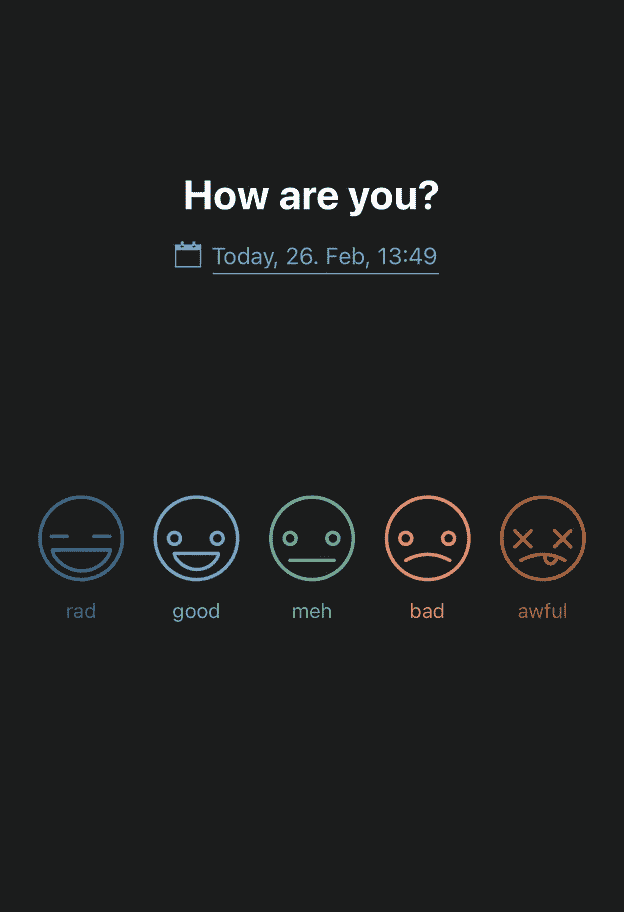

Daylio 应用。我截图。

这篇文章将介绍我在分析 Daylio 这些年收集的数据后的发现。我的调查以统计方法为特色，包括时间序列分析和相关性，并专注于情绪和活动之间的关系，情绪签到时间，以及我的情绪得分如何变化。但是等等，先别走！我知道“统计学”和“相关性”这两个术语很吓人。这就是为什么我保证我会隐藏令人讨厌的细节和复杂性。相反，我会把它们伪装成更容易消化的 21 个迷人的小图表(点击放大)。

对于阅读本文的技术专家来说，您会在文章末尾找到一个链接，指向我的 GitHub repo，其中包含我编写的用于分析数据的 R notebook，以及另一个指向我用来提取数据的库。

现在来分析一下。

[shawnanggg](https://unsplash.com/@shawnanggg?utm_source=medium&utm_medium=referral) 在 [Unsplash](https://unsplash.com?utm_source=medium&utm_medium=referral) 上的照片

## 冗长的摘要

至少连续 **1017** 天跟踪自己的心情。第一条是 2019 年 1 月 4 日**——新年决心万岁——最后一条是**2021 年 10 月 19 日**。我说至少是因为，当我写下这句话的时候，我还在使用这个应用程序，但分析不会包含 2021 年 10 月 19 日以后的数据。**

**在这 1017 天里，我记录了 1031 次我的心情(最初，我想每天记录两次，但最终只有一次)。所以，我们可以说，平均来说，我每天有**一种**情绪。图 1 是本文的第一个图表，显示了这 1031 条记录，按四种情绪“rad”、“good”、“meh”和“bad”分组。**

**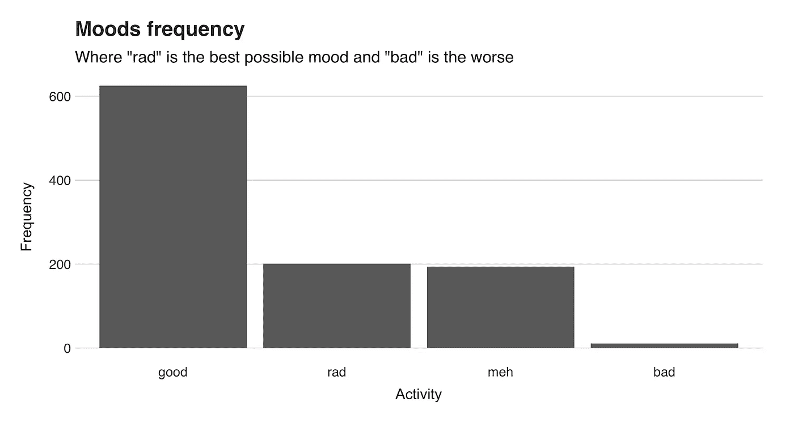**

**图一。情绪频率。**

**在 1031 个条目中出现了 625 次(**61 次** %),排在第四位的“好”情绪高居榜首。接下来是“rad”，这款应用的最佳情绪，也是我在不同的 **201** ( **19** %)场合都认同的一个。在悲伤的一端，我们有**194**(**19**%)“meh”和**11**“bad”(**1**%)。此外，还有第五种甚至更悲伤的情绪叫做“糟糕”,这种情绪在文章中没有出现，因为我从来没有使用过它。希望它会保持这种状态。**

**您可以将描述当天活动的活动列表添加到每个情绪记录中。就我而言，我通常会记录下一天中最难忘的活动，或者我在心情登记时间前后做的那些活动，这个时间大约是晚上 **9 点**(如图 2 所示)。我经常忽略的一个例子是“健身房”我这样做是因为我几乎每天都在凌晨(不到晚上 9 点)去那里(所以它不是那么令人难忘)。**

**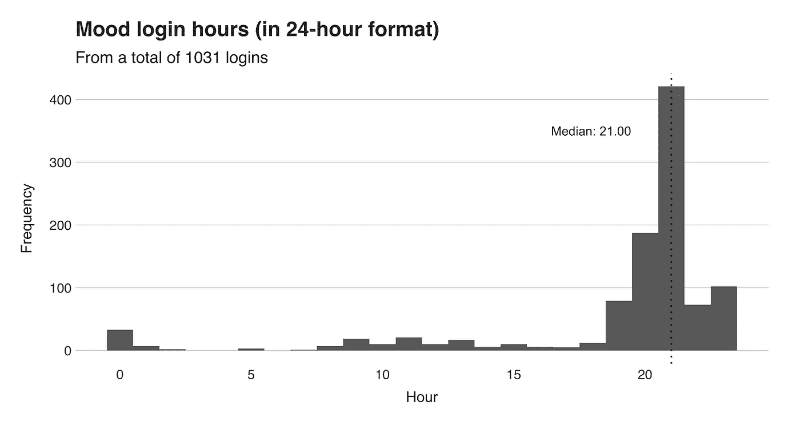**

**图二。心情登录时间，包括中位数。**

**我在这 1031 份心情记录中报告了 44 种不同的活动。此外，我将其中一些描述为有趣或无聊，快乐或悲伤，异常或不愉快。但他们就是我——他们描绘了我是谁，我做什么。**

**当我们阅读这篇文章时，你可能会看到几个意思不清楚的活动，你可能想知道它们是什么意思。因此，为了避免任何疑问，我将零星地描述一下它们。现在，跟着我看图 3，在这里我将介绍我的 44 项活动以及我选择它们的频率。**

**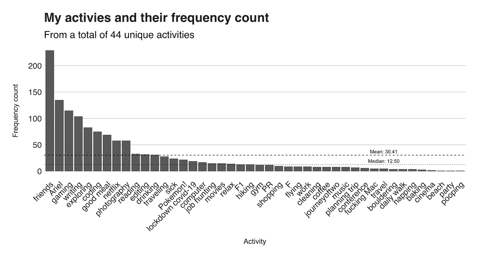**

**图 3。我的活动及其频率计数，包括平均值和中值。**

**“朋友”(不，我不是指电视节目)是最重要的活动。这个活动，用来描述和朋友度过的愉快的一天，在数据集中出现了 **229** 次。与我在 1031 次签到中添加的 1338 次活动的总和相比，这是 17.11%。这么说吧，这样的顶级活动——我在这里会很俗气——在一天结束时，朋友是留在我脑海里的东西。我做的是 *X* 还是 *Y* 并不重要。那是次要的。重要的是，如果那天晚上我和朋友在一起，我会点击“朋友”图标说，“今天是个好日子。”**

**既然我们在谈论人，我就借此机会介绍一个在我生命中扮演重要角色的人。她叫 Ariel，是我的前女友。嗯，那不是她的名字，是我选的一个假名，因为我在分析数据的时候看到了一个小美人鱼迷因。但在那之前，甚至在写分析的第一行代码之前，我就知道她的名字会出现很多很多次——的确发生了。如图表所示，她是第二个被提及最多的活动。占 **10.09** 的 **135** 个条目。相当多，对吧？毕竟我们一起分享了很多年的经历。**

**如果图 5 中有一个活动让你发笑或皱眉，我敢打赌它是“**拉屎**”我们都会便便，甚至在天气好的时候也会便便几次。然而，我只录制了一次。这是一次惊心动魄还是令人毛骨悚然的上厕所之旅？我不记得了。尽管如此，它确实标志着 2019 年 1 月 6 日。**

**给情绪分配一个数值，其中“1”表示“糟糕”,“5”表示“糟糕”,得出的平均值和中间值分别为 **3.99** 和 **4** 。因此，我们可以得出结论，我的典型心情是“好”但这种压缩三年数据的方法很无聊，尤其是因为情绪记录包括一系列活动。那么，如果我利用这些活动来发现它们是如何影响情绪的呢？图 4 有答案。**

**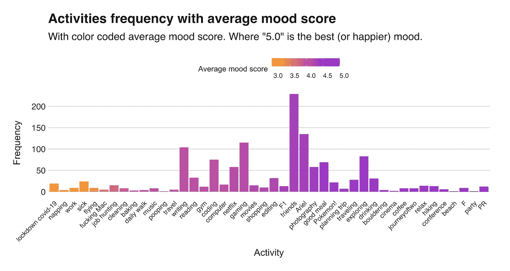**

**图 4。活动、活动频率和平均情绪得分。**

**彩色图 4 显示了活动(X 轴)和它们的频率计数(Y 轴),按照从所述活动出现的日子获得的平均情绪得分排序。在左边，橙色，我们有产生较低平均情绪分数的悲伤活动，在右边，有高分数的最快乐的活动。第一部是《禁闭的新冠肺炎》，平均情绪得分为 2.94 分，它指的是因为限制而呆在家里的日子。接下来是“午睡”，是的，我说的是午睡。你还记得你小时候逃避午睡吗？我仍然不喜欢它们——除非我感觉不舒服(“生病”也是最糟糕的活动之一)或者情绪化，不知道如何继续我的一天。**

**另一个负面活动是“他妈的 Mac”在给它加上金之前，我需要说我爱我的苹果电脑。它陪伴了我大约四年，经历了许多冒险。但是哇，这不是有问题吗？在这四年里，我已经送去修理过五次了。通常，我不在乎，因为不管怎样，东西会坏掉。但当它在我的书的第一稿截止日期前两周停止工作，并且最近的 Mac 商店离这里有四个小时的路程时，就不行了。**

**另一个值得注意的负面活动是“求职”让我给出背景。2020 年初，我在新西兰，这是我历时一年的背包探险中去过的第 11 个(也是最后一个)国家。与此同时，当我徒步旅行、开车(在左边)和吃馅饼时，一个更大的东西正在新西兰和世界其他地方展开:新冠肺炎疫情。奇怪的是，由于我在荒野中，直到我到达克赖斯特彻奇市，我才意识到情况的严重性。不久之后，封锁开始了。就这样，我独自一人在克赖斯特彻奇的一间公寓里。在我的困惑中，不知道接下来会发生什么，我宣布我的旅行结束了，去找工作。但当时找工作很艰难，不仅因为公司停止招聘，还因为我远离可能找到工作的国家。所以，我没有找工作，而是收集了一堆电子邮件，开头写着“感谢你的关注”。**

**然而，让我感兴趣的是图表中心区域和之后的一切，因为这让我感觉良好。每个紫色项目至少有 4 分的平均分，这相当于一个“好”的心情。其中之一是“朋友”，前面已经介绍过了；其他我想强调的是“神奇宝贝”、“摄影”、“美食”、“编辑”(Photoshop 中的图片)和“写作”。在“好”之后是“好”，完美的情绪，在图表的末尾用四个蓝色的活动来表示。活动“F”指的是 F，我最亲密的朋友之一，他在我的数据中，因为当他从波多黎各(我的祖国)飞往德国(我目前居住的地方)进行为期一周的冒险时，我有多开心，包括火车、无数张丑陋的自拍和啤酒。最后一个是“公关”，它提到了波多黎各的一个暑假，在那里，除了其他事情，我还拜访了 F(我们拍了更多难看的自拍)。**

**除了平均值，还有第二个统计数据叫做标准差，我把它应用到每项活动的情绪列表中。标准偏差是一个描述列表值分散程度的数字。(一个正式的、更数学化的定义是一个数字，表示列表中的值与列表中的平均值相差多少)。例如，列表`[1, 3, 6]`的标准偏差是 **2.52** ，列表`[1, 5, 10]`的标准偏差是**4.51**——后者更大，因为列表值之间有更多的“空间”。与这个实验相关的一个例子是 Ariel 的情绪得分活动列表。本次活动平均情绪 4.33。但是，因为我知道许多活动的情绪是 3 或 5——而不是 4——我预计会有很大的标准差，因为 3 和 5 远不是 4(在这种情况下)。那么，我每次活动的情绪有多分散(较大的标准差)或集中(较小的标准差)？图 5 有答案。**

****

**图 5。活动、活动频率和情绪的标准差。最后三个活动有一个未定义的标准差，因为每个活动只有一个条目。**

**上面的图表显示了每项活动的排序标准差分数，并说明了哪些活动产生了稳定或多样的情绪分数。前五个标准差是 0.0，这意味着这些类别的情绪总是相同的，例如，活动“PR”总是“rad”相反，有些类别的标准差很高。这些包括“Ariel”(因为我们既有正常的日子，也有美好的日子)，“旅行”(花几个小时坐在地铁里令人沮丧，但也很有趣)，“旅行”(我非常不喜欢旅行，所以我有两项活动)，还有小睡(所以不是所有的小睡都很糟糕)。**

**图 6 和图 7 解释了活动是如何影响情绪得分的，但是现在，我想分析相反的情况:当活动缺失时的得分。因为我有活动出现时的平均情绪，剩下的步骤是计算活动消失时的平均情绪，并减去两个数字，这产生了一个数字，表示当他们出现和不出现时情绪有什么不同。图 6 是差异，表 1 是原始数据(我故意省略了大多数活动)。**

**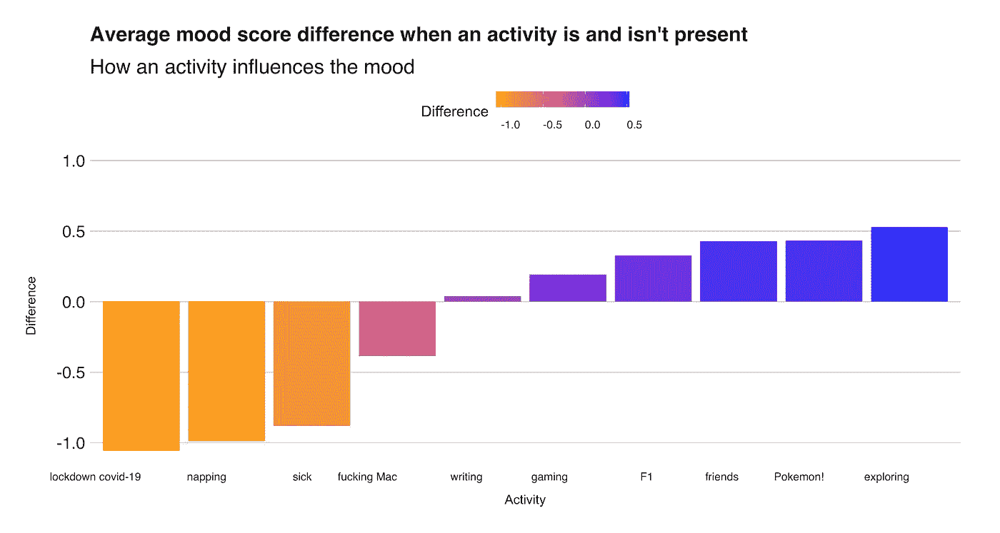**

**图 6:有活动和没有活动时的平均情绪得分差异。**

**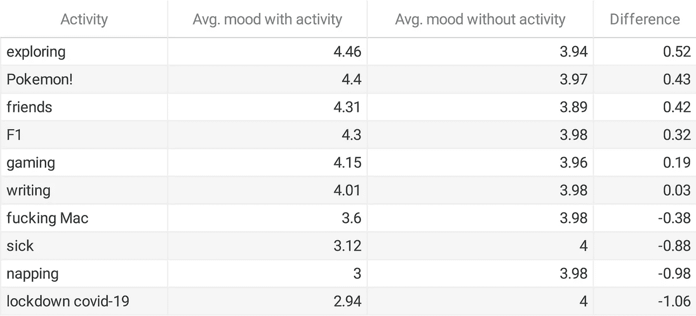**

**表 1:有活动、无活动和差异时的平均情绪得分。**

**禁闭期间我并不开心，这些图表也知道。在那些以呆在家里为亮点的日子里，平均情绪得分为 **2.94** 。但是看看当活动丢失时，它是如何增加到 4 的。相差 1.06。那是一种完整的情绪！相比之下，提升情绪的活动包括我之前介绍的几个，即“朋友”、“神奇宝贝”和其他活动，即“F1”(F1)和“探索”(指四处走走，通常带着我的相机)。**

## **活动、日历和相关性的组合**

**我每天报告的活动数量各不相同。例如，在 **318** 个场合(那是 **31** 天的百分之)，我输入无；在 **325** 场合( **31** %)，一个；而且在 **388** ( **38** %)上，不止一个。从这个不止一个的组中，我发现最热门的组合是出现了 **23** 次的“美食”和“朋友”，出现了 **11** 次的“写作”和“阅读”，以及出现了 **10** 次的“朋友”和“喝酒”。表 2 列出了前 10 名。**

**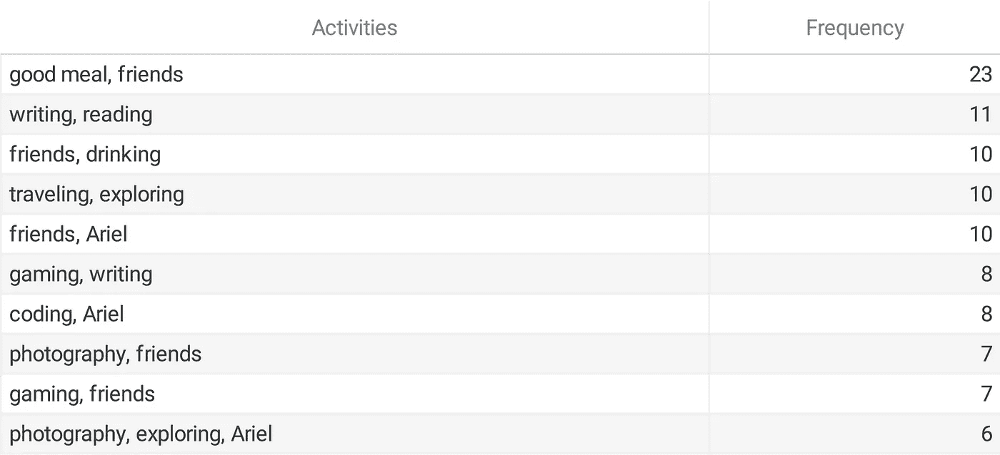**

**表 2:前 10 个组合。**

**一半的组合有“朋友”例如，“朋友”和“喝酒”，“朋友”和“游戏”，“朋友”和“摄影”。所以，我想“朋友让一切变得更好”这句老话并没有错。**

**除了接管我的活动，我可爱的朋友们也接管我的周末。在分析活动出现的日子时，我发现大多数“朋友”条目都发生在周末——周五 **46** ，周六 **45** ，周日 **40** 。图 7 显示了这些天的情况。**

**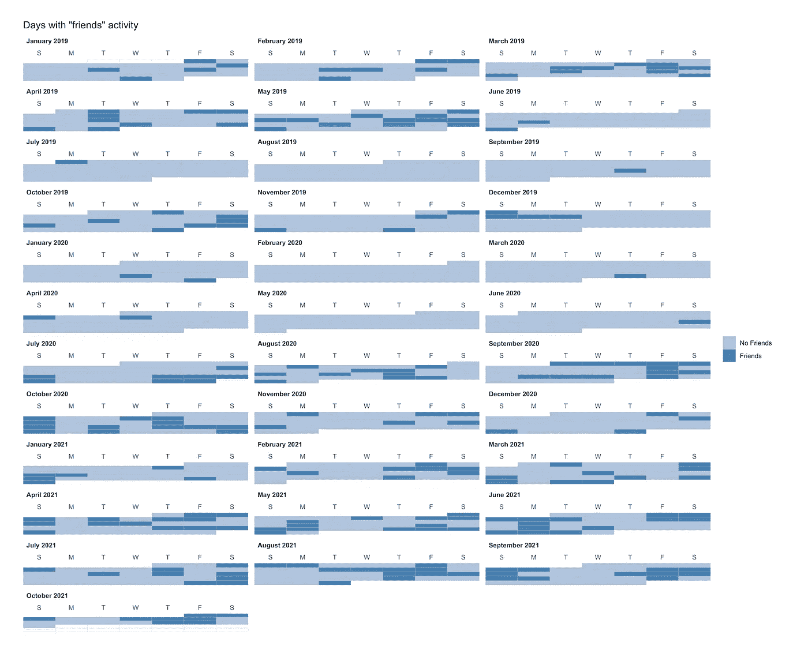**

**图 7:“朋友”日历。点击放大。**

**对比“朋友”的一个活动是“写作”(图 8)。周末和朋友在一起，这几天几乎没有时间写作，这就解释了为什么周五只有六个“写作”条目，周六有九个。相反，最好的写作日是周日( **24** )、周一( **20** )和周三( **18** )。顺便说一句，请注意我从 2021 年 5 月到 2021 年 9 月的写作瓶颈，当我开始着手你正在阅读的这项调查时，我打破了这个瓶颈。**

**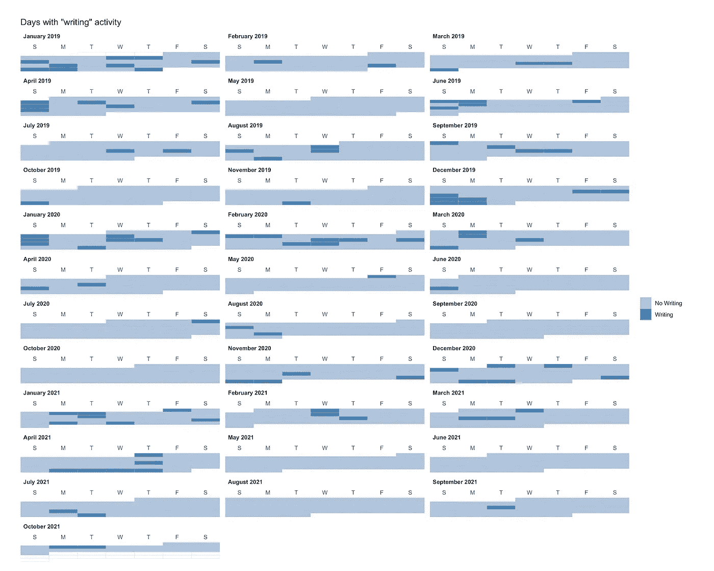**

**图 8:“写作”日历。点击放大。**

**经常出现的组合并不意味着它的一个活动经常出现，而另一个活动经常出现。“朋友”活动就是一个很好的例子。表 2 显示我不做一个，而是和朋友做各种各样的事情。但是我们能说我只和朋友吃饭或者喝酒吗？这种相关性有助于回答这个问题。在统计学中，*相关性*是一个描述“两个变量相互协调运动的程度”的数字([来源](https://www.investopedia.com/terms/c/correlation.asp#:~:text=Correlation%20is%20a%20statistical%20term,they%20have%20a%20negative%20correlation.))。在这里，活动之间的相关性是一个介于-1 和 1 之间的数字，它衡量两个活动在同一天出现的频率。例如，高相关性意味着两个活动经常在一起，而低相关性表明它们不经常一起出现。在我们可以从数据中创建的 **1892** 对活动中，最高的相关性(图 9)来自“探索/摄影”对，最低的来自“朋友/写作”——因为我很少在遇到朋友的日子写作。然而，我最喜欢的相关性是“F1/抱石”和“F1/烘焙”；对我来说，理想的周日包括早上抱石，晚上烤蛋糕，一边看 f1 比赛(周日举行)，一边狼吞虎咽地吃蛋糕。**

****

**图 9:相关矩阵**

## **随着时间的推移，我的心情是如何变化的**

**Daylio 中的每日条目有第三个数据点:记录的创建时间戳(可以选择或使用当前时间)。这个时间数据是有序的(按日期)并定期记录(每天一次)，这两个属性是创建名为*时间序列*的数据类型所必需的。除了时间之外，时间序列还有第二个值，用来测量在那个时间戳发生了什么。我这里要介绍的时间序列，追踪了我从 2019 年 1 月 4 日到 2021 年 10 月 19 日的心情评分。在下图中，您可以看到一个数据集样本，其中包含记录的时间戳和我选择的情绪得分。**

**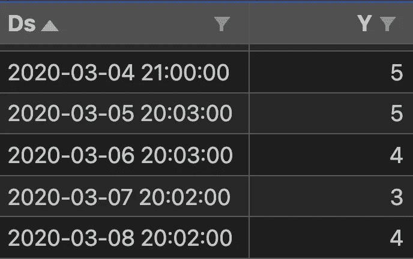**

**我的时间序列数据集的样本。第一列“Ds”表示时间，第二列“Y”表示当天的心情。**

**一旦将数据转换为时间序列，就可以应用算法来汇总数据，并发现时间如何影响值。趋势就是汇总的一个例子，它观察数据随时间的增加或减少行为。这一部分的第一个可视化是趋势线(图 10 ),描述了我的情绪从第一天开始的起伏。**

****

**图 10:时间序列趋势。**

**时间序列趋势描绘了一个不显著的下降趋势，初始得分为 **4.2** ，结束于 **4.1** 。然而，重要的是图表如何随着时间的推移而变化，特别是在 2020 年 4 月和 5 月左右的最低点——那时我正在新西兰找工作。但后来，在我获得工作机会并恢复生活(2020 年 7 月)后，分数达到了它通常的、更快乐的值。**

**时间序列的一个特点是它能够将数据分解成称为*成分*的规则间隔，允许我们从不同的时间框架角度对其进行分析。一个例子是季节成分，它在数据中寻找季节性，或者一个季节如何影响时间序列。我要研究的季节是:每日、每周和每年的季节性。通俗地说，我想知道签到的时间、日期或月份如何影响我当天选择的情绪得分。**

**对于每个季节，该算法计算其中观察到的趋势。让我们考虑每周的季节性。由于我的数据集涵盖了 1017 天，相当于 145.3 周，该算法将汇总一周中每个时刻的情绪得分，例如周一的情绪得分，然后对它们进行平均。(实际上比这复杂，但细节不在本文讨论范围内)。我认为如果我们看到图像会更好(图 11、12 和 13)。**

****

**图 11:时间序列的每周季节性。**

**上图显示了每周的季节性。它的 X 轴是有序的工作日(从周日开始)，Y 轴是受签到时间影响的情绪得分可变性。例如，我周日的情绪比周五和周四观察到的基线高出 **0.15** 点(一边看 f1 一边吃自制饼干是一种享受)，比基线低 **0.10** 点。但总的来说，一周中的时间或日期几乎不会影响我的情绪检查分数，这可以通过 Y 轴范围来表示，即从 **-0.10** 到**0.20**；仅仅相差 0.30 分，或者说情绪得分的三分之一。**

****

**图 12:时间序列的年度季节性。**

**一年中的时间比一周有更大的影响。在这种季节性中，情绪得分最多变化 **0.6** 点，如范围从 **-0.3** 到 **0.3** 的 Y 轴限制所观察到的。在今年的前五个月(除了三月)，情绪在 0.0 的基线附近，但随着德国夏季的开始(以及去比尔加滕的旅行)，情绪像温度计一样上升。这种模式的一个明显的例外是 7 月份的下降，我把这归因于新西兰的封锁和南半球的冬天。几周后，当树叶变黄时，我用连帽衫代替短裤，用南瓜香料拿铁代替椰林可乐达斯，漫长的白天和漫长的夜晚，因为我在准备另一个圣诞节，我可能会在波多黎各庆祝。**

**最后，我们有每日季节性图表，如下图 14 所示。第一次看到这个图表，看不懂。我从左到右，从上到下看了一遍，没有任何意义。于是，我放弃了，抓起手机。我查了一下时间，是上午 9 点；我检查了电子邮件，没有新消息；我看到了通知，意识到自己前一天晚上没有进入状态。我当时就做了。就在这一刻，当所有的希望都消失的时候，我明白了这个图表。**

****

**图 13:时间序列的每日季节性。**

**在文章的前面，我提到我通常会在晚上 7 点或 9 点记录我的心情。在这些时间记录意味着我在做一些不经意的事情，例如玩神奇宝贝，并且可以使用 Daylio 添加今天的数据。但如果我做的不是休闲的事情呢？如果我正在做一些很棒的事情，例如玩竞技神奇宝贝，却不能使用手机，该怎么办？如果是这样的话，那么我会等到晚些时候或者第二天早上再记录心情，这就解释了为什么在那些时候心情得分会更高。**

# **探索情绪**

**我想把文章的最后一部分献给每种情绪——毕竟，Daylio 就是关于它们的。对于每种情绪，我将讨论它最长的一段时间，最重要的活动，以及我选择它的那一天。让我们从最好的一个开始，“rad”，以最差的一个结束，“bad”**

## **拉德**

**“Rad”是最好的心情。这就是我所追求的:一个完美的一天，吸引最好的感觉、行动和人。我已经有相当一部分了； **201** 完全正确。这是五天中的一天，即 19%。但是这五分之一是一个平均值，因为也有例外，比如持续了 14 天的最长记录**。****

**我的周末很愉快(图 14)。前面提到的 201 天中有 38 天是星期六，这是我们最喜欢的一天，而 **33** 是星期天。让我感到惊讶的是那些 **32** 周二，我们经常降级的一天，人们认为这是最糟糕的一天(谷歌“为什么周二如此无关紧要”并大笑)。**

****

**图 14:工作日的天数。**

**使我的日子变得更有活力的活动是我已经展示过几次的那些(图 15)。排在第一位的是《老友记》，出现在《我的快乐时光》的 36%中，而《爱丽儿》出现在其中的 28%中。图表中的一个亮点是活动“会议”( **2.49** %)，指的是参加会议，或者更好的是在会议上发言，这是我喜欢做的事情，但最近因为世界的现状而没有做。(如果阅读这篇文章的人主持或知道适合这项工作的在线或面对面会议，请联系我，帮我提高这个低百分比。)**

****

**图 15:有这些活动的“rad”天数的百分比。**

**过去的好心情——我默认的情绪，我选择它超过其他四种情绪 625 次( **61** %)就证明了这一点。它最令人印象深刻的连胜纪录开始于 2021 年 3 月 11 日，结束于 2021 年 4 月 2 日。二十四天，其中唯一的亮点是我吃麦当劳快乐套餐来收集附送的神奇宝贝卡片。我把他们都抓住了。**

**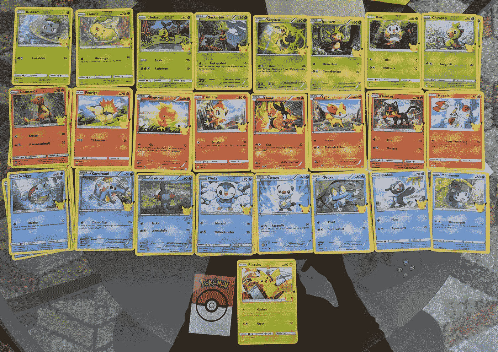**

**25 张麦当劳神奇宝贝卡片。图片由我:)**

**周一的忧郁在我的生活中是不存在的——事实上，这是我最美好的一天(图 16)。这个丑闻不断的日子，有人恨，有人爱，却给了我最美好的日子( **101** )，一个离亚军周日不远的数字，以及它的 **99** 享受时刻。**

**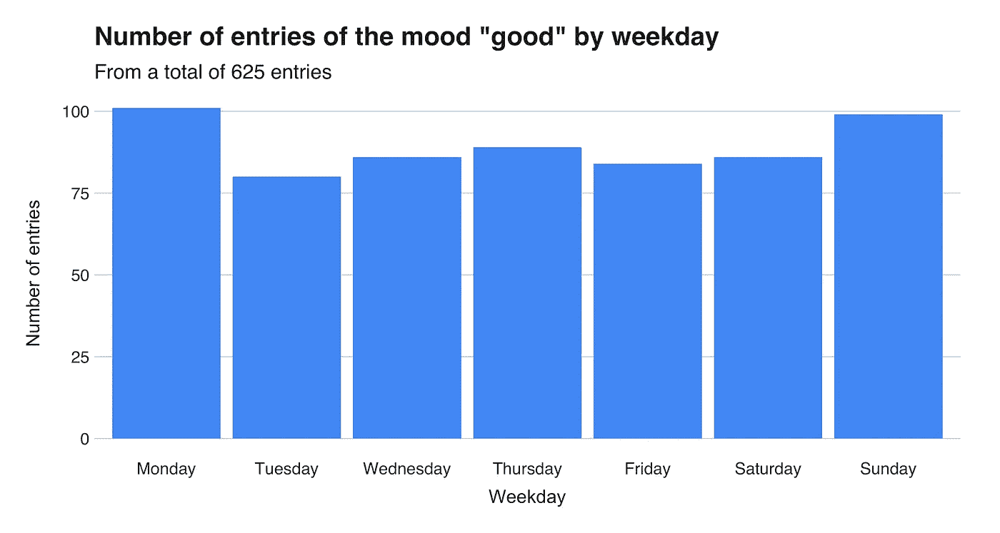**

**图 16:工作日的“好”心情。**

**我的好日子和孤独的活动。与 rad days 的社交活动相反，good days 的特色是我更喜欢独自做的活动(图 17)。例子有“写作”(如斯蒂芬·金所说，“写作是一项孤独的工作”)，“阅读”，不用说，“便便”。只有我的手机被允许加入后一个。**

****

**图 17:有这些活动的“好”天的百分比。**

**牛津将“meh”定义为表示缺乏兴趣的感叹词——我同意。meh day 是无趣的一天。你不快乐也不悲伤；你是我。这几天我过了 194 天。这是我一天中的百分之十九(T2)，也是我快乐时光的百分之一。幸运的是，我还没有经历一连串无趣的日子。最长的持续了七天，归因于新西兰第一次封锁的前几天(2020 年 3 月 19 日，直到 3 月 25 日)。**

**星期天是最无聊的一天。(在我对这一天说了那么多美好的事情之后，这怎么可能呢？).但是我不能对星期三说同样的话，让我吃惊的是，星期五。图 18 显示了这些数字。**

****

**图 18:工作日的“meh”心情。**

**至于活动，只有三个经常出现在 meh 日(图 19)。**

**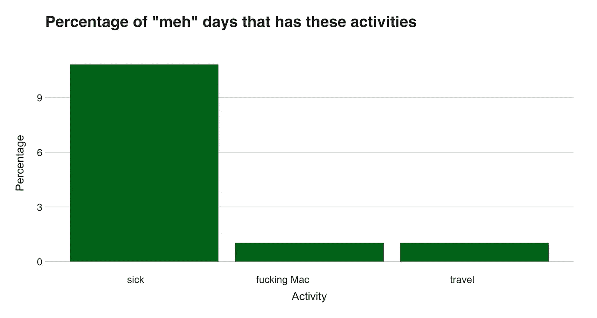**

**图 19:有这些活动的“meh”天数的百分比。**

## **严重的**

**我们都同意糟糕的一天糟透了。对我来说，糟糕的一天意味着我焦虑、疯狂或过度思考。这些都不是愉快的感觉。不过，像这样的日子很少见。到目前为止，我在 1031 天中使用这个分类 **11** 次( **1** %)。他们来了就走了。最长的“连胜”只持续了两天:2020 年 4 月 4 日至 5 日和 2021 年 7 月 9 日至 10 日。更好的是:他们周日不会来(图 20)。因为再一次，我保证这是我最后一次带这个，徒步旅行，抱石，f1 和烘焙有什么不好？**

****

**图 20:工作日的“坏”情绪。**

**我仍然觉得有趣的是，“午睡”是一种与糟糕的日子联系在一起的活动(图 21)。但是午睡本身并不是坏事。错的是我去午睡城的原因(正如一个朋友喜欢说的)。我在逃避什么情况吗？睡一觉，也许就好了。我糊涂了吗？睡觉，也许你会找到答案。但我知道没那么简单。有时我需要接受现状，度过一天，因为正如数据显示的那样，明天我会感觉更好。**

**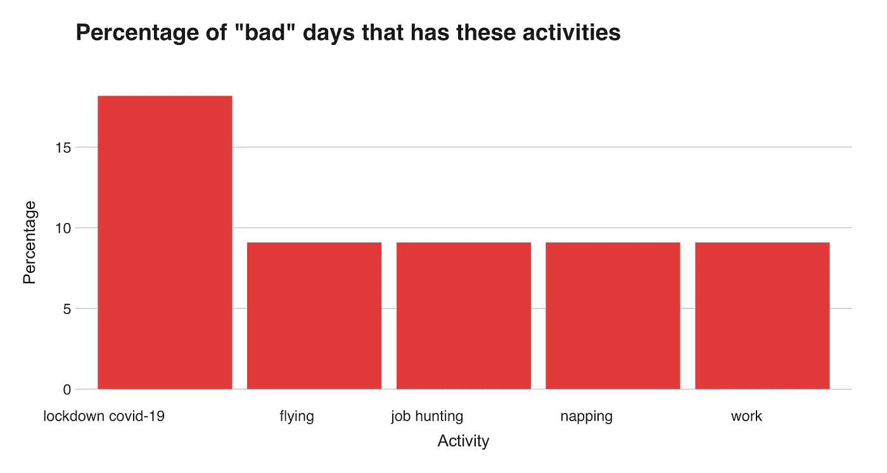**

**图 21:有这些活动的“糟糕”日子的百分比。**

## **最后的话**

**过去的三次改变给我带来了很多改变。这一切都是从我在国外有一个正常、稳定、美好的生活开始的。然后我的优先事项改变了。过去很重要的事情现在已经不那么重要了；我的恐惧不再存在；我的梦想成了我的头等大事。所以，我做了一些激烈的事情。我辞掉了我热爱的工作，告别了我亲爱的朋友，卖掉了我的东西，带着我的相机，笔记本电脑，还有 Ariel 登上了飞机。我背着背包生活，写一本书，提高我的摄影水平。实现梦想！**

**但是当病毒失控时，它提前结束了。因此，我不得不在一个美丽的国家用四面墙内的夜晚来代替我在森林里的夜晚，那里的冬天是在六月，做一个霍比特人离现实不远。**

**就在这些墙里面，我思考着接下来会发生什么。我贪婪的一面想留下来延长这次冒险，尽管它已经不可持续了。我耗尽了我的积蓄，浪费了我的时间，没有一个计划。直到一个机会出现，我登上了飞机。**

**飞机把我带到了 416 天前我离开的那个城市。虽然我很高兴回来，但我不能忽视新环境是多么独特和奇怪。我少了 7 公斤。，几件衬衫，不得不戴着口罩早早回家，认识的人大多都走了。**

**一年后，我坐下来思考这些时刻和我的感受。知道我已经记录了我的情绪和活动很长一段时间，我想确认我所记得的是准确的，还是我只是感到怀旧。这是两者的混合。**

**写这篇文章让我想起了很多时刻。这让我想起了我的背包客年，我的波多黎各之旅，与朋友的无数晚餐，我周日下午的蛋糕和一级方程式赛车，以及新的神奇宝贝游戏的发布。它也带回了令人不快的记忆，包括孤独的日子，生病的时候，当我的 Mac 电脑没电了，当我的电子邮件被世界各地的公司自动拒绝时。写这个也带来了很多惊喜。例如，我没想到在新西兰的最后几天，我的情绪得分会有如此明显的下降，周日活动之间的相关性，或者根据数据，我三年中只大便过一次。**

**如果有什么东西我会带走的话，那就是从另一个角度看那些改善我生活的事情——朋友、探险、摄影、写作和神奇宝贝——是多么美好。当然，这个我早就知道了。我爱我的朋友，带着我的相机到达一个新的地方，花一个安静的晚上写作，以玩最新的神奇宝贝游戏结束。但这是我记得的，有时我们的记忆会偏向我们喜欢的东西——然而，用数据见证和确认这些事实使晚上 9 点点击我的手机的那几秒钟成为一项值得的投资。**

**你可以在[https://github.com/juandes/daylio-mood-analysis](https://github.com/juandes/daylio-mood-analysis)的 GitHub 中找到我编写的用于分析和可视化数据的源代码，以及在[https://github.com/MichaelCurrin/daylio-csv-parser](https://github.com/MichaelCurrin/daylio-csv-parser)用于转换数据的库代码。我故意省略了数据集。**