# IVFPQ + HNSW 用于十亿级相似性搜索

> 原文：<https://towardsdatascience.com/ivfpq-hnsw-for-billion-scale-similarity-search-89ff2f89d90e>

## 十亿级矢量数据集的最佳索引方法


保罗·塔尔博特在 [Unsplash](https://unsplash.com?utm_source=medium&utm_medium=referral) 上的照片

我们在上一篇文章中了解了 [**IVFPQ**](/similarity-search-with-ivfpq-9c6348fd4db3) ，其中倒排文件索引(IVF)与[乘积量化](/product-quantization-for-similarity-search-2f1f67c5fddd) (PQ)相结合，创建了一种有效的大规模相似性搜索方法。

[](/similarity-search-with-ivfpq-9c6348fd4db3) [## 使用 IVFPQ 进行相似性搜索

### 了解如何实现倒排文件索引(IVF)以及产品量化(PQ ),以实现快速有效的…

towardsdatascience.com](/similarity-search-with-ivfpq-9c6348fd4db3) [](/product-quantization-for-similarity-search-2f1f67c5fddd) [## 用于相似性搜索的产品量化

### 如何在内存中压缩和适应一个庞大的向量集，以便用非对称距离计算进行相似性搜索…

towardsdatascience.com](/product-quantization-for-similarity-search-2f1f67c5fddd) 

在本文中，我们将了解 **HNSW** 以及它如何与 IVFPQ 一起使用，以形成十亿级相似性搜索的最佳索引方法。

我们将首先介绍 NSW 和 skip list，这是构建 HNSW 的两个重要基础。我们还将介绍如何使用 [Faiss](https://github.com/facebookresearch/faiss) 实现 HNSW，不同参数设置的效果，以及 HNSW 索引的不同变体如何在搜索质量、速度和内存使用方面进行比较。

# **内容**

[**1。简介**](#80cb)
[**2。可导航小世界(新州)**](#427b)
∘ [(A)新州—建设](#2c8e)
∘ [(B)新州—搜索](#2a7b)
[**3 .跳过清单**](#1469)
[**4。分层可导航小世界(hnsw)**](#57a8)
∘[(a)hnsw—构造](#4f45)
∘ [插入过程](#0582)
∘ [启发式选择](#2a02)
∘ [(B) HNSW —搜索](#4dbd)
[**5 .用 Faiss 实现:indexhnswflat**](#c7d8)
∘[效果的 m，efConstruction，和 efSearch](#9342)
[**6。用 Faiss 实现:IndexIVFPQ+HNSW**](#9718)
[**7。HNSW 指标对比(有/无 IVF 和/或 PQ)**](#c8f9)
[**8。概要**](#baa5)

# 1.介绍

图由顶点和边组成。边是连接两个顶点的线。让我们称连接的顶点为朋友。

在向量的世界中，相似的向量通常彼此靠近。因此，如果向量被表示为图上的顶点，逻辑上，靠近在一起的顶点(即，具有高相似性的向量)应该被连接为*朋友*。即使他们没有作为朋友*连接在一起*，他们也应该可以很容易地通过一两个顶点到达彼此。

对于一个可导航的图，每个顶点都必须有朋友。否则就没有办法到达顶点。有*个朋友*很好，但是有太多的*个朋友*对一个图来说代价会很大。想想保持这些连接所需的内存和存储，以及在搜索期间比较距离所需的计算次数。

通常，我们不希望图形看起来像下面这样。

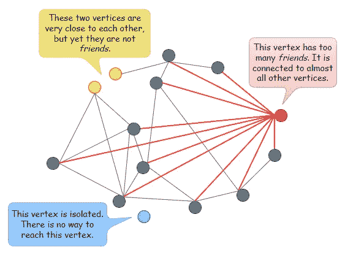

除非另有说明，所有图片均为作者所有

> 我们想要的是一个具有[小世界网络](https://en.wikipedia.org/wiki/Small-world_network)特性的可导航图，其中每个顶点只有少量的连接，并且两个随机选择的顶点之间的平均跳数很低。

# 2.可航行的小世界(新南威尔士州)

从概念上讲，使用 Delaunay 图(或 [Delaunay 三角剖分](https://en.wikipedia.org/wiki/Delaunay_triangulation))进行近似最近邻搜索似乎是理想的，因为彼此靠近的顶点是*朋友*，并且不存在孤立的顶点。


一个 Delaunay 图的例子

然而，构建一个 Delaunay 图并不容易和直接，并且搜索效率只是次优的。例如，如果两个顶点 A 和 B 相距很远，我们需要通过大量从 A 开始的*友*连接才能到达 B，反之亦然。

因此，新南威尔士州使用一种更简单的方法来构建 Delaunay 图的近似值，而不是构建精确的 Delaunay 图。

## 新南威尔士州——建筑

NSW 图是通过以随机顺序一个接一个地插入顶点来构建的(即向量首先被打乱)。

> 当插入一个新顶点时，它将连接到与其最近的现有顶点。

在下图中，`M`被设置为 3。我们从插入 a 开始。此时，图中没有其他顶点。接下来，我们插入 B。由于图中只有 A，我们将 B 连接到 A。然后我们插入 C。现在图中只有 A 和 B，所以我们将 C 连接到 A 和 B。接下来，我们插入 D。同样，由于图中只有 A，B 和 C，我们将 D 连接到 A，B 和 C。

现在，当我们插入 E 时，图中有四个其他顶点，即 A、B、C 和 d。由于`M`设置为 3，我们只将 E 连接到最近的三个顶点，即 B、C 和 d


用`M=3`构建 NSW 图

如果我们继续以这种方式插入顶点并构建图形，我们可以得到如下所示的 NSW 图形。

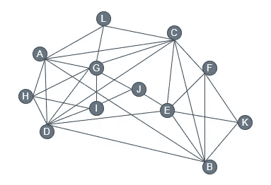

新南威尔士州图表示例

随着越来越多的顶点被插入，可以观察到在早期阶段建立的一些连接已经变成了长距离链接。例如，看看上图中的链接“A — B”和“C — D”。

## 新南威尔士州——搜索

在新南威尔士州图上的搜索遵循简单的贪婪搜索方法。

> 在每一步中仅使用局部信息，并且不需要数据的维度或分布的先验全局知识。这就是新州的妙处，可以从任何一个顶点发起搜索。

可以随机选择搜索的入口点。从当前点开始，该算法将试图找到离查询向量最近的*朋友*，并向该顶点移动。

如下所述，重复该步骤，直到它再也找不到任何比自己更接近查询向量的*朋友*。


在新南威尔士州图上搜索最近邻(示例 1)

下图显示了在构建的早期阶段创建的远程链接如何有利于一些搜索案例。在这个例子中，入口点、A 和查询向量位于图的相对两端。由于长距离链接“A — B”，搜索过程只需两跳(A→B→K)即可到达查询向量的最近邻居。

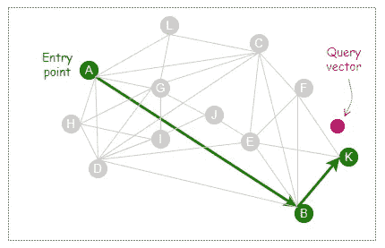

在新南威尔士州图上搜索最近邻(示例 2)

新南威尔士州的搜索质量可以通过使用随机入口点执行多次搜索来提高。

# 3.跳过列表

[跳表](https://en.wikipedia.org/wiki/Skip_list)是 W. Pugh [3]发明的一种数据结构，基于[链表](https://en.wikipedia.org/wiki/Linked_list)构建，元素排序。

下面是一个链表的例子，其中的元素已经排序。链表上的节点包含元素的值和指向下一个元素的指针。


具有排序元素的链表

跳表由多层链表组成，其中原始链表在最底层(0 级)。较高的级别包含在级别 0 上找到的相同元素，但只是它们的子集。级别越高，元素的数量越少。


跳转列表数据结构

> 跳过列表的上层充当高速公路，因为一些元素在遍历期间被跳过。

这使得在跳过列表中快速搜索元素。搜索从最顶层开始，遍历节点，只有当前指针指向下一个值大于要搜索的值的元素时，才向下搜索。

例如，搜索‘91’只需要遍历 3 个节点，如果要在原始链表上进行搜索，则需要遍历 8 个节点。


在跳过列表中搜索 91

# 4.分层可导航小世界

HNSW 是新南威尔士州的新发展，其中的层次结构构成了一种优雅的细化，其灵感来自于 skip list 的分层结构。

HNSW 中的分层组合将不同长度的链路分成不同的层。远程链接可以在上层找到，而短程链接在底层。

长距离链接在减少到达正在寻找的最近邻居附近所花费的时间和精力方面起着重要的作用。

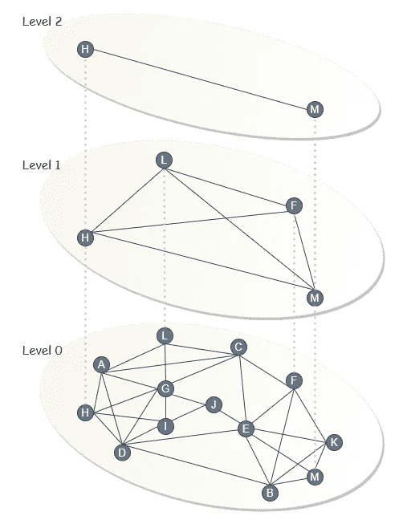

HNSW 的一个例子

## HNSW——建筑

HNSW 的构建与 NSW 非常相似，其中的图结构也是通过一个接一个地插入顶点来增量构建的。

然而，与 NSW 不同，顶点在插入之前不需要被打乱。这是因为 HNSW 中的随机效应是由水平随机化完成的。这是如何工作的？

嗯，在构建图形的过程中，每个顶点被随机分配一个整数，`ℓ`，表示该顶点所在的最大层数。例如，如果一个顶点被赋予了`ℓ=3`，那么我们可以找到存在于第 2 层、第 1 层和第 0 层的顶点。

> “以指数衰减概率分布随机选择元素所在的最大层”——[y . Malkov 和 D. Yashunin](https://arxiv.org/abs/1603.09320)

这使得`ℓ=1`成为顶点最有可能收到的赋值，并且获得更大的`ℓ`值的概率极低。

因此，大多数顶点总是出现在第 0 层。随着级别数的增加，这些级别上的顶点数会显著减少。为了了解`ℓ`的分布情况，请看下面来自 50 万个向量的随机数据集的样本。


来自 500，000 个向量的随机数据集的ℓ分布

## 插入过程

在插入过程中，在每一层上，该算法贪婪地探索顶点的[邻域](http://mathonline.wikidot.com/neighbourhood-degrees-and-degree-sequence#toc0)，并维护当前找到的新插入顶点的最近邻居的动态列表。

对于从顶层开始的插入过程的第一阶段，这个动态列表的大小被设置为 1。然后，找到的最近的顶点被用作下一层的入口点，搜索继续进行。

一旦达到低于`ℓ`的水平，这标志着插入过程的第二阶段。从这一点开始，动态列表的大小遵循由名为`efConstruction`的参数设置的值。除了作为下一层(如果有的话)的入口点之外，当前找到的最近邻居也是候选的*朋友*，其中的`M`将被选择来与当前层上新插入的顶点建立连接。

当新插入顶点的连接在级别 0 建立时，插入过程结束。

> 根据论文【2】，“通过评估列表中最近的先前未评估的元素的邻域，在每一步更新动态列表，直到评估列表中每个元素的邻域”。
> 
> 因此`efConstruction`(设置动态候选列表的大小)可以被定义为控制要探索的候选邻居数量的参数。它标志着施工期间的勘探深度。

## **启发式选择**

之前，我们了解到对于新南威尔士州，将选择最接近新顶点的`M`个现有顶点进行连接。这是一种简单的方法，只选择并连接到最近的顶点。对于 HNSW 来说，使用启发式方法建立连接是提升性能的一个进步。

> 启发式选择不仅考虑了顶点之间的最短距离，还考虑了图上不同区域的连通性。

考虑下面的例子。很明显，右边的两个集群没有直接连接。为了从 A 到 Y，人们必须穿过一条很长的路线，通过左边的另一个星团。

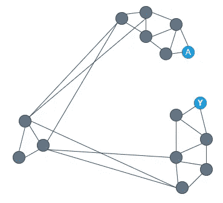

使用`M=2`，当我们在如下所示的位置插入一个新的顶点 N 时，我们得到 4 个候选的*朋友，* A，B，X 和 Y，其中 2 个将被选择与 N 连接


启发式选择

在 4 个候选点中，A 最接近新顶点。因此，选择 A 连接到 n。

距离 N 最近的下一个顶点是 B。但是，因为距离“B — A”小于距离“B — N ”,所以忽略顶点 B，而考虑下一个最近的顶点 Y。

此时，试探选择将 N 连接到 Y，因为距离‘Y-A’大于‘Y-N’。通过这样做，我们现在能够在右侧的两个集群之间建立直接连接。

> 该启发式算法增强了顶点邻域的多样性，并且对于高度聚集的数据的情况导致了更好的搜索效率。

在构建过程中，除了为每个新顶点建立`M`连接，HNSW 还关注每个顶点在任一时间点的连接总数。为了保持小世界的可导航性，对于 0 级，每个顶点的最大连接数通常被限制在`*2*M*`，对于所有其他级别，最大连接数被限制在`*M*`。

## (B)HNSW-搜索

HNSW 的搜索过程从顶层的指定入口点开始。它遵循与插入过程所描述的相同的搜索过程，贪婪地探索顶点的邻域以找到最接近查询向量的顶点并向其移动。

当它再也找不到任何比自己更接近查询向量的顶点时，它就下降到下一级。

搜索继续进行，直到到达底层(层 0)，在这一点上将探索更多的候选邻居。当前找到的最近邻居的动态列表的大小将遵循由名为`efSearch`的参数设置的值。一旦完成了所有需要的探索，就会返回动态列表中的`k`个最近邻居。

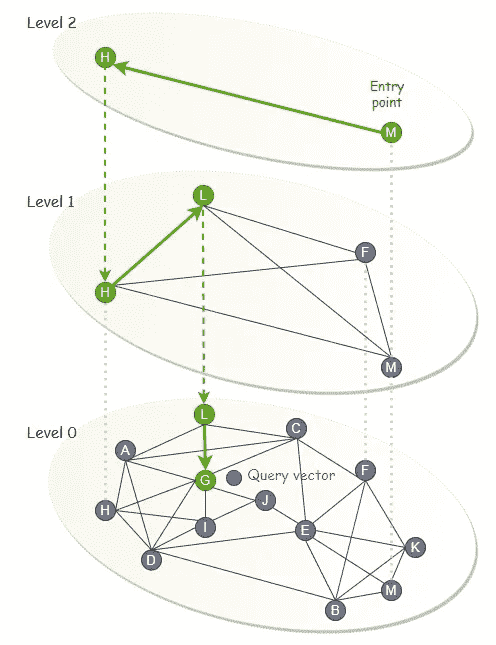

在 HNSW 图上搜索最近邻

# 5.用 Faiss 实现:IndexHNSWFlat

[**Faiss**](https://github.com/facebookresearch/faiss)**(脸书 AI 相似性搜索)是一个针对高效相似性搜索进行了高度优化的库。**

**在 Faiss 中，HNSW 通过`IndexHNSWFlat`实现。Faiss 中的索引是一个数据结构，一个可以使用`add`方法将向量添加到索引中的对象，以及使用`search`方法在给定一些查询向量的情况下执行最近邻搜索。*平面*索引通常是指没有任何压缩或编码的索引，其中实际向量按原样存储。**

## **M、efConstruction 和 efSearch 的效果**

**在本节中，我们将绘制并检查`M`、`efConstruction`和`efSearch`对 HNSW 的影响。**

> **概括来说，`*M*`是在构建过程中为每个新顶点建立的连接数。`efConstruction`是构建期间要探索的候选邻居的数量，而`efSearch`是搜索期间要探索的候选邻居的数量。**
> 
> **为了生成这些图，300 万个 128 维向量被添加到`IndexHNSWFlat`，并且使用 1000 个查询向量来执行搜索。这些是使用 Faiss 数据集模块生成的合成矢量。**
> 
> **准确性，或者说搜索质量，是由检索性能决定的。在我们的例子中，它是用`1-recall@3`测量的。这是在每个查询的前 3 个结果中返回真正最近邻的查询向量的分数。**

**以下是对上述参数对 HNSW 的影响的观察。**

**对于查询向量搜索，速度受`M`、`efConstruction`和`efSearch`的影响。当这些参数的值增加时，搜索通常会变慢。**

****

**1，000 个查询向量的每个查询的平均搜索时间(毫秒)。**

**同样的参数也会影响搜索质量。更大的`M`、`efConstruction`或`efSearch`值可以获得更高的召回率。**

**请注意，将`efConstruction`设置为太小的值对获得合理的性能没有帮助。在这种情况下提高`M`或`efSearch`的值没有帮助。为了获得满意的结果，绝对需要一个可行的`efConstruction`值。**

**例如，在我们的例子中，`efConstruction=40`连同`M=32`和`efSearch=16`能够以每个查询 0.24 毫秒的快速搜索速度达到 0.85 的令人印象深刻的召回率。这意味着在 85%的情况下，每个查询的前 3 个结果中都会返回真正的最近邻。**

**如果我们不介意较慢的搜索，将`efSearch`增加到 76 甚至可以将召回率提高到接近完美的 0.97 分！**

**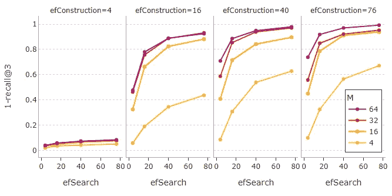**

**1000 个查询向量的召回性能。**

**可以看到，在`M`、`efSearch`和`efConstruction`的高值达到某一点后，回忆开始慢慢趋于平稳。此外，请注意为`M`和`efConstruction`设置较高的值会导致构建时间明显延长，如下图所示。**

**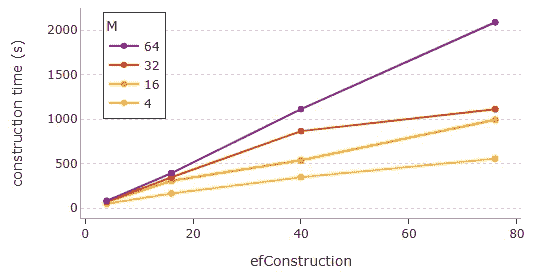**

**300 万个 128 维向量的构建时间。**

**最后，指示内存使用的 HNSW 的索引大小随着`M`线性增长。**

**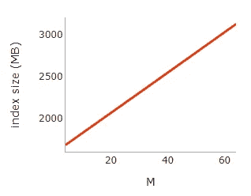**

**300 万个 128 维向量的索引大小(MB)。**

**下面的气泡图总结了`M`、`efConstruction`和`efSearch`对 HNSW 的搜索速度和准确性的影响，以及对索引大小和构建时间的影响。**

**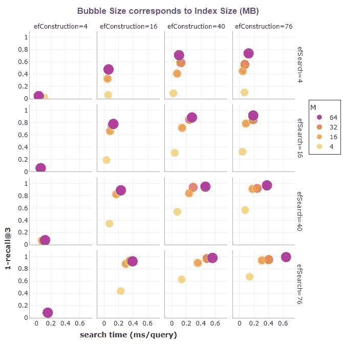****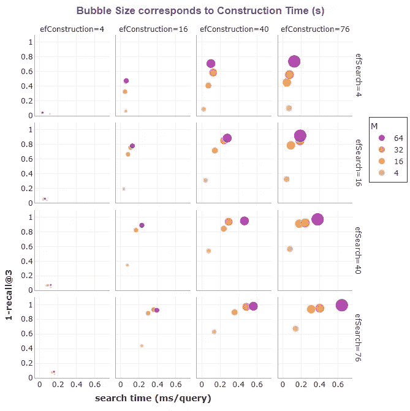**

**如果内存不是问题，HNSW 是提供快速和高质量搜索的绝佳选择。**

# **6.用 Faiss 实现:IndexIVFPQ + HNSW**

**厉害！我们已经学习了如何用 Faiss 实现 HNSW。但是我们如何将 HNSW 与 [IVFPQ](/similarity-search-with-ivfpq-9c6348fd4db3) 一起使用呢？**

**在 Faiss 中， [IVFPQ](/similarity-search-with-ivfpq-9c6348fd4db3) 用`IndexIVFPQ`实现。**

> **我们之前看到的`IndexHNSWFlat`现在作为`IndexIVFPQ`的粗量化器。**
> 
> **粗略量化器负责寻找最接近查询向量的分区质心，以便只需要在那些分区上执行向量搜索。**

**下面的代码显示了如何用`IndexHNSWFlat`创建一个`IndexIVFPQ`作为粗量化器。**

**注意`IndexIVFPQ`需要在添加数据库向量之前用 k-means 聚类进行训练。为此，使用了`train`方法。一旦创建了索引，就可以设置`nprobe`的值来指定要搜索的分区数量。**

> **在 Faiss 中，也可以使用`[index_factory](https://github.com/facebookresearch/faiss/wiki/The-index-factory)`函数而不是类构造函数来创建索引。这种替代方法非常有用，尤其是对于构建复杂的复合索引，这种索引可能包含预处理步骤，如 [PCA](https://en.wikipedia.org/wiki/Principal_component_analysis) ，或者其他类型的向量转换和细化。**
> 
> **使用`index_factory`，通过指定向量的维数(例如 128)和工厂字符串(例如“IVF10000_HNSW32，PQ16”)作为函数的输入，可以将几行代码简化为一行。**

```
index = faiss.index_factory(128, "IVF10000_HNSW32,PQ16")
```

> **上面的代码使用`*index_factory*`为 128 维向量创建一个索引。它是一个具有 10，000 个分区的倒排文件索引，使用 16 个 8 位段的乘积量化(如果未指定位数，则默认为 8 位)。粗略量化器是基于图形的 HNSW 索引，对于每个新顶点有 32 个连接。**

# **7.HNSW 指数比较(有/无 IVF 和/或 PQ)**

**在本节中，我们将研究 HNSW 索引的不同变体，以及它们在搜索准确性、速度和内存使用方面的比较。它们是:**

*   **IVFPQ+HNSW**
*   **试管婴儿+HNSW**
*   **HNSW**
*   **HNSW+PQ**

**Faiss `index_factory`用于通过以下工厂字符串创建这四种类型的索引:**

> *****IVF65536_HNSW32，PQ32*** :这本质上是 **IVFPQ+HNSW** 。它是一个具有 65，536 个分区的倒排文件索引，使用 32 个 8 位段的乘积量化。粗量化器是基于图形的 HNSW 索引，带有`M=32`。**
> 
> *****IVF65536_HNSW32，平*** :这本质上是 **IVF+HNSW** 。它是一个有 65，536 个分区的倒排文件索引。粗量化器是基于图形的 HNSW 索引，带有`*M=32*`。**
> 
> *****HNSW32，Flat*** :这本质上只是 **HNSW** ，一个基于图形的索引，带有`*M=32*`。**
> 
> *****HNSW32_PQ32*** :这个本质上是 **HNSW+PQ** 。它是一个基于图形的 HNSW 索引，带有`*M=32*`，使用乘积量化，有 32 段，每段 8 比特。**

**和之前一样，在这些索引中加入 300 万个 128 维向量，使用 1000 个查询向量进行搜索。至于`efConstruction`和`efSearch`，使用 Faiss 的默认值。**

**在四种类型的索引中， **IVFPQ+HNSW** 在索引大小或内存使用方面是冠军。它的大小只有 154 MB，内存效率比单独的 HNSW 高 15 倍。**

**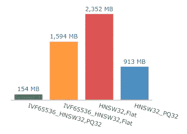**

**300 万个 128 维向量的索引大小(MB)。**

**对于基于 IVF 的索引，增加`nprobe`(要搜索的分区数量)会导致更长的搜索时间，但会提高召回性能。**

**根据使用的`nprobe`的值，基于 IVF 的索引可以比 HNSW 或 HNSW+PQ 的性能更好或更差。**

**从下面的图表中，我们可以了解当`nprobe=128`用于基于 IVF 的索引时，索引的相对性能。**

******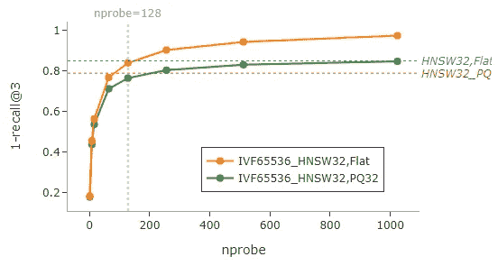**

> **选择合适的`nprobe`是平衡搜索速度和准确性的关键。**

# **8.摘要**

**下表显示了四种索引的召回性能与搜索时间的关系，以及它们各自的大小(MB)。**

**对于基于 IVF 的索引，使用的`nprobe`是 128。**

**结果可以从下面的图表中看到。在条形图上，我们可以看到四种类型的索引在搜索速度上的巨大差异，相比之下，在回忆性能上的差异更为细微。**

**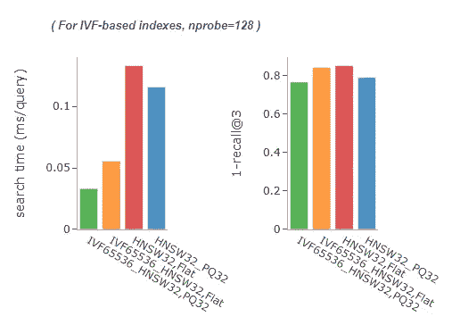**

**下面的气泡图很好地展示了搜索时间与回忆性能的对比。气泡的大小对应于索引的大小，这表示内存使用情况。**

**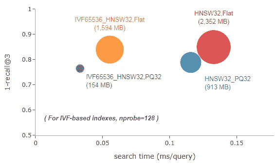**

**在搜索速度方面，可以观察到基于试管婴儿的索引(绿色和橙色气泡)领先。由于搜索的非穷举性质，它们的速度非常快，因为搜索只在一小部分分区上执行。**

**在准确性方面，HNSW(红色气泡)领先，PQ 指数(绿色和蓝色气泡)落后。PQ 指标是带有[乘积量化](/product-quantization-for-similarity-search-2f1f67c5fddd)的指标。由于它们进行有损压缩，因此预期它们具有较低的精度。然而，它们的弱点被内存中的巨大节省所高度补偿。**

**显然， **IVFPQ+HNSW** (绿色泡泡)无论是搜索速度还是内存效率都是赢家。它拥有最小的内存占用(哦，看看绿色泡泡有多小)，通过使用`nprobe=128`，它成功实现了每个查询 0.03 毫秒的最快平均搜索时间，并且具有 0.77 的良好召回率。**

**如果需要更高的召回率呢？如下图所示，增加`nprobe`可以达到目的，但代价是搜索时间更长。记住，选择一个合适的`nprobe`是在权衡利弊中取得明智和现实结果的基础。**

**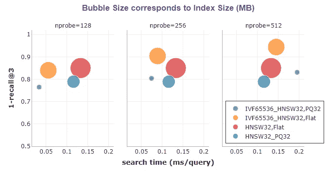**

**增加`nprobe`对基于 IVF 的指标的影响。当`nprobe`增加时，绿色和橙色的气泡向右上方移动。**

> **IVFPQ 与作为粗量化器的 **HNSW** 一起提供了一种极其节省内存且无可挑剔的快速搜索，对于大规模近似最近邻搜索具有良好的准确性。**

**毫不奇怪，凭借速度、内存使用和准确性的良好平衡， **IVFPQ+HNSW** 成为十亿级相似性搜索的最佳索引方法。**

****

**照片由 [Japheth Mast](https://unsplash.com/@japhethmast?utm_source=medium&utm_medium=referral) 在 [Unsplash](https://unsplash.com?utm_source=medium&utm_medium=referral) 拍摄**

# **参考**

**[1] Y. Malkov，A. Ponomarenko，A. Logvinov 和 V. Krylov，[基于可导航小世界图的近似最近邻算法](https://doi.org/10.1016/j.is.2013.10.006) (2013)**

**[2] Y. Malkov 和 D. Yashunin，[使用分层可导航小世界图的高效和鲁棒的近似最近邻搜索](https://arxiv.org/abs/1603.09320) (2018)**

**[3] W. Pugh，[跳过列表:平衡树的概率替代方案](https://dl.acm.org/doi/10.1145/78973.78977) (1990)，《美国计算机学会通讯》，第 33 卷，第 6 期，第 668-676 页**

**[4] J .布里格斯，[分层可导航小世界(HNSW)](https://www.pinecone.io/learn/hnsw/)**

**[5] Y. Matsui，[亿级近似最近邻搜索](https://www.youtube.com/watch?v=SKrHs03i08Q) (2020)**

**[6] [Faiss Wiki](https://github.com/facebookresearch/faiss/wiki/)**

**[7] J. Arguello，[评价指标](https://ils.unc.edu/courses/2013_spring/inls509_001/lectures/10-EvaluationMetrics.pdf)**

```
***Before You Go...****Thank you for reading this post, and I hope you’ve enjoyed learning the best indexing approach for billion-scale similarity search.**If you like my post, don’t forget to hit* [***Follow***](https://peggy1502.medium.com/) *and* [***Subscribe***](https://peggy1502.medium.com/subscribe) *to get notified via email when I publish.**Optionally, you may also* [*sign up*](https://peggy1502.medium.com/membership) *for a Medium membership to get full access to every story on Medium.*📑 *Visit this* [*GitHub repo*](https://github.com/peggy1502/Data-Science-Articles/blob/main/README.md) *for all codes and notebooks that I shared in my posts.*© 2022 All rights reserved.
```

**有兴趣阅读我的其他数据科学文章吗？查看以下内容:**

**[](/advanced-techniques-for-fine-tuning-transformers-82e4e61e16e) [## 微调变压器的先进技术

### 学习这些先进的技术，看看它们如何帮助改善结果

towardsdatascience.com](/advanced-techniques-for-fine-tuning-transformers-82e4e61e16e) [](/transformers-can-you-rate-the-complexity-of-reading-passages-17c76da3403) [## 变形金刚，你能评价阅读段落的复杂程度吗？

### 用 PyTorch 微调 RoBERTa 以预测文本摘录的阅读难易程度

towardsdatascience.com](/transformers-can-you-rate-the-complexity-of-reading-passages-17c76da3403) 

[张佩琦](https://peggy1502.medium.com/?source=post_page-----89ff2f89d90e--------------------------------)

## 掌握动态编程系列

[View list](https://peggy1502.medium.com/list/series-on-mastering-dynamic-programming-ce9124edda06?source=post_page-----89ff2f89d90e--------------------------------)2 stories[](https://pub.towardsai.net/building-a-product-recommendation-engine-with-aws-sagemaker-321a0e7c7f7b) [## 用 AWS SageMaker 构建产品推荐引擎

### 了解如何使用 Amazon SageMaker 因式分解机构建和训练个性化推荐引擎

pub.towardsai.net](https://pub.towardsai.net/building-a-product-recommendation-engine-with-aws-sagemaker-321a0e7c7f7b) [](/aws-certified-machine-learning-specialty-97eacbd1a0fe) [## AWS 认证机器学习—专业

### 关于如何准备和通过考试的提示和建议

towardsdatascience.com](/aws-certified-machine-learning-specialty-97eacbd1a0fe)**