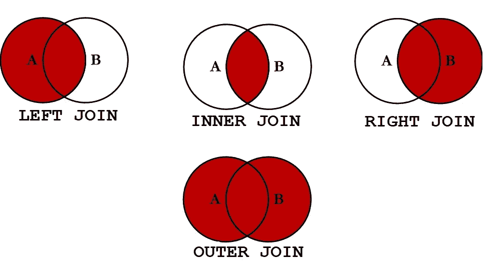
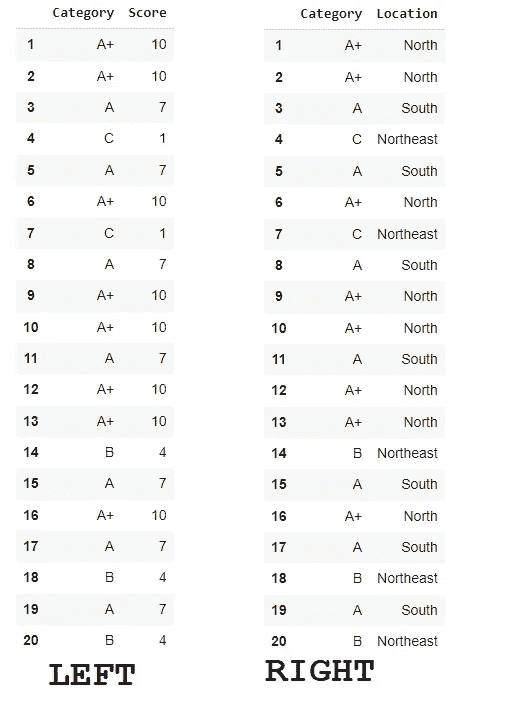
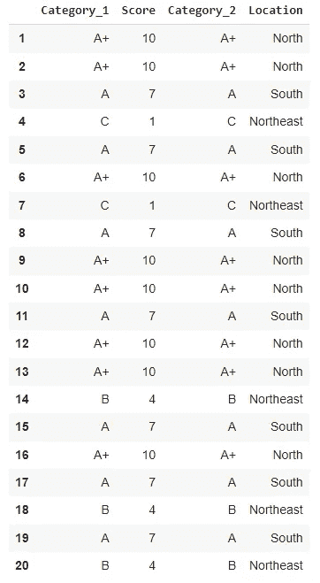
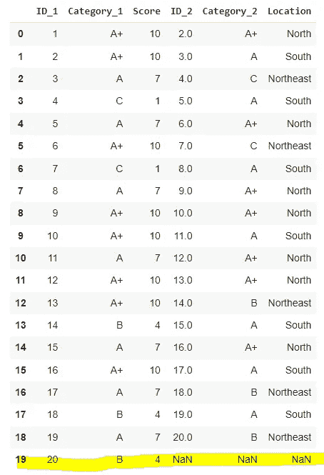
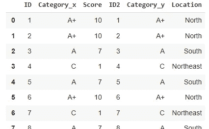

# 熊猫中的加入与合并

> 原文：<https://towardsdatascience.com/join-vs-merge-in-pandas-17b1b773bfb5>

## Pandas 的 join 和 merge 函数之间的实际差异


照片由[汉娜·布斯](https://unsplash.com/@hannahbusing?utm_source=unsplash&utm_medium=referral&utm_content=creditCopyText)在 [Unsplash](https://unsplash.com/s/photos/join?utm_source=unsplash&utm_medium=referral&utm_content=creditCopyText) 上拍摄

## 这些功能

作为一名数据科学家，总有一天你会面临一个问题，你的数据一部分在数据集 A 中，另一部分在数据集 b 中。

当这样的问题发生时，您肯定会从 SQL 中寻找一个类似于以前的`join`的函数。如果你正在使用 Python，你很可能会面对熊猫库中的这两个选项:`df.join()`或`df.merge()`。

在这篇文章中，我们想了解基本的区别，并决定使用哪一个。

总之，两者将执行相同的任务，即查看来自*数据集 A* 和来自*数据集 B* 的列，并根据您选择的连接类型返回结果—见下图。



联接类型。图片由作者提供。

> A 里有什么？B 里面是什么？
> 
> 让我们检查两个表，看看什么是相等的…

## 熊猫加入

我首先把熊猫`join`带到餐桌上，因为——在我看来——它不如`merge`灵活。

Pandas join 总是需要将右边表的列或索引与左边表的索引相匹配。因此，假设您在左边的表中有一个数字索引从 1 到 20 的表，您希望将它与给定的右边的表进行匹配。它们必须具有相同的索引，或者右表必须具有与左表中的索引具有相同数字/信息的列。

我知道，这很令人困惑。让我们编写代码来看看结果。会更有意义。

```
**# Creating two Dataframes**# Set seed
np.random.seed(10)# dataframe 1
df1 = pd.DataFrame( {'Category': np.random.choice(['A', 'A+', 'B', 'C'], size=20)} )df1['Score'] = np.select([df1.Category == 'A+', df1.Category == 'A', df1.Category == 'B', df1.Category == 'C'],
                        [10, np.random.choice([7,8,9]), np.random.choice([4,5,6]), np.random.choice([1,2,3])])
df1.index = [i for i in range(1,21)]# dataframe 2
df2 = pd.DataFrame( { 'Category': df1.Category} )df2['Location'] = np.select([df1.Category == 'A+', df1.Category == 'A', df1.Category == 'B', df1.Category == 'C'],
                            ['North', np.random.choice(['Southwest','South']), np.random.choice(['South', 'East', 'Northeast']), np.random.choice(['Northeast','South','Southeast'])])
df2.index = [i for i in range(1,21)]
```



两个数据帧。图片由作者提供。

请注意，两者都有相同的索引和相同的“id”。

```
# Join both df
df1.join(df2, lsuffix='_1', rsuffix='_2')
```



连接函数的结果。图片由作者提供。

您可以看到它在这种情况下工作得非常好，因为两个数据集有相同的索引。

现在，第二个例子显示了`join`方法在熊猫身上的局限性。如果我在两边创建一个名为 ID 的列，并保留原来的索引(从 0 到 19)，看看会发生什么。

如果我运行这个…

```
# Creating two Dataframes# Set seed
np.random.seed(10)**# dataframe 1 with ID col**
df1 = pd.DataFrame( {'ID': range(1,21),
                     'Category': np.random.choice(['A', 'A+', 'B', 'C'], size=20)} )df1['Score'] = np.select([df1.Category == 'A+', df1.Category == 'A', df1.Category == 'B', df1.Category == 'C'],
                        [10, np.random.choice([7,8,9]), np.random.choice([4,5,6]), np.random.choice([1,2,3])])**# dataframe 2 with ID col**
df2 = pd.DataFrame( { 'ID': range(1,21),
                     'Category': df1.Category} )df2['Location'] = np.select([df1.Category == 'A+', df1.Category == 'A', df1.Category == 'B', df1.Category == 'C'],
                            ['North', np.random.choice(['Southwest','South']), np.random.choice(['South', 'East', 'Northeast']), np.random.choice(['Northeast','South','Southeast'])])**#Join on the column ID**
df1.join(df2, on= 'ID', lsuffix='_1', rsuffix='_2')
```

事情是这样的。



使用 Join 进行联接时出错。图片由作者提供。

我已经指定我想要列`ID`上的`join`，但是 Pandas **将尝试将右表中的列 ID 与左表中的索引相匹配。这就是问题发生的时候。即使两个表在 ID 列中有相同的 ID(1 到 20)，索引仍然是从 0 到 19。我们会错过一些连接。**

## 熊猫合并

熊猫`merge`的功能更加多样，因为它可以从两边连接柱子。所以在这里，使用与上面完全相同的代码，但是将方法改为`merge()`，我们将得到正确的结果。

```
# Creating two Dataframes# Set seed
np.random.seed(10)# dataframe 1
df1 = pd.DataFrame( {'ID': range(1,21),
                     'Category': np.random.choice(['A', 'A+', 'B', 'C'], size=20)} )df1['Score'] = np.select([df1.Category == 'A+', df1.Category == 'A', df1.Category == 'B', df1.Category == 'C'],
                        [10, np.random.choice([7,8,9]), np.random.choice([4,5,6]), np.random.choice([1,2,3])])# dataframe 2
df2 = pd.DataFrame( { 'ID': range(1,21),
                     'Category': df1.Category} )df2['Location'] = np.select([df1.Category == 'A+', df1.Category == 'A', df1.Category == 'B', df1.Category == 'C'],
                            ['North', np.random.choice(['Southwest','South']), np.random.choice(['South', 'East', 'Northeast']), np.random.choice(['Northeast','South','Southeast'])])**# MERGE on the column ID**
df1.merge(df2, on='ID', how= 'inner')
```


合并结果。图片由作者提供。

merge 方法还有其他很酷的参数，比如合并两个具有不同列名的数据帧的能力。假设左边的表是 ID，右边的表是 ID2 列。我们只需使用这些代码来实现合并。

```
df1.merge(df2, left_on='ID', right_on='ID2', how= 'inner', )
```



用不同的列名合并。图片由作者提供。

## 在你走之前

连接数据集是数据科学家的一项常见任务。如果你知道每种方法是如何工作的，你就更容易选择选择哪一种。

对我来说，我通常去`df.merge()`，因为那里更灵活。不确定熊猫团队是否会永远保留这两只熊猫，但知道它们的基本区别是有好处的。

不要忘记从这两种方法探索文档。

[熊猫合并](https://pandas.pydata.org/docs/reference/api/pandas.DataFrame.merge.html)

[熊猫加入](https://pandas.pydata.org/docs/reference/api/pandas.DataFrame.join.html)

如果你喜欢这个内容，请关注我的博客。

[](https://gustavorsantos.medium.com/) [## 古斯塔沃·桑托斯-中等

### 阅读古斯塔夫·桑托斯在媒介上的作品。数据科学家。我从数据中提取见解，以帮助个人和公司…

gustavorsantos.medium.com](https://gustavorsantos.medium.com/)