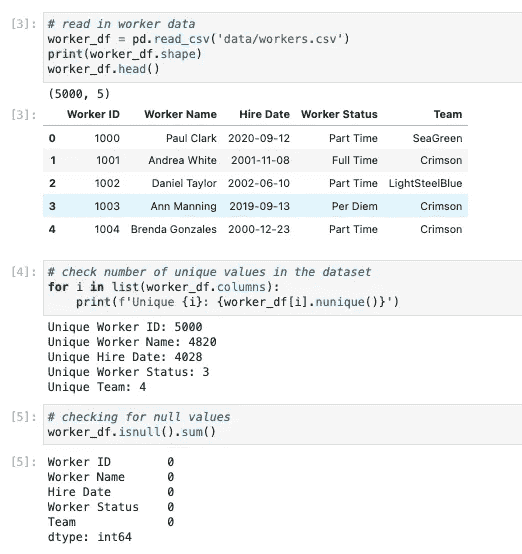
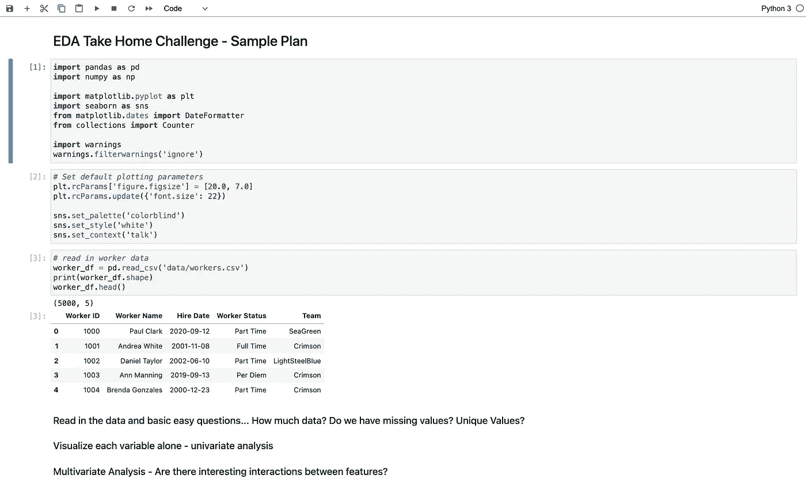
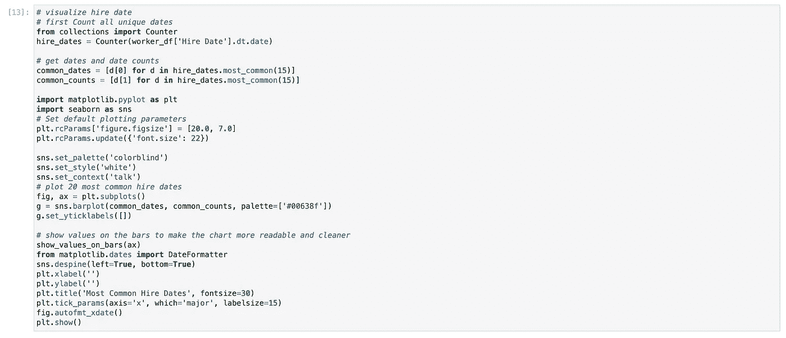

# Jupyter 笔记本:避免犯这 4 个错误

> 原文：<https://towardsdatascience.com/jupyter-notebooks-avoid-making-these-4-mistakes-e5cbad1d473d>

## 借助 Jupyter 笔记本电脑实现生产就绪代码

美国宇航局在 [Unsplash](https://unsplash.com/s/photos/jupiter?utm_source=unsplash&utm_medium=referral&utm_content=creditCopyText) 拍摄的照片

Jupyter 笔记本是我最喜欢的编写代码的方式——尤其是在第一次探索一个新的数据集时。

它们允许您查看每一步的代码和结果，将变量和数据集保存在内存中，并促进快速有效的实验。

Jupyter 笔记本允许我们将代码、叙述性文本、等式和可视化全部组合在一个文档中。

但是，伴随着这种巨大的能力而来的是巨大的责任。在这里，我们讨论数据科学家犯的四个常见错误，这些错误否定了 Jupyter 笔记本的伟大之处。

## 运行单元出现故障

在分析过程中，我们会多次无序地运行细胞。

当我遇到一个错误，或者代码没有按照我想要的那样运行时，我会一遍又一遍地运行那个单元格，直到我得到想要的结果。

做实验的时候，这绝对没有错！

当我们试图让代码为生产做好准备时，无论是机器学习模型，还是导出到 Excel 的简单报告，都会出现问题。

编程的一个关键是结果的可再现性。

任何人用相同的输入运行我们的笔记本应该得到相同的输出——而不必记住在第三个和第六个单元之前运行第五个单元两次。

> 你……应该以这样一种方式写笔记本，任何人都可以用同样的输入重新运行它，并产生同样的输出。你的笔记本应该是从上到下可执行的…
> 
> [—谷歌的 Jupyter 笔记本宣言](https://cloud.google.com/blog/products/ai-machine-learning/best-practices-that-can-improve-the-life-of-any-developer-using-jupyter-notebooks)

示例:单元格不按顺序运行时出错—图片由作者提供

确保我们的笔记本从上到下运行无误，让笔记本看起来更专业。

也许，更重要的是，确保笔记本从上到下无错运行让我们离生产就绪代码更近了一步。

## 在一个牢房里放太多东西

Jupyter 笔记本与典型的文本编辑器(如 VSCode 或 Sublime Text)的真正区别在于，它让您能够单步调试代码，并可视化每一步的输出。

它将变量保存在内存中，允许我们不断编写和更正代码，而不必等待潜在的耗时操作，如在每次微小的更改后读取大型数据集或模型训练。

当我们开始用太多的代码使一个单元过于拥挤时，我们就失去了一些使 Juypter 如此伟大的交互性。

例子:在一个单元格中塞进太多东西——作者图片

当你把所有的东西都塞进一个单元时，这个单元中的所有代码都会被立即执行，你就失去了看到每一步发生了什么的能力。这也使得真正看到每一步在做什么变得更加困难。

因为只有单元格的最后一行被自动打印到屏幕上，所以如果我们不小心将 print 语句添加到我们想要查看输出的行中，我们可能会丢失一些输出，如上图所示。

将所有的代码都塞进一个单元格中会减少交互结果，并且会隐藏关键细节。

我并不是说要将每个单元限制为只有一行代码，而是以一种有意义的方式对代码进行分组。

示例:以流畅且有意义的方式对代码进行分组——图片由作者提供

这样更好看！每个单元格中的代码完成一项任务，并打印出关键信息，让我们知道代码按预期工作，并让我们看到数据的样子。

## 没有利用降价单元格

降价太棒了！它允许我们在笔记本上添加带有格式的叙述性文本，并可以使我们的工作更加完美，为演示做好准备。

降价指南提供了一个很棒的[备忘单](https://www.markdownguide.org/cheat-sheet/)来帮助你开始。要使用键盘快捷键创建 Markdown 单元格，请按 esc 键，然后按 m 键。

我喜欢使用降价单元格来创建我的分析计划。例如，当开始一个带回家的挑战时，就像我们在这里讨论的例子，我们可以使用 Markdown 作为一个清单来给出我们的分析方向，并让我们专注于手头的任务。

使用 Markdown 的 EDA 计划—图片由作者提供

现在我们有了一个计划，我们可以开始编写满足每个目标的代码。尤其是在处理一个新的和不熟悉的数据集时，创建一个减价待办事项列表可以帮助指导我们的分析，并让我们保持专注。

准备演示时，减价也非常有用。我们可以添加我们的想法和见解，为向利益相关者展示我们的分析做准备。

在展示我们的笔记本电脑时，无论是在代码审查中还是对业务用户，具有关键洞察力的 Markdown 单元格都非常有帮助。

示例:使用 Markdown 对可视化效果进行评论—按作者排序的图像

## 在整个笔记本中导入包

当使用笔记本工作时，很多时候我发现自己需要导入一个我没有马上想到的包。

虽然在目前，将导入语句添加到当前单元格会更容易和更快，但我们不应该这样做！

一个好的做法是在笔记本的第一个代码单元中添加所有的导入语句。

这不仅使我们的笔记本看起来更精致、更专业，而且还可以帮助我们在想要将笔记本转换为生产就绪脚本时省去麻烦。

示例:在整个笔记本中导入包—按作者排序的图像

虽然我们的代码没有错误运行——笔记本可能从上到下运行，上面的例子看起来很混乱，有点令人困惑。

在笔记本上工作时，意识到我们在分析中途需要另一个包是完全正常的，我们应该尝试将所有的导入语句放在第一个单元格中。相信我——你未来的自己会感谢你的！

示例:第一个单元格中的所有导入语句-按作者排序的图像

## 结论

在这里，我们讨论了使用 Jupyter 笔记本进行开发时要避免的一些常见做法。纠正这些不良做法将有助于我们的笔记本看起来更完美，并向生产更近一步。

我有没有漏掉什么不好的笔记本做法？我很想在评论中听到你对朱庇特的抱怨！