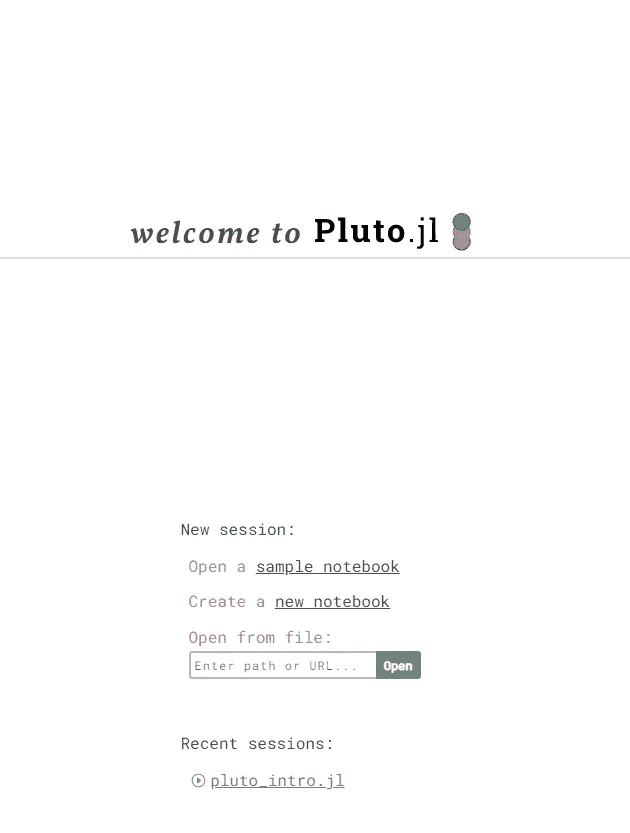
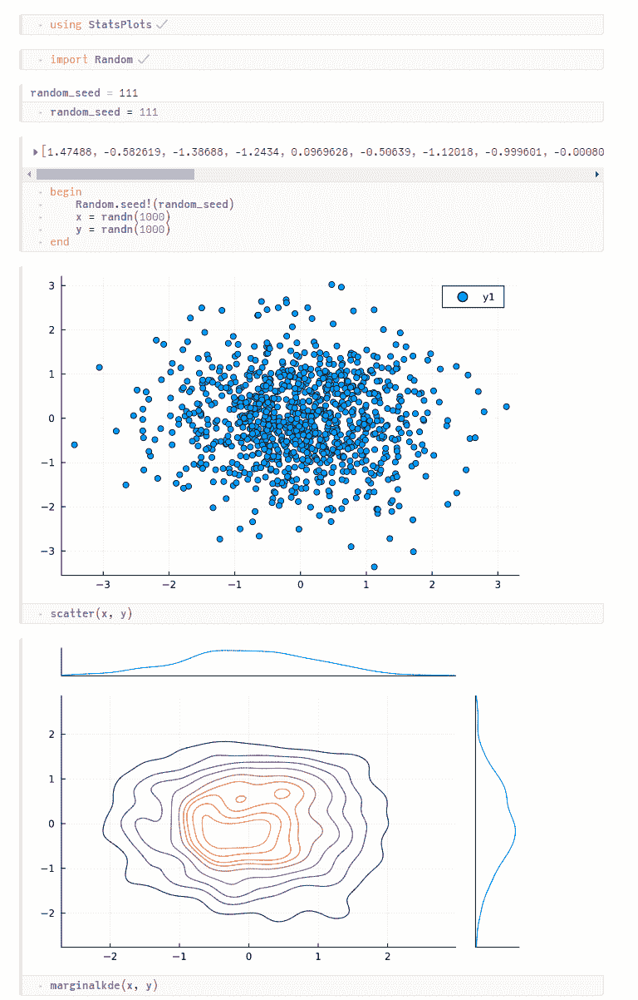

# 朱庇特笔记本可能是一种痛苦，但我❤️布鲁托

> 原文：<https://towardsdatascience.com/jupyter-notebooks-can-be-a-pain-but-i-%EF%B8%8F-pluto-f47913c5c16d>

## 朱莉娅的 Pluto.jl 将使教育变得更好


不是这个冥王星… |照片由 [NASA](https://unsplash.com/@nasa?utm_source=unsplash&utm_medium=referral&utm_content=creditCopyText) 在 [Unsplash](https://unsplash.com/s/photos/pluto?utm_source=unsplash&utm_medium=referral&utm_content=creditCopyText) 上拍摄

作为一名数据科学家，我阅读并有时——几乎总是违背我的意愿——写笔记本。Jupyter 笔记本允许您将所有的分析和评论储存在一个地方，这样您的结果就可以很容易地与他人分享。至少这是承诺…

> 要获得所有媒体文章的完整信息——包括我的——可以考虑在这里订阅。

我个人发现笔记本容易出现**错误**，**滚动对于长笔记本来说是一种痛苦**，而 **IntelliJ 只有在感觉需要的时候才能工作**。VSCode 试图通过与笔记本更好地集成来改变这一点，但写笔记本仍然感觉乏味，我更喜欢先写脚本，然后在演示文稿或类似的东西中添加评论。

但是我同意，把你所有的分析和评论放在一个地方是一个非常好的主意。想象一下这样一个世界，共享研究不是通过共享一长段无聊的文本来完成的，而是通过共享一个写得很好的**笔记本，上面有真实的代码**，可以访问所有的**数据**，安装正确的**包**，并允许你重新运行结果，调查它们，甚至做出改变来探索“假设”情景。现在，帮我报名吧！

> 要获得完全的可复制性，您需要:环境(包、操作系统等)、代码和数据

问题是**访问数据和计算真的很难**。你读过多少包含数据链接的论文？或者，当数据可用时，您可能会发现类似这样的内容:“我们在自定义操作系统上的数据中心的 5000 个 GPU 上运行了这个”。祝你好运……所以我认为，就目前而言，笔记本电脑最适合做简短的分析，或者——请击鼓— **教育**。


你需要做才能学会|照片由[伊妮斯·亚乌兹](https://unsplash.com/@enisyavuz?utm_source=unsplash&utm_medium=referral&utm_content=creditCopyText)在 [Unsplash](https://unsplash.com/s/photos/car-mechanic?utm_source=unsplash&utm_medium=referral&utm_content=creditCopyText) 上拍摄

> 熟能生巧，这也是必不可少的！

人们——是的，我们都是学生——如果能够探索和修补事物，就会学得更好。有多少工程师仅仅通过阅读课本就学会了组装一辆汽车？熟能生巧，这也是必不可少的！Jupyter 笔记本这个还可以，但是 [Pluto.jl](https://github.com/fonsp/Pluto.jl) 更好！听我说完。

> 如果你认为这是一种时尚，请三思！在麻省理工学院，冥王星被用来教授这门令人敬畏的课程。

# 冥王星是什么？

布鲁托本质上是一个 Jupyter 笔记本**，完全是为 Julia** 设计的。利用 Julia 的速度和灵活性，它可以解析你的代码，并理解哪些代码单元依赖于哪些其他单元。然后，当您更改一个块中的代码时，**会自动重新运行依赖于该块的所有单元格**，使用新的输入立即显示结果和数字。它确实将反应式计算提升到了一个新的水平。

基础知识:

*   它**在您的浏览器**中运行
*   将文件——包括元数据——保存在一个`.jl`文件中，这样您的源代码控制和所有东西仍然可以工作。**无需在笔记本文件和脚本之间转换。**
*   使用反应性来计算哪些**细胞需要自动重新计算**。
*   有**自动完成**和所有的基本功能。
*   可以共享为`.jl`、`html`或`pdf`文件。

# 开始按钮在哪里？

Gif 来自 [GIPHY](https://giphy.com/gifs/homer-simpson-fat-mumu-fZk0FD0wxQpb2)

安装冥王星实在是再简单不过了。你需要一个朱莉娅·REPL，键入`]`来访问包管理器，然后运行`add Pluto`。

要启动您的第一个笔记本，您需要执行以下操作:

```
import Pluto
Pluto.run()
```

这将为您提供一个带有 Pluto 会话的浏览器窗口:



这是你启动 Pluto 时在浏览器中看到的——作者截图

点击`new notebook`后，你会看到一个类似 Jupyter 笔记本的熟悉界面:


你的第一个笔记本和它的第一个代码单元——作者截图

# 准备好迎接魔法了吗？来做套餐吧！


冥王星与包裹玩得真的很好——照片由 [Markus Spiske](https://unsplash.com/@markusspiske?utm_source=unsplash&utm_medium=referral&utm_content=creditCopyText) 在 [Unsplash](https://unsplash.com/s/photos/package?utm_source=unsplash&utm_medium=referral&utm_content=creditCopyText) 上拍摄

你还记得我说过为了复制你的代码，你需要**包含你所有的包**吗？在 Jupyter 中，你可以通过包含一个虚拟环境来做到这一点，而在 Python 中，诗歌已经走过了一段很长的路来解决确切的包版本——Julia 的内置包管理器仍然更好使用——但是如果你只想共享一个笔记本，如果所有的**包信息都被包含进来，并且所有的东西都被神奇地安装好了**不是更好吗？

Pluto 知道你是否正在安装软件包，并将软件包元数据直接存储在你的`.jl`文件中，这样每个拿走你笔记本的人都会有和你完全一样的软件包。下面是一个 Pluto 文件的摘录，其中包含包清单:

这在你档案的最后


要添加软件包，只需在其中一个单元格中键入`using`或`import`，直到出现一个小☁️。悬停在它上面，它会告诉你，如果你运行这个单元，这个包将被安装。

> 您可以禁止为每个笔记本创建虚拟包环境，并使用当前目录或全局环境。

# 反应

现在我们有了情节，我们可以制作…情节！


作者截图

如果你仔细看了截图，你可能会注意到一些有趣的事情。主要是，每个单元只做一件事。这是故意的。这是为了建立细胞的依赖性，并使反应成为可能。如果你真的需要的话,`begin .. end`包装器仍然允许你在一个步骤中运行多个东西。我真正欣赏的是，如果您试图在一个单元格中运行多个赋值，Pluto 会自动为您提供一个解决方案并为您重构代码。多好啊！

其次，**输出位于代码单元**的顶部。对我来说，这更有意义。作为一名读者，我想先看看结果，然后深入研究代码，以确保它做了它应该做的事情。

为了证明这都是反应性的，看看当我改变定义了`random_seed`的单元格时会发生什么:



反应冥王星-作者截屏

> 如果您有长时间运行的计算，并且不想每次都重新运行，您可以通过单击它们的选项菜单(…)来禁用单元格。

# 滑块，滑块无处不在

以上很好，我认为这让编码和学习变得更有趣。但是当你添加 HTML 滑块时，事情就变得有趣多了。

使用`InteractiveUtils`和`Markdown`包的组合，您可以在笔记本上添加滑块，并将结果绑定到一个变量:

如何在笔记本上添加 HTML 滑块

在宏调用之后，`@bind`宏会将 HTML 代码的结果——滑块值绑定到变量，并返回一个 HTML 元素，然后`md`可以呈现该元素。我忘记了我在小学时学过的所有关于 HTML 的东西，但是上面的代码非常简单，甚至我都可以做到😅。

以下是滑块:


冥王星中的滑块——作者截图

现在我们有了滑块，让我们乘风破浪:


作者的屏幕截图

如果这种交互式绘图不能推动这一点，那么我不知道什么会。我认为冥王星是如此棒的教育工具，我真的希望有一天我的孩子也能像这样学习数学。

> *这里用到的所有代码都可以在 GitHub 上*[*https://github.com/niczky12/medium*](https://github.com/niczky12/medium/blob/master/julia/memoize.jl)下找到

# 试一试！


试试冥王星吧，你不会失望的——照片由[布雷特·乔丹](https://unsplash.com/@brett_jordan?utm_source=unsplash&utm_medium=referral&utm_content=creditCopyText)在 [Unsplash](https://unsplash.com/s/photos/try?utm_source=unsplash&utm_medium=referral&utm_content=creditCopyText) 上拍摄

以上都是相当简单的儿童游戏，但我试图证明这在教育环境中是多么有用。

> 你可以从[这里](https://github.com/niczky12/medium/blob/master/julia/pluto_intro.jl)拿走笔记本，自己试试滑块。

想象一下**通过这种方式学习概率密度函数**，你可以摆弄参数并立即看到结果…

如果你想更进一步，你甚至可以**包括一些机器学习或统计分析**，让你的**读者摆弄超参数**。应用程序是无止境的，我真的希望这将在更广泛的数据科学社区中流行起来。冥王星已经在朱莉娅社区掀起了波澜，但这需要让更多的人看到！

> 非常感谢冥王星的创造者！你们太棒了。

[](https://github.com/fonsp/Pluto.jl)  

来自 JuliaCon 的创作者的精彩演讲——由 Julia 编程语言频道上传

> 我写朱莉娅和其他很酷的东西。如果你喜欢这样的文章，请考虑关注我。

[](/joining-dataframes-in-julia-c435e3da32f3)  [](/reading-csv-files-with-julia-e2623fb62938) 