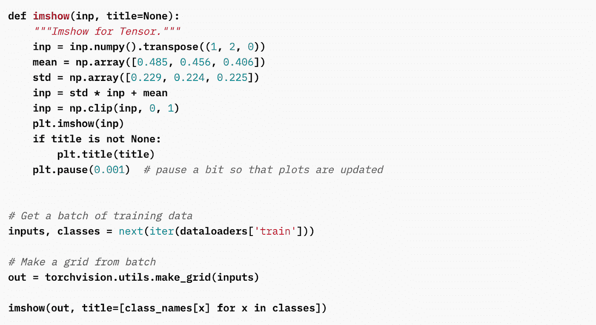
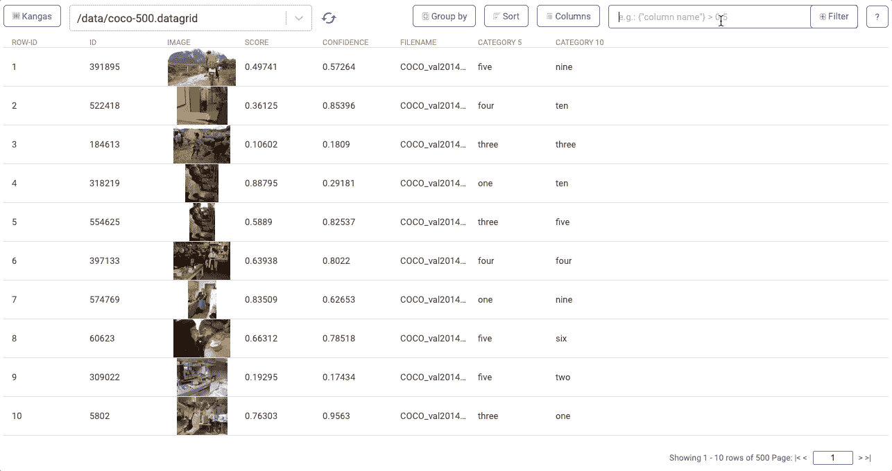
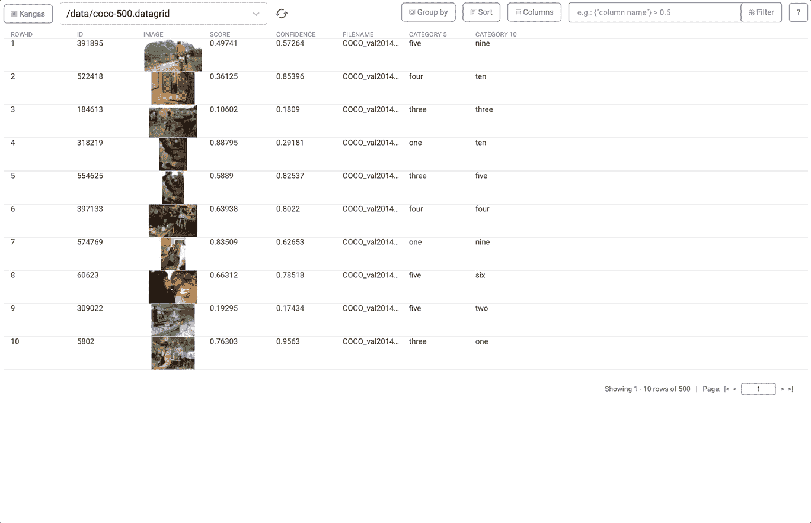

# Kangas:大规模可视化多媒体数据

> 原文：<https://towardsdatascience.com/kangas-visualize-multimedia-data-at-scale-db981b5e8d23>

## 用于探索性数据分析的开源库

在机器学习中，我们认为胶水代码是必要的，但很大程度上是良性的。即使是对初学者最友好的计算机视觉教程也会包含一些笨拙的自定义 renderImage()方法，您只需使用它来显示图像。



*来源:* [*PyTorch —计算机视觉迁移学习教程*](https://pytorch.org/tutorials/beginner/transfer_learning_tutorial.html)

我合作过的每个数据科学团队都有一组这些“定制”的实用程序脚本，尤其是在探索性数据分析等更特殊的流程中。在很大程度上，这些小技巧奏效了——直到它们不奏效。

同样的模式不可避免地会出现。项目从“看看这是否可行”发展到“将它部署到生产中”，不断增加的复杂性导致了复杂的困难:

*   我有一个包含 250 万张图片的数据集，我编写了一个 showImage()方法。我如何在所有 250 万张图片上运行它，而不使这台笔记本电脑崩溃？
*   我有一个部署的对象检测模型，我可以从我拼凑的仪表板上看到它的整体性能下降了。如何将单个预测可视化为带有边框和标签的图像？
*   我们的新数据集拥有数量惊人的要素。我们有一个脚本来生成整个数据集的统计摘要，但我如何执行查询(分组、排序、过滤等。)对数据？

突然，你的效用函数变成了效用软件。后端团队构建了一个使用标签和变换来渲染图像的服务，但是它是不稳定的，并且只适用于特定的格式。您团队中的某个人构建了一个“管道”，这实际上只是一个善意的 Python 脚本的拼凑，它对您的数据做出了一些非常严格的假设。而现在，你花了几个小时为你的实用软件写实用函数，你渴望概率论

在处理这个问题多年后，我和我的同事 Doug Blank 放弃了寻找一个完美工具的努力，决定自己开发一个。快进几个月(和几个主要的重构)，我们终于准备好发布我们新的开源库， [Kangas](https://github.com/comet-ml/kangas) ，用于它的初始测试版。


来源: [Kangas 知识库](https://github.com/comet-ml/kangas)

# 介绍 Kangas V1:用于计算机视觉的开源 EDA

在 Kangas 的早期(就像没有“roo”的“袋鼠”，原因我们并不完全确定)，我们已经着手解决探索性数据分析中的三个具体问题:

## **1。大型数据集很难处理。**

虽然 pandas 是一个很棒的工具，但它将数据帧存储在内存中，随着数据集的增长，性能会下降。实现第三方工具，比如 Dask 是在生产前构建复杂管道的一个好选择，但是会减慢你的研究速度。

这是我们开始研究袋鼠的地方。我们想“如果我们不把一个类似数据帧的对象存储在内存中，而是把它存储在一个实际的数据库中，会怎么样？”然后转化为“如果数据框是真实的数据库会怎样？”

Kangas 的基类是 DataGrid，您可以使用熟悉的 Python 语法来定义它:

```
from kangas import DataGrid 
dg = DataGrid(name="Images", columns=["Image", "Score"]) 
dg.append([image_1, score_1]) 
dg.show()
```

*注意:实际上有几种不同的方式来构建数据网格。更多，* [*见此处*](https://github.com/comet-ml/kangas/wiki/Constructing-DataGrids)

Kangas DataGrid 是一个实际的 SQLite 数据库，使它能够存储大量数据并快速执行复杂的查询。它还允许保存和分发数据网格，甚至远程服务。

## **2。可视化数据需要几个小时**。

要浏览 CV 数据集，您需要查看图像本身，以及相关的元数据和变换。您需要能够跨视图比较图像，绘制聚合统计图表，理想情况下，在单个 UI 中完成所有这些。您典型的库的混杂导致的输出最好被描述为“功能性的”，而不是美观的。

Kangas 中的可视化需要简单、快速和流畅。我们没有依赖 Python 库，而是将 Kangas UI 构建为一个实际的 web 应用程序。服务器端呈现(使用 React 服务器组件)允许 Kangas 快速呈现可视化，同时执行各种查询，包括过滤、排序、分组和重新排序列。



来源: [Kangas 演示](https://kangas.comet.com/?datagrid=/data/coco-500.datagrid)

最重要的是，Kangas 为标签、分数和边界框等内容提供了内置的元数据解析:



来源: [Kangas 演示](https://kangas.comet.com/?datagrid=/data/coco-500.datagrid)

## **3。EDA 解决方案很少具有互操作性**。

EDA 的挑战之一是数据通常是杂乱的和不可预测的。您同事对工具的“古怪”偏好经常以最不直观的方式改变您的数据。在理想的情况下，你不需要改变你的工作流程来应对这种可变性——它会正常工作。为了在 Kangas 实现这一点，我们必须做几件事。

首先，我们希望确保任何类型的数据都可以加载到 Kangas 中。为此，Kangas 很大程度上并不介意在数据网格中存储什么。Kangas 另外提供了几个构造器方法，用于从不同的源获取数据，包括 pandas 数据帧、CSV 文件和现有的数据网格。

```
import kangas as kg 

# Load an existing DataGrid 
dg = kg.read_datagrid("https://github.com/caleb-kaiser/kangas_examples/raw/master/coco-500.datagrid") 

# Build a DataGrid from a CSV 
dg = kg.read_csv("/path/to/your.csv") 

# Build a DataGrid from a Pandas DataFrame 
dg = kg.read_dataframe(your_dataframe) 

# Construct a DataGrid manually 
dg = kg.DataGrid(name="Example 1", columns=["Category", "Loss", "Fitness", "Timestamp"])
```

其次，我们希望确保 Kangas 可以在任何环境中运行，而无需进行重大设置。一旦你运行了“pip install kangas ”,你就可以在你的本地机器上，从笔记本环境中，或者甚至部署在它自己的服务器上，作为一个独立的应用程序来运行它(就像我们在[kangas.comet.com](https://kangas.comet.com/?datagrid=/data/coco-500.datagrid)所做的那样)。)

最后，Kangas 是开源的这一事实意味着它在定义上是可互操作的。如果您的特殊需求如此具体和极端，以至于 Kangas 路线图上的任何东西都无法满足它们，您可以分叉回购并实现您需要的任何东西。如果你这样做了，请让我们知道！我们很想看看。

# Kangas 的路线图是什么？

对袋鼠来说还为时尚早。目前，只有少数测试用户在测试它，大部分代码库仍在积极开发中。记住这一点，接下来会发生什么很大程度上取决于你。Kangas 现在是，将来也永远是一个免费的开源项目，在接下来的几个月和几年里，我们选择优先考虑什么将取决于社区成员最想要什么。

如果你有多余的时间，并且迫切需要更好的探索性数据分析，可以考虑去 [Kangas repo](https://github.com/comet-ml/kangas) 看看，并尝试一下。我们对所有类型的社区贡献都是开放的，如果你关注了这个库，每当有新的主要版本发布时，你都会得到更新。