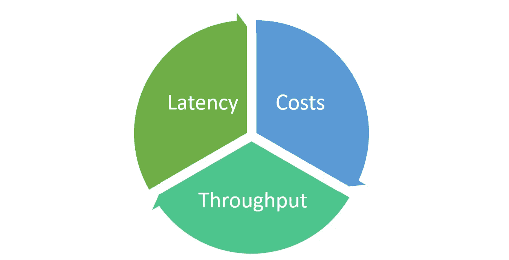
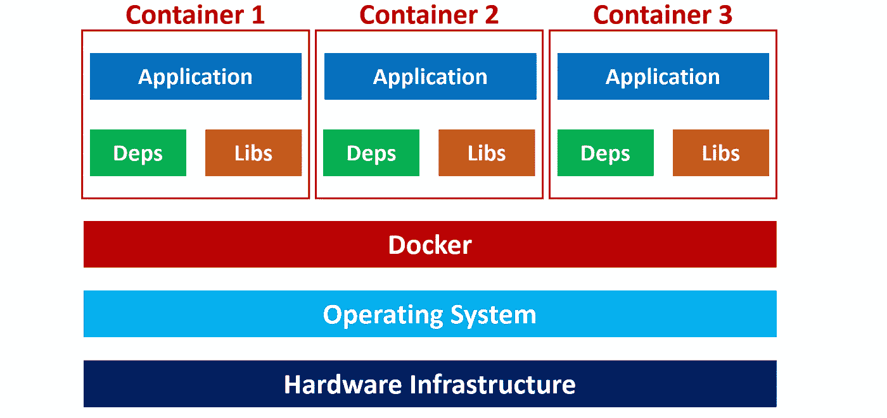
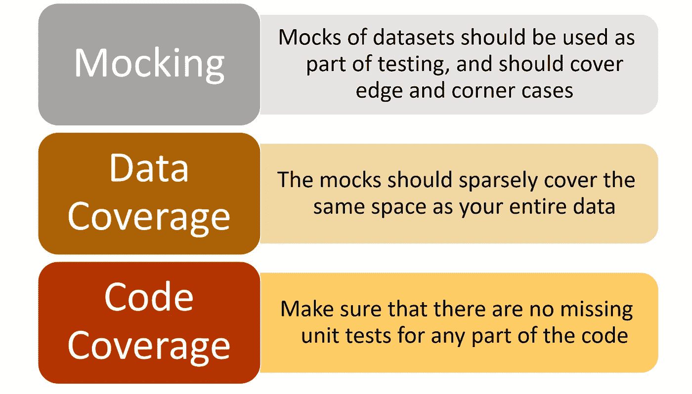
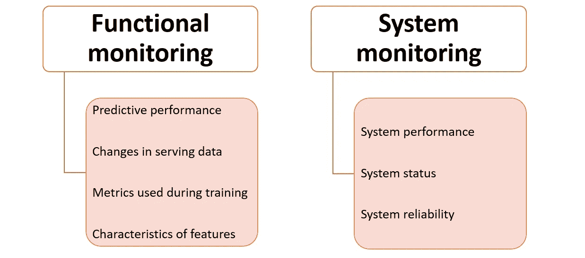

# MLOps 专业化认证的关键学习点—课程 4

> 原文：<https://towardsdatascience.com/key-learning-points-from-mlops-specialization-course-4-ee39bbd2864b>

## MLOPS 专业化系列

## 来自 DeepLearning 的面向生产的机器学习工程(MLOps)课程的最终见解(含课堂讲稿)。艾&吴恩达

照片由[建造的机器人](https://unsplash.com/@built?utm_source=unsplash&utm_medium=referral&utm_content=creditCopyText)在 [Unsplash](https://unsplash.com/s/photos/pipeline?utm_source=unsplash&utm_medium=referral&utm_content=creditCopyText) 上拍摄

在现实世界中实现机器学习(ML)的潜力超越了模型训练。通过利用 MLOps 的最佳实践，团队可以以可持续的方式更好地操作和管理 ML 模型的端到端生命周期。

在由 4 部分组成的 MLOps 专业化系列的最后一篇文章中，我总结了课程 4 的课程，以便您可以跳过数小时的在线视频，同时仍能获得关键的见解。

## 内容

> ***(1)****[*概述*](#4bc1)***(2)****[*重点课*](#f1bb)***(3)****[*讲义*](#ff93)***

***本文涵盖了****4*******4-课程*** *MLOps 专业化。* [*跟随本页*](https://kennethleungty.medium.com/) *保持更新更多 ML 内容。****

# ***(1)概述***

***MLOps 专业化认证的最后一门课程侧重于部署经过培训的 ML 模型，并将其提供给最终用户。***

***我们着眼于构建可靠的基础设施，并为实时或批量推理逐步交付生产系统。***

***此外，我们还探讨了如何监控这些系统以检测模型衰退、补救性能下降并避免系统故障。***

******

***照片由[塞尔吉奥·萨拉](https://unsplash.com/@sergiosala?utm_source=medium&utm_medium=referral)在 [Unsplash](https://unsplash.com?utm_source=medium&utm_medium=referral) 上拍摄***

# ***(2)主要经验教训***

> ***第 1 部分—模型服务简介***

## ***实时和批量推理***

*   ***模型服务是指使经过训练的模型可供最终用户使用。***
*   ***获得模型预测(又名推理)的方式主要有两种——**实时**推理和**批量**推理。***
*   ***在批量推断中，部署的 ML 模型基于历史输入数据进行预测。当获取实时预测并不重要时，这种情况通常就足够了。***
*   ***实时预测，也称为按需或在线推理，是使用推理时可用的输入数据实时生成的预测。***

## ***优化实时推理***

*   ***作为优化**实时**推理的一部分，有三个关键指标:延迟、成本和吞吐量。***

******

***实时(即在线)推理需要考虑的三个关键指标|作者图片***

*   *****延迟**是用户动作和应用程序对动作的响应之间的延迟。***
*   *****成本**指与推理相关的基础设施成本(例如，CPU、GPU、缓存)***
*   *****吞吐量**是单位时间内服务的成功请求数。***
*   ***许多面向客户的应用程序旨在最小化延迟，同时最大化吞吐量，例如航空公司推荐网站。***
*   ***最终，这是在确保高系统性能的同时将成本保持在合理范围内的一种平衡行为。***

## ***平衡复杂性和成本***

*   ***在构建和选择我们的模型时，有两种类型的指标需要评估以平衡性能和成本:**优化**和**门控指标。*****

******

***平衡模型复杂性和成本的指标|作者图片***

*   *****优化指标**包括反映模型预测能力的准确度和精确度等指标。***
*   ***我们经常遇到增加模型复杂性以提高性能的情况，因此我们需要注意成本，因为更高的复杂性会导致更高的成本。***
*   ***因此，**门控指标**如 GPU 负载和模型大小充当**操作约束**，使我们的模型在成本和硬件限制内运行。***

## ***部署选项***

*   ***关于在哪里部署模型，主要有两种选择— **数据中心**或**设备上(如手机、嵌入式设备)**。***

******

***按作者部署模型|图像的选择***

*   ***这意味着我们可以将模型部署在通过远程 API 调用访问的数据中心服务器上，或者将模型的实例直接分发到用户的设备上。***

## ***嵌入式设备的限制***

*   ***像移动电话和嵌入式设备这样的分布式环境有一定的限制，如内存、存储和电池容量。***
*   ***比如手机平均 GPU 内存小于~4GB，除了你的 ML 机型之外的应用都共享这个 GPU。***
*   ***这种受限的环境意味着我们不会在这些设备中部署大型复杂的模型。***
*   ***这些限制也意味着我们必须为特定的任务选择最佳的模型。例如，[**MobileNets**](https://arxiv.org/abs/1704.04861)**就是专门为移动设备上的计算机视觉而设计的。*****

> *****第 2 部分—模式和基础设施*****

## *****模型服务器*****

*   *****模型服务器允许我们大规模部署 ML 模型，这样我们就可以通过 API 调用很容易地检索模型预测。*****
*   *****我们可以在本地或云上托管这些模型服务器。*****

**********

*****运行中的模型服务器|作者图片*****

*   *****模型服务器首先基于模型工件实例化 ML 模型。然后，通过 REST(或 gRPC) API 端点向客户端公开模型的预测功能。*****
*   *****[**tensor flow Serving**](https://www.tensorflow.org/tfx/guide/serving)是一个开源模型服务器的例子，它提供了一个为生产环境设计的灵活、高性能的 ML 服务系统。*****
*   *****其他流行的模型服务器还有[英伟达 Triton 推理服务器](https://developer.nvidia.com/nvidia-triton-inference-server)、 [Kubeflow Serving](https://www.kubeflow.org/docs/external-add-ons/serving/) 和 [TorchServe](https://github.com/pytorch/serve) 。*****

## *****缩放的重要性*****

*   *****大量的推理请求会淹没模型服务器。因此，模型基础设施必须能够轻松地伸缩，以处理不同的请求大小。*****
*   *****缩放主要有两种方式:**水平**和**垂直*******
*   *******垂直**扩展是指使用更大更强大的硬件，例如升级 CPU、添加更多 RAM、使用更新的 GPU 等。*****
*   *******横向**扩展是指添加更多的节点/设备(即 CPU、GPU)来满足推理负载增加的需求。*****
*   *******通常推荐水平缩放**，原因如下:*****

1.  *****允许**弹性**，因为根据负载、吞吐量和延迟要求调整节点数量更容易*****
2.  *******无需**让现有服务器**离线**进行硬件升级*****
3.  *******对硬件**容量**没有限制，因为可以随时添加节点*******

## *****集装箱化*****

*   *****ML 应用程序通常与许多依赖项和可配置项相关联。*****
*   *****容器使得以轻量级的方式打包和运行整个 ML 应用程序变得容易，而不用担心操作系统(OS)的需求。*****
*   *****容器允许ML 应用的**快速敏捷部署**以及简单的**水平可伸缩性。*******
*   *****Docker 是最流行的构建、部署和管理容器化应用程序的开源平台。*****

**********

*****容器架构|作者图片*****

*   *****我们可以使用像 [Kubernetes](https://kubernetes.io/) 和 [Docker Swarm](https://docs.docker.com/engine/swarm/) 这样的容器编排软件来管理和同步多台机器上的多个容器。*****

> *****第 3 部分—模型管理和交付*****

## *****实验跟踪*****

*   *****实验是 ML 模型开发的基础，跟踪结果对于调试和提高模型性能至关重要。*****
*   *****跟踪方面包括代码、超参数、执行环境、库版本和模型性能度量。*****
*   *****Jupyter 笔记本非常适合运行和跟踪简单的实验，但这不是最好的方法，因为笔记本通常不会推广到生产中。*****
*   *****可以使用 [TensorBoard](https://www.tensorflow.org/tensorboard) 、[Weights and bias](https://wandb.ai/site/experiment-tracking)和 [Neptune](https://neptune.ai/) 等工具进行实验跟踪。*****
*   *****一个好的习惯是为每个实验加上一致且有意义的标签，这样结果就有条理且易于解释。*****

## *****数据版本控制*****

*   *****数据仅反映了收集数据时的情况，数据预计会随着时间的推移而变化。*****
*   *****将我们的数据以及我们通常跟踪的代码和运行时参数**版本化是至关重要的。*******
*   *****一些很好的数据版本控制工具包括[厚皮动物](https://www.pachyderm.com/)、 [DVC](https://dvc.org/) 和 [ML 元数据(MLMD)](https://www.tensorflow.org/tfx/guide/mlmd) 。*****

## *****模型版本和注册*****

*   *****因为每个模型可能有不同的代码、数据和配置，所以执行模型版本控制是很重要的。*****
*   *****有了模型版本化，我们可以很容易地检索旧的模型并理解模型血统(即，产生模型的工件之间的一组关系)。*****
*   *****模型注册中心是一个用于存储训练模型的中央存储库，它提供了一个用于管理和搜索训练模型的 API。*****
*   *****模型注册对于支持模型发现、模型理解和模型重用是必不可少的，包括在拥有数百个模型的大规模环境中。*****

**********

*****模型工件流向模型注册|按作者分类的图像*****

*   *****创建模型注册中心的几个流行工具包括 [MLflow 模型注册中心](https://www.mlflow.org/docs/latest/model-registry.html)和 [Azure ML 模型注册中心](https://docs.microsoft.com/en-us/azure/machine-learning/how-to-deploy-and-where?tabs=azcli#registermodel)。*****

## *****对 MLOps 的需求*****

*   *****今天影响 ML 工作的许多问题反映了软件工程领域在不久前所面临的问题。*****
*   *****这些问题包括缺乏可再现性和出处、低效的协作、手动跟踪、上市缓慢，以及模型在部署前被阻止。*****
*   *****MLOps 借用 DevOps 的概念来标准化和统一 ML 系统开发生命周期，以应对上述挑战。*****
*   *****MLOps 的目标是创建一个一致且可靠的方法来自动化模型的培训和部署，同时进行强大而全面的监控。*****

## *****MLOps 成熟度—0 级*****

*   *****MLOps 系统的成熟度由数据、建模、部署和维护的**自动化**水平决定。*****
*   *****MLOps 级别 0 是 ML 生命周期流程为手动的基本级别。*****
*   *****它只关注将训练好的模型作为预测服务进行部署。它不涉及自动再培训或主动性能监控的过程。*****
*   *****这种成熟度在许多开始在其用例中采用 ML 的企业中是典型的。*****

## *****MLOps 成熟度—1 级*****

*   *****MLOps 级引入了**流水线自动化**，目标是自动化连续模型训练。*****
*   *****它包括重要组件，如**自动化数据和模型验证、管道触发器**和**元数据管理**。*****

## *****MLOps 成熟度—2 级*****

*   *****MLOps 级别 2 目前仍有一些推测性。*****
*   *****它涉及到健壮的自动化持续集成/持续交付(CI/CD ),因此团队可以围绕特征工程、模型架构和超参数快速探索新的想法。*****
*   *****这个成熟度级别还包括关键组件，如源代码控制、部署服务、模型注册和特性存储。*****

**********

*****CI/CD 和自动化 ML 管道|图片来自 [Google Cloud](https://cloud.google.com/architecture/mlops-continuous-delivery-and-automation-pipelines-in-machine-learning#mlops_level_2_cicd_pipeline_automation)*****

## *****持续集成/持续交付(CI/CD)*****

*   *******综合集成(CI)** 当新代码被提交到源代码库中时，涉及到新代码的构建、打包和测试。*****
*   *****在作为 CI 的一部分进行部署之前，单元测试对于检查代码是否正常工作是至关重要的，它涉及模拟、数据覆盖和代码覆盖。*****

**********

*****ML 单元测试的注意事项|作者图片*****

*   *******连续交付(CD)** 是将新代码和新训练模型的系统部署到目标环境中，同时确保**兼容性**和**预测服务性能**的过程。*****
*   *****持续集成和持续交付的整个过程和基础设施被称为 CI/CD。*****

## *****渐进式交货*****

*   *****渐进交付被认为是一个开发过程，是对 CI/CD 的改进。*****
*   *****它侧重于逐步推出新功能，以限制潜在的部署风险并提高部署速度。*****
*   *****它包括首先向小规模、低风险的受众交付变更，然后扩展到更大规模、更高风险的受众。*****
*   *****渐进式交付的示例包括蓝/绿部署、金丝雀部署和现场实验。*****

> *****第 4 部分—模型监控和记录*****

## *****为什么监控很重要*****

*   *****ML 开发是一个循环迭代的过程，监控对于改进和维持 ML 系统至关重要。*****
*   *****持续监控对于识别**数据偏差**、**模型陈旧性**和**负反馈循环**非常重要。*****

## *****ML 系统中的监控*****

*   *****ML 监控不同于软件监控，因为 ML 系统有两个附加组件:数据和模型。*****
*   *****ML 系统监控包括两个关键部分— **功能**监控和**系统**监控。*****
*   *******功能监控**关注模型预测性能和服务数据的变化。这些包括模型性能度量以及数据中每个特征的分布和特征。*****
*   *******系统监控**指监控生产系统的性能和服务系统的可靠性。它包括吞吐量、延迟、资源利用率等运营指标。*****

**********

*****ML 系统监控的类型|按作者分类的图片*****

## *****记录*****

*   *****日志记录是围绕模型和系统建立可观察性的一种重要方式。*****
*   *****日志是 ML 系统中离散事件(例如，模型输入、预测)的不可变时间戳记录。*****
*   *****使用聚合汇点和工作空间允许团队集中日志来创建 ML 系统的**统一视图**用于报告和警报。*****
*   *****虽然日志无可否认是有用的，但是我们必须意识到它的一些缺点。*****
*   *****过多的日志记录会影响系统性能，对日志进行聚合操作以及设置和维护日志记录工具会产生巨大的成本。*****

# *****(3)课堂讲稿*****

*****为了表示感谢，下面是从幻灯片和抄本中整理出来的 [***GitHub repo 和 PDF 讲义***](https://github.com/kennethleungty/MLOps-Specialization-Notes/tree/main/4.%20Deploying%20Machine%20Learning%20Models%20in%20Production) 。在这些笔记中还有很多其他有价值的见解，所以去看看吧！*****

*****您可以在此处找到前三门课程的总结:*****

***** [## MLOps 专业化认证的关键学习点—课程 1

### 面向生产的机器学习工程课程 1 的主要内容

towardsdatascience.com](/key-learning-points-from-mlops-specialization-course-deeplearning-ai-andrew-ng-5d0746605752)  [## MLOps 专业化认证的关键学习点—课程 2

### 来自生产课程 2 的机器学习工程的主要见解

towardsdatascience.com](/key-learning-points-from-mlops-specialization-course-2-13af51e22d90)  [## MLOps 专业化认证的关键学习点—课程 3

### 来自生产课程 3 的机器学习工程的主要见解

towardsdatascience.com](/key-learning-points-from-mlops-specialization-course-3-9e67558212ee) 

# 在你走之前

欢迎您来到**加入我的数据科学学习之旅！**点击此 [Medium](https://kennethleungty.medium.com/) 页面，查看我的 [GitHub](https://github.com/kennethleungty) ，了解更多精彩的数据科学内容。同时，享受构建生产 ML 系统的乐趣！

 [## 通过我的推荐链接加入媒体-梁建华

### 作为一个媒体会员，你的会员费的一部分会给你阅读的作家，你可以完全接触到每一个故事

kennethleungty.medium.com](https://kennethleungty.medium.com/membership)*****