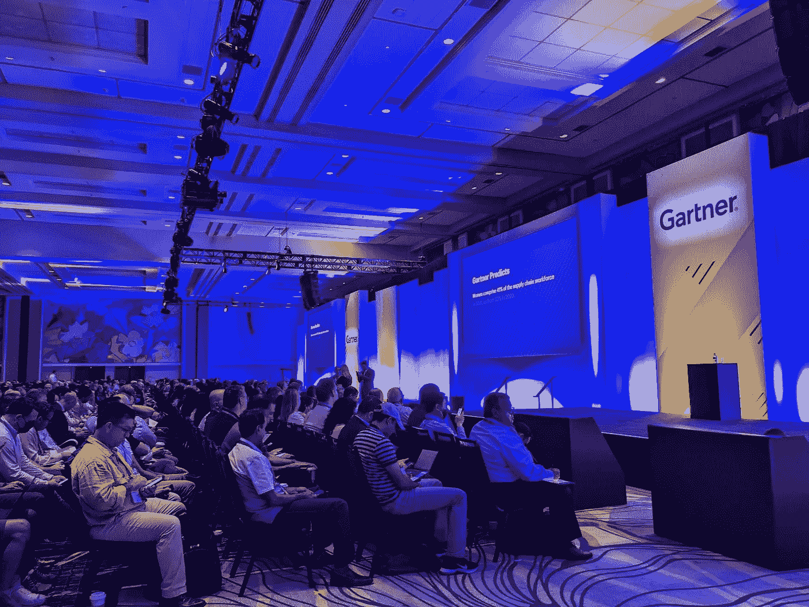
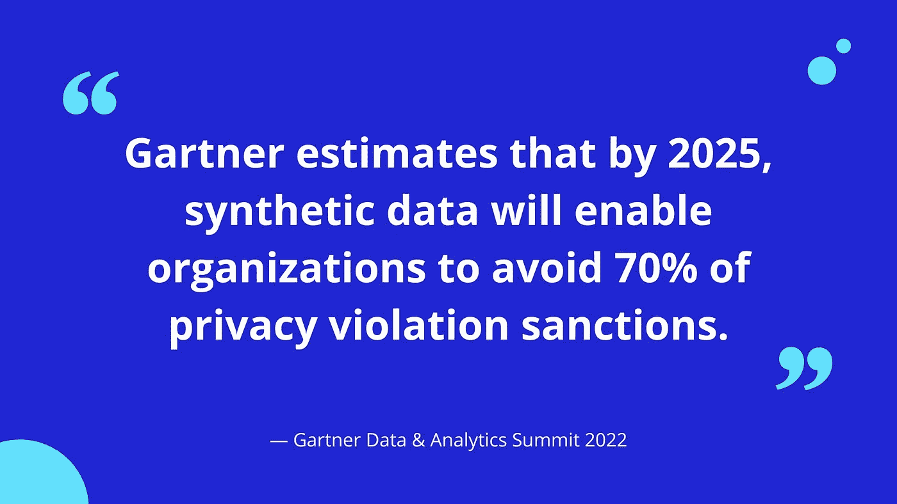
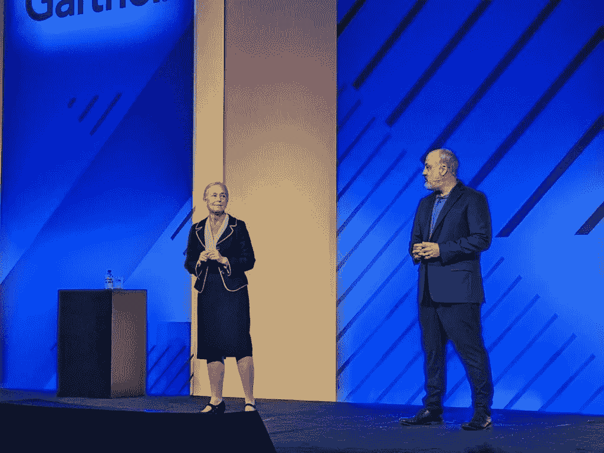

# 2022 年高德纳数据与分析峰会的主要收获

> 原文：<https://towardsdatascience.com/key-takeaways-from-gartner-data-analytics-summit-2022-ec908f9599df>

## 增强分析、合成数据、适应性治理等等

2022 年 Gartner 数据与分析峰会开幕主题演讲。(图片由作者提供。)

> “我们现在生活在一个永远不确定的世界里。能够应对这种不确定性的企业才能最成功地驾驭未来。”
> 
> *—Gartner Data&2022 年分析峰会*

正如疫情所展示的，在当今的新世界中，不能或不愿变革的组织会陷入一堆麻烦之中。如今，无论是在自己的团队中还是在整个组织中，数据人员都肩负着担当变革推动者并不断推动创新的重任。

今年 [Gartner Data &分析峰会](https://www.gartner.com/en/conferences/na/data-analytics-us)的主题是“**释放创新&转变不确定性**”。在开场主题演讲中，Debra Logan(Gartner 的杰出副总裁分析师)和 Gareth Herschel(Gartner 的副总裁分析师)谈到了数据团队和领导者如何推动创新并创造有意义的商业价值。

以下是你应该从今年的峰会中了解的四大理念:

*   通过小数据、合成数据和活动元数据，将数据从负债变为资产
*   通过增强分析，将分析视为一门艺术和一门科学
*   成为“决策设计者”,在适当的时候加快决策并提供见解
*   用三种类型的治理平衡控制和支持

# 成为“数据管理员”，而不是数据管道工

> *“我们不需要大量数据。我们需要正确的数据，让我们变得更聪明的数据。”*
> 
> *—Gartner Data&2022 年分析峰会*

在数据世界里，我们有一个坏习惯，就是向 FOMO 屈服，认为数据越多越好。*“如果我不包含这个数据集，以后需要它怎么办？为了安全起见，我不妨加上一句。”*云给了我们无限的空间来存储数据，这让我们养成了这个习惯。

但是，尽管云有诱人的前景，我们可以做得更好。毕竟，数据不是无害的——它有风险，错误的数据可能是一种负担。

Gartner 解释说，我们不应该成为“**数据管道工**”，建立无数管道从数据源获取数据，而是应该充当“**数据礼宾员**”，引导人们找到正确的数据。在深入研究您的数据之前，停下来回答几个关于您正在收集和使用的数据的问题:

1.  我们收集的数据正确吗？
2.  我们找到正确的见解了吗？
3.  我们的分析真的会推动结果吗？
4.  治理有助于还是阻碍创新？

# 大数据已经过时，小数据和合成数据正在流行

> *“停止收集数据以防万一。用小数据替代大数据，用合成数据替代真实数据。”*
> 
> *— Gartner 数据&2022 年分析峰会*

当我们屈服于 FOMO，尽可能地吸收所有的数据时，我们经常会以垃圾数据膨胀我们的系统而告终。该主题演讲解释了“数据节食”的重要性，即关注最重要的数据，而不是试图吸收和分析数据。

不要大数据，想想 [**小数据**](https://www.gartner.com/en/newsroom/press-releases/2021-05-19-gartner-says-70-percent-of-organizations-will-shift-their-focus-from-big-to-small-and-wide-data-by-2025) 。你能创建的"**最小可行数据集**是什么，就像我们在技术世界中如何看待 MVP(最小可行产品)？通常，这种“MVD”与大得多的数据集一样有影响力，而且创建起来也快得多。

> *“小数据可能比最全面的大数据集合更有洞察力……我们应该渴望创建最少的可行数据。”*
> 
> *—Gartner Data&2022 年分析峰会*

确保您的数据保持为资产而非负债的另一种方法是利用 [**合成数据**](https://www.gartner.com/en/newsroom/press-releases/2022-06-22-is-synthetic-data-the-future-of-ai) 。Gartner 估计，到 2030 年，人工智能模型中的合成数据将完全盖过真实数据。

合成数据是为在人工智能模型中使用而制造的数据。它保留了原始数据的结构，但并不完全相同。虽然这听起来像是一个未来的梦想，但合成数据仍然存在，而且越来越强大。没有真实的人的信息，合成数据集没有真实数据集那样的隐私问题。

*作者图片*

# 利用活动元数据的力量

> *“到 2025 年，数据结构中活动元数据辅助的自动化功能将减少三分之一的人力，同时将数据利用率提高四倍。”*
> 
> *—Gartner Data&2022 年分析峰会*

去年，Gartner 引入了活动元数据的概念，用活动元数据的[首份市场指南](/the-gartner-magic-quadrant-for-metadata-management-was-just-scrapped-d84b2543f989)取代了其元数据管理解决方案的市场指南。今年，Gartner 已将全部精力投入到活动元数据上，将其整合到几乎所有不同主题的演讲中。

**活动元数据**究竟是什么？Gartner 的基本定义是“一组支持持续访问和处理元数据的能力，这些元数据支持持续的分析……”

在实践中，[活动元数据](/what-is-active-metadata-and-why-does-it-matter-add3408c228)作为现代数据栈之上的一层。它利用开放 API 连接数据堆栈中的所有工具，并在双向流中来回传送元数据。这使得活动元数据可以带来上下文，比如说，从雪花到 Looker，Looker 到 Slack，Slack 到吉拉，吉拉又回到雪花。

通过拼接您的数据堆栈和增加不同用户的上下文，**活动元数据是启用数据结构的关键**。它可以用于计算您实际拥有的数据，提高使用该数据的效率，并推动强大的用例来增加该数据的价值(如识别数据漂移和发现新的数据类别)。

# 将增强分析视为一门艺术和科学

如今，分析和人工智能变得异常智能。他们可以在[国际象棋](https://en.wikipedia.org/wiki/Computer_chess)、[扑克](https://www.nature.com/articles/d41586-019-02156-9)、[桥牌](https://www.theguardian.com/technology/2022/mar/29/artificial-intelligence-beats-eight-world-champions-at-bridge)、[围棋](https://en.wikipedia.org/wiki/AlphaGo)以及我们发明的几乎所有游戏中击败我们——他们甚至开始发明[新游戏](https://developer.nvidia.com/blog/speedgate-worlds-first-sport-generated-by-ai/)！但是，在由此产生的海量分析见解中，你如何才能专注于最重要的事情呢？

> *“增强分析让人们专注于他们擅长的事情，过滤掉噪音。”*
> 
> *—Gartner Data&2022 年分析峰会*

就像一个只带回最重要信息的探险家， [**增强分析**](https://www.gartner.com/en/doc/441420-how-augmented-analytics-will-transform-your-organization) 识别我们数据中最重要的信号。这有助于过滤噪音，让人们专注于他们擅长的事情。

作者图片

即使有了增强分析的力量，Gartner 强调分析更多的是一门艺术而不是科学。

在科学领域，我们考虑的是最大化我们的结果——也就是创造出最好的答案。但往往在数据中，我们不需要完美的答案。事实上，这通常是不可能的，因为我们的数据是不完美和不完整的。

相反，我们需要为现在的创造最佳答案*。分析从根本上来说是主观的和不完美的，所以从**建立“好”的样子开始，然后当你达到它的时候停止**。(时间拳击和 Scrum 技术在这里会很有帮助。)这一点至关重要，因为数据团队的时间和资源有限，所以每一个完美回答的问题都可能是另一个没有回答的问题。*

> *“艺术是关于激发和挑战性的问题。好的分析回答问题，但伟大的分析促使我们提出新的更好的问题。”*
> 
> *— Gartner 数据&2022 年分析峰会*

# 成为“决策设计者”来影响决策的制定

做出决定是困难的，维护决定更难。毕竟，在了解到植物性饮食可以减少心血管疾病后，每个人都没有转变为植物性饮食，大多数新年决心都在二月中旬被打破。因此，如果给人们数据并不总是有效，我们如何才能真正推动更好的决策？

根据 Gartner 的说法，答案是成为一名“**决策设计师**”，或者以最有可能真正创造变革的方式分享数据和见解。有三种方法可以做到这一点。

首先，**在合适的时间发表见解**。高管们想要做出决定，但当他们的数据被处理、洞察准备就绪时，这个决定早就应该做出了。这就是增强分析发挥作用的地方。更快的分析甚至可以主动标记问题并识别机遇或挑战，从而更容易将数据输出与实际决策联系起来。

> *“高管希望做出决策，但分析往往与他们的需求不同步。”*
> 
> *—Gartner Data&2022 年分析峰会*

第二，**用自动化加速决策**。您知道吗？实时营销比短时间后发送的营销成功两倍，比与客户行动不同步的营销有效十倍。时机很重要，你越快用相关的见解回答问题，它们在决策中就越有用。

第三，**连接你的决定**。随着跨职能部门收集和分析数据，组织越来越数字化，那么为什么决策仍然经常在孤岛中做出呢？将不同团队、团体或垂直行业做出的决策联系起来，可以帮助公司优化大局，而不是让决策陷入个人偏见或团队政治。这就是活动元数据跨数据堆栈连接不同工具的能力发挥作用的地方。

# 治理不是关于控制

> *“治理有一点坏名声。但是如果我们想要创新，我们真的需要进行治理。只是决定如何把事情做好的过程。”*
> 
> *—Gartner Data&2022 年分析峰会*

治理得到了一个坏名声，但是它不一定是可怕的或者阻碍我们的工作。

根据 Gartner 的说法，要记住的最重要的事情是**治理不是统一的**——它有不同的风格。当你防御风险时，有时治理就是控制。但有时这是为了激发创造力或适应变化。

治理不是一刀切的。实际上，您应该了解三种不同类型的治理— **战略治理**、**控制治理**和**适应性治理**。

根据 Gartner 的说法，适应性治理“支持灵活敏捷的决策过程，帮助组织快速响应机遇，同时持续应对投资、风险和价值”。

Debra Logan 和 Gareth Herschel 在 2022 年 Gartner 数据与分析峰会开幕主题演讲台上。(图片由作者提供。)

从今年的峰会可以清楚地看到，数据处于一个令人兴奋的位置。在经历了前所未有的社会和经济剧变后，数据领导者似乎急于用新水平的创新和影响来应对过去的破坏。我迫不及待地想知道我们将何去何从，以及未来一年数据世界将会发生什么！

附注:敬请关注 2022 年高德纳数据与分析峰会，了解更多见解、趋势和经验。我在这里学到了很多，我迫不及待地想和大家分享。

**觉得这个内容有帮助？在我的时事通讯《元数据周刊》上，我每周都写关于活动元数据、数据操作、数据文化和我们的学习建设的文章。** [**在此订阅。**](https://metadataweekly.substack.com/)

这篇博客是与克里斯汀·加西亚合写的。