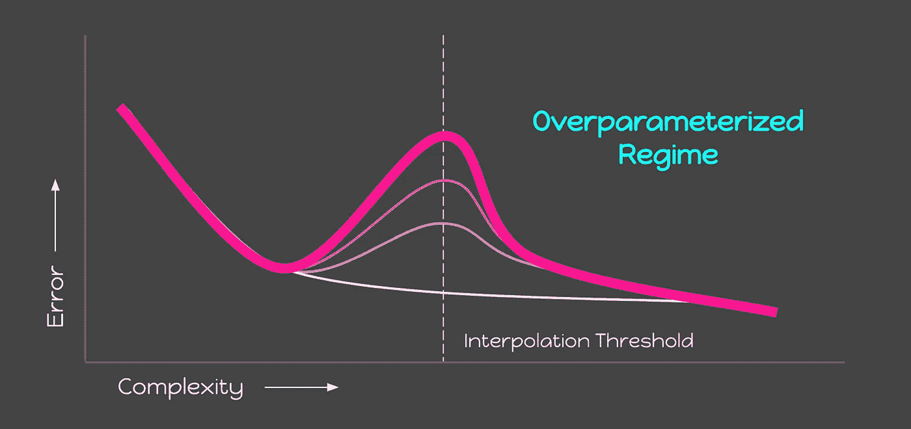

# 告别你的偏见:监督学习的基础理论不完整吗？

> 原文：<https://towardsdatascience.com/kiss-your-bias-goodbye-is-the-fundamental-theory-of-supervised-learning-incomplete-511344d55bcd>

## *深度学习明显违反了偏差-方差权衡，引发了所有预测建模的问题*

偏差-方差权衡是所有监督学习的试金石。它在每门统计学入门课程和数据科学训练营中都有讲授，因为这是我们最小化任何模型的总预测误差的方法。对于回归问题，均方误差有一个[简单的数学分解](https://www.stat.cmu.edu/~cshalizi/ADAfaEPoV/)，分解为偏差项(真实函数的近似误差)、方差项(我们试图拟合的函数估计值的方差)和不可约误差。对于其他类型的误差，如分类的 0–1 损失，没有好的方法将误差分解成其组成部分，但我们可以通过学习曲线经验地测量权衡(或至少接近)。

当我第一次看到一项深度学习研究显示出[奇怪的偏差-方差权衡](https://arxiv.org/pdf/1801.00173.pdf)时，我立刻否定了它。模型中的参数数量超过了数据点的数量，并且完全符合数据中的噪声。就像用高次多项式拟合线性趋势一样，模型不可能尽可能好地推广到新数据。虽然这项研究显示了良好的测试集错误率，但我认为结果是由于泄漏或不可重现的错误。

托马斯·波吉奥等人。艾尔。，“深度学习理论三:解释非过拟合难题”，Image，Arxiv，1/16/2018，[https://arxiv.org/abs/1801.00173](https://arxiv.org/abs/1801.00173)

随着深度学习变得越来越受欢迎，更多的研究得到了类似的结果，往往是错误率出现奇怪的峰值，即模型中的参数数量接近训练集中的样本数量。偏差-方差权衡是监督学习的核心要素，但所有这些结果似乎都违背了它。发生了什么事？

# 双重下降现象

为什么高度参数化的神经网络不会过度拟合数据的问题至少可以追溯到 Breiman 在 1995 年提出的问题。但对不同架构的不同数据集进行的不同深度学习研究显示，这一有趣的结果是可重复的，专家将其命名为“双重下降”现象。[贝尔金等人。艾尔。](https://arxiv.org/pdf/1812.11118.pdf)第一个为这一现象提供了清晰的概念性解释。“经典的”偏差-方差权衡一直保持到模型对训练数据进行插值，此时泛化误差开始随着模型复杂性的增加而再次改善。

正则化过度参数化机制中偏差-方差权衡的说明(Jason Capehart，2022)

他们发现的另一个重要进展是，过度参数化机制中的模型行为并不是神经网络所独有的。这种现象可以扩展到决策树模型和集成。随后，[哈斯蒂等人。艾尔。](https://arxiv.org/pdf/1903.08560.pdf)采用理论方法来研究双重下降，并证明了最小二乘回归(最简单的可能模型之一)基于信噪比、协方差矩阵和特征各向同性的各种选择来展示该现象。他们还证明，当模型被错误指定时，线性模型的风险的全局最小值可能存在于过度参数化的区域中。增加超过插值阈值的参数数量会增加模型的近似能力，并减少他们所谓的“错误设定方差”，该方差可能与“错误设定偏差”不成比例。其核心是，这为过度参数化为什么有益提供了令人信服的论据。随着参数数量的增加，偏差通常会减少，但超过插值阈值后，减少方差项中错误设定的误差会产生最优解。

去年 [Dar et。艾尔。](https://arxiv.org/pdf/2109.02355.pdf)回顾了大量关于过度参数化学习的前期工作，并针对具有“n”个样本和“p”个参数的模型进行了总结:

*   “经典”偏差-方差权衡适用于**欠参数化**区域，其中 p < n
*   插值解，其中 p ~ n 在欠参数化和**过参数化**区域之间的过渡处具有高泛化误差，除非模型被正则化
*   当模型被错误指定时，p > n 的过参数化模型可以实现更好的泛化，但是插值何时是比正则化更好的策略尚不清楚

过度参数化学习的理论仍然无法解释该领域的最新实践，因为它主要局限于简单的参数模型。也就是说，这个理论清楚地表明，我对双重下降现象的最初反应是错误的。这些不是神经网络魔法所特有的虚假结果——深度学习已经促使人们重新评估偏差-方差权衡，目前，它的影响似乎扩展到了所有监督学习。

# 这在实践中意味着什么？

我是一名从业者，这意味着我通常不会关注人工智能研究中的新理论。我感兴趣的大多数问题是因果性的，而不是预测性的，即使它们是预测性的，通常也不是关于固有的稀疏数据。尽管这些结果令我震惊，但还是有几个问题需要澄清:

偏倚-方差权衡是错误的吗？

不。偏差-方差权衡成立，插值阈值之外的权衡本质以前并不为人所知。或者，就我自己而言，我以前对偏差-方差权衡的理解是不完整的。尽管我一直坚持“所有的模型都是错误的”这一概念，但我从未考虑过随着模型容量的增加，模型的错误设定会如何分别影响偏差和方差。[戈曼等人。艾尔。](https://www.dam.brown.edu/people/documents/bias-variance.pdf)30 年前我可能已经明白了这一点，但我认为公平地说，这方面的工作直到最近才得到充分重视。

**插值模型总是最好的模型吗？**

不。它取决于生成分布的数据，并且在模型被很好指定的任何情况下，最佳误差应该在参数化不足的范围内。

**插值比正则化好吗？**

这看起来像一个开放式的问题。理论结果(参见 [Dar 等人。艾尔。](https://arxiv.org/pdf/2109.02355.pdf)第 3.3 节回顾)对具有更强数据假设的更简单模型的研究表明，最佳正则化应始终比插值具有更低的误差率。但这些理论研究是由更复杂的插值模型在实践中的成功推动的，这些模型的假设更少。插值优于正则化或正则化优于插值的情况仍有待研究。

**过度参数化学习提出了哪些新问题？**

有三个让我感兴趣。

1.  测量插值模型复杂性的好方法是什么？使用参数的数量作为模型容量的度量似乎是不够的，特别是对于处于或接近过参数化状态的模型，这些模型具有显式或隐式正则化。
2.  有没有好的方法来测量过度参数化模型的校准？深度学习模型是出了名的过于自信，对于任何插值其训练数据的模型，我甚至不清楚像普拉特缩放这样的事后校准方法是否有意义。
3.  我们如何解决过度参数化模型中的公平性问题？偏见，在偏见的意义上而不是统计意义上，存在于所有真实世界的数据集中。据推测，除非应用公平约束，否则插值数据的模型特别容易强化历史偏见。

过度参数化的学习是否会影响信号处理或深度学习以外的其他领域仍有待观察。目前，超参数化是机器学习中一个有趣的新方向。

# 参考

1.  贝尔金等人。艾尔。，调和现代机器学习实践和偏差-方差权衡(2019)，[https://arxiv.org/abs/1812.11118](https://arxiv.org/abs/1812.11118)
2.  哈斯蒂等人。艾尔。、高维无脊最小二乘插值中的惊喜(2019)【https://arxiv.org/abs/1903.08560 
3.  达尔等人。艾尔。，告别偏差-方差权衡？超参数化机器学习理论综述(2021)，【https://arxiv.org/abs/2109.02355 
4.  贝尔金等人。艾尔。，过拟合还是完美拟合？内插分类和回归规则的风险界限(2018)，[https://arxiv.org/abs/1806.05161](https://arxiv.org/abs/1806.05161)
5.  Shalizi，从初级观点看高级数据分析(2021)，[https://www.stat.cmu.edu/~cshalizi/ADAfaEPoV/](https://www.stat.cmu.edu/~cshalizi/ADAfaEPoV/)
6.  德国 et。艾尔。，神经网络与偏差/方差困境(1992)，[https://www . dam . brown . edu/people/documents/Bias-Variance . pdf](https://www.dam.brown.edu/people/documents/bias-variance.pdf)
7.  Breiman，参考 NIPS 文件后的思考(1995 年)，[https://www.gwern.net/docs/ai/scaling/1995-breiman.pdf](https://www.gwern.net/docs/ai/scaling/1995-breiman.pdf)
8.  波焦等人。艾尔。、深度学习理论三:解释非过拟合难题(2018)[https://arxiv.org/abs/1801.00173](https://arxiv.org/abs/1801.00173)