# 语言模型标度律和 GPT-3

> 原文：<https://towardsdatascience.com/language-model-scaling-laws-and-gpt-3-5cdc034e67bb>

## 理解为什么像 GPT-3 这样的 LLM 工作得这么好…

(照片由[瓦尔德马·布兰德](https://unsplash.com/@waldemarbrandt67w?utm_source=unsplash&utm_medium=referral&utm_content=creditCopyText)在 [Unsplash](https://unsplash.com/s/photos/language?utm_source=unsplash&utm_medium=referral&utm_content=creditCopyText) 上拍摄)

语言模型(LMs)非常通用——它们将文本作为输入，将文本作为输出。最近的研究表明，通过使用提示技术来执行准确的零镜头和少镜头推理，可以利用这种通用的文本到文本结构来解决各种任务，而无需任务特定的适应(即，没有微调或架构修改)。简单地说，我们可以在一个大的、未标记的文本语料库上预先训练 LM(使用语言建模目标)，然后通过文本提示询问 LM 来解决问题。这样，预先训练的模型可以很容易地重新用于解决不同的问题。

虽然 LMs 作为任务不可知的基础模型具有不可思议的潜力，但是最初尝试将预先训练的 LMs 转移到解决下游任务(例如，GPT 和 GPT-2 [4，5])，效果并不好。在这个概述中，我们将了解最近的研究如何建立在这些初步尝试的基础上，并创建了实现更好的任务无关性能的 LMs。这一系列工作的关键发现是 *LMs 变得更加强大，因为你扩大了它们的规模*；见下文。

(来自[1]和[2])

更具体地说，我们将了解到，大型 LMs(LLM)比它们的小型对应物更具有 *(i)* 采样效率，并且 *(ii)* 更能够向下游任务进行任务无关的转移。有趣的是，这些 LLM 的性能遵循各种因素(例如，模型大小和训练数据量)的可预测趋势。对这些趋势的经验观察最终导致了 GPT-3 的诞生，这是一个 1750 亿参数的 LLM，远远超过了其前辈的任务不可知性能，甚至在某些任务上超过了最先进的监督深度学习技术。

# 背景

理解 LMs 所需的大部分先决信息已经在我以前的一篇文章中提到了。这些先决条件包括语言建模目标、只有解码器的转换器模型，以及如何将这些思想结合起来生成强大的基础模型。点击链接[了解更多信息。](https://cameronrwolfe.substack.com/p/language-models-gpt-and-gpt-2#%C2%A7prerequisites-for-gpt)

我将在这里对这些想法进行一个快速的概述，并解释一些有助于理解像 GPT-3 这样的 LLM 的附加概念。

## 语言建模一瞥

现代 LMs 使用通用预训练程序来解决各种各样的任务，而不需要下游适应(即，没有架构修改、微调等)。).使用未标记文本的大型语料库，我们使用语言建模目标预先训练我们的 LM，该目标是 *(i)* 从我们的语料库中采样一些文本，并且 *(ii)* 试图预测出现的下一个单词。这是一种自我监督学习的形式，因为我们总是可以通过简单地查看我们语料库中的数据来找到下一个单词的基本事实；见下文。

语言模型预培训流程(由作者创建)

**建筑。**现代 LMs 使用仅支持解码器的变压器架构，该架构将一系列由屏蔽自我关注和前馈变换组成的层应用于模型输入。使用屏蔽自我注意代替[双向自我注意](https://cameronrwolfe.substack.com/i/76273144/self-attention)，因为它防止模型在序列中“向前看”以发现下一个单词。

除了这些仅用于解码器的层之外，LM 架构还包含嵌入层，这些嵌入层存储与固定大小词汇表中所有可能的标记相对应的向量。使用这些嵌入图层，可以将原始文本转换为模型可接受的输入矩阵，如下所示:

1.  [将](/how-to-build-a-wordpiece-tokenizer-for-bert-f505d97dddbb)原始文本标记成单独的标记(即单词或子单词)
2.  为每个输入标记查找相应的嵌入向量
3.  连接令牌嵌入，形成令牌向量的矩阵/序列
4.  向每个令牌添加位置(和其他)嵌入

请参见下图，了解此过程的说明。

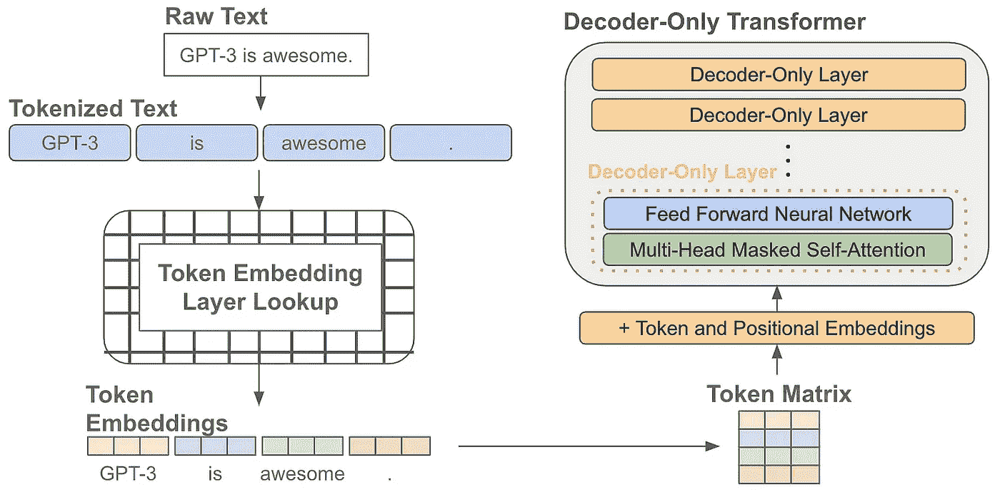

将原始文本转换成与模型兼容的令牌嵌入矩阵(由作者创建)

理解 LM 中嵌入层和仅解码器层之间的区别很重要。例如，本概述中的一些后续工作将通过排除嵌入层中的参数并仅计数仅包含在解码器层中的参数来研究基础 LM 中的参数数量。

**适应。**通过在大型语料库上预训练 LMs，我们获得了一个模型，该模型可以在给定一系列标记作为上下文的情况下准确预测下一个标记。但是，*我们如何使用这样的模型来解决像句子分类和语言翻译这样的语言理解任务呢？*

对于现代 LMs，这个问题的答案实际上很简单——我们根本不改变 LM。相反，我们通过向模型提供文本“提示”来利用模型的文本到文本输入输出结构的一般性质，例如:

*   "把这句话翻译成英语: <sentence>= > "</sentence>
*   “总结以下文档: <document>= >”。</document>

给出这些解决问题的提示(更多例子见[这里的](https://www.buildgpt3.com/)),一个好的 LM 应该输出一个为我们解决问题的文本序列！对于我们必须从一组固定的解决方案(即多项选择或分类)中进行选择而不仅仅是生成文本的问题，我们可以使用 LM 来衡量生成每个潜在解决方案的概率，并选择最有可能的解决方案。

**主打外卖。**现代 LLM 的关键在于，我们可以使用语言模型预训练作为创建通用基础模型的工具，这些模型可以解决各种问题，而无需调整或微调模型。尽管与微调或监督语言理解技术相比，以前的 LMs 如 GPT 和 GPT-2 [4，5]表现不佳，但这样的学习框架非常有前途，正如我们将在 GPT-3 中看到的那样，甚至可以在底层 LM 变得更大时表现得相当好。

## 幂定律

本概述将包含对[幂律](https://en.wikipedia.org/wiki/Power_law)概念的多次引用。例如，一份文件可能会做出如下声明:

> *“LM 的试验损失根据模型参数的数量按幂律变化”。*

这句话简单地告诉我们，两个量之间存在关系——损耗和模型参数的数量——因此一个量的变化会产生另一个量的相对[不变](http://felix.physics.sunysb.edu/~allen/540-05/scaling.html#:~:text=scale%20invariance%20of%20power%20law%20functions&text=The%20function%20y%3Dxp,by%20a%20scale%20factor%20a.)变化。

为了更具体一点，幂律可以用下面的等式来表示。

(作者创作)

这里，我们研究的两个量是`x`和`y`，而`a`和`p`决定了这些量之间的幂律的形状/行为。绘制该幂律(使用`a = 1`、`p = 0.5`和`0 < x, y < 1`)会产生下图，其中将两个轴转换为对数标度会产生幂律特有的线性趋势。

描述两个量之间的基本幂律关系(由作者创建)

幂定律只是告诉我们一个量作为另一个量的幂而变化。我们将在本概述中看到的工作考虑了幂律的逆版本，如下所示。

(作者创作)

值得注意的是，这个等式与之前的等式相同，只是`p`的指数为负。这个负指数产生了下图，其中一个量随着另一个量的增加而减少。

描述两个量之间的逆幂定律(由作者创建)

在我们对 LMs 的分析中，我们会遇到类似上图的幂律。也就是说，LM 损失倾向于根据关于几个不同因素(例如模型或数据集大小)的幂定律而降低。我们将在后面的章节中对此进行更多的阐述。

## 其他有用的细节

除了语言建模背后的核心思想之外，还有几个额外的概念可能有助于了解下一步。

**分布式训练。**这篇综述中的论文的主要思想是扩大像 GPT 和 GPT-2 这样的模型，使它们变得更好。然而，随着我们的模型变得越来越大，由于计算和内存开销的增加，训练变得更加困难。为了帮助实现这一点，我们可以利用分布式培训技术，这种技术使用更多的硬件(例如，更多的服务器/GPU)来使大规模培训过程更加容易处理和高效。

有几种不同的方法来分配神经网络的训练过程。这些技术之一是*数据并行训练*，其中我们:

1.  取一个大的小批量
2.  将这个小批量分成几个更小的子批量
3.  在不同的 GPU 上并行执行与每个子批次相关的计算
4.  将来自每个 GPU 的子批次结果累积到一个集中的模型更新中

这种方法通过在几个 GPU 上并行化大型小批量的模型计算来提高训练效率。

有些不同的是，我们可以执行*模型并行训练*，它将模型本身(即，而不是小批量)分割到多个 GPU 上。例如，我们可以将模型的每一层——甚至每一层的更小部分——发送到单独的 GPU。实际上，这意味着正向传递分布在几个设备或 GPU 上，每个设备或 GPU 包含底层模型的一小部分。这种方法能够训练更大的模型(即，因为每个 GPU 只存储模型的一小部分！)并且可以通过智能流水线和模型前向传递的并行化来提高训练效率。

出于概述的目的，我们只需要知道我们可以利用跨许多 GPU 的分布来使 LLM 训练更易处理和更高效。数据和模型并行训练是流行的分布式训练技术的例子。分布式训练存在许多考虑因素和替代方法——这是深度学习中的一个完整的研究领域，产生了许多令人敬畏的实际结果。

要了解更多信息，我建议查看以下文章:

*   数据和模型并行训练[ [博客](https://analyticsindiamag.com/data-parallelism-vs-model-parallelism-how-do-they-differ-in-distributed-training/)
*   让 LM 培训更高效[ [LM 博客](https://www.mosaicml.com/blog/billion-parameter-gpt-training-made-easy) ] [ [LLM 博客](https://www.mosaicml.com/blog/gpt-3-quality-for-500k) ]

**临界批量。**鉴于使用大批量进行数据并行训练可以提高计算效率，我们应该尽可能地扩大批量，对吗？嗯，这不太正确，因为 *(i)* 较大的批处理可能会降低模型性能，而 *(ii)* 增加批处理大小会增加计算成本并需要额外的硬件。简单地说，批量增加太多会产生收益递减；见下文。

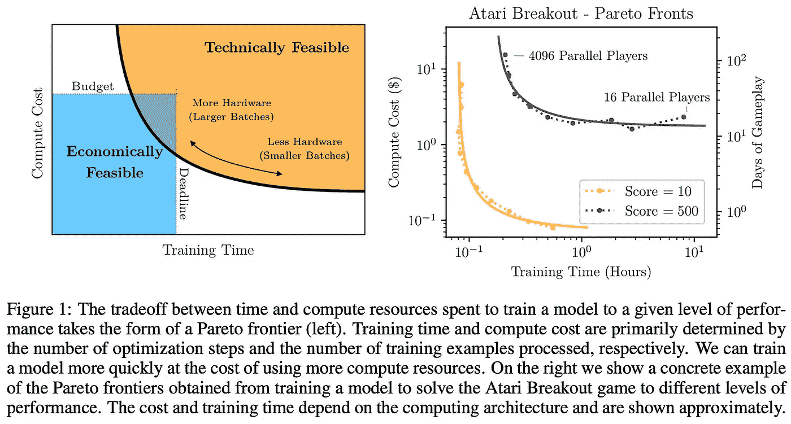

(摘自[3])

考虑到这一点，我们可能会开始想:*使用什么样的批量最合适？*这个问题通过【3】中临界批量的建议得到了经验性的回答。这项工作使用一种称为*梯度噪声标度*的度量来估计跨各种域的最大有用批量。超过这个临界批量，我们开始看到在性能和计算效率方面的收益递减。因为采用不同的批量大小会影响培训的效率和质量，一些工作——正如我们将在本概述中看到的——采用临界批量大小作为资源高效培训的标准实践。

**光束搜索。** LM 通过输出文本序列响应提示来解决问题。这些序列可以通过连续预测下一个单词、将这个单词添加到输入提示中、预测另一个单词等等来自回归生成；见下图。

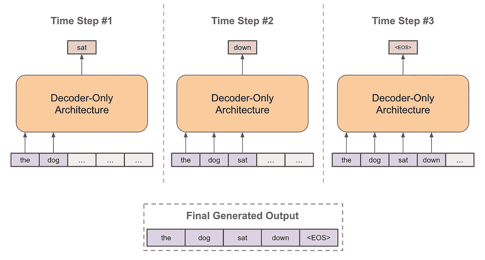

使用语言模型生成自回归输出(由作者创建)

然而，不断预测最可能的下一个单词的贪婪方法并不是最佳的！这是因为记号序列的概率(假设每个记号独立地生成)是给定前面记号的每个单词的条件概率的乘积(即，由于概率的[链规则](https://www.hackerearth.com/practice/machine-learning/prerequisites-of-machine-learning/bayes-rules-conditional-probability-chain-rule/tutorial/))。贪婪地选择最可能的下一个令牌可能不会最大化这个概率；例如，最初选择低概率记号可能随后导致序列的剩余部分中的更高概率记号。

我们可以用*波束搜索*找到一个近似的解决方案，而不是测试所有可能的输出标记的组合来找到最佳输出序列。波束搜索背后的思想很简单:不是在每一步选择最可能的下一个标记，而是选择前 k 个最可能的代，基于这些顶部选择维护一个可能的输出序列列表，然后在最后选择这些序列中最可能的。

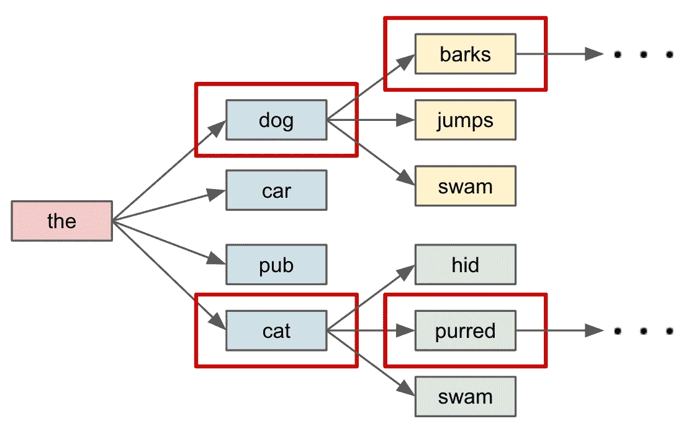

k=2 的波束搜索(由作者创建)

# 出版物

我们现在将概述预测[1]和经验验证[2]类似 GPT-3 的 LLMs 的难以置信的实际效用的出版物。从这些出版物中，我们将更好地理解为什么 LLM 如此强大，并看到它们在实际应用中的性能的广泛分析。

## [神经语言模型的标度律](https://arxiv.org/abs/2001.08361)【1】

GPT 和 GPT-2 [4，5]向我们展示了 LMs 作为通用基础模型的不可思议的潜力，但是当转移到下游任务时，它们的性能仍然有待改进。因此，我们可能会问:*我们如何才能让这些模型变得更好？*

在[1]中，作者研究了使 LMs 更强大的一个潜在方向——扩大规模。具体来说，他们训练一群仅解码器的 LMs，并分析其测试损失(即，在保留测试集上的交叉熵语言建模损失)作为几个因素的函数，这些因素包括:

*   模型尺寸
*   数据量
*   训练计算量
*   批量
*   建筑细节(即模型宽度/深度、注意力头数量等。)
*   上下文长度(即，用于预测下一个记号的记号的数量)

这种分析揭示了 LM 训练行为的几个基本特性。例如，如果参数总数是固定的，调整架构细节对 LM 性能的影响是最小的。然而，LM 的测试损失遵循关于模型大小、数据大小和跨越几个数量级的训练计算量的幂定律；见下文。

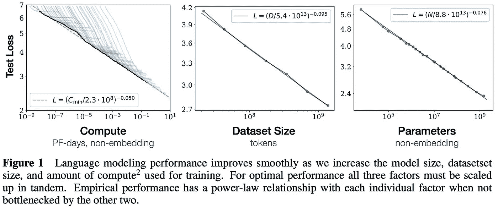

(来自[1])

为了让这一点更清楚，作者在[1]中考虑了三个主要因素:模型大小(N)、数据大小(D)和训练计算量(C)。为了研究与这些因素中的任何一个相关的缩放行为，我们 *(i)* 确保其他两个因素足够大(即，因此它们不是性能的瓶颈)，然后 *(ii)* 在我们正在研究的因素的大范围值上测量 LM 的测试损失。例如，为了研究 C 的缩放属性，我们确保模型和数据集足够大，然后测量不同 C 设置下的 LLM 性能。我们现在将分别考虑这些因素。

**模特身材。**为了研究相对于模型大小的缩放特性，作者在来自[1]–WebText2 的完整数据集上训练不同的 LM 收敛，webtext 2 是来自 GPT-2 的扩展版本 WebTest[2]，大约大 10 倍。然后，通过采用具有不同数量的总参数的几个 LMs，我们可以获得如下所示的图。

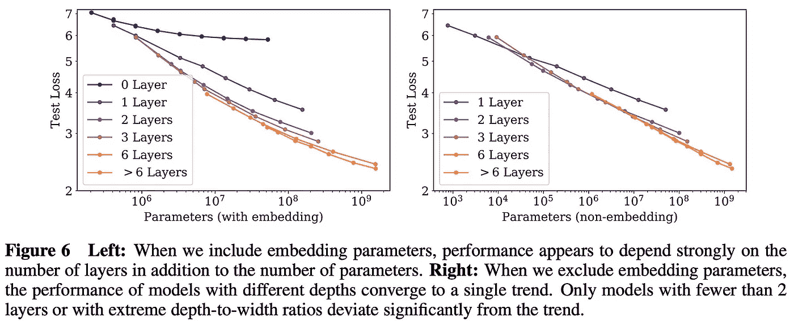

(来自[1])

通过将 LM 的测试损耗绘制为仅解码器层中的参数总数的函数(即，排除嵌入层中的所有参数)，我们可以看到 LM 损耗遵循关于 n 的平滑幂定律。换句话说，*增加 LM 的大小会产生其性能的稳定改善*。

(来自[1])

**数据和计算。**为了研究 LM 的性能如何随训练数据量而扩展，作者[1]采用了足够大的 LM，并在不同大小的数据集上执行单独的训练试验。对于每个试验，模型被训练直到试验损失开始增加，这是过度拟合的指示。此外，该分析向我们显示，测试损失根据关于数据集大小的幂定律而减少；见上文。

(来自[1])

当改变训练计算量时，我们看到一个非常相似的趋势，定义为批大小 B 和训练迭代次数 s 的 C = 6NBS，给定一个足够大的数据集和固定的批大小 B，我们可以扫描多个 LM 大小 N 以获得上面所示的结果。这里，我们看到，使用 N 和 S 的不同组合实现了每个计算预算 C 的最佳结果，但是最佳 LM 损失根据关于训练计算量的幂定律而降低。

此外，我们可以从这些结果中看到，LM 样本效率(即模型运行良好所需的样本数量)随着 n 的增加而提高。为了更清楚地说明这一点，[1]的作者分析了不同规模的 LMs 在训练期间观察到的样本总数方面的性能，得出了下图。在这里，我们可以清楚地看到，随着模型变大，LM 的性能提高得更快。

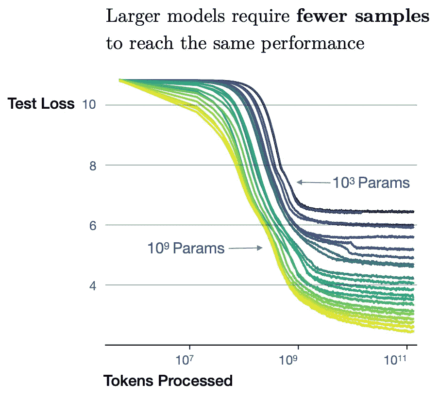

(来自[1])

**成对标度定律。**除了通过孤立地分析 N、D 和 C 观察到的幂定律，同时改变这些因素的配对也可以产生可预测的行为；例如，通过联合改变 N 和 D，我们可以获得如下所示的图。这里，我们观察到 *(i)* 较大的模型开始在较小的数据集上过度拟合，并且 *(ii)* LM 损失遵循关于给定的足够大的数据集的 N 的严格幂定律。

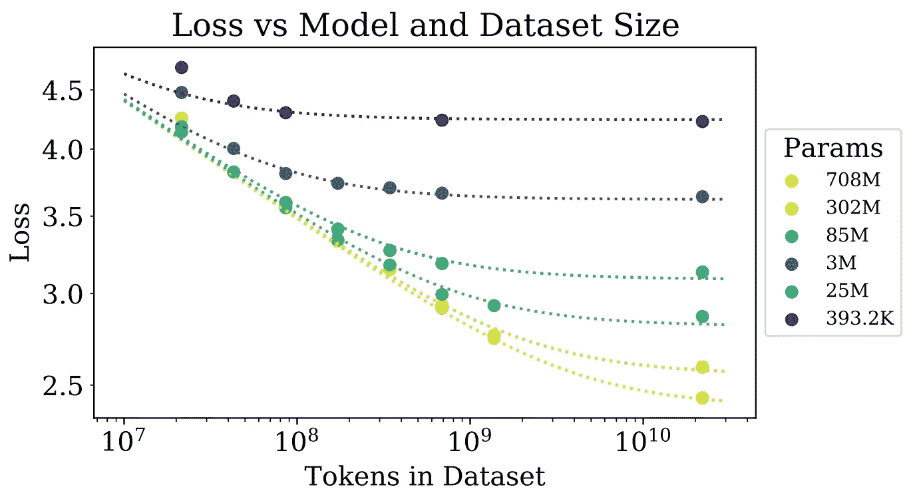

(来自[1])

在高层次上，这告诉我们，当我们增加底层 LM 的大小时，我们必须使数据集更大，以避免过度拟合。然而，作者在[1]中发现，次线性缩放数据大小(即，与`N^0.74`成比例)足以避免过度拟合。

**外卖。**虽然我们已经在高层次上讨论了[1]中概述的幂定律，但实际出版物使这些定律变得非常具体，甚至提出了任何 LM 测试损耗的准确预测框架。为了简单起见，我们在这里避免这些细节，而是集中在以下用于训练 LMs 的要点上。

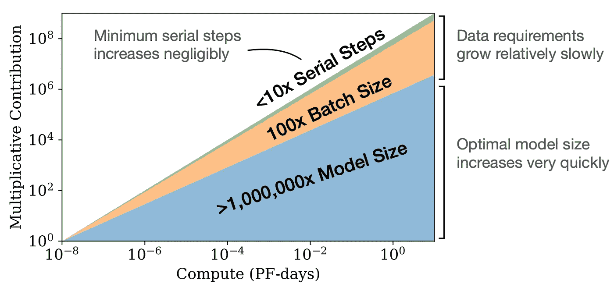

如何恰当地在 LLM 培训中投入更多计算(来自[1])

如果我们要扩大 LM 培训的规模，我们应该:

1.  将大部分额外计算投入到更大的模型中(即，更大的模型样本效率更高)
2.  增加数据集的大小(但不要像模型大小那样大)以避免过度拟合。
3.  稍微增加批量大小(即根据临界批量大小[3])。
4.  停止训练远未收敛的模型，以优化训练计算的使用。

在[1]中观察到的幂律似乎不受阻碍地持续了几个数量级。虽然这种扩展最终会达到一个极限，但它仍然表明(适当地)增加 LM 训练的规模会产生可测量的性能收益，暗示探索 LLM(如 GPT-3)可能会被证明是非常有益的。

> “我们的结果强烈表明，更大的模型将继续表现更好，并且样品效率也将比以前预期的高得多。大模型可能比大数据更重要。”—来自[1]

# [语言模型是一次性学习者](https://arxiv.org/abs/2005.14165) [2]

先前关于 GPT 和 GPT-2 [4，5]的工作开始揭示通用 LMs 在解决文本理解任务中的效用。然而，这些模型仍然有局限性:

*   GPT 并不是完全任务不可知的(即，需要特定任务的微调)
*   GPT-2 在零射击状态下的表现远不如有监督的最先进水平

现有的工作提供了一个“概念证明”,即 LMs 可以通过执行零/少量、任务不可知的推理来消除对任务规范的需求。然而，LMs 相对于监督技术的较差性能使得它们不太实用。幸运的是，在[1]中观察到的幂律提供了希望，即较大的 LMs(即 LLM)可以缩小任务不可知和任务特定/监督性能之间的差距。

朝着这个方向发展，GPT-3 与 GPT-2 共享相同的纯解码器架构(除了增加一些稀疏注意层[6])，在现有 LMs 的基础上增加了几个数量级。特别地，它是具有超过 1750 亿个参数的 LLM(即，作为参考，GPT-2 [5]包含 15 亿个参数)；见下文。

(来自[2])

随着 GPT-3，我们终于开始看到 LLMs 有希望的任务无关性能，因为该模型的少数镜头性能在几个任务上接近监督基线。与 GPT-2 类似，作者使用语言建模目标对 LLM 进行预训练，但他们采用了基于过滤版本的 CommonCrawl 和一些附加的高质量语料库的更大数据集。用于预训练的完整数据集的细分如下所示。

(来自[2])

GPT-3 的预训练与 GPT-2 相似，但模型的训练时间要长得多。为了使训练过程在计算上可行，作者采用了模型并行分布式训练方法，该方法将每个 LM 层的部分分布在单独的 GPU 上。因为每个 GPU 只存储完整模型的一小部分，所以可以在不超过内存限制的情况下进行训练。

GPT-3 的学习过程有两个组成部分:联合国/自我监督的预培训和环境学习。这两个组件如下图所示。

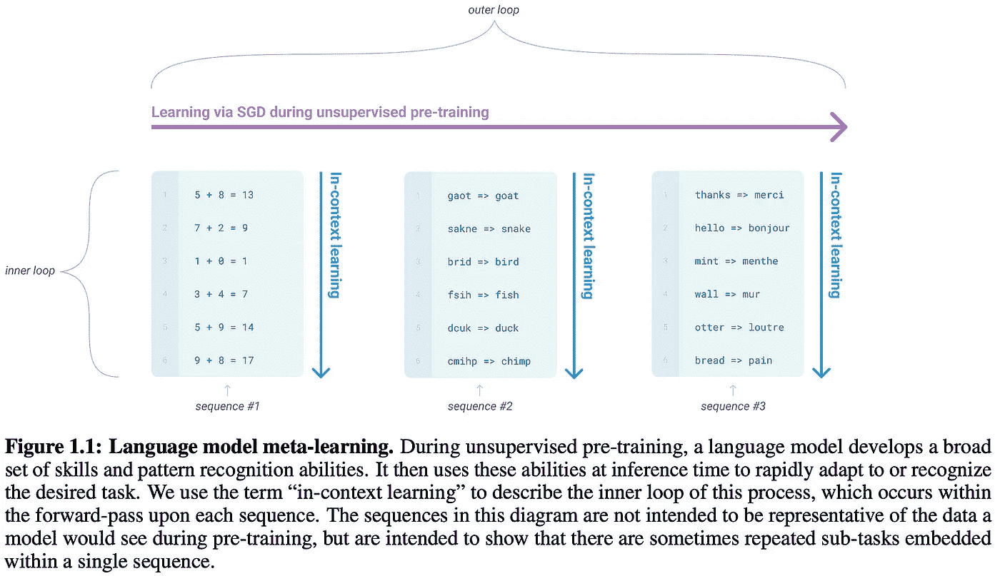

(来自[2])

简而言之，我们首先在大型无监督文本语料库上预训练通用 LLM，然后使用上下文学习指导该模型解决下游任务。这种环境中的学习过程可以通过特定任务的微调(如在 GPT)来执行，甚至可以使用像不需要对 LM 进行梯度更新的少数镜头学习这样的技术。微调与零次、一次和少量学习的不同变体之间的差异如下所示。

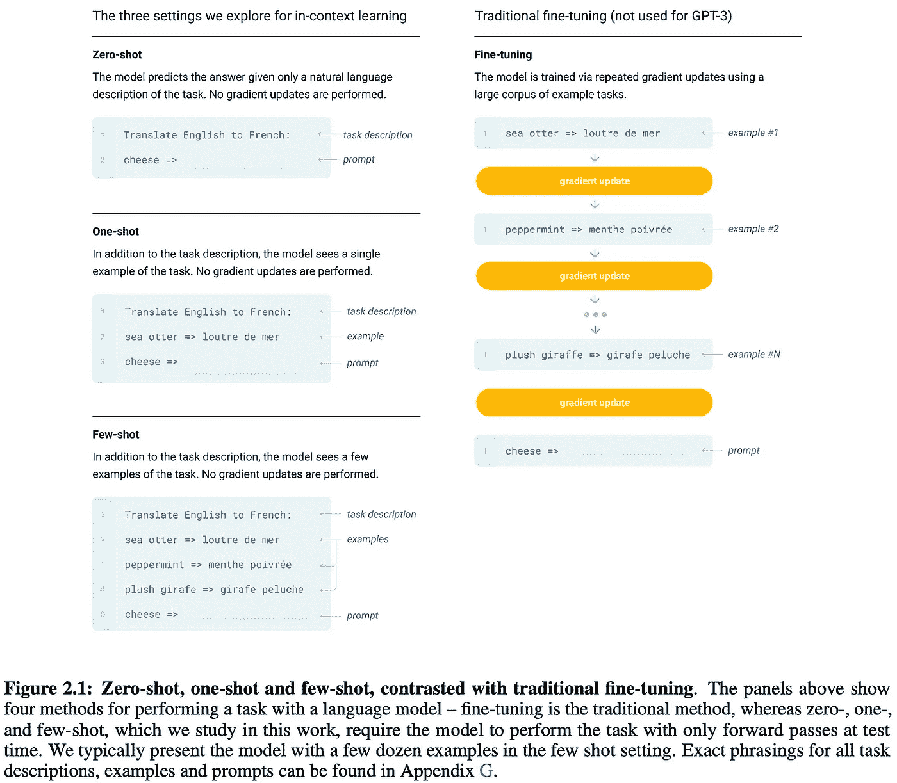

(来自[2])

与以前的变体不同，GPT-3 仅使用零和少量学习技术进行评估。作者没有根据用于评估的任何下游数据集调整或微调模型。相反，他们在大规模文本语料库上预先训练这个令人难以置信的大模型，并研究仅使用包含不同数量“上下文相关示例”的少量提示技术是否可以准确地执行上下文相关学习，如上图所示。

通过在一系列语言理解任务上评估 GPT-3，我们立即看到使用更大的模型显著地有益于少数镜头表现。例如，在句子完成任务上，GPT-3 改进了当前的最先进水平(即，包括使用监督训练或微调的方法！)在几个流行的数据集上，提供更多的上下文示例似乎可以进一步提高性能；见下文。

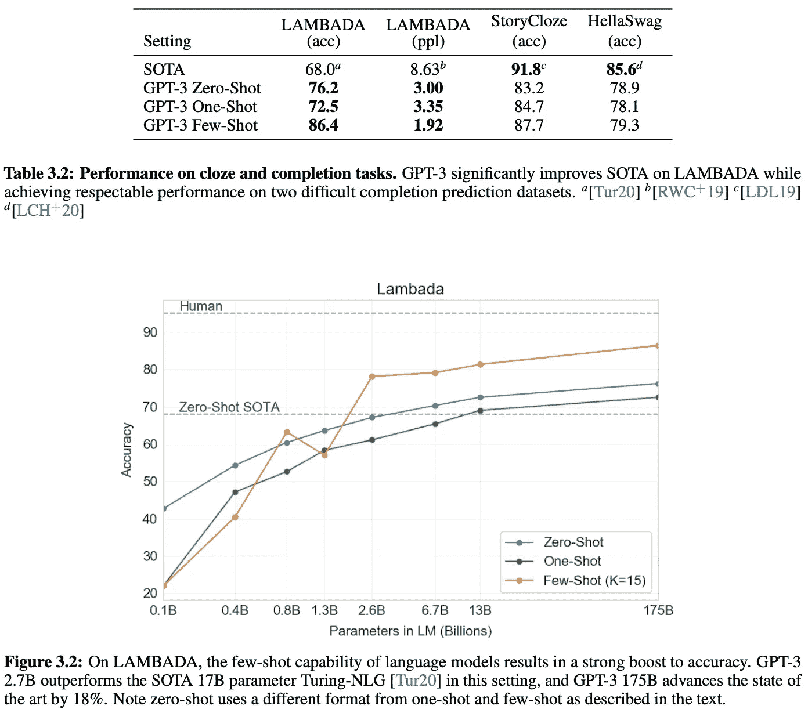

(来自[1])

在问答任务中，我们看到 GPT-3 的表现优于 T5 [7]或罗伯塔[8]等模型。然而，这些模型执行广泛的、受监督的微调，而 GPT-3 通过任务不可知的、少量的推理实现了可比较的结果。简而言之，GPT-3 在这些任务上的表现仍然令人印象深刻，因为它是一个完全通用的 LLM，没有以任何方式专门解决这些任务。

当在翻译任务上评估 GPT-3 时，我们观察到 GPT-3 在从其他语言翻译成英语方面优于最先进的无监督神经机器翻译(NMT)技术。鉴于 GPT-3 的预训练集仅包含 7%的非英语内容，并且没有语言之间的明确混合或翻译，这样的结果令人惊讶。有趣的是，GPT-3 在从英语翻译成其他语言方面的效率要低得多；见下文。

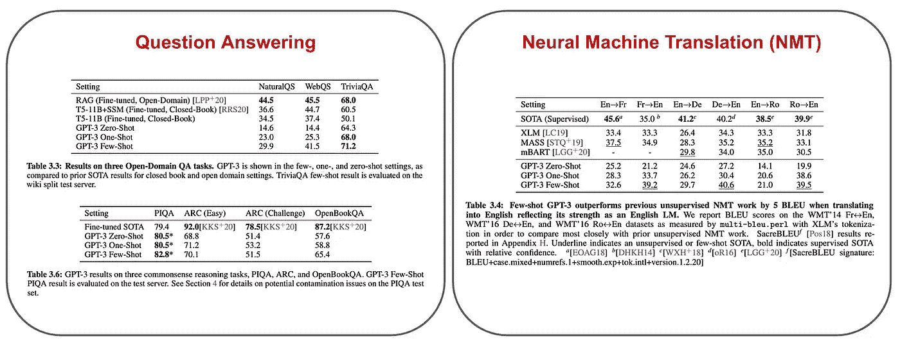

(来自[2])

作者还在超级胶水基准测试上评估了 GPT-3，该测试包含各种不同的语言理解任务。结果汇总在下图中，我们可以看到 *(i)* 使用更多的上下文示例有利于 GPT-3 的性能，*(ii)*【GPT-3 甚至可以超过流行的微调基线，如[BERT](https://cameronrwolfe.substack.com/p/language-understanding-with-bert)【9】。

(来自[2])

在所有的基准测试中，GPT-3 向我们展示了 LLM 随着规模的增长，在任务无关的情境学习中变得更加有效。我们可以使用上下文中的示例来促使 LLM 对各种任务做出准确的响应，这使得 GPT-3 成为第一个使用通用 LLM 对各种下游任务执行高度准确的推理而无需任何特定任务修改的实际例子。

尽管 GPT-3 在创建任务不可知的语言基础模型方面取得了令人难以置信的飞跃，但这些进步是以巨大的计算成本为代价的。GPT-3 是在一个专用 GPU 集群上进行预训练的，其预训练过程需要的计算量比之前研究过的任何模型都多得多；见下文。

(来自[2])

虽然最近的工作已经大幅降低了 GPT-3 的训练成本(即从 1000 万美元的计算成本降低到 50 万美元)，但获得这样的基础模型仍然不便宜。如果我们想创建自己的基础模型，如 GPT-3，我们最好确保它表现良好。

**开源 GPT-3。**在[2]中 GPT-3 的最初提议之后，该模型没有公开发布。相反，它只能通过[付费 API](https://openai.com/api/)访问。尽管模型的 API 被大量使用，但是缺乏对模型本身(及其训练代码)的开源访问阻碍了进一步的分析和实验。

为了消除这个问题，一个开源版本的 GPT-3，称为 OPT-175B，被创建和分析[10]。OPT-175B 的发布还包括一个完整的代码库和几个日志，为 LLM 培训过程提供了有价值的见解。了解更多关于 OPT-175B 的信息(并查看可用于训练 GPT-3 等 LLM 的代码！)，查看这里的概述。

# 外卖食品

最初提出和探索 GPT 模型的目的是创建能够解决各种任务的通用语言模型。这些模型是在这样的假设下运行的:如果我们可以在非常精细的级别上理解语言建模(即预测序列中的下一个单词)，那么我们可以用许多有用的方式来概括这种理解，而不需要特定任务的微调或调整。

最初，像 GPT 和 GPT-2 这样的 LMs 没有达到这个目标。他们与任务无关的表现远不如监督基线。然而，在这个概述中，我们已经了解到，增加这些 LMs 的规模是创建高性能、任务不可知的语言理解模型的可行途径。最终，这种思路导致了 GPT-3 的提出和分析，这是一个巨大的 LLM(比 GPT-2 大 100 倍),远远超过了以前的 LMs 的任务无关性能。

**缩放定律。**纵向扩展 LMs(即使用更大的模型、更多的数据和更多的计算)可以显著提高其性能。随着我们增加 LM 训练的规模，我们从[1]中的发现得知，我们应该 *(i)* 显著增加基础模型的大小，并且 *(ii)* 在较小程度上增加用于预训练的数据量(以及批量大小)。较大的语言模型的样本效率更高，并且它们的性能在模型大小、数据大小和跨几个数量级的训练计算量方面以幂律形式提高。换句话说， *LMs 变得越大越好*。

**我们可以扩展到什么程度？** GPT-3(拥有 1750 亿个参数的 LLM)以前所未有的规模实证验证了[1]中概述的趋势。当我们采用这种大规模模型并在大型文本语料库上对其进行预训练时，我们看到在任务不可知、少数镜头性能方面的巨大改进。在几个基线上，GPT-3 仍然优于监督技术，但[2]中的发现提供了明确的证据，表明 LLM 随着规模的增长，其执行上下文学习的能力有所提高。虽然 GPT-3 在技术上类似于 GPT-2，但训练这种规模的模型是一项工程壮举，展示了语言基础模型令人难以置信的潜力。

## 结论

非常感谢你阅读这篇文章。如果你喜欢它，请在 [twitter](https://twitter.com/cwolferesearch) 上关注我，或者订阅我的[深度(学习)焦点时事通讯](https://cameronrwolfe.substack.com/)，在那里我挑选了一个关于深度学习研究的单个双周主题，提供了对相关背景信息的理解，然后概述了关于该主题的一些流行论文。我是 [Cameron R. Wolfe](https://cameronrwolfe.me/) ，ale gion[的研究科学家，莱斯大学的博士生，研究深度学习的经验和理论基础。你也可以看看我在 medium 上的](https://www.alegion.com/)[其他作品](https://medium.com/@wolfecameron)！

## 文献学

[1]卡普兰，贾里德，等。“神经语言模型的标度律。”arXiv 预印本 arXiv:2001.08361 (2020)。

[2]布朗、汤姆等人，“语言模型是一次性学习者。”神经信息处理系统进展 33(2020):1877–1901。

[3] McCandlish，Sam 等，“大批量培训的经验模型”arXiv 预印本 arXiv:1812.06162 (2018)。

[4]拉德福德、亚历克等，“通过生成性预训练提高语言理解”(2018).

[5]拉德福德、亚历克等人，“语言模型是无人监督的多任务学习者。”

[6] Child，Rewon 等人，“用稀疏变换器生成长序列”arXiv 预印本 arXiv:1904.10509 (2019)。

[7] Raffel，Colin 等人，“用统一的文本到文本转换器探索迁移学习的极限”j .马赫。学习。第 21.140 (2020)号决议:第 1 至 67 段。

[8]刘，，等.“Roberta:一种稳健优化的 bert 预训练方法”arXiv 预印本 arXiv:1907.11692 (2019)。

[9] Devlin，Jacob 等《Bert:用于语言理解的深度双向转换器的预训练》arXiv 预印本 arXiv:1810.04805 (2018)。

[10]张，苏珊等:“开放预训练转换语言模型”arXiv 预印本 arXiv:2205.01068 (2022)。