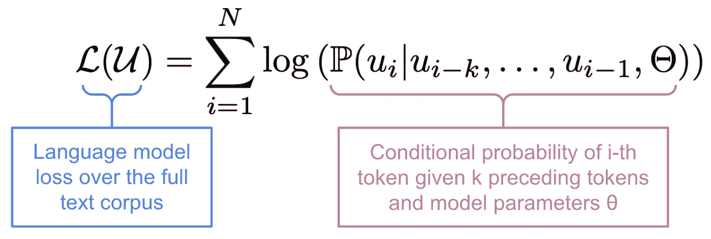
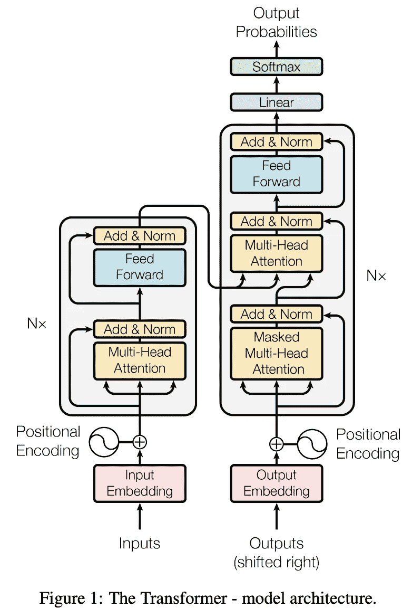
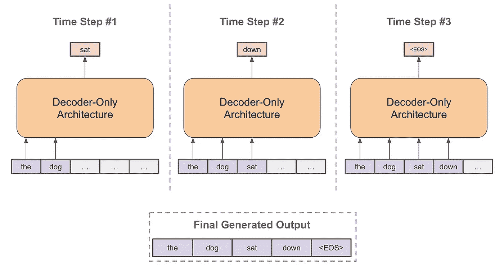
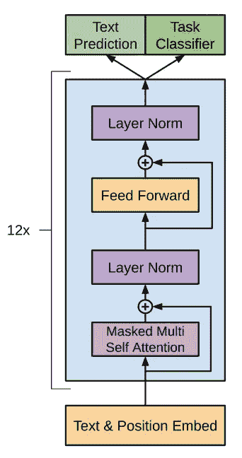
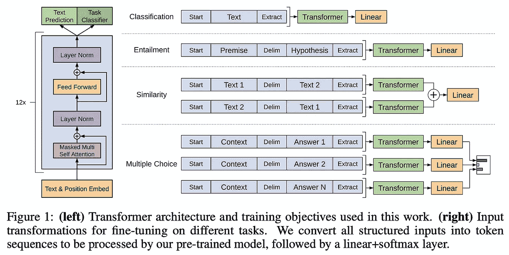
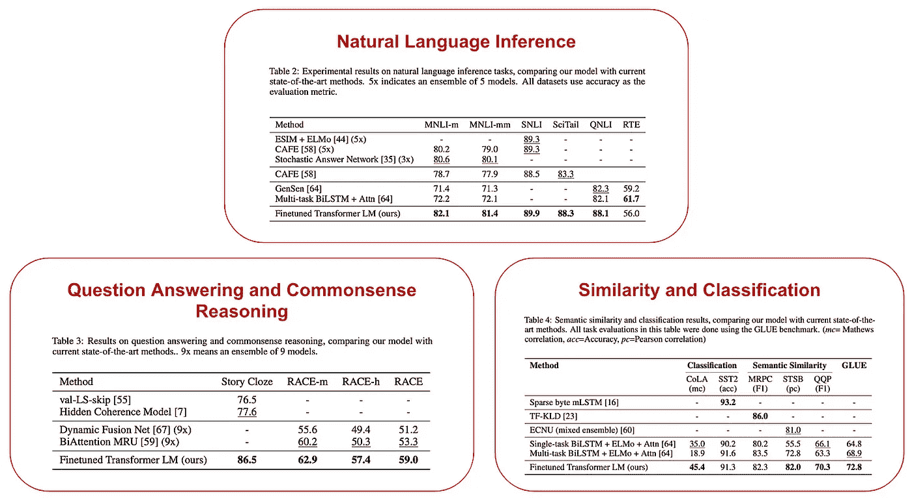
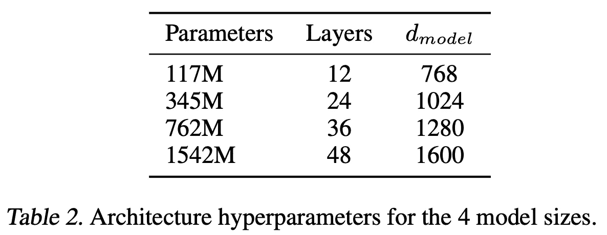
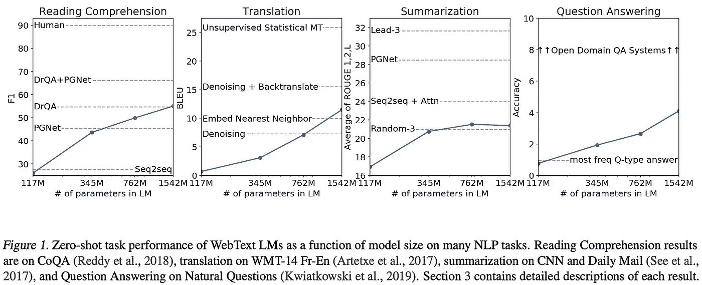

# 语言模型:GPT 和 GPT-2

> 原文：<https://towardsdatascience.com/language-models-gpt-and-gpt-2-8bdb9867c50a>

## 小型语言模型如何激发现代突破

(图片由[JESHOOTS.COM](https://unsplash.com/@jeshoots?utm_source=unsplash&utm_medium=referral&utm_content=creditCopyText)在 [Unsplash](https://unsplash.com/s/photos/writing-an-email?utm_source=unsplash&utm_medium=referral&utm_content=creditCopyText) 上拍摄)

像 GPT-3 [7]这样的语言模型已经彻底改变了 NLP 的现代深度学习应用，导致了广泛的宣传和认可。然而，有趣的是，GPT-3 的大部分技术创新都是从它的前辈 GPT 和 GPT-2 继承来的。因此，对 GPT 和新 GPT 协议的有效理解有助于更好地理解当前的自然语言处理方法。

GPT 和 GPT-2 模型探索的基本方法很简单。事实上，它可以归结为几个步骤:

1.  使用大量原始文本数据预先训练语言模型
2.  采用这种预先训练的模型来解决下游任务

不过描述的有点模糊。*语言模型的预训练是如何工作的？我们如何“适应”语言模型来解决不同的任务？*

在这个概述中，我们将建立对语言建模的基本理解，它在 GPT 和 GPT-2 中的使用，以及除了生成连贯的文本之外，它如何被用来解决问题。尽管 GPT 和 GPT-2 由于最近提出了更大、更有能力的模型而有些过时，但它们所基于的基本概念仍然与现代深度学习应用高度相关。让我们仔细看看。

预先训练的语言模型可用于解决各种下游任务(由作者创建)

# GPT 的先决条件

GPT 和 GPT-2 背后的基本直觉是使用通用的、[预训练的](https://cameronrwolfe.substack.com/i/73746314/training-pre-training-and-fine-tuning)语言模型来高精度地解决各种语言建模任务。为了充分理解这种方法，我们必须首先涵盖一些关于语言模型如何工作的基本概念，以及它们如何在 GPT 协议和新 GPT 协议中得到利用。

## 语言建模

语言模型预培训(由作者创建)

使用语言建模目标，在未标记文本数据的语料库/数据集上预先训练 GPT 模型。简单来说，这意味着我们通过 *(i)* 从数据集中采样一些文本，以及 *(ii)* 训练模型来预测下一个单词，来训练模型；见上图。这种预训练程序是一种[自我监督学习](https://cameronrwolfe.substack.com/i/76273144/self-supervised-learning)的形式，因为正确的“下一个”单词可以通过简单地查看数据集中的下一个单词来确定。

**数学中的语言建模。**要理解语言建模，我们只需要掌握上面概述的基本思想。然而，为了更严谨一点，我们可以注意到我们的语料库只是一组标记。我们可以将标记视为数据集中的单个单词，但这并不完全正确。现实中，令牌可能是子词，甚至是字符；更多详情请参见此处的[和](/how-to-build-a-wordpiece-tokenizer-for-bert-f505d97dddbb)。

让我们将组成我们的预训练数据集的这组记号(大小为`N`)表示如下。

我们的未标记文本语料库只是一组有序的标记(由作者创建)

给定具有参数`θ`的深度学习模型，语言建模目标试图最大化如下所示的可能性。

文本语料库中的语言建模损失

简而言之，这个表达式描述了给定`k`前一个标记作为上下文，模型预测正确的下一个标记的概率。对于任何可能难以理解这一公式的人，请随意查看下面的帮助链接。

*   为什么我们使用对数概率？[ [博客](https://chrispiech.github.io/probabilityForComputerScientists/en/part1/log_probabilities/)
*   理解条件概率[ [博客](https://www.hackerearth.com/practice/machine-learning/prerequisites-of-machine-learning/bayes-rules-conditional-probability-chain-rule/tutorial/)

使用语言建模损失(这只是表征了我们的模型准确预测序列中下一个标记的能力！)，我们可以按照以下程序预训练我们模型的参数`θ`，以使损失最小化:

1.  来自预训练语料库的样本文本
2.  用我们的模型预测下一个令牌
3.  使用随机梯度下降(SGD)或任何其他优化器[来增加正确的下一个令牌的概率](https://ruder.io/optimizing-gradient-descent/)

通过多次重复这种(自我监督的)训练过程，我们的模型最终将变得真正擅长语言建模(即预测序列中的下一个令牌)。

什么是语言模型？使用这种自我监督语言建模目标预训练的模型通常被称为语言模型(LMs)。随着规模的扩大，LMs 变得更加有效(例如，更多的层、参数等。).因此，我们将经常看到这些模型的更大版本(例如，GPT-3 [7])，它们被称为大型语言模型(LLM)。

**LMs 为什么有用？** LMs 可以通过迭代预测最可能的下一个令牌来生成连贯的文本，这使得从文本自动完成到聊天机器人的一系列应用成为可能。然而，除了它们的生成能力之外，NLP 中的先前工作已经表明 LM 预训练对于各种任务是令人难以置信地有益的；例如，预训练的单词嵌入在下游任务中是有用的[3，4]，LM 预训练提高了[lstm](https://colah.github.io/posts/2015-08-Understanding-LSTMs/)【5】的性能。

超越这种方法，GPT 模型探索语言模型预训练与变压器[6]。与顺序模型(如 LSTM)相比，变形金刚具有令人难以置信的表现力(如高表现能力、多参数等)。)和 *(ii)* 更适合现代 GPU 并行计算的能力，允许用更大的模型和更多的数据执行 LM 预训练。这种可伸缩性使得 LLM 的开发成为可能，它彻底改变了 NLP 应用程序。

# 仅限解码器的变压器

GPT 和 GPT-2 都使用只有解码器的变压器结构。我之前已经[总结了](https://cameronrwolfe.substack.com/p/understanding-the-open-pre-trained-transformers-opt-library-193a29c14a15#%C2%A7understanding-opt)这个架构，但是为了完整起见，我将在这里提供一个快速概述。要了解更多关于 transformer 架构的信息，我建议简要阅读这里的解释。

转换器架构有两个主要组件:编码器和解码器。

(摘自[6])

纯解码器架构从变压器中移除了以下组件:

*   整个编码器模块
*   解码器中的所有编码器-解码器自关注模块

去除这些组件后，解码器的每一层都简单地由一个掩蔽的自我注意层和一个前馈神经网络组成。将几层这样的层相互堆叠起来，就形成了一个深层的、只有解码器的变压器架构，比如那些用于 GPT 或 GPT-2 的架构；见下文。

仅限解码器的变压器架构(由作者创建)

**为什么是解码器？**对 LMs 使用解码器架构(相对于编码器)的选择不是随意的。解码器中被屏蔽的自我关注层确保模型在制作令牌的表示时不能在序列中向前看。相比之下，双向自我关注(如编码器中所用)允许基于序列中的所有其他标记来调整每个标记的表示。点击这里阅读更多关于自我关注[的内容。](https://cameronrwolfe.substack.com/p/language-understanding-with-bert#%C2%A7self-attention)

语言建模需要掩蔽的自我注意，因为我们不应该在预测下一个标记时在句子中向前看。使用被屏蔽的自我关注产生自回归架构(即，意味着模型在时间`t`的输出被用作时间`t+1`的输入)，其可以连续预测序列中的下一个令牌；见下文。

仅解码器转换器架构的自回归输出(由作者创建)

对于不需要掩饰自我注意力的任务(如句子分类、标注等。)，但是，我们要记住，使用双向自我关注才是真正有益的；更多详情见[此处](https://cameronrwolfe.substack.com/p/language-understanding-with-bert)。

## 创建基础模型

既然我们已经对语言建模和相关架构有了基本的了解，我们就可以理解 GPT LMs 背后的灵感了，这从下面的观察开始:

*   未标注文本语料库非常丰富
*   有标签的数据很少

对于大多数深度学习系统来说，需要大量的标记数据来执行区分性语言理解任务。*目前的深度学习系统都是狭义的专家*。该模型只是在一个大型的监督数据集上进行训练，以便它学习准确地执行特定的任务；见下文。

大多数深度学习模型使用监督(或标记)数据集来学习如何准确执行单个特定任务(由作者创建)

尽管这种方法很常用，但它有一些主要的局限性:

1.  一些域没有太多的标记数据
2.  我们必须为我们想要解决的每个任务训练一个新的模型(而训练深度学习模型是昂贵的！)

**基金会模特。** GPT 和 GPT-2 在深度学习领域摆脱了狭隘的专家范式。我们可以预先训练一个 LM，然后以某种方式调整这个模型来解决大量的任务，而不是为每个应用程序训练一个新的模型。用于解决许多任务的通用模型被称为[基础模型](https://crfm.stanford.edu/)。

这种方法通过对大量不同的数据集进行预训练，缓解了数据匮乏的问题。此外，这些模型可以被重用或修改来解决其他任务，使我们避免不断地训练新模型。一种使基础模型适应下游任务的方法是对监督数据集进行微调(即更多的训练)。然而，最近的主要方法是通过零或少量推理。

**通过提示进行零/少击推理。GPT 模型接收文本作为输入，产生文本作为输出。我们可以通过提供如下输入来利用这种通用的输入输出结构:**

*   "把这句话翻译成英语:`<sentence> =>`"
*   “总结以下文档:`<document> =>`”。

这些解决任务的“提示”允许使用 LMs 进行零触发(即，没有看到正确输出的例子)推理。根据这些提示，LM 最合适的输出应该能够解决任务(例如，翻译成英语或总结一个文档)！为了执行少量推理，我们可以在开始时用正确输出的例子构建一个类似的提示；见下文。

使用 LMs 的零、一和少量推理(来自[7])

# 出版物

我们现在将概述 GPT 和 GPT-2 的细节。这些模型由 OpenAI 的研究人员发表，率先使用通用 LMs 来解决下游任务。他们为 GPT-3 这样的突破性进展奠定了基础。这些模型之间的主要区别仅仅在于底层 LM 的大小。

## [通过生成性预训练提高语言理解](https://www.cs.ubc.ca/~amuham01/LING530/papers/radford2018improving.pdf) (GPT) [1]

GPT 是一个通用语言理解模型，分两个阶段训练:预训练和微调。

GPT 建筑(摘自[1])

GPT 使用一个 12 层的，只有解码器的变压器架构，匹配原来的变压器解码器[6](除了使用可学习的位置嵌入)；见上图。GPT 首先在 [BooksCorpus](https://yknzhu.wixsite.com/mbweb) 数据集上执行语言模型预训练，然后在各种有区别的语言理解任务上单独微调(以监督的方式)。

(来自[1])

我们没有修改 GPT 的架构来解决不同的任务，而是在特定于任务的结构中提供输入，然后将模型的输出传递到单独的分类层。例如，在蕴涵任务中，我们连接输入的句子，用一个特殊的分隔符将它们分开，将这个输入提供给 GPT，然后将 GPT 的输出传递给一个单独的分类层。在[1]的第 3.3 节中进一步解释了用不同的监督任务微调 GPT，并在上面进行了说明。

(来自[1])

GPT 在上面列出的各种各样的任务上被评估。作者发现，在具有长跨度连续文本(而不是单独的、混乱的句子)的语料库上对 GPT 进行预训练是必不可少的(这一发现也得到了最近工作的验证[9])。在整个实验设置中，我们看到 GPT 在 12 个任务中的 9 个任务上取得了最先进的表现，甚至持续优于模型集合；见下文。

(来自[1])

从这些实验中，我们了解到通用 LMs 相对较好地理解语言概念，并且能够学习复杂的模式(例如，长期依赖、语言歧义等)。)在文本数据中。在不使用任何特定于任务的架构或修改的情况下，GPT 远远超过了许多基线，包括许多用于解决单个任务的专用解决方案。

## [语言模型是无人监督的多任务学习者](https://cdn.openai.com/better-language-models/language_models_are_unsupervised_multitask_learners.pdf)(GPT-2)【2】

GPT-2 的提案[2]遵循了与其前身相似的模式。该模型使用语言建模目标进行预训练，但它不执行微调，而是选择以零触发方式解决下游任务。简而言之，GPT-2 通过以下方式执行多任务学习:

1.  在原始文本数据上预先训练通用 LM
2.  使用文本“提示”在各种任务中进行零距离推理

预训练是在一个定制的 WebText 数据集上进行的，该数据集是通过从 Reddit 抓取流行链接构建的，并且测试了四种不同大小的 LMs。最小的模型符合 GPT [1]的大小，最大的模型是 GPT-2；见下文。

(来自[2])

除了一些小的差异(例如，不同的权重初始化、更大的词汇、更长的输入序列等)，模型架构与 GPT 相同。).尽管这些 LMs 很大，但在预训练期间，它们被发现不足以适应 WebText 数据集，这表明较大的 LMs 会表现得更好。

GPT-2 在几项任务上进行评估(即，语言建模、问题回答、翻译等。)，在那里它实现了有希望的(但不总是最先进的)结果。例如，在下表中，我们看到 GPT-2 在语言建模和阅读理解任务中表现良好，但在摘要和问题回答方面远远低于基线。

(来自[2])

即使性能不是很好，我们需要记住 *GPT-2 没有执行任何微调来解决这些任务*。所有这些结果都是通过零射击推理获得的，这使得 GPT 在某些任务上的竞争表现令人印象深刻。

有趣的是，零炮性能随着基础 LM 的大小而持续提高，这表明增加 LM 的大小/容量提高了其在预训练期间学习相关特征的能力；见下文。

(来自[2])

预训练和微调是一种有效的迁移学习范式，但 GPT-2 向我们展示了更容易、更通用的迁移方法。假设它们在足够大的语料库上被预先训练，LMs 似乎能够学习下游任务，即使没有任何架构或参数修改。虽然 GPT-2 的性能并不令人印象深刻，但作者指出，更大的 LMs 会好得多。

> “……具有足够能力的语言模型将开始学习推断和执行自然语言序列中展示的任务，以便更好地预测它们，而不管它们的采购方法如何。”-来自[2]

# 外卖食品

GPT 和 GPT-2 教会了我们很多关于深度学习的知识。虽然从准确性的角度来看，它们在下游任务中的有效性并不令人难以置信，但它们让人们看到了 LMs 作为基础模型的惊人潜力，并为 GPT-3 等 LLM 的出现奠定了方法论基础。这些模型的影响是深远的，但我试图从下面对 GPT 和 GPT-2 的研究中总结一些最有用的观点和想法。

**语言模型前期训练很棒。**变压器，由于其对计算的有效利用，使得语言模型预训练能够在大规模上执行。在这个预训练过程中学习的表示允许预训练的 LMs 很好地推广到解决其他任务。简而言之， *LMs 不仅仅擅长语言建模*——他们还能解决其他任务！

尺寸很重要。正如我们在从 GPT 到 GPT-2 的过渡中看到的，增加预先训练的 LM 的大小增加了学习表征的质量；例如，GPT-2 在零炮/少炮推断方面远远优于 GPT。在(更大的)GPT-3 模型发布后，这种趋势变得更加明显[7]。

**我们应该利用基础模型。**大多数深度学习模型都被训练成完成单一的、狭窄的任务。然而，在许多情况下，我们可以受益于 *(i)* 通过对未标记数据的自我监督学习来预训练更大的模型，以及 *(ii)* 调整该模型来解决许多任务。这种大型基础模型的再利用在计算上是高效的(即，计算在许多任务之间共享)，并且不是特定于 LMs 的。我们也可以为计算机视觉等领域训练基础模型[8]！

## 代码和资源

对于那些有兴趣尝试 GPT-2 应用程序的人来说，代码是[公开的](https://github.com/openai/gpt-2)！然而，预先训练这样的模型在计算上是相当昂贵的。更好的方法是[下载一个预先训练的语言模型](https://huggingface.co/models?sort=downloads)，然后[对其进行微调](https://huggingface.co/docs/transformers/v4.14.1/en/training)或者执行零/少量推理(例如，通过使用这里的演示)。

## 结论

非常感谢你阅读这篇文章。如果你喜欢它，请在 [twitter](https://twitter.com/cwolferesearch) 上关注我，或者订阅我的[深度(学习)焦点时事通讯](https://cameronrwolfe.substack.com/)，在那里我挑选了一个关于深度学习研究的单个双周主题，提供了对相关背景信息的理解，然后概述了关于该主题的一些流行论文。我是 [Cameron R. Wolfe](https://cameronrwolfe.me/) ，Alegion 的研究科学家，莱斯大学的博士生，研究深度学习的经验和理论基础。也可以看看我在 medium 上的[其他著述](https://medium.com/@wolfecameron)！

## 文献学

[1]拉德福德、亚历克等，“通过生成性预训练提高语言理解”(2018).

[2]拉德福德、亚历克等人，“语言模型是无人监督的多任务学习者。”

[3]潘宁顿、杰弗里、理查德·索赫尔和克里斯托弗·曼宁。"手套:单词表示的全局向量."2014 年自然语言处理经验方法会议录(EMNLP)。2014.

[4] Conneau，Alexis 等人，“从自然语言推理数据中监督学习通用句子表示”arXiv 预印本 arXiv:1705.02364 (2017)。

[5]霍华德、杰里米和塞巴斯蒂安·鲁德。“用于文本分类的通用语言模型微调。”arXiv 预印本 arXiv:1801.06146 (2018)。

[6]瓦斯瓦尼、阿希什等人，“你所需要的只是关注。”神经信息处理系统进展 30 (2017)。

[7]布朗、汤姆等人，“语言模型是一次性学习者。”神经信息处理系统进展 33(2020):1877–1901。

[8]袁，陆等.“佛罗伦萨:计算机视觉的新基础模型”arXiv 预印本 arXiv:2111.11432 (2021)。

[9] Krishna，Kundan 等人，“下游数据集是令人惊讶的好的预训练语料库。”arXiv 预印本 arXiv:2209.14389 (2022)。