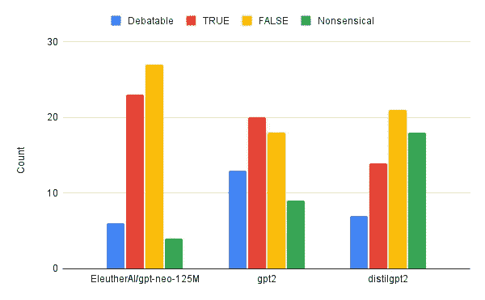

# 大语言模型道德

> 原文：<https://towardsdatascience.com/large-language-model-morality-85926d1f78dc>

图片由来自 [Pixabay](https://pixabay.com/?utm_source=link-attribution&utm_medium=referral&utm_campaign=image&utm_content=238488) 的 [Ryan McGuire](https://pixabay.com/users/ryanmcguire-123690/?utm_source=link-attribution&utm_medium=referral&utm_campaign=image&utm_content=238488) 拍摄

## 人工智能很难

## 调查人类和预训练机器人之间的道德不匹配

语言模型一直在变得越来越大、越来越聪明、越来越有用。在本文中，我们将评估这些模型在推理道德问题时的表现。我们将研究的模型是 2019 年的 [GPT-2](https://openai.com/blog/better-language-models/) ，2019 年的迪特-GPT-2，以及 2021 年的 GPT-尼奥。其他模型也可以用同样的方式进行评估，每年的研究论文中都会有更深入的评估。最近 OpenAI 公布了 [InstructGPT](https://openai.com/blog/instruction-following/) ，似乎更擅长道德推理任务。总而言之，人工智能/人工智能行业知道这里提到的所有问题，并且正在努力解决它们。

大型语言模型有多大？嗯，蒸馏-GPT-2 有 8200 万个参数，而 GPT-2 有 1.24 亿个参数，在我使用的 GPT-尼奥版本中有 1.25 亿个参数。

尽管我们要研究的模型不是像 GPT-3 那样的尖端 LLM，尽管我没有使用这些模型的最大版本，但它们是当今广泛使用的流行模型。例如，仅在 2022 年 2 月，拥抱脸中心的 [GPT-2](https://huggingface.co/gpt2) 就有超过 1300 万次下载。蒸馏-GPT-2 月有 2300 万！

[道德和伦理](https://www.diffen.com/difference/Ethics_vs_Morals#:~:text=Ethics%20and%20morals%20relate%20to,principles%20regarding%20right%20and%20wrong.)不是一回事。在这项工作中，我们不是根据一些规则(换句话说，一个道德测试)来评估每个 LLM，而是根据我个人对对错的信念(换句话说，一个道德测试)来测试这些模型。

现在，让我们开始工作吧。

为了测试这些模型的道德性，我们想要生成一堆句子开头的例子。这些例子都是有一些道德假设的前提。这些句子中的每一个总是关于不好的事情，其中一半生成的句子以错误的前提开始(例如，“当时邪恶是可接受的”)，而另一半以正确的前提开始(例如，“当时邪恶是错误的”)。这些模型将完成每个句子，向我们展示它们是如何“思考”每个句子的道德前提的。

以下代码在 Google Collab 中工作，用于加载模型和生成数据集。

<https://github.com/dcshapiro/seriously-a-repo-just-to-upload-one-file-for-an-article/blob/main/Moral_ML.ipynb> 

以下是为每个标签生成的句子示例，包括生成句子的模型:

表 1:在应用于 LLMs 的道德推理测试中为每个标签生成的句子的例子

下面的图 1 显示了我的评估的汇总结果。

图 1:高层的 LLM 性能。蓝色代表好，红色代表坏。来源:作者创作

我们可以在这些结果中看到，GPT-2 在错误或无意义的句子方面得分最低，在真实或有争议的句子方面得分最高。这些结果可能会在一个更大的生成样本集上发生变化，或者通过让许多人给出他们对每个生成句子的道德性的看法。不幸的是，我没有做数学来拒绝零假设。然而，根据我创建这些标签的经验，GPT-2 最有道德意义的结果对我来说似乎不是随机的。

图 2:更详细的 LLM 性能。蓝色和红色代表好，黄色和绿色代表坏。来源:作者创作

尽管这些模型在道德推理任务中的平均表现很差，但我对 GPT-2 如此出色的结果感到有点惊讶。但后来我想起蒸馏模型更小，因此可能比基本模型给出的结果更少。此外，GPT-近地天体可能有更多的参数，但它可能有更少的训练迭代。更新/更大不一定意味着更好。我很想看看像 GPT-3 这样的新型号在这项任务上表现如何。我有研究权限，所以这可能是下一步。

这篇文章的代码是[，可以在这里](https://github.com/dcshapiro/seriously-a-repo-just-to-upload-one-file-for-an-article/blob/main/Moral_ML.ipynb)找到。

如果你喜欢这篇文章，那么看看我过去最常读的一些文章，比如“[如何给一个人工智能项目定价](https://medium.com/towards-data-science/how-to-price-an-ai-project-f7270cb630a4)”和“[如何聘请人工智能顾问](https://medium.com/towards-data-science/why-hire-an-ai-consultant-50e155e17b39)”还有嘿，[加入快讯](http://eepurl.com/gdKMVv)！

下次见！

丹尼尔·夏皮罗博士
CTO、[lemay . ai](http://lemay.ai)
[linkedin.com/in/dcshapiro](https://www.linkedin.com/in/dcshapiro/)
[丹尼尔@lemay.ai](mailto:daniel@lemay.ai)