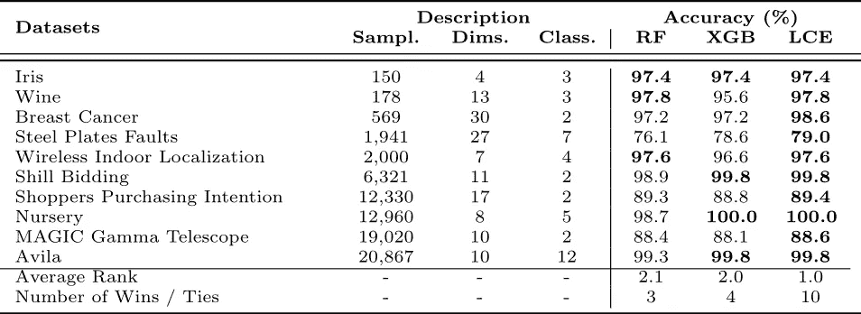

# LCE:最强大的机器学习方法？

> 原文：<https://towardsdatascience.com/lce-the-most-powerful-machine-learning-method-e8ea77f317d6>

## 介绍最新的基于树的方法及其潜在的进一步发展

彼得·斯洛瓦切克(Petr Slováek)在[的](https://unsplash.com/)上拍摄的照片。

正如在“为什么基于树的模型在表格数据上仍然优于深度学习？”【Grinsztajn 等人，2022】，**广泛使用的** **基于树的模型在很多情况下仍然是最先进的机器学习方法**。最近，**【fau vel et al .，2022】提出将性能最好的基于树的集成方法——随机森林【Breiman，2001】和极端梯度推进(XGBoost)【Chen and guest rin，2016】的优势结合起来，并整合了一种补充的多样化方法，使其成为**更好的泛化预测器。****

**本文首先**介绍了 LCE** ，然后**在不同的公共数据集上将它的性能与** **和 XGBoost** 进行了比较。然后，根据用户反馈(在发布后的头几个月有数万次包下载)，这篇文章提出了一些**想法，以进一步增强 LCE** 的能力，并建立可能**最强大的机器学习方法。最后，它解释了如何参与 LCE 的进步。****

# **概观**

**Random Forest 和 XGBoost 分别依靠装袋和助推的方法。Bagging 对方差减少具有主要影响，而 boosting 对偏差减少具有主要影响，使得这两种方法互补以解决机器学习模型面临的偏差-方差权衡。因此， **LCE 将打包和提升结合起来，并基于分而治之的策略来学习训练数据的不同部分，以捕捉无法在全球范围内发现的新关系**。更多关于 LCE 的详细信息，请参考我的文章“ [Random Forest 还是 XGBoost？是时候探索 LCE 了。](/random-forest-or-xgboost-it-is-time-to-explore-lce-2fed913eafb8)**

# **比较**

**下面的小节详细介绍了所采用的方法以及使用上述算法的公共实现所获得的结果。为了保持这篇文章的平均长度在中等，比较集中在分类的任务上。未来的工作可以探索回归任务的比较。**

## **评估设置**

****数据集**基于来自 [UCI 机器学习知识库](https://archive.ics.uci.edu/ml/index.php) [Dua 和 Graff，2017]: Avila [De Stefano 等人，2018]，乳腺癌[Bennett 和 Mangasarian，1992]，Iris [Fisher，1936]，MAGIC Gamma Telescope [Dvořák 和 Savick，2007]，Nursery [Zupan 等人，1997]，Shill Bidding [Alzahrani 和 Sadaoui**

**表 1 包含数据集及其描述。数据集是在中小型类别中随机选择的，其中基于树的集成方法通常表现更好。**

****实现**Python 3.10 上使用了以下包:**

*   **本地级联集合(LCE):0 . 3 . 2 版本中封装[*lcensemble*](https://github.com/LocalCascadeEnsemble/LCE)**
*   ***随机森林(RF):1 . 1 . 2 版本中的 [*scikit-learn*](https://github.com/scikit-learn/scikit-learn)***
*   ***XGBoost(XGB):1 . 6 . 2 版本中的包 [*xgboost*](https://github.com/dmlc/xgboost)***

***这些实现都与 scikit-learn 兼容，它允许一个独特的管道来进行一致的比较(参见下面的代码)。***

*****超参数优化**所有模型的基于树的学习中的经典超参数(`max_depth`，`n_estimators`)通过在训练集上进行三重交叉验证的网格搜索来设置。使用 scikit-learn 的模型选择工具 [GridSearchCV](https://scikit-learn.org/stable/modules/generated/sklearn.model_selection.GridSearchCV.html) 执行网格搜索。***

***`max_depth`和`n_estimators`的取值范围是这些方法通常采用的范围。为了公平起见，LCE 用于 XGBoost ( `xgb_max_depth`)的`max_depth`值范围与用于评估 XGBoost(【3，6，9】，见 [LCE 文档](https://lce.readthedocs.io/en/latest/generated/lce.LCEClassifier.html#lce.LCEClassifier))的值范围相同。***

***这些经典的超参数被选来进行一般的比较。在特定应用的情况下，考虑另一组超参数可能是有趣的。有关更多信息，请参考每种方法的文档。***

*****度量**对于每个模型，报告每个数据集的测试集的准确性。所有数据集的平均排名和获胜/平局数也显示为汇总统计数据。***

*****代码**用于比较的 Python 代码如下(格式为[黑色 ):](https://github.com/psf/black)***

## ***结果***

***表 1 显示了基于前面介绍的方法获得的结果。每个数据集的最佳精度用粗体表示。***

******

***表 1:来自 UCI 知识库的 10 个数据集的精度结果[Dua 和 Graff，2017]。数据集按大小升序排序。缩写:类。—类别数，dim。—维数，样本。—样本数量。***

***首先，我们观察到 **LCE** 是一个更好的概括预测器，因为它在所有数据集中获得了**最佳平均排名(LCE: 1.0，随机森林:2.1，XGBoost: 2.0)。*****

***然后，我们可以看到，结合随机森林和 XGBoost 的优势，同时采用补充多样化方法， **LCE 在两类数据集(小型/中型)上的 10 个数据集**中的 4 个数据集上优于这两种方法。**对于其余的**数据集， **LCE 在随机森林和 XGBoost 之间获得了与最佳执行方法**相同的预测性能(与随机森林 3 胜/平，与 XGBoost 4 胜/平)。因此， **LCE** 设计允许它**在测试的数据集上保持随机森林和 XGBoost 方法**的优点，**及其补充多样化方法可以使它胜过这两种方法**。***

# ***未来的进步***

***如前所述，LCE 是一种**高性能的**、**可扩展的**和**用户友好的**机器学习方法，用于分类和回归的一般任务。特别是，LCE:***

*   ***通过结合 Random Forest 和 XGBoost 的优势并采用互补的多样化方法来增强它们的预测性能。***
*   ***支持并行处理以确保可扩展性。***
*   ***通过设计处理缺失的数据。***
*   ***采用 scikit-learn API 以便于使用。***
*   ***遵循 scikit-learn 惯例，允许与 scikit-learn 管道和模型选择工具进行交互。***
*   ***是以开放源代码和商业可用的形式发布的——Apache 2.0 许可证。***

***然而，LCE 系统的能力还可以进一步增强，还需要进行一些开发，以满足各种用户需求。***

## ***后续步骤***

***根据第一轮用户反馈和我自己开发 LCE 的经验，社区为 LCE 添加以下功能是很有价值的:***

*****建模灵活性:*****

*   ***基本方法:LCE 在树的每个节点中使用 XGBoost 作为基本方法。向终端用户提供根据他们的特定应用选择基本方法的可能性将是有益的，例如，其他增强方法，如 LightGBM [Ke 等人，2017]或任何其他对偏差减少有主要影响的机器学习方法，通过将其添加为 LCE 的参数。***
*   ***损失函数:LCE 使用 scikit-learn 中提供的标准损失函数(例如交叉熵，MSE)。这些标准功能并不适合所有用户特定的应用。因此，为最终用户增加采用自定义损失函数的可能性将是有价值的(有关更多信息，请参考当前在 [scikit-learn GitHub issue](https://github.com/scikit-learn/scikit-learn/issues/1701) 中的讨论)。***
*   ***多任务学习:LCE 目前采用传统的单任务学习。然而，在许多应用中(例如，医疗风险评估、多个指标的财务预测)，期望解决多个相关的机器学习任务以增强泛化性能。最近的一项工作[Ibrahim 等人，2022 年]提出通过使用正则化器扩展可微分树来解决这一挑战，该正则化器允许跨任务共享软参数，这可能是一个值得考虑的有趣选项。***
*   ***流式处理:为了满足新兴应用处理大量不断发展的数据流的需求(例如，网络安全、能源管理)，开发一个集成了严格的内存要求和快速处理时间的流式版本的 LCE 是很有价值的。Gomes 等人[2017]采用适应性方法的工作可能是这个方向上一个有趣的起点。***

*****忠实的设计可解释性**:当前用于系综的可解释性方法是事后方法(例如，SHAP [Lundberg 等人，2017]，Anchors [Ribeiro 等人，2018])，这些方法不能提供忠实的解释[Rudin，2019]。忠实性至关重要，因为它对应于最终用户对模型预测解释的信任程度，即解释与模型实际计算内容的相关程度。监管和标准化机构强调忠诚是包括人工智能组件在内的流程的问责制、责任和透明度的支柱[欧洲议会和理事会，2021；菲利普斯等人，2021 年】。因此，在 LCE 的设计中直接整合一种机制将是有价值的，这种机制将允许提取支持其预测的解释。***

*****可伸缩性**:训练和推理阶段的计算时间对许多应用程序来说都很关键，因此:***

*   ***CPU:加速当前的 CPU 实现。***
*   ***GPU:添加 GPU 支持(如 CUDA)。***
*   ***云上分布式:增加对多台机器(例如 AWS、GCE、Azure 和 Yarn clusters)上分布式培训的支持，以及与云数据流系统(例如 Flink 和 Spark)的集成。***

*****编程语言** : LCE 目前用 Python 实现。为了适应不同的用户需求，用其他语言(例如 C++、R、Java、Julia、Scala)来实现它是很有价值的。***

## ***如何参与？***

***他们以多种方式参与 LCE；例如，学生的学校项目，学者的研究问题，通过专业人员的合作实现绩效最大化:***

*   ***给 LCE GitHub 库添加一颗星星。这看似无关紧要，但对于 LCE 的参考和可见性却至关重要。***
*   ***回答问题跟踪器上的查询，调查错误，并审查其他开发人员的请求，以确保现有版本按预期运行。***
*   ***开发新的测试用例，使代码库更加健壮。***
*   ***通过添加上一节中介绍的新功能来扩展 LCE 功能。***
*   ***在各种媒体上设计针对不同受众的教程，让更多人发现 LCE。***

***对于组织而言，可以赞助项目以支付开发 LCE 和最高标准所需的费用(例如，强大的持续集成基础架构等专业服务、研讨会费用)。***

# ***结论***

***本文提出了一种新的基于树的机器学习方法 LCE，并通过与当前表现最好的方法进行比较，表明它在公共基准上获得了最佳性能。然后，它介绍了参与的关键方向，以进一步推动 LCE 并释放其全部潜力。如果你有任何问题，你可以在这里联系我。***

# ***参考***

***南艾伯哈德，d .库曼斯和 o .德维尔。高维环境下分类器的比较。技术。1992 年第 92-02 号代表。(许可证: [CC BY 4.0](https://creativecommons.org/licenses/by/4.0/deed.en)***

***A.阿尔扎拉尼和萨达乌伊。拍卖欺诈数据的聚类和标记。数据管理、分析和创新，269–283，2020。(牌照: [CC0](https://creativecommons.org/publicdomain/zero/1.0/deed.en) )***

***K.班尼特和奥·曼加里安。两个线性不可分集合的鲁棒线性规划判别。优化方法和软件，1:23–34，1992 年。(许可证: [CC0](https://creativecommons.org/publicdomain/zero/1.0/deed.en) )***

***长度布莱曼。随机森林。机器学习，45(1):5–32，2001。***

***米（meter 的缩写））布塞马、s .泰尔齐和 w .塔斯特尔。一种新的元分类器。北美模糊信息处理学会年会，2010 年 1-7 日。(牌照: [PDDL](https://opendatacommons.org/licenses/pddl/1-0/) )***

***T.陈和 C. Guestrin。XGBoost:一个可扩展的树提升系统。2016 年第 22 届 ACM SIGKDD 知识发现和数据挖掘国际会议论文集。***

***D.杜瓦和 c .格拉夫。UCI 机器学习知识库，2017 年。***

***J.Dvořák 和 p .萨维奇。使用模拟退火软化决策树中的分裂。ICANNGA 会议录，2007 年。(许可证: [ODbL](https://opendatacommons.org/licenses/odbl/1-0/) )***

***欧洲议会和理事会。2021.人工智能法案。欧洲联盟法律。***

***K.Fauvel、E. Fromont、V. Masson、P. Faverdin 和 A. Termier。XEM:一种用于多元时间序列分类的可解释的设计集成方法。数据挖掘和知识发现，36(3):917–957，2022。***

***R.菲舍尔。分类问题中多重测量的使用。优生学年鉴，7:179–188，1936 年。(许可证: [CC0](https://creativecommons.org/publicdomain/zero/1.0/deed.en) )***

***H.戈梅斯、a .比费特、j .里德、j .巴德达尔、f .埃内布雷克、b .普法林格、g .霍姆斯和 t .阿布德斯莱姆*。*用于进化数据流分类的自适应随机森林。机器学习，106:1469–1495，2017。***

***长度 Grinsztajn、E. Oyallon 和 G. Varoquaux。为什么在典型的表格数据上，基于树的模型仍然优于深度学习？《第 36 届神经信息处理系统数据集和基准追踪会议论文集》，2022 年。***

***南易卜拉欣、侯赛因和马祖姆德尔。使用可微分树集成的灵活建模和多任务学习。2022 年第 28 届 ACM SIGKDD 知识发现和数据挖掘国际会议论文集。***

***G.柯，孟庆国，芬利，王，陈，马，叶，刘。LightGBM:一种高效的梯度推进决策树。《2017 年第 31 届神经信息处理系统会议论文集》。***

***南伦德伯格和 s .李。2017.解释模型预测的统一方法。第 31 届神经信息处理系统国际会议论文集。***

***页（page 的缩写）菲利普斯、c .哈恩、p .丰塔纳、a .耶茨、k .格林、d .布罗尼亚托夫斯基和 m .普日博基。2021.可解释人工智能的四个原则。美国国家标准与技术研究所。***

***米（meter 的缩写））里贝罗、辛格和格斯特林。2018.锚:高精度模型不可知的解释。《第 32 届 AAAI 人工智能会议论文集》。***

***J.罗拉、b .佩鲁马尔、s .纳拉亚南、p .塔库尔和 r .巴特。基于神经网络的粒子群优化和引力搜索模糊混合算法的室内用户定位。《第六届软计算解决问题国际会议论文集》，2017 年。(许可证: [CC 乘 4.0](https://creativecommons.org/licenses/by/4.0/deed.en) )***

***C.鲁丁。2019.停止解释高风险决策的黑盒机器学习模型，而是使用可解释的模型。自然机器智能，1:206–215。***

***C.萨卡尔、S. Polat、M. Katircioglu 和 Y. Kastro。基于多层感知器和 LSTM 递归神经网络的在线购物者购买意向实时预测。神经计算与应用，6893–6908，2018。(牌照: [CC0](https://creativecommons.org/publicdomain/zero/1.0/deed.en)***

***C.de Stefano，M. Maniaci，F. Fontanella 和 A. Scotto di Freca。中世纪手稿中通过版面特征进行可靠的作者鉴定:以《阿维拉圣经》为例。人工智能的工程应用，72:99–110，2018。(牌照: [CC0](https://creativecommons.org/publicdomain/zero/1.0/deed.en) )***

***B.祖潘、m .博汉内克、I .布拉特科和 j .德姆萨尔。通过功能分解的机器学习。1997 年第 14 届机器学习国际会议论文集。(许可证: [CC0](https://creativecommons.org/publicdomain/zero/1.0/deed.en) )***