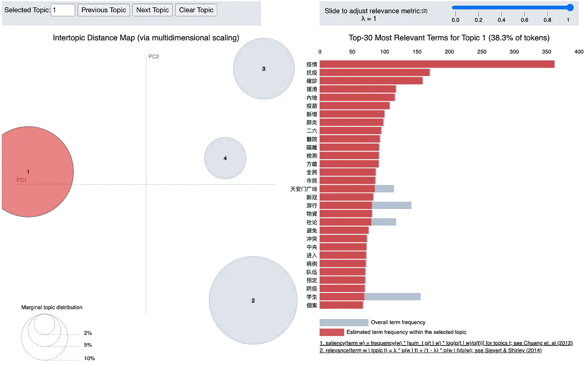

# LDA 话题建模:基于中文微博数据的案例研究

> 原文：<https://towardsdatascience.com/lda-topic-modeling-a-case-study-with-chinese-tweets-data-2d08ad25b08c>

## 一种数据驱动的方法来理解 Twitter 上的热门话题


克里斯·j·戴维斯在 [Unsplash](https://unsplash.com/s/photos/tweets?utm_source=unsplash&utm_medium=referral&utm_content=creditCopyText) 上的照片

在过去的几年里，新冠肺炎彻底改变了我们的生活方式。随着远程和虚拟通信在我们的日常生活中发挥着越来越重要的作用，从客户服务的角度来看，也越来越需要了解和衡量服务质量，并从数字聊天数据中识别潜在的机会。在这些场景中， **NLP** (自然语言处理)技术，如情感分析和主题建模，可能会为企业增加价值。

In this post, I will demonstrate how to do topic modeling with **LDA**, aka **Latent Dirichlet Allocation**. This method is already there for some time, and there are already plenty of great articles on how to apply it to English-based text data. To add some extra flavors here, I will apply this technique to another language — Chinese. More specifically, I will look at the tweets data with Hong Kong (香港) in the hashtags, and explore what are the trendy topics discovered with the LDA method.

# 主题建模和 LDA

在进入细节之前，我们先简单说一下主题建模和 LDA 的概念。在自然语言处理的背景下，**主题建模**通常用于在统计模型的帮助下发现出现在文档集合中的抽象主题。 **LDA** 是实现主题聚类的最经典模型之一，其关键的潜在假设是所有文本数据都是不同主题(具有不同关联权重)的组合，并且每个主题也是具有不同关联权重的不同关键词的组合。

如果你想知道更多关于 LDA 背后的数学细节，我发现 Luis 的这个视频做得很好，如果你感兴趣，你可以看看。

# NLP 项目的一般工作流程

典型的 NLP 项目(不限于主题建模)的一般工作流程如下:

*   **执行文本预处理**。这可能包括诸如文本清理、词干化/词条化、标记化和停用词移除等步骤。尽管数据预处理的想法非常简单，但它通常在项目生命周期中消耗最多的时间。这是有意义的，因为这一步的质量通常对最终输出有非常关键的影响。
*   **为 NLP 任务应用相关模块**。根据手头的任务，我们需要导入相关的库，并准备好输入到相关模型中的文本数据。像所有其他数据科学模型一样，我们也需要进行一些超参数调整，以获得最佳结果。对于我们的主题建模案例研究，将使用 gensim 包中的 LDA 模型。更多细节将在后面的章节中介绍。
*   **评估模型性能**。如何评估模型的结果在很大程度上取决于问题的性质。例如，如果我们在谈论带标签数据的监督学习，那么我们可以使用 F1 分数(分类问题)和 RMSE(回归问题)等相关指标。在主题建模的例子中，由于它属于无监督学习的范畴，我们可能需要使用一些特殊的度量标准(例如**一致性**)来衡量结果的性能——在后面的章节中会有更多的介绍。

# 中文自然语言处理对英文自然语言处理

现在我们知道了一个典型的 NLP 项目的一般流程。鉴于英语是世界上使用最广泛的语言，默认情况下，人们使用英语作为 NLP 项目的基础。但是，如果我们需要用另一种语言(在我们的例子中是中文)来开发 NLP 应用程序，我们应该期待的主要区别是什么？

虽然不同语言之间的一般工作流程是相似的，但我想说主要的区别确实在于文本的**预处理阶段**。例如，我们不能对汉字进行词干化/词汇化，因为汉字不是以这种方式组织的。此外，中文文本数据的标记化步骤也有点棘手。与英语不同的是，在一个句子中，每个单词都用空格隔开，而在汉语中，单词之间没有空格。

于是，我们不得不利用一些专门的中文分词工具包，比如 [**街霸**](https://github.com/fxsjy/jieba) 。我们将在后面的章节中更详细地介绍这一点。其余的中文和英文文本预处理工作流程非常相似，至少对于主题建模问题是如此。

# 从 Twitter 获取数据

Now we have a high-level understanding of the workflow, it is time to start the case study! The first challenge we need to resolve is how to obtain Twitter data. To download data from Twitter, you may set up a Twitter developer account to query tweets with their [API](https://developer.twitter.com/en/docs/twitter-api). The API is very well documented and easy to follow through to get things started, but in case you prefer to follow a tutorial from some other users, you may take a look at this [post](/an-extensive-guide-to-collecting-tweets-from-twitter-api-v2-for-academic-research-using-python-3-518fcb71df2a) from Andrew. For my case, I managed to extract the tweets data from Jan’22 to Mar’22 with the keyword “香港”, and managed to query ~12k tweets in total. Among all the tweets, around 6k tweets are in Chinese, and they are used as the raw text data for topic modeling later.

# 文本预处理

现在我们手头有了 Twitter 数据，下一步是为 LDA 模型准备文本数据。如前所述，文本预处理阶段非常关键，通常会对最终结果产生很大影响。一般步骤如下:

## 准备一个停用词列表

与英语类似，也有中文停用词，这可能会干扰从文本数据中获取实际主题。您可以做一个简单的 google 搜索，看看是否有可用的停用词列表，或者您可以利用一些现有的库(如*stopwodiso)*来直接导入停用词。

## 使用自定义词典来改进标记化

As mentioned earlier, **jieba** is one of the most popular libraries to handle word segmentation in Chinese text. While jieba has pretty decent tokenization performance by default, its built-in tokenization is based on Mandarin Chinese mostly. When dealing with text data in Hong Kong, you may notice that local people may use Cantonese (粤语) more often, which is quite different compared to Mandarin. To handle this more effectively, we can import some user-defined vocabulary to help jieba improve word segmentation performances. I managed to find out one [online post](https://ayaka.shn.hk/yueseg/hant/#pycantonese-%E8%A9%9E%E5%BA%AB) which covers a way to generate a combined corpus of Mandarin and Cantonese, and then I imported this corpus as the user custom dictionaries when doing word segmentation later on.

## 文本预处理功能

在准备了中文/粤语分词的停用词表和自定义词典之后，我们现在就可以开始文本预处理的剩余步骤了。为了简单起见，我们将只在推文中保留中文字符(这样所有的特殊字符、表情符号和任何其他符号都将被排除在外)，然后我们使用 jieba 库进行分词。最后，我们从列表中删除了停用词和单个字符的单词，因为它们没有携带太多用于主题建模的信息。实现上述目的的代码示例附于此:

```
def remove_special_character(text):
    # Remove non-chinese characters in the text - including all the hypterlinks, emoji and symbols
    return re.sub(r'[^\u4E00-\u9FA5]+','',text)def clean(doc):

 #Remove special characeters (keep only chinese or english words)
 special_free = remove_special_character(doc)

 #Do the jeiba word segmentation
 words_cut = [word for word in jieba.cut(special_free)]

 #Remove stop words and single words from the word list
 stop_free = [word for word in words_cut if word not in stop_words_combined and len(word) > 1]

 return stop_free
```

# 基于 Gensim LDA 的主题建模

经过文本预处理后，我们现在准备建立模型。一般步骤如下:

## 1.准备一本包含所有出现的单词的字典

本质上，我们在这里所做的是创建一个单词包，包含文档中出现的所有单词。为了便于处理，每个唯一的单词被分配一个唯一的 id。实现这一点的代码片段如下:

```
dictionary = corpora.Dictionary(df_raw_cn[‘tweet_cleand’])
```

## 2.为每个文档创建一个词频词典

在这里，对于每个单独的文档，我们希望创建一个词频字典来记录每个单词在文本中出现的次数(即**单词袋**矢量化)。这一步基于我们在上一步中创建的字典，还附加了下面的代码示例:

```
doc_term_matrix = [dictionary.doc2bow(doc) for doc in df_raw_cn[‘tweet_cleand’]]
```

值得注意的是，在这里，我们也可以选择用 **tf-idf** 的方法来制作这本词典。对于那些不熟悉 tf-idf 的人来说，它是“term-frequency-inversed-document-frequency”的缩写，其中它通过惩罚在大多数文档中出现的非常常见的词的重要性来增强词袋方法(即，这些常见的词不会增加将当前文档与其他文档区分开来的价值)。下面的代码示例可以完成这项工作:

```
tfidf = gensim.models.TfidfModel(doc_term_matrix)
corpus_tfidf = tfidf[doc_term_matrix] #this will replace doc_term_matrix we created with bow vecterization when fitting into LDA model
```

## 3.使用 gensim 运行 LDA 模型

前面的数据准备工作已经完成，我们终于准备好为 LDA 模型拟合文本数据了。像 gensim 这样的库只需要一个函数调用就可以让这变得非常简单。除了我们在步骤 1 和 2 中获得的两条数据输入之外，还有一些其他参数需要为该模型进行调整，包括 **num_topics** 、 **chunksize** (每个训练块中使用的文档数)，以及 **passes** (训练遍数总数)等。在所有参数中，num_topics 可能是对最终结果最关键的参数。现在，我们将首先构建一个 num_topics = 10 的基本模型。代码示例附在下面:

```
lda_model = gensim.models.LdaMulticore(corpus=doc_term_matrix,
 id2word=dictionary,
 num_topics = 10,
 random_state=100,
 chunksize=100,
 passes=10,
 per_word_topics=True)
```

请注意，我们只是随机假设主题集群的数量为 10。检查结果时，您可能会注意到一些分类显示相似的关键字，这表明分类计数没有优化。对于我们的案例，有三个主题群都与 Covid 中的新闻以及香港如何采取相关措施来有效解决 Covid 相关问题有关(如果您碰巧能阅读中文，请张贴以下 3 个主题群)。因此，我们应该期望最终的主题集群计数小于 10，因为我们已经在这里看到了一些重复。

```
[(0,
  '0.037*"疫情" + 0.025*"疫苗" + 0.018*"確診" + 0.016*"個案" + 0.014*"新冠" + 0.014*"病毒" '
  '+ 0.012*"抗疫" + 0.011*"新增" + 0.010*"肺炎" + 0.009*"死亡"'),
 (2,
  '0.042*"疫情" + 0.023*"內地" + 0.019*"援港" + 0.016*"中央" + 0.015*"中共" + 0.013*"工作" '
  '+ 0.011*"物資" + 0.010*"医院" + 0.008*"全民" + 0.007*"醫療"'),
 (3,
  '0.024*"台灣" + 0.012*"中國" + 0.011*"香港人" + 0.010*"陽性" + 0.009*"深圳" + '
  '0.006*"檢測" + 0.006*"隔離" + 0.006*"事情" + 0.006*"民众" + 0.006*"台湾"')
]
```

## 4.用一致性分数寻找最佳聚类数

如前一步所示，我们已经建立了一个基本的 LDA 模型，并返回了 10 个主题簇。然而，看起来 10 个集群可能不是最佳选择，因为我们已经看到了一些内容非常接近的集群。选择最佳聚类数有不同的方法，其中一种常用的技术是测量**主题** **一致性分数**。

**主题一致性**的想法是评估主题在多大程度上受到底层文本数据的支持。在高层次上，对于我们为 LDA 模型获得的主题，LDA 模型是具有不同概率得分的单词的组合，我们基于具有各种统计和概率度量的底层文档文本数据来评估其质量。如果你有兴趣了解更多的基础数学知识， *Pedro* 在这篇[文章](/understanding-topic-coherence-measures-4aa41339634c)中很好地介绍了所有背景知识。

尽管 LDA 和主题一致性计算的底层数学可能会变得有点复杂，幸运的是，gensim 通过一个简单的函数调用使计算主题一致性分数变得相对简单。理想情况下，我们试图实现的是主题聚类数量和整体主题一致性分数之间的平衡点(类似于 k-means 聚类的[肘方法](https://en.wikipedia.org/wiki/Elbow_method_(clustering)#:~:text=In%20cluster%20analysis%2C%20the%20elbow,number%20of%20clusters%20to%20use.))。然而，在实践中，确定主题群计数的过程还应该考虑实际的业务环境。示例代码块附在下面:

```
for k in range(3,20): # loop through different number of topics and calculate the coherence scores correspondingly
 print(f’Round {k}:’)
 Lda = gensim.models.LdaMulticore
 ldamodel = Lda(corpus=doc_term_matrix,
 id2word=dictionary,
 num_topics = k,
 random_state=100,
 chunksize=100,
 passes=50,
 iterations=100,
 per_word_topics=True)
 cm = gensim.models.coherencemodel.CoherenceModel(model=ldamodel,texts=df_raw_cn[‘tweet_cleand’],
 dictionary=dictionary,coherence=’c_v’)
 coherence.append((k,cm.get_coherence()))
```

考虑到一致性分数和业务理解，在尝试了一些不同的集群计数之后，设置 num_topics = 4 似乎返回了一个合理的结果。如下所示，第一个聚类是关于新冠肺炎相关的新闻，第二个聚类是关于香港股票市场，第三个聚类是关于过去发生的一个特定的政治事件，最后一个聚类是关于其他最近的政治新闻。返回的结果也与我在香港的中文推特数据上的观察一致。

```
[(0,
  [('疫情', 0.010080575),
   ('抗疫', 0.004716392),
   ('確診', 0.004410203),
   ('援港', 0.0032681422),
   ('內地', 0.0032191873)]),
 (1,
  [('港股', 0.00796206),
   ('股市', 0.006621567),
   ('中国', 0.0041328296),
   ('学生', 0.0039018765),
   ('股通', 0.0038416982)]),
 (2,
  [('绝食', 0.0081910975),
   ('迎送', 0.003878918),
   ('灵柩', 0.003878918),
   ('数十万', 0.003878918),
   ('长安街', 0.003878918)]),
 (3,
  [('中共', 0.005017238),
   ('台灣', 0.0024242366),
   ('香港人', 0.0021062237),
   ('过去', 0.0018380425),
   ('正义', 0.0018066273)])]
```

# 用 pyLDAvis 可视化主题集群

如前所述，我们可以通过逐一查看所有主题及其相关单词来评估主题聚类结果。这完全没问题，但是可能不太方便，尤其是当集群数量变大时。幸运的是，有一个流行的可视化软件包可以用来以交互的方式可视化主题集群。在高层次上，在生成的情节中主要有两个交互元素可供您使用:

1.  **相关性度量λ** 。相关性是指一个术语出现在一个特定主题中而排除其他术语的程度。当λ = 1 时，术语按照它们在主题中的概率进行排序(“常规”方法)，而当λ = 0 时，术语仅按照它们的**提升**进行排序。提升是术语在主题中的概率与其在语料库中的边缘概率的比率。在高层次上，lift 试图测量与 TF-IDF 矢量化相似的效果。
2.  **话题间距离图**。在这里，用户能够在 GUI 中浏览不同的主题群，并且用户还可以很好地了解不同的主题群是如何彼此分离的。一般来说，所有主题聚类之间的距离越远，分割结果越好。

生成交互图的示例代码和输出截图附在下面:

```
import pyLDAvis
import pyLDAvis.gensim_modelspyLDAvis.enable_notebook()
vis = pyLDAvis.gensim_models.prepare(lda_model, doc_term_matrix, dictionary)
vis
```



展示主题群的互动图(图片由作者提供)

# 想法和最后笔记

在这篇文章中，我们通过一个案例研究，介绍了如何使用 LDA 对中文推文数据进行主题建模。我们讨论了一些主题，如文本挖掘项目的典型工作流是什么，使用非英语文本数据时需要考虑的一些特殊事项，以及如何确定主题聚类的最佳数量并可视化您的结果。

虽然这看起来是一个不错的 POC 项目，但是当考虑将这种分析转移到生产中时，将会有许多其他的挑战。例如，有时你的业务伙伴已经知道他们在寻找什么样的主题集群，但是使用这种 LDA 主题建模方法，可能无法真正控制这一点(如果你的输出集群被很好地分成他们想要的集群，那你就太幸运了)。

这里没有完美的答案。在商业环境下，它实际上是与相应的利益相关者协调，以确保每个人的期望是一致的。如果模型结果不符合预期，我们可能需要考虑一些其他的技术来满足相关的业务需求——有时甚至可能是非建模的方法！

感谢阅读！如果你有任何反馈，请通过评论这篇文章来联系我们。如果你感兴趣，也可以看看我的其他帖子:

</time-series-analysis-with-statsmodels-12309890539a>  </time-series-analysis-arima-based-models-541de9c7b4db>  </new-tableau-desktop-specialist-certification-exam-overview-b482a2f373fb> 