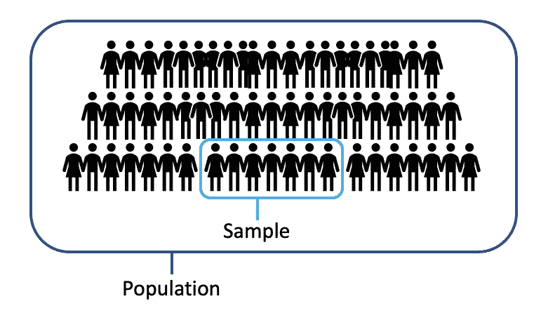

# 精益机器学习:以精益创业的方式运行概念验证(第 3 部分)

> 原文：<https://towardsdatascience.com/lean-machine-learning-running-your-proof-of-concept-the-lean-startup-way-part-3-a0c1bf3e1bd>

## 如何转变构建机器学习产品的方式

图 1:创新最佳点。图片作者。

欢迎回到我们精益机器学习系列的最后一篇文章。在开始这篇文章之前，我们建议你先查看一下[第一部分](/lean-machine-learning-running-your-proof-of-concept-the-lean-startup-way-part-1-f9dbebb74d63)和[第二部分](/lean-machine-learning-running-your-proof-of-concept-the-lean-startup-way-part-2-cf13b6b5154a)。快速回顾一下，我们一直在讨论如何通过应用 Eric Ries 的精益创业方法来构建更好的机器学习产品。

在第 1 部分和第 2 部分，我们描述了如何制作一个令人满意的、可行的、可行的机器学习产品。这些领域都是传统创新最佳点(ISS)的一部分。我们已经将本系列的最后一篇文章致力于一个极其重要的主题——伦理。虽然我们不认为自己是数据伦理方面的专家，但我们希望提高人们对数据科学这一不断发展的子领域的认识。

在本文中，我们将把数据伦理分为四个部分——数据源、安全性、隐私和对社会的影响。虽然这不是一个详尽的列表，但它代表了该主题的一个很好的概述。

# 数据源

为了描述数据源与数据伦理的关系，我们首先需要定义什么是数据源。我们将主要把数据源称为你用来训练和测试你的机器学习模型的数据。但是，需要注意的是，模型本身可以被视为数据源。许多数据科学家不会从零开始构建模型。事实上，他们经常选择使用模型作为他们更大的解决方案的一部分。例如，数据科学家可能通过单词嵌入模型发送文本，为他们自己的模型生成特征。

对于任何用于创建机器学习模型的数据源，了解数据来自哪里以及如何生成都很重要。您应该从了解数据的质量开始，因为它将对您的模型的结果产生重大影响(垃圾输入，垃圾输出)。

约翰·施诺布里奇在 [Unsplash](https://unsplash.com?utm_source=medium&utm_medium=referral) 上的照片

## 数据质量的七个维度

数据质量通常通过七个维度进行评估——准确性、完整性、覆盖面、符合性、一致性、及时性和唯一性。让我们来看看每一个都意味着什么。

**准确性** —准确性是指给定数据与其真实形式的关系。准确性低的数据集可能会因为手动输入数据而出现很多错误。

**完整性—** 完整性是指所需数据属性的可用性。例如，大多数电子文件需要作者、创建日期等。创建文件时必须包括。文件是数据、作者、创建日期等。是数据属性或元数据。数据集中记录的每个数据点可能都有任意数量的必需或可选元数据。

**覆盖率** —覆盖率是关于所需数据记录的可用性。假设您正在收集 Covid 测试结果，但您选择只收集阳性 Covid 案例。虽然最初，您可能只对积极的情况感兴趣，但为了让机器学习模型预测 Covid 结果，它需要看到积极和消极情况的示例。覆盖率低是样本偏差最常见的例子。

**符合** —符合是指数据内容与要求的标准相一致。例如，如果你正在收集信用卡号码，这些可能都应该是整数。你的数据集符合这个标准吗？

**一致性** —一致性包括数据符合所需格式和定义的程度。这听起来可能类似于一致性，但是我们不是检查*数据是否*符合标准，而是检查*一致性*如何。

**时效性** —时效性是所表现内容的流通性，也是数据是否可用，需要时是否可以使用。例如，当您每周甚至每天都需要数据时，接收月度数据并没有帮助。

**唯一性** —唯一性是确保记录只被记录一次。换句话说，你的数据集中有重复的吗？例如，也许你有重复的用户，这意味着你的每日活跃用户数是倾斜的。

虽然看起来很奇怪，但这些维度中的每一个都可以应用于机器学习模型。比如你的模型是否及时？当需要时，你提供预测吗？这包括确保模型的输入准备就绪，以及让模型预测足够快，以便在需要时提供预测。

## 数据源中的偏差

当人们第一次讨论数据科学领域的伦理时，他们通常会想到模型偏差。就拿歧视女性的[亚马逊简历审查员](https://www.reuters.com/article/us-amazon-com-jobs-automation-insight/amazon-scraps-secret-ai-recruiting-tool-that-showed-bias-against-women-idUSKCN1MK08G)来说吧。然而，模型偏差通常是由原始数据源中的偏差引起的。

如果你还记得你的第一堂概率统计课，你可能已经知道了样本和总体之间的区别。在现实世界中处理数据时，您几乎总是在处理样本，而不是实际的总体。即使你是苹果公司，你也没有*地球上所有*iPhone 的用户数据。

图 2:人口与样本。图片作者。

在你所拥有的用户数据中，你可能会有不同的用户行为。一些用户通过上传照片、发送信息等方式不断地与你的应用程序交互，而另一些用户从不上传照片。那么面对这种现实，如何创建一个“有代表性”的数据集呢？你可能需要花很多钱来开发渗透到细分市场的应用程序，这样你才能抓住那部分缺失的人口。

但是如果你甚至不知道这个段的存在呢？最终，您需要非常努力地工作来检测您遇到新细分市场的时刻，并快速调整您的数据集以包含该细分市场。这不是一件容易的事——它需要认真的思考和资金来正确执行。

识别和理解模型偏差在任何机器学习产品中都至关重要。在我看来，数据质量是您企业的竞争优势。有偏见的数据或不能正确代表总体的数据会使组织变得脆弱。其他拥有更好数据的人可以并且*会*打败你。

虽然数据伦理是当今许多组织事后才想到的话题，但随着拥有更高质量数据的公司将更好地服务于其客户，这种情况在未来不会持续下去。我们处理数据的实践需要提升，偏见只是这个问题中的一个方面。关于对抗偏见的一种方法的介绍，请查看这个关于行为驱动的机器学习的[视频](https://youtu.be/fYQwnyizP9s)。

# 数据安全和隐私

许多人交替使用安全和隐私这两个术语，但是澄清两者之间的区别是很重要的。安全性是指如何保护您的数据，而隐私是指如何使用您的数据。

equifax 2017 年的[数据泄露](https://en.wikipedia.org/wiki/2017_Equifax_data_breach)是缺乏数据安全的一个例子——黑客能够访问数百万客户的姓名、社会安全号码，甚至一些驾照号码。许多数据科学家处理来自各种应用程序的数据，包括事务数据库的副本。这些数据必须受到与原始数据相同级别的保护。

摄影:[飞:D](https://unsplash.com/@flyd2069?utm_source=medium&utm_medium=referral) 上 [Unsplash](https://unsplash.com?utm_source=medium&utm_medium=referral)

另一方面，Target 的 2012 年[怀孕预测模型](https://www.driveresearch.com/market-research-company-blog/how-target-used-data-analytics-to-predict-pregnancies/)代表了数据隐私的缺失。Target 为了增加销量，建立了一个模型来预测各种情况，在一种情况下，他们预测到一个青少年怀孕了。这位少女没有通知她的父母，所以当塔吉特百货送来婴儿用品的优惠券时，她感到很震惊。现在没有人黑 Target，也没有信息被窃取，但是这个人的隐私被侵犯了，他们的个人情况被泄露了。在许多方面，你甚至可能认为塔吉特违反了 HIPPA，因为他们建立了一个可以预测医疗状况的模型，并且他们选择通过邮件发送信息。

## 处理数据安全

那么我们如何处理这些情况呢？对于数据安全性，我建议您借鉴软件开发和 shift left 中的最佳实践，这促进了软件开发生命周期的一个阶段——在本例中是安全性——在过程的早期移动。

太多时候，当机器学习产品准备投入生产时，数据安全被讨论为它的最后一块。相反，在产品开发的早期阶段就让组织的信息安全团队参与进来是非常重要的。确保即使在概念验证(POC)期间也能正确处理数据至关重要。

数据安全的两个最佳实践包括加密静态数据和使用工作所需的最少量数据。我承认如果不知道创建模型需要哪些数据，后者是很难的。但是一旦你知道了，减少暴露的数据量是当务之急。可靠的数据管理实践和文档对此有所帮助。

照片由[西格蒙德](https://unsplash.com/@sigmund?utm_source=medium&utm_medium=referral)在 [Unsplash](https://unsplash.com?utm_source=medium&utm_medium=referral) 上拍摄

即使你有最好的数据安全措施，你的机器学习模型也可以通过应用编程接口(API)间接暴露你的训练数据集。聪明的黑客可以通过成员关系推断和模型反演来捕获有关您的训练数据集的信息。

隶属度推断是一种利用机器学习模型产生的置信度得分的技术。如果模型在其训练集中看到了一个数据点，当它在生产中遇到相同的数据点时，它可能会有较高的置信度得分。黑客可以利用这一点，通过重复查询模型中具有高置信度得分的数据点，并使用这些数据点来重新创建训练集，而无需访问底层数据。

模型反演是另一种允许黑客从模型输出中重建原始输入数据的方法。换句话说，黑客可以建立一个模型，使用另一个模型的输出来预测原始数据是什么。这种技术甚至可以用来捕捉数据的上下文。

## 处理数据隐私

那么我们如何防止像成员推断和模型反演这样的攻击呢？要回答这个，我们先来讨论一下数据隐私。

照片由[戴恩·托普金](https://unsplash.com/@dtopkin1?utm_source=medium&utm_medium=referral)在 [Unsplash](https://unsplash.com?utm_source=medium&utm_medium=referral) 上拍摄

虽然这个主题值得单独写一篇文章，但我想简要强调一下差分隐私。作为一名数据科学家，您可能习惯于处理原始数据。但是，在处理个人用户数据时，这可能会侵犯个人的隐私权。差分隐私试图通过在数据中聚合或添加噪声来解决这一问题，从而使个人用户不再是可识别的。

差分隐私是一个严重的问题，它也恰好是上一节讨论的安全问题的最有希望的解决方案。差别隐私的关键是当你收集数据集时，能够产生可信的否认。为了说明似是而非的可否认性，你可以把它想象成一种算法，在这种算法中，你通过抛硬币来决定你将获得正确的答案还是相反的答案。虽然你不知道哪些答案是对的，哪些是错的，但是你可以从概率上计算出一个足够大的群体的平均真实答案。这是强大的，因为你可以知道答案是什么，而不知道任何个人的答案。每个人都有似是而非的否认，而你有总的真相。

即使你认为你已经混淆了一个数据集，你也可能没有考虑到黑客将来可能获得的所有数据来识别你的数据集中的个人。为了保护个人隐私，你应该深入思考如何用不同的隐私算法产生合理的可否认性。

## 机器学习顾问委员会的重要性

妥善处理数据隐私需要一个村庄。在机器学习顾问委员会中拥有一个多样化的个人群体是帮助实施数据隐私措施的一种很好的方式。一个全面的顾问委员会可能包括来自不同部门的代表，包括人力资源、法律、信息安全、产品管理和工程。此外，将道德、多元化和包容部门的领导纳入该小组也很重要。咨询委员会还应该有自主权和决策权。没有什么比一个咨询委员会不能为维护良好的道德标准做出必要的改变更令人沮丧的了。

[Redd](https://unsplash.com/@reddalec?utm_source=medium&utm_medium=referral) 在 [Unsplash](https://unsplash.com?utm_source=medium&utm_medium=referral) 上的照片

咨询委员会的最后一个考虑是模型发布后的可接受使用。一旦一个模型开始做出预测，很有可能有人想要将这些预测(或者甚至模型本身)应用到一个新的、潜在的非预期用例中。重要的是，模型有适当的文档和数据管理来帮助防止这种情况，并且模型或其数据的任何新用例都应该由顾问委员会仔细审查。

# 机器学习模型对社会的影响

最后但同样重要的是，在我们关于数据伦理的讨论中，我们必须考虑我们的机器学习模型如何影响社会。我们的模型对人类有什么影响？

关于算法如何改变青少年对自己的感觉，已经有一些[令人震惊的统计数据](https://www.theguardian.com/technology/2021/sep/14/facebook-aware-instagram-harmful-effect-teenage-girls-leak-reveals)。我们也看到了算法如何无意中延续历史上的种族主义比喻。虽然 10 年前，公司道歉并说“我们不知道会发生这种事”可能是可以接受的，但现在没有借口了。

我们知道机器学习会给社会带来意想不到的后果。机器学习顾问委员会帮助数据科学家考虑对社会的潜在影响至关重要，应该有适当的指标来衡量这一点。是的，这将使机器学习更加昂贵，但这是我们必须要求公司承担的成本。

机器学习模型也通过碳排放和剥削性数据标签实践影响社会。许多最复杂的机器学习算法在计算上是昂贵的，这导致了更高的碳足迹和增加的财务成本。在算法复杂的情况下，公司自然会被激励使用更简单的模型，因为它们实现起来成本更低。但是，用来标记所有这些数据以创建机器学习模型的劳动力呢？大型组织通常雇佣或外包全部劳动力来为他们标记数据。在许多情况下，这些人来自较低的社会经济背景，当使用这些系统时，很容易剥削整个阶层的人。公司制定道德政策来帮助保护这些劳动力免受剥削是很重要的。

# 结论

虽然机器学习已经成为我们这个时代最热门的词汇之一，但它的伦理困境正开始变得越来越明显。像《社会困境》这样的电影才刚刚开始揭示这个重要的话题。

如果这是您第一次介绍数据伦理，您可能会被实现机器学习模型时要考虑的所有领域所淹没。好消息是，你不必单干。依靠组织中具有其他背景(如法律和信息安全)的个人来帮助您做出关于模型的数据隐私和安全的明智决策。更好的办法是，咨询你公司的机器学习顾问委员会，如果他们有的话。

公司需要时间来更加重视机器学习中的数据伦理，但未来是光明的。机器学习社区有解决这些问题的强烈愿望，随着该领域的不断发展，我们期待了解更多。

# 参考

1.  [https://www . Reuters . com/article/us-Amazon-com-jobs-automation-insight/Amazon-scraps-secret-ai-recruiting-tool-that-show-bias-against-women-iduscn1 MK 08g](https://www.reuters.com/article/us-amazon-com-jobs-automation-insight/amazon-scraps-secret-ai-recruiting-tool-that-showed-bias-against-women-idUSKCN1MK08G)
2.  https://youtu.be/fYQwnyizP9s
3.  【https://en.wikipedia.org/wiki/2017_Equifax_data_breach 
4.  [https://www . drive research . com/market-research-company-blog/how-target-used-data-analytics-to-predict-guests/](https://www.driveresearch.com/market-research-company-blog/how-target-used-data-analytics-to-predict-pregnancies/)
5.  https://www.bbc.com/news/technology-58462511
6.  [https://www . the guardian . com/technology/2021/sep/14/Facebook-aware-insta gram-有害-影响-少女-泄露-揭露](https://www.theguardian.com/technology/2021/sep/14/facebook-aware-instagram-harmful-effect-teenage-girls-leak-reveals)