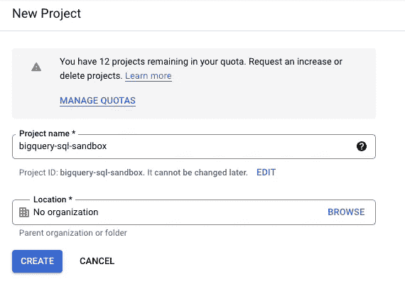
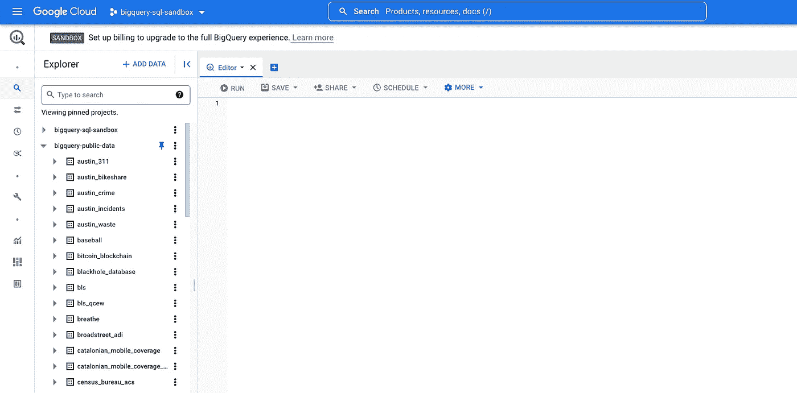
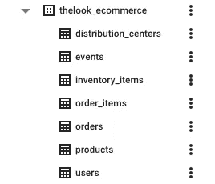
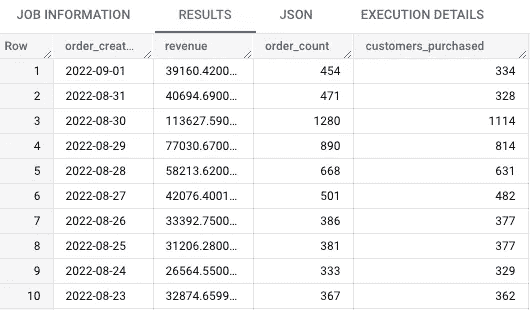
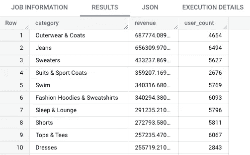

# 使用 Google BigQuery 上的电子商务数据集学习 SQL

> 原文：<https://towardsdatascience.com/learn-sql-with-the-e-commerce-dataset-on-google-bigquery-6864989e1494>

## 我经常被问到这个问题:我学习了 SQL 的基础知识；现在怎么办？我的回答是:开始用 SQL 回答现实世界的业务问题。

图片由 [Unsplash](https://unsplash.com?utm_source=medium&utm_medium=referral) 上的[克拉克街商业](https://unsplash.com/@mercantile?utm_source=medium&utm_medium=referral)拍摄

学习任何东西都有一个棘手的问题，那就是从理论到实践。我来自越南，在那里学习驾驶是一场噩梦。说真的，查查“越南交通”，你就知道我的意思了。所以我知道有很多人有驾驶执照，但是在驾校之外从来没有驾驶过。

对越南人来说，开车入门很难，也很吓人。人们在获得驾照后推迟驾驶的时间越长，距离他们最后一次驾驶的时间也就越长。过了一段时间，他们开始忘记基础知识，这使得开始变得更加困难。

照片由[莱昂妮·克拉夫](https://unsplash.com/@leoniec?utm_source=medium&utm_medium=referral)在 [Unsplash](https://unsplash.com?utm_source=medium&utm_medium=referral) 上拍摄

学习 SQL 也差不多。在你学会写一个简单的陈述后，现在做什么？建立一个本地数据库很难，并不是每个懂 SQL 的人都能做到。此外，处理用 Excel 创建的假数据一点也不好玩。

  

所以，我们去“兜风”，好吗？

# 设置 BigQuery 沙箱

首先，我们应该启动我们的隐喻汽车。BigQuery 是 Google 的托管数据仓库。作为一项托管服务，您不必花费数小时来学习如何在本地创建 MySQL 数据库并在那里加载数据。如果你有一个谷歌账户，即使没有信用卡，你也可以在五分钟内开始编写 SQL 查询。

BigQuery 沙盒就像一辆模型车，让你练习驾驶。谷歌已经收集了数百个真实世界的公共数据集，你可以查询。从维基百科、比特币这样的海量数据集到经济学数据，你都可以找到你感兴趣的行业的数据，并以此为起点。

首先，你必须访问这个 [URL](https://console.cloud.google.com/bigquery) 并使用你的谷歌账户登录，如果你还没有这样做的话。接下来，选择您的国家，同意 TOS 并继续。您需要创建一个项目来开始使用 BigQuery sandbox，这是一个免费的测试环境，允许您每月查询高达 1 TB 的数据。为您的项目选择一个唯一的名称并创建一个。

创建谷歌云项目(图片由作者提供)

只需一会儿，您现在就可以访问 BigQuery 沙箱了！选择`Add data`、`Pin a project`、`Enter project name`，输入`bigquery-public-data`。你可以在这个项目下看到所有 240 个免费的公共数据集。

固定公共数据集项目(按作者分类的图像)

在本文中，我不会讨论如何使用 BigQuery UI。但是如果你想的话，可以看看这篇文章，或者更好的是 Coursera 上的这篇专业化文章。

# Look 电子商务数据集

既然我们发动了汽车，让我们来了解它。使用固定的`bigquery-public-data`项目，向下滚动，点击`more results`，您应该能够找到`thelook_ecommerce`数据集。您可以选择不同的表，探索该数据模式，并使用 preview 检查实际数据。

虚构的电子商务数据集(图片由作者提供)

这是一个虚构的时尚电商，叫做 Fashionly。我们有一个网站，客户可以用它来购买我们的产品。

当客户访问我们的网站并注册账户时，她的旅程就开始了。她在注册时使用的信息存储在 users 表中，注册日期对应于客户的创建日期。

一旦注册，她可以随时访问我们的网站。每次她访问时，events 表中都会生成一个新事件。我们知道她从哪里浏览我们的网站，以及她采取了什么行动(访问、将产品添加到购物车或购买)等信息。我们还知道她来自哪里(流量来源)以及她使用什么类型的浏览器进行访问。

当她购物时，在 orders 表中会创建一个订单。订单发货、取消或退货的时间戳也记录在这里。

每个订单可以包含一个或多个项目，记录在订单项目表中。order items 表也与产品相关联，我们在其中存储产品的详细信息。

我们有几个仓库存放存货。当新库存进入仓库时，记录库存创建日期。同样的事情也发生在产品销售的时候。

# 现在让我们使用您的 SQL！

想象自己是 Fashionly 的所有者、财务、产品或运营负责人。你想了解你公司的什么情况？这里有一些问题让你开始。

*   我们每天的销售额是多少？与昨天，上周/月/年的同一时间相比，是高还是低？
*   谁是我们的客户？按人口统计细分。他们的购买行为是什么？他们买得多还是少？我们签约新客户的速度有多快？
*   我们卖得最多和最少的是什么？我们靠什么赚钱？某些产品/品类是否更适合特定的客户群体？
*   我们在哪个地理位置做得好/不好？我们的仓库能覆盖所有区域吗？我们应该在何时何地考虑扩大我们的履行能力？
*   我们在哪个营销渠道做得好？我们目前的组合是什么？趋势有变化吗？

为了进一步了解你的业务并做出更好的决策，你可以问很多很多更多的问题。

让我们一起来看几个问题。我们将从一个基本的查询开始，以了解我们销售了多少，每天有多少订单，以及有多少客户购买了。为此，我们必须将订单和 order_items 连接在一起。请确保在您的查询中过滤掉已取消和退回的订单。

基本商业信息(图片由作者提供)

我们可以看到，我们每天的销售额约为 30–40，000 美元，处理约 400 份订单，约有 300 名客户购买。有些日子，我们的销售额远远超过平均水平。

接下来，让我们看一个稍微复杂一点的查询。我想知道客户第一次下单购买最多的是哪个品类。要做到这一点，我们必须使用一个窗口函数来识别第一个订单。然后我们可以按产品类别分组，计算我们的收入和用户数。

首批订单的主要类别(图片由作者提供)

现在，如果我想创建一个活动来推动新用户的获取，我知道外套可能会给我带来最多的收入，而牛仔裤会给我带来最多的客户。

# 总结

BigQuery 是一种让您轻松开始学习 SQL 的方法。只有走出去“驱动”，也就是应用 SQL 来回答现实世界的业务问题，人们才能真正学会如何使用这种受欢迎的技能。

这里有一些在 BigQuery 中使用 SQL 的最佳实践，我想你应该知道。

感谢您的阅读，希望这篇文章对您有所帮助。