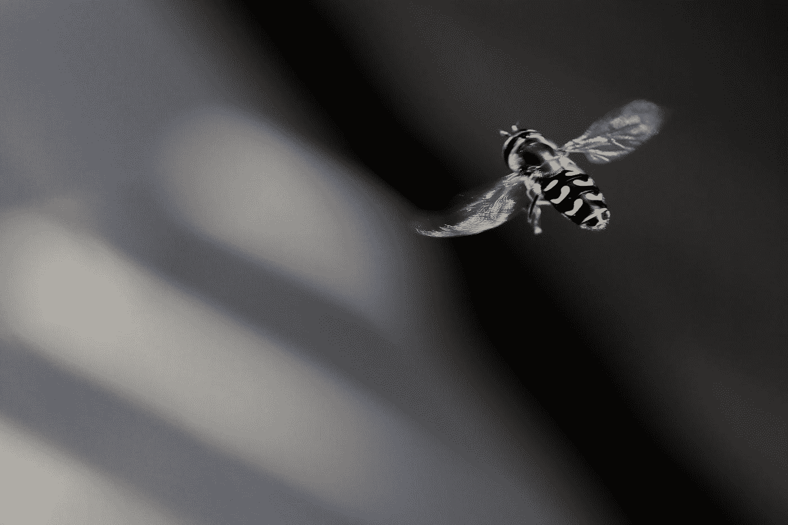
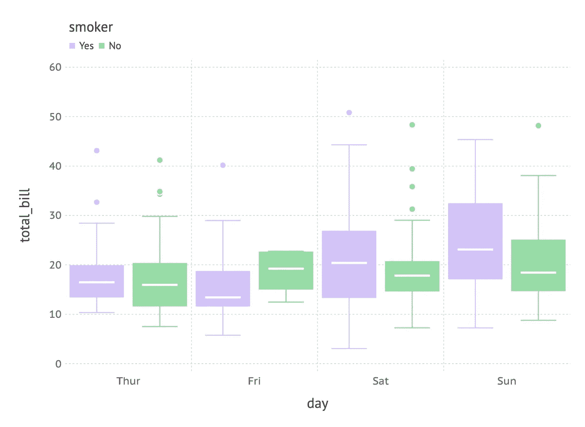
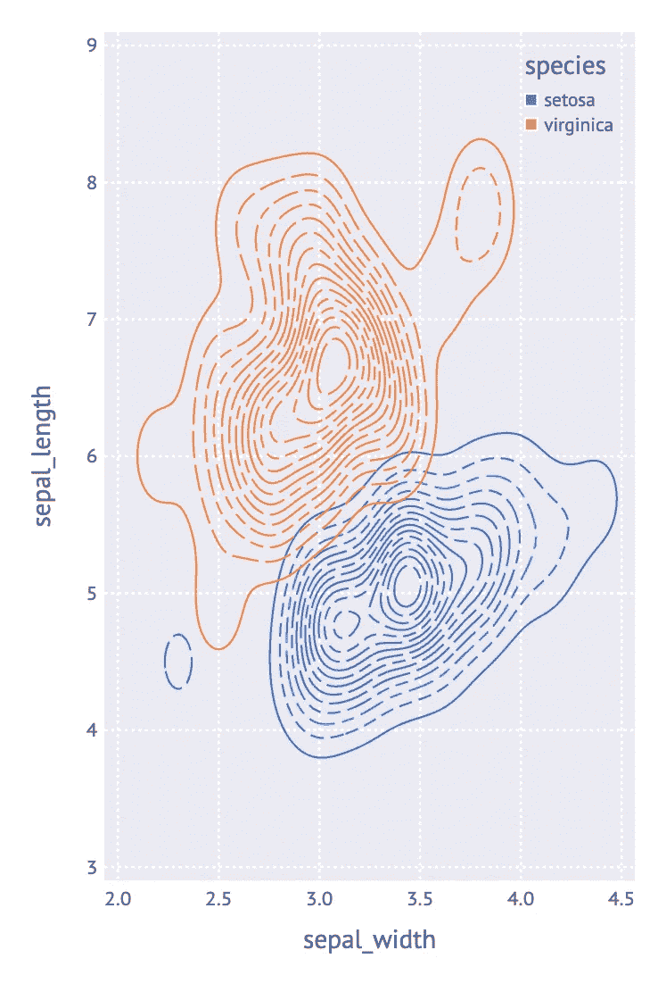
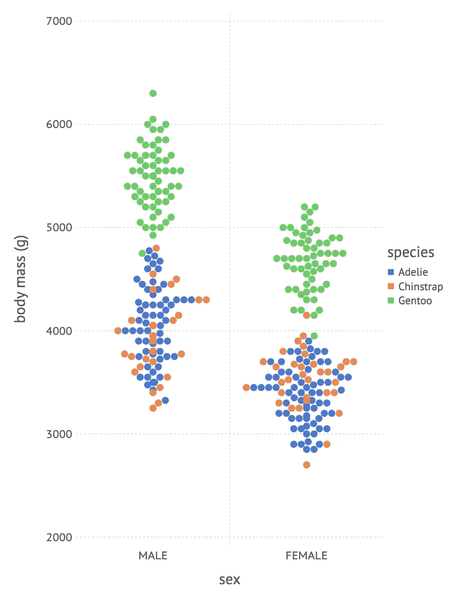
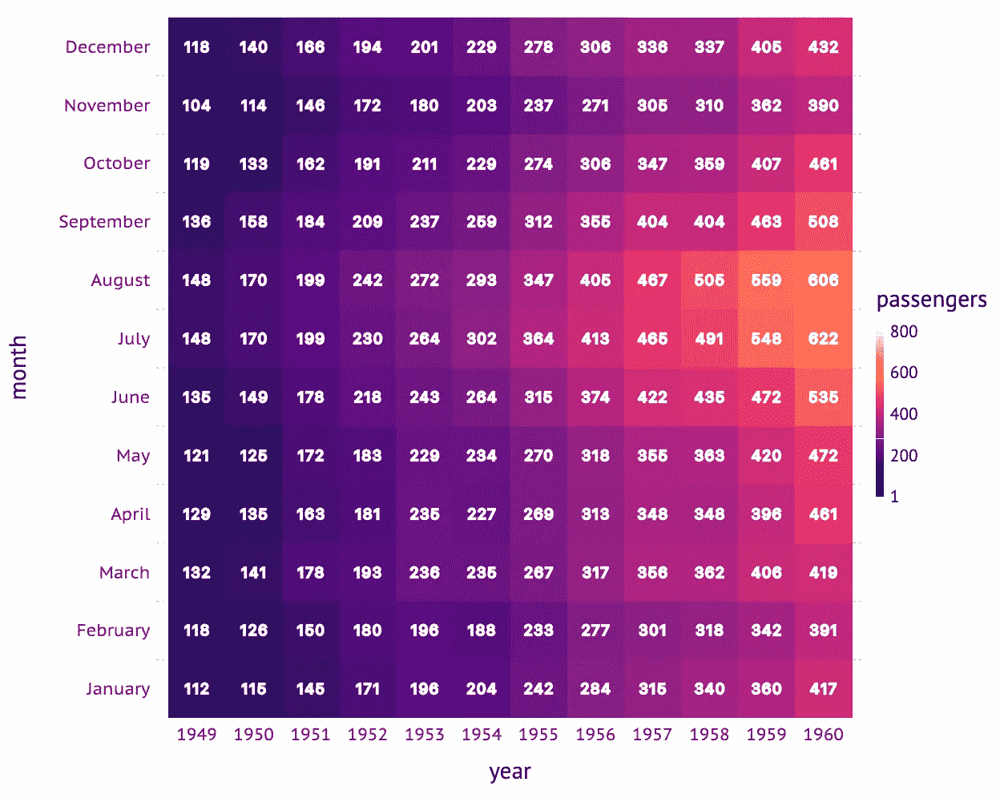

# 通过在《朱丽亚》中创造美丽的海伯恩情节来学习牛虻

> 原文：<https://towardsdatascience.com/learning-gadfly-by-creating-beautiful-seaborn-plots-in-julia-755821156c86>

## 为 Julia 介绍了一个通用的数据可视化库，特别是为那些在 Julia 中编码时错过了 Seaborn 的 python 爱好者



由[安妮·尼加德](https://unsplash.com/@polarmermaid?utm_source=medium&utm_medium=referral)在 [Unsplash](https://unsplash.com?utm_source=medium&utm_medium=referral) 上拍摄

我在 Python 中经常使用的一个库是 Seaborn。在 Julia 中，我最喜欢的数据可视化软件包之一是牛虻。它很大程度上是基于哈德利·威克姆的《R 的 ggplot2》和利兰·威尔金森的《图形的语法》一书。

在《牛虻》的介绍中，我们将创造 6 个美丽的海波恩情节。在每一个情节中，牛虻的新的可能性都会被用到。

我们将创建以下数据可视化:

*   [散点图](https://seaborn.pydata.org/examples/scatter_bubbles.html)具有不同的点大小和色调
*   分组[箱线图](https://seaborn.pydata.org/examples/grouped_boxplot.html)
*   多双变量 [KDE](https://seaborn.pydata.org/examples/multiple_bivariate_kde.html) 图
*   带有分类变量的散点图[图](https://seaborn.pydata.org/examples/scatterplot_categorical.html)
*   水平(分层)[柱状图](https://seaborn.pydata.org/examples/part_whole_bars.html)
*   带注释的[热图](https://seaborn.pydata.org/examples/spreadsheet_heatmap.html)

在跟随之后，你将足够了解牛虻，从而在你自己的数据上创建伟大的数据可视化。让我们开始吧。

# 包装

首先让我们加载所有需要的 Julia 包。如果你需要帮助建立一个 Julia 包环境，你可能会有兴趣先阅读这个故事。

```
using CSV
using DataFrames
using Gadfly
using Compose
using ColorSchemes
```

# 具有不同点大小和色调的散点图

在该图中，我们将使用`Geom.point`，设置一个`Theme`，手动指定颜色，并设置点尺寸图例的最小和最大值。我们正试图尽可能地再现这一情节。

首先，我们需要下载数据并将其加载到数据帧中。

```
download("https://raw.githubusercontent.com/mwaskom/seaborn-data/master/mpg.csv", "mpg.csv")
mpg = DataFrame(CSV.File("mpg.csv"))
```

在绘图之前，我们首先设置绘图大小。这可以在`inch`或`cm`完成。在`plot`函数中使用的第一个参数用于数据集(`mpg`)。我们将在 X 轴上绘制`horsepower`，在 Y 轴上绘制`mpg`(每加仑英里数)。点数颜色将基于`origin`的国家，点数的大小将反映汽车`weight`。为了防止过度绘制，我们设置 alpha 为`0.5`。在这个图中，我们使用十六进制颜色代码。但是你也可以在这里使用颜色名称，比如`red`、`green`和`blue`。或者为默认的牛虻颜色省去这一行。我们还设置了点捕捉图例的最小值和最大值。该图例的颜色设置为默认颜色`black`。

```
set_default_plot_size(15cm, 12cm)
plot(
    mpg,
    x = :horsepower,
    y = :mpg,
    color = :origin,
    size = :weight,
    alpha = [0.5],
    Geom.point,
    Scale.color_discrete_manual("#5377C9", "#DF8A56", "#82CA70"),
    Scale.size_area(
        minvalue = minimum(mpg.weight),
        maxvalue = maximum(mpg.weight)
    ),
    Theme(
        background_color = "white",
        default_color = "black",
    ),
)
```


作者图片

恭喜你，你刚刚完成了你的第一个美丽的牛虻情节！

# 分组箱线图

在该图中，我们将使用`Geom.boxplot`，设置 X 轴上数值的顺序，设置颜色顺序，并将图例的位置设置为`top`。为了匹配 Seaborn 的版本，我们还设置了箱线图之间的间距。

```
# download data
download("https://raw.githubusercontent.com/mwaskom/seaborn-data/master/tips.csv", "tips.csv")
tips = DataFrame(CSV.File("tips.csv"))# visualize data
set_default_plot_size(16cm, 12cm)
plot(
    tips,
    x = :day,
    y = :total_bill,
    color = :smoker,
    Geom.boxplot,
    Scale.x_discrete(
        levels = ["Thur", "Fri", "Sat", "Sun"]
    ),
    Scale.color_discrete_manual(
        "#D0C4F4", "#A6D9AA", 
        order = [2, 1]
    ),
    Theme(
        key_position = :top,
        boxplot_spacing = 10px,
        background_color = "white",
    ),
)
```



一个非常好的分组箱线图，只有几行代码！

# 多元二元 KDE 图

除了数据被过滤以匹配 Seaborn [图](https://seaborn.pydata.org/examples/multiple_bivariate_kde.html)之外，这个可视化中突出的是相对位置被用于定位颜色键`Guide.colorkey(pos = [0.78w, -0.42h])`。此位置相对于图的宽度和高度。对于这个图，我们将使用`Geom.density2d`。在`Theme`我们将设置`panel_fill`颜色、`grid_color`和`grid_line_width`。

```
# download data
download("https://raw.githubusercontent.com/mwaskom/seaborn-data/master/iris.csv", "iris.csv")
iris = DataFrame(CSV.File("iris.csv"))# visualize data
set_default_plot_size(10cm, 15cm)
plot(
    subset(iris, :species => ByRow(!=("versicolor"))),
    x = :sepal_width,
    y = :sepal_length,
    color  = :species,
    Scale.color_discrete_manual("#5377C9", "#DF8A56", "#82CA70"),
    Geom.density2d,
    Theme(
        background_color = "white",
        panel_fill = "#EAEAF1",
        grid_color = "white",
        grid_line_width = 1.5px,
    ),
    Guide.colorkey(pos = [0.78w, -0.42h]),
)
```



作者图片

# 分类变量散点图

在这个图中，我们将使用`Geom.beeswarm`来匹配 Seaborn [版本](https://seaborn.pydata.org/examples/scatterplot_categorical.html)。该图中的新内容是，我们设置了`yticks`的位置，并为 Y 轴上的值设置了`ylabel`。

```
# download data
download("https://raw.githubusercontent.com/mwaskom/seaborn-data/master/penguins.csv", penguins.csv)
penguins **=** DataFrame(CSV**.**File("penguins.csv"))# visualize data
set_default_plot_size(12cm, 16cm)
plot(
    dropmissing(penguins, [:body_mass_g, :sex, :species]), 
    x **=** :sex, 
    y **=** :body_mass_g, 
    color **=** :species, 
    Geom**.**beeswarm, 
    Scale**.**color_discrete_manual("#5377C9", "#DF8A56", "#82CA70"), 
    Guide**.**yticks(ticks **=** 2000**:**1000**:**7000), 
    Guide**.**ylabel("body mass (g)"), 
    Theme(
        background_color **=** "white",
    ), 
)
```



作者图片

此时(在牛虻版本 1.3.4 中),创建相同的水平剧情似乎无法正常工作。一旦有了解决方案，我将更新代码并绘制一个水平蜂群。

# 水平(分层)条形图

在这个图中，我们将使用两层来创建我们想要的柱状图。这个条形图的特殊之处在于，一个条形图代表总数，另一个条形图代表数据的一部分。所以这些不仅仅是堆叠的条形。我们将使用`Geom.bar`和`horizontal`方向。我们将在每层使用一个`Theme`，在整个情节中使用一个`Theme`。

```
# download data
download("https://raw.githubusercontent.com/mwaskom/seaborn-data/master/car_crashes.csv", "car_crashes.csv")
car_crashes **=** DataFrame(CSV**.**File("car_crashes.csv"))# visualize data
set_default_plot_size(5inch, 10inch)
p **=** plot(
    sort(car_crashes, :total, rev **=** false), 
    layer(
        x **=** :alcohol, 
        y **=** :abbrev, 
        Geom**.**bar(orientation **=** :horizontal), 
        Theme(
            default_color **=** color("#617BBA"), 
            bar_spacing **=** 3px, 
            bar_highlight **=** color("white")
        ), 
    ),
    layer(
        x **=** :total, 
        y **=** :abbrev, 
        Geom**.**bar(orientation **=** :horizontal), 
        Theme(
            default_color **=** color("#B2C8E7"), 
            bar_spacing **=** 3px, 
            bar_highlight **=** color("white"), 
        ), 
    ), 
    Guide**.**xlabel("Automobile collisions per billion miles"), 
    Guide**.**ylabel(""), 
    Guide**.**manual_color_key("", ["Total", "Alcohol-involved"], ["#B2C8E7", "#617BBA"]), 
    Theme(
        background_color **=** "white",
        key_position **=** :bottom, 
    ),
)
```


作者图片

现在，你可以称自己为牛虻专家了！

# 带注释的热图

可能这一系列中最漂亮的情节是带注释的[热图](https://seaborn.pydata.org/examples/spreadsheet_heatmap.html)。由于注释的原因，它也是最复杂的一个。在这个可视化中，使用了来自`ColorSchemes`模块的 colorschema `magma`。`plasma`、`inferno`、`viridis`和`seaborn_rocket_gradient`也是很好的配色方案。`Geom.rectbin`用于创建[热图](https://seaborn.pydata.org/examples/spreadsheet_heatmap.html)。

```
# download data
download("https://raw.githubusercontent.com/mwaskom/seaborn-data/master/flights.csv", "flights.csv")
flights = DataFrame(CSV.File("flights.csv"))# visualize data
set_default_plot_size(17cm, 14cm)
plot(
    flights,
    x = :year,
    y = :month,
    color = :passengers,
    Geom.rectbin,
    Scale.ContinuousColorScale(
        palette -> get(ColorSchemes.magma, palette)
    ),
    Guide.xticks(
        ticks=[minimum(flights.year):maximum(flights.year);]
    ),
    Theme(background_color = "white"),
    Guide.annotation(
        compose(
            context(),
            text(
                flights.year,
                1:length(unique(flights.month)),
                string.(flights.passengers),
                repeat([hcenter], nrow(flights)),
                repeat([vcenter], nrow(flights)),
            ),
            fontsize(7pt),
            stroke("white"),
        ),
    )
)
```



作者图片

# 最后的想法

我喜欢 Python 语言和像 Seaborn 这样的数据可视化库。也就是说，以我的拙见，牛虻是 Julia 语言中最通用的数据可视化库之一(除此之外，还有其他类似的 [Plots](https://docs.juliaplots.org/stable/) 、 [Makie](https://github.com/JuliaPlots/Makie.jl) 和 [Vega-Lite](https://vega.github.io/vega-lite/) )。希望这篇介绍是有用的，特别是对于那些来自 Python 和使用 Seaborn 的人。如果你对与 [Makie](https://github.com/JuliaPlots/Makie.jl) 包的对比故事感兴趣，请告诉我。

[](/how-to-setup-project-environments-in-julia-ec8ae73afe9c) [## 如何在 Julia 中设置项目环境

### 介绍 Julia 的内置包管理器，用于生成项目环境和管理包…

towardsdatascience.com](/how-to-setup-project-environments-in-julia-ec8ae73afe9c) [](/getting-started-with-data-analysis-in-julia-421ce0032916) [## Julia 中的数据分析入门

### 关于 Julia 中数据分析入门的温和介绍性指南。

towardsdatascience.com](/getting-started-with-data-analysis-in-julia-421ce0032916) [](/reactive-data-analysis-with-julia-in-pluto-notebooks-b4652defd03e) [## 在 Pluto 笔记本中使用 Julia 进行反应数据分析

### 当你喜欢朱庇特的时候，你就会爱上冥王星！

towardsdatascience.co](/reactive-data-analysis-with-julia-in-pluto-notebooks-b4652defd03e) [](https://medium.datadriveninvestor.com/create-thematic-maps-using-shapefiles-in-julia-135ea67e9628) [## 使用 Julia 中的 Shapefiles 创建专题地图

### 如何在 Julia 中使用 Plots 包绘制 choropleth 图

medium.datadriveninvestor.com](https://medium.datadriveninvestor.com/create-thematic-maps-using-shapefiles-in-julia-135ea67e9628)